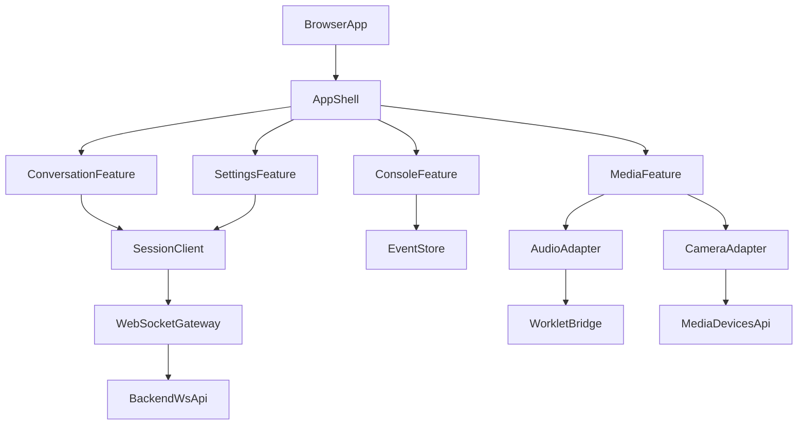
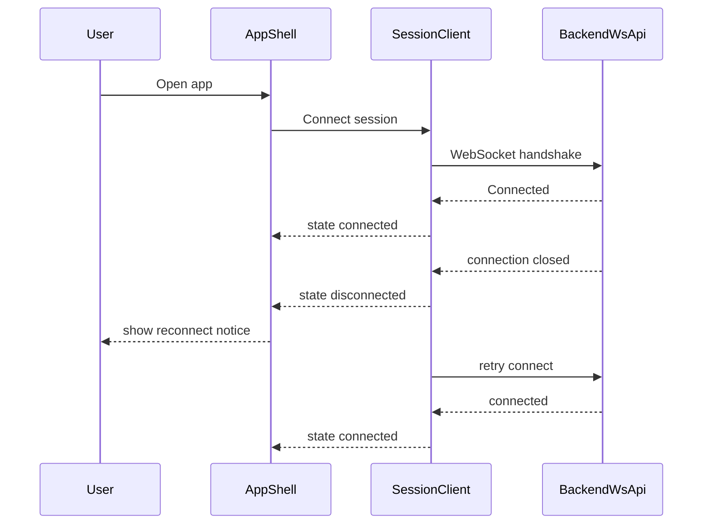
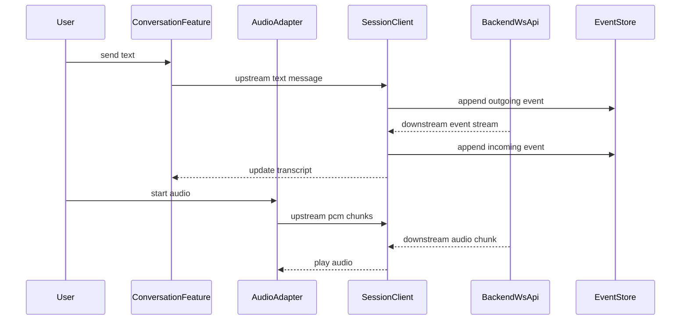
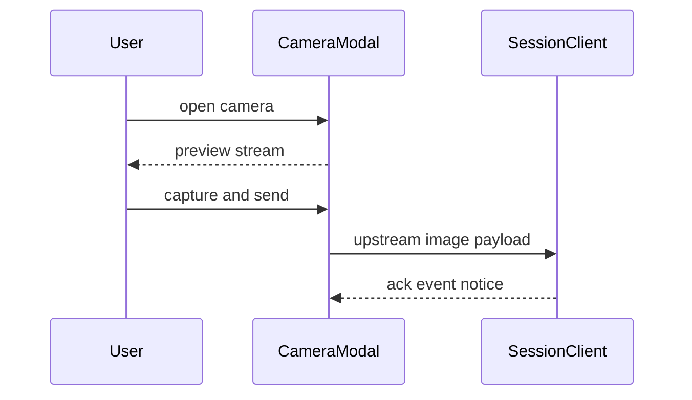
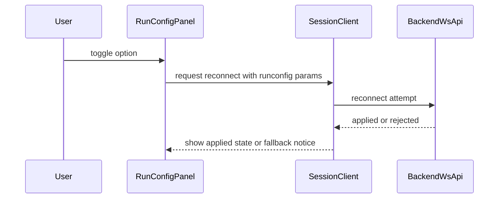

# Technical Design: react-realtime-voice-ui

## Overview

本設計は、既存の `app/static` ベース実装を、`new_ui_design.pen` で定義したUIに整合させつつ React.js ベースへ再構築するための技術方針を定義する。目的は、既存のリアルタイム双方向会話機能（テキスト・音声・画像・イベント可観測性）を欠落なく維持し、レスポンシブ/PWA対応を含む拡張しやすい構造へ移行することである。

ユーザーは会話利用者（音声・テキスト・画像操作）と運用者（Event Consoleでの監視）を想定する。影響範囲はフロントエンド実装全体と、RunConfig反映契約に関わるバックエンド接続面に及ぶ。

### Goals

- 既存機能同等性を維持したReact UI移行
- `new_ui_design.pen` 準拠の Desktop/Tablet/Mobile 構成実現
- RunConfig契約ギャップを吸収できる通信設計確立
- PWA導入時の再接続・権限失敗時UXを明確化

### Non-Goals

- ADKエージェントロジックの機能拡張
- バックエンドの全面リファクタ
- 完全オフライン会話処理

## Requirements Traceability

| Requirement | Summary | Components | Interfaces | Flows |
| --- | --- | --- | --- | --- |
| 1.1, 1.2, 1.3, 1.4, 1.5 | レスポンシブ構成と操作導線 | `AppShell`, `ResponsiveLayout`, `BottomTabBar` | `LayoutStateContract` | F1 |
| 2.1, 2.2, 2.3, 2.4, 2.5 | 接続状態表示と遷移 | `ConnectionController`, `ConnectionBadge` | `ConnectionStateContract` | F1 |
| 3.1, 3.2, 3.3, 3.4, 3.5 | テキスト会話送受信 | `ConversationPane`, `ComposerBar` | `ConversationStreamContract` | F2 |
| 4.1, 4.2, 4.3, 4.4, 4.5 | 音声入出力 | `AudioInputController`, `AudioPlaybackController`, `VoiceActivityPanel` | `AudioStreamContract` | F2 |
| 5.1, 5.2, 5.3, 5.4, 5.5 | カメラモーダルと画像送信 | `CameraModal`, `ImageCaptureController` | `ImageCaptureContract` | F3 |
| 6.1, 6.2, 6.3, 6.4, 6.5 | Event Console可観測性 | `EventConsole`, `EventFilterBar` | `EventLogContract` | F2 |
| 7.1, 7.2, 7.3, 7.4, 7.5, 7.6 | RunConfig契約と反映 | `RunConfigPanel`, `SessionReconnectOrchestrator` | `RunConfigContract` | F4 |
| 8.1, 8.2, 8.3, 8.4, 8.5 | 通知とエラー回復 | `SystemNoticeCenter`, `RecoveryStateBanner` | `NoticeContract` | F1, F4 |

## Architecture

### Existing Architecture Analysis

- 現行は `index.html` + `style.css` + `app.js` でUI/状態/通信が一体化。
- WebSocket通信、音声Worklet、カメラ処理、イベントログはすでに動作実績あり。
- サーバーは `/ws/{user_id}/{session_id}` でBIDIを提供し、イベントはJSONテキストで下流配信。
- RunConfigクエリは送信されるが、サーバー反映の契約が未定義。

### Architecture Pattern & Boundary Map

**Selected pattern**: Hybrid Adapter + Feature-oriented UI Composition



**Architecture Integration**:
- Domain boundaries:
  - UI構成: `AppShell` 配下の feature コンポーネント
  - 通信境界: `SessionClient` と `WebSocketGateway`
  - メディア境界: `AudioAdapter` / `CameraAdapter`
- 既存パターン保持: WebSocket単一通信路、音声バイナリ送信、イベントコンソール可観測性
- 新規要素必要性: 型安全な契約層と状態分離で、巨大 `app.js` の責務集中を解消

### Technology Stack & Alignment

| Layer | Choice / Version | Role in Feature | Notes |
| --- | --- | --- | --- |
| Frontend | React 19.x + TypeScript | 画面構成と状態管理 | React公式更新系に追従（research参照） |
| Build Tool | Vite (React TS template) | 開発/ビルド基盤 | 既存静的資産から移行しやすい |
| UI System | Tailwind CSS v4 + shadcn/ui | デザイン実装と再利用部品 | Vite向け公式導入手順あり |
| Realtime Transport | Browser WebSocket | BIDIセッション通信 | `/ws/{user_id}/{session_id}` 契約維持 |
| Audio | Web Audio API + AudioWorklet | 低遅延録音/再生 | secure context前提 |
| Camera | MediaDevices API | 画像取得・送信 | 権限拒否時の通知必須 |
| PWA | Service Worker + Manifest | オフラインシェル・インストール導線 | install promptは限定対応 |

### Build & Delivery Boundary

- 開発時は React/Vite 開発サーバーを使用し、バックエンドの `/ws/{user_id}/{session_id}` に接続する。
- 本番時は Vite のビルド成果物を FastAPI の静的配信境界に統合し、`/` はSPAシェル、静的資産は `/static` 配下で配信する。
- 音声Worklet関連資産はビルド後も同一オリジン配下で解決可能な配置規則を維持する。
- 既存配信契約（WebSocketエンドポイント、静的配信パス）を破壊しないことをリリース条件とする。

## System Flows

### F1: セッション接続と回復



### F2: 会話・音声・イベント記録



### F3: カメラモーダル送信



### F4: RunConfig変更



## Components & Interface Contracts

| Component | Domain/Layer | Intent | Req Coverage | Key Dependencies (P0/P1) | Contracts |
| --- | --- | --- | --- | --- | --- |
| AppShell | UI | 全体レイアウトとレスポンシブ制御 | 1.1, 1.2, 1.3, 1.4, 1.5, 2.1, 2.2, 2.3, 2.4, 2.5 | ResponsiveLayout (P0), ConnectionController (P0) | State |
| SessionClient | Integration | WebSocket接続とイベント配信 | 2.1, 2.2, 2.3, 2.4, 2.5, 3.1, 3.2, 3.3, 3.4, 3.5, 7.1, 7.2, 7.3, 7.4, 7.5, 7.6 | BackendWsApi (P0) | Service, Event, State |
| ConversationFeature | UI | 会話履歴表示と入力 | 3.1, 3.2, 3.3, 3.4, 3.5, 8.1, 8.2, 8.3, 8.4, 8.5 | SessionClient (P0), EventStore (P1) | State |
| AudioAdapter | Media | 録音・再生の抽象化 | 4.1, 4.2, 4.3, 4.4, 4.5 | WorkletBridge (P0), SessionClient (P0) | Service, State |
| CameraAdapter | Media | カメラ取得と画像化 | 5.1, 5.2, 5.3, 5.4, 5.5 | MediaDevicesApi (P0), SessionClient (P0) | Service |
| EventConsole | UI | 上下流イベント監視UI | 6.1, 6.2, 6.3, 6.4, 6.5 | EventStore (P0) | State |
| RunConfigPanel | UI | 設定切替と反映確認UI | 7.1, 7.2, 7.3, 7.4, 7.5, 7.6 | SessionClient (P0) | Service, State |
| SystemNoticeCenter | UI | system/error/recovery通知 | 8.1, 8.2, 8.3, 8.4, 8.5 | SessionClient (P1), EventStore (P1) | Event, State |

### Integration Layer

#### SessionClient

| Field | Detail |
| --- | --- |
| Intent | WebSocket接続、再接続、イベント正規化、購読配信を担う |
| Requirements | 2.1, 2.2, 2.3, 2.4, 2.5, 3.1, 3.2, 3.3, 3.4, 3.5, 4.3, 4.4, 4.5, 6.1, 6.2, 6.3, 6.4, 6.5, 7.2, 7.3, 7.4, 7.5, 7.6, 8.1, 8.2, 8.3, 8.4, 8.5 |

**Responsibilities & Constraints**
- 単一セッション接続の状態管理
- イベント種別の正規化（text/audio/transcription/turn/interrupt/error）
- RunConfig再接続時の適用結果通知

**Dependencies**
- Outbound: BackendWsApi — 双方向イベント送受信 (P0)
- Inbound: ConversationFeature / EventConsole / RunConfigPanel — 状態購読 (P0)

**Contracts**: Service [x] / API [ ] / Event [x] / Batch [ ] / State [x]

##### Service Interface

```typescript
type ConnectionState = "connecting" | "connected" | "disconnected" | "reconnecting" | "error";

type RunConfigOptions = {
  proactivity: boolean;
  affectiveDialog: boolean;
};

type RunConfigApplyResult = {
  status: "applied" | "rejected" | "unsupported";
  effective: RunConfigOptions;
  reason?: string;
};

type StreamEvent =
  | { kind: "text"; role: "user" | "agent"; text: string; partial: boolean }
  | { kind: "audio"; mimeType: string; payload: ArrayBuffer }
  | { kind: "inputTranscription"; text: string; finished: boolean }
  | { kind: "outputTranscription"; text: string; finished: boolean }
  | { kind: "turnComplete" }
  | { kind: "interrupted" }
  | { kind: "error"; message: string };

interface SessionClientService {
  connect(userId: string, sessionId: string, options: RunConfigOptions): Promise<void>;
  reconnectWithRunConfig(options: RunConfigOptions): Promise<RunConfigApplyResult>;
  sendText(text: string): void;
  sendAudioChunk(pcmChunk: ArrayBuffer): void;
  sendImage(base64Jpeg: string): void;
  subscribe(handler: (event: StreamEvent) => void): () => void;
  getConnectionState(): ConnectionState;
}
```

##### API Contract

| Direction | Channel | Payload | Result |
| --- | --- | --- | --- |
| outbound | WebSocket query | `proactivity=true|false`, `affective_dialog=true|false` | 接続再確立を試行 |
| inbound | event message | `{ kind: \"runConfigApplyResult\", status: \"applied\"\\|\"rejected\"\\|\"unsupported\", effective: { proactivity: boolean, affectiveDialog: boolean }, reason?: string }` | UIに反映結果を通知 |

- Preconditions: RunConfig変更要求は接続中または再接続可能状態でのみ受理する。
- Postconditions: 変更要求ごとに `runConfigApplyResult` を1回以上通知する。
- Fallback rule: `rejected` または `unsupported` の場合は `effective` を既定値または直前成功値へ戻す。

- Preconditions: `userId` と `sessionId` は非空。
- Postconditions: `connect` 後は少なくとも1回接続状態イベントが発行される。
- Invariants: 同時に複数WebSocket接続を持たない。

### Media Layer

#### AudioAdapter

| Field | Detail |
| --- | --- |
| Intent | マイク録音とスピーカー再生をSessionClient契約へ接続する |
| Requirements | 4.1, 4.2, 4.3, 4.4, 4.5 |

**Dependencies**
- External: AudioWorklet API (P0)
- Outbound: SessionClient (P0)

**Contracts**: Service [x] / API [ ] / Event [ ] / Batch [ ] / State [x]

##### Service Interface

```typescript
type AudioPermissionState = "unknown" | "granted" | "denied";

interface AudioAdapterService {
  startInput(): Promise<void>;
  stopInput(): void;
  pushOutputChunk(chunk: ArrayBuffer): void;
  stopOutput(): void;
  getPermissionState(): AudioPermissionState;
}
```

#### CameraAdapter

| Field | Detail |
| --- | --- |
| Intent | カメラプレビュー開始・停止、キャプチャ、画像送信前データ生成 |
| Requirements | 5.1, 5.2, 5.3, 5.4, 5.5 |

**Dependencies**
- External: MediaDevices API (P0)
- Outbound: SessionClient (P0)

**Contracts**: Service [x] / API [ ] / Event [ ] / Batch [ ] / State [x]

##### Service Interface

```typescript
interface CapturedImage {
  dataUrl: string;
  base64Jpeg: string;
  width: number;
  height: number;
}

interface CameraAdapterService {
  openPreview(): Promise<MediaStream>;
  capture(): Promise<CapturedImage>;
  closePreview(): void;
}
```

### UI Layer

#### EventConsole

| Field | Detail |
| --- | --- |
| Intent | upstream/downstreamログを時系列表示し、詳細展開とフィルタ操作を提供 |
| Requirements | 6.1, 6.2, 6.3, 6.4, 6.5, 8.1, 8.2, 8.3, 8.4, 8.5 |

**Contracts**: Service [ ] / API [ ] / Event [x] / Batch [ ] / State [x]

##### State Management

- State model: `entries`, `showAudioEvents`, `expandedEntryIds`
- Persistence & consistency: セッション中メモリ保持、clearで即時初期化
- Concurrency strategy: 単一スレッドUI更新、append-onlyログ

#### RunConfigPanel

| Field | Detail |
| --- | --- |
| Intent | Proactivity / Affective Dialog の切替と適用結果表示 |
| Requirements | 7.1, 7.2, 7.3, 7.4, 7.5, 7.6 |

**Contracts**: Service [x] / API [ ] / Event [x] / Batch [ ] / State [x]

##### State Management

- State model: `desiredOptions`, `effectiveOptions`, `applyStatus`, `applyError`
- Invariants: `effectiveOptions` は `desiredOptions` と異なる場合がある（非対応時）

## Data Models

### Domain Model

- SessionContext: `userId`, `sessionId`, `connectionState`
- ConversationItem: `id`, `role`, `kind`, `text?`, `image?`, `status`
- EventLogEntry: `id`, `direction`, `summary`, `timestamp`, `payloadRef`, `isAudio`
- RunConfigState: `desired`, `effective`, `status`, `lastUpdatedAt`

### Logical Data Model

- `ConversationItem` は時系列 append-only。
- `EventLogEntry` は詳細payloadを持つが、音声バイナリはサイズ要約へ正規化可能。
- `RunConfigState` は接続状態と連動し、反映結果を区別管理。

### Data Contracts & Integration

- WebSocket upstream message:
  - text: `{ type: "text", text: string }`
  - image: `{ type: "image", data: string, mimeType: "image/jpeg" }`
  - audio: binary PCM chunk
- WebSocket downstream event: ADK event JSON（必要フィールドを正規化してUIへ配信）

## Error Handling

### Error Strategy

- Fail fast at boundary: 権限拒否・接続失敗・契約非対応は即時通知。
- Graceful degradation: 非対応機能は無効化し、会話継続を優先。

### Error Categories and Responses

- User Errors: mic/camera権限拒否 → 再試行導線提示
- System Errors: WebSocket断/再接続失敗 → 自動再試行 + 状態表示
- Contract Errors: RunConfig非対応 → 既定値へフォールバックし警告表示

### Monitoring

- EventConsoleで error/system イベントを識別色で表示。
- 再接続試行回数と直近失敗理由を表示可能にする。

## Testing Strategy

- Unit Tests:
  - SessionClient のイベント正規化
  - RunConfig apply result の状態遷移
  - EventConsole のフィルタ・展開ロジック
- Integration Tests:
  - 接続→送信→受信→turn complete の連携
  - interrupted受信時の音声停止
  - camera capture から image send までの連携
- E2E/UI Tests:
  - Desktop/Tablet/Mobile 各レイアウトでの主要操作
  - 再接続時の通知と復帰
  - RunConfig切替後の反映表示

## Security Considerations

- secure context 要件を満たさない環境では音声/PWA機能を限定表示。
- 画像データ・イベントpayload表示は必要最小限に留め、機微情報を恒久保存しない。

## Performance & Scalability

- EventConsoleは描画件数上限と仮想化戦略を適用可能な設計にする。
- 音声チャンク処理はUIスレッド負荷を抑える（Worklet前提）。

## Supporting References

- 仕様根拠と外部調査は `research.md` を参照。
- 特に RunConfig 契約の適用可否と PWA install 制約は設計判断の主要前提。
