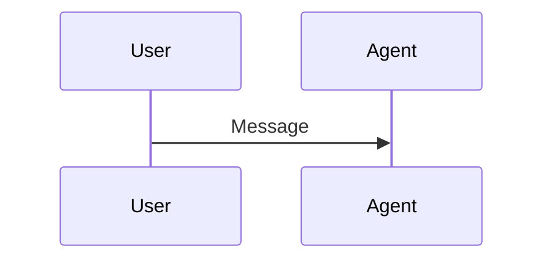

# Documenting and coding style guideline

## 1. Structure and Organization

### 1.1 Section Hierarchy
- **Consistent heading levels**: All parts must follow the same heading hierarchy pattern:
  - Part title: `# Part N: Title`
  - Major sections: `## N.N Title`
  - Subsections: `### Subsection Title`
  - Sub-subsections: `#### Detail Title`
- **Heading capitalization**: All section headings must use consistent Title Case
  - Example: `## Live API Session Resumption` (not `## Live API session resumption`)
  - Example: `## Concurrent Live API Sessions and Quota Management` (not `## Concurrent Live API sessions and quota management`)
  - Apply Title Case to all heading levels (##, ###, ####)
- **Maximum nesting depth**: Headings should not exceed 4 levels deep (####)
- **Parallel structure**: Similar content types across parts should use the same heading levels

### 1.2 Section Ordering
Each part should follow this standard structure where applicable:
1. **Introduction paragraph(s)**: Brief overview of the part's topic
2. **Core concepts**: Main technical content organized by subsections
3. **Code examples**: Practical demonstrations with explanations
4. **Best practices**: Guidelines and recommendations (if applicable)
5. **Common pitfalls**: Warnings and cautions (if applicable)
6. **Navigation links**: Previous/next part links at the end of each part (required for all parts in a series)

### 1.3 Consistent Section Types
- **Note boxes**: Use `!!! note "Title"` for multi-paragraph supplementary information (never `!!! info`)
- **Warnings**: Use `!!! warning "Title"` for cautions and potential issues
- **Tips**: Use `!!! tip "Title"` for production considerations and best practices
- **Code blocks**: All code examples should have language tags (```python, ```mermaid, etc.)
- **Diagrams**: Mermaid diagrams should be used consistently for sequence flows and architecture

## 2. Document Style

### 2.1 Writing Voice and Tone
- **Active voice**: Prefer "ADK provides" over "ADK is provided"
- **Present tense**: Use "returns" not "will return" for describing behavior
- **Second person**: Address the reader as "you" for instructions
- **Consistent terminology**:
  - Use "Live API" when referring to both Gemini Live API and Vertex AI Live API collectively
  - Specify "Gemini Live API" or "Vertex AI Live API" when platform-specific
  - Use "bidirectional streaming" or "bidi-streaming" consistently (not "bi-directional")
  - Use "ADK" not "the ADK" or "Google ADK" (unless first mention)
- **Version independence**:
  - Do NOT mention ADK version numbers (e.g., "v1.19.0", "ADK 1.18")
  - Do NOT label features as "new" or "introduced in version X"
  - Write documentation as if describing the current state of ADK
  - This keeps the guide evergreen and avoids version-dependent maintenance
- **Third-party product disclaimers** (PROHIBITED):
  - **NEVER include disclaimers** for third-party products or services in ADK documentation
  - Such disclaimers must ONLY be published by the owners of those products
  - Remove any warning/disclaimer content about services not owned by the ADK team
  - Example of prohibited content: disclaimers about Live API limitations, third-party service restrictions, etc.
  - If unsupported features must be documented, publish them separately (e.g., in adk-python-community repo)

### 2.2 Technical Explanations
- **Progressive disclosure**: Introduce simple concepts before complex ones
- **Concrete before abstract**: Show examples before deep technical details
- **Real-world context**: Connect technical features to practical use cases
- **Consistent metaphors**: If using analogies, ensure they're appropriate and consistent

### 2.3 Cross-references and Links
- **Format**: Use relative links for internal docs: `[text](part2.md#section)`
  - Use simplified filenames: `part1.md`, `part2.md`, etc. (not `part1_intro.md`, `part2_live_request_queue.md`)
- **Link text**: Should be descriptive: "See [Part 4: Response Modalities](part4.md#response-modalities)" not "See [here](part4.md#response-modalities)"
- **Source references**: Add as code block title attribute using HTML anchor tags that open in new windows
  - MUST include "Source reference: " prefix
  - Use single quotes for title attribute: `title='Source reference: <a href="..." target="_blank">file:lines</a>'`
  - The link opens in a new window with `target="_blank"`
  - **MUST use commit hash links** (permalinks) instead of `main` branch to prevent broken links when code changes
  - Example: ` ```python title='Source reference: <a href="https://github.com/google/adk-python/blob/abc1234def5678/src/google/adk/runners.py#L746-L775" target="_blank">runners.py:746-775</a>' `
- **Demo references**: Add as code block title attribute using HTML anchor tags that open in new windows
  - MUST include "Demo implementation: " prefix
  - Use single quotes for title attribute: `title='Demo implementation: <a href="..." target="_blank">file:lines</a>'`
  - **MUST use commit hash links** (permalinks) instead of `main` branch to prevent broken links when code changes
  - Include line numbers in the link for precise reference
  - Example: ` ```python title='Demo implementation: <a href="https://github.com/google/adk-samples/blob/abc1234def5678/python/agents/bidi-demo/app/main.py#L129-L158" target="_blank">main.py:129-158</a>' `
- **Learn more**: Use `!!! note "Learn More"` boxes or subsections instead of blockquotes
- **Navigation links** (required for multi-part documentation series):
  - Every part in a series MUST include navigation links at the end
  - Format: `← [Previous: Part N Title](partN.md) | [Next: Part N Title](partN.md) →`
  - First part: Only include "Next" link
  - Last part: Only include "Previous" link
  - Middle parts: Include both "Previous" and "Next" links
  - Example: `← [Previous: Part 2: LiveRequestQueue](part2.md) | [Next: Part 4: RunConfig](part4.md) →`

### 2.4 Lists and Bullets
- **Sentence fragments**: Bullet points should start with capital letters and end without periods (unless multi-sentence)
- **Parallel construction**: All items in a list should follow the same grammatical structure
- **Consistent markers**: Use `-` for unordered lists, numbers for sequential steps

### 2.5 Admonitions and Callouts

**General Philosophy: Prefer Regular Headings Over Admonitions**

Admonitions should be used sparingly for brief callouts only. Substantive content should use regular section headings instead of being wrapped in admonitions. This keeps documentation clean, scannable, and professional.

**When to use `!!!` boxes:**

- **`!!! note "Title"`** - Brief supplementary information (1-3 paragraphs maximum):
  - Use for additional context that enhances understanding
  - Use for "Learn More" references to other sections or parts
  - **Do NOT use for**: Multi-paragraph explanations or substantive technical content

- **`!!! warning "Title"`** - Short cautions (security risks, data loss, breaking changes):
  - Use for alerting users to potential issues
  - Keep warnings focused on a single concern

- **`!!! tip "Title"`** - Concise best practice reminders:
  - Use for production considerations
  - Keep tips actionable and specific

- **`!!! important "Title"`** - Critical single-topic alerts:
  - Use for information requiring immediate attention
  - Reserve for truly critical information only

**Never use blockquotes (`>`) in documentation**:
- Blockquotes make content look like headings and reduce scannability
- Use `!!! note` boxes for cross-references and supplementary information
- Use subsections (###, ####) for substantive content that needs separation

**MkDocs Admonition Requirements:**
- **Indentation**: All content inside admonitions MUST be indented with 4 spaces
- **Title quoting**: Admonition titles should be quoted: `!!! note "Title"`
- **Supported types**: note, warning, tip, important, danger, info (prefer `note` over `info` for consistency)
- **Blank lines**: Blank lines inside admonitions must also have 4 spaces (not empty) to maintain the admonition context

**Example of correct admonition formatting:**
```markdown
!!! note "Live API Reference Notes"
    **Labels**: Metadata tags used in Google Cloud for resource organization.

    This continues the admonition with proper 4-space indentation.

    - Bullet points also need indentation
    - Each line must start with 4 spaces
```

**Common Issues with Code Blocks in Admonitions:**

The most common rendering issue is code blocks appearing as headers or plain text instead of properly formatted code. This happens due to incorrect indentation.

**INCORRECT - Blank line breaks the admonition:**
```markdown
!!! note "Title"
    Some text about the code:

    ```python
    # Code here
    ```
```

The blank line after "Some text" has no indentation, which breaks the admonition.

**CORRECT - Blank line maintains admonition:**
```markdown
!!! note "Title"
    Some text about the code:

    ```python
    # Code here
    ```
```

Notice the blank line has 4 spaces to maintain the admonition context.

**Best Practice - Use subsections instead of admonitions for complex code blocks:**

If you encounter persistent indentation issues with code blocks in admonitions, convert the admonition to a regular subsection:

```markdown
### Important Note

Content here with proper code blocks.

```python
# Code renders correctly without indentation complexity
```
```

This approach eliminates indentation issues and improves readability for code-heavy content.

**Consistency rules:**
- Use the same emoji and format across all parts
- Never use `!!! info` - use `!!! note` instead for consistency
- Never use blockquotes (`>`) - use `!!! note` boxes or subsections instead
- Always indent admonition content with exactly 4 spaces (not tabs)

**Content restrictions:**
- **Do NOT use admonitions for unsupported features**: If content describes features not officially supported by ADK, remove it from official documentation entirely
- Publish unsupported/experimental content in separate community repositories instead
- Never use warnings or tips to "disclaim" unsupported functionality—either it's supported (document it) or it's not (remove it)

## 3. Sample Code Style

### 3.0 Source Code Formatting (src/ directory)

All Python code under `/src` (including the bidi-demo application) must be formatted and linted using the following tools:

**Required Tools:**

- **black**: Code formatter (line length 88)
- **isort**: Import sorter (compatible with black)
- **flake8**: Linter for style and error checking

**Running the formatters:**

```bash
# Format code with black and isort
cd src/bidi-demo
black .
isort .

# Check for linting issues
flake8 .
```

**Configuration:**

The tools should be configured to work together. Recommended `pyproject.toml` settings:

```toml
[tool.black]
line-length = 88

[tool.isort]
profile = "black"
line_length = 88
```

**Pre-commit check:**

Before committing changes to `/src`, ensure:

- [ ] `black --check .` passes (no formatting changes needed)
- [ ] `isort --check .` passes (imports properly sorted)
- [ ] `flake8 .` passes (no linting errors)

**Note:** Code samples in documentation (docs/*.md) should follow the same style for consistency, but are not automatically checked by these tools.

### 3.1 Code Block Formatting
- **Language tags**: All code blocks must specify language: ```python, ```bash, ```json, ```javascript
  - For Mermaid diagrams: ```mermaid
  - Supported Mermaid diagram types: `sequenceDiagram`, `graph TB/TD/LR`, `flowchart`
  - MkDocs uses Pygments for syntax highlighting via `pymdownx.highlight` extension
- **Code block titles** (optional but recommended for source references):
  - Use the `title=""` attribute to add context to code blocks
  - Particularly useful for source code references instead of separate blockquote lines
  - Example: ` ```python title="Source: runners.py" `
  - Example: ` ```python title="main.py:129-158" `
  - Makes the relationship between link and code clearer and more professional
- **Indentation**: Use 4 spaces for indentation (NEVER tabs)
  - Python: 4 spaces per indent level
  - JavaScript: 4 spaces (not 2)
  - All languages: consistent 4-space indentation
- **Line length**: Prefer breaking lines at 80-88 characters for readability
- **Comments**:
  - Use `#` for inline comments in Python
  - Comments should explain "why" not "what" (code should be self-documenting)
  - Avoid redundant comments like `# Send content` when code is `send_content()`

### 3.2 Code Example Structure
Each code example should include:
1. **Brief introduction**: One sentence explaining what the example demonstrates
2. **Complete code block**: Runnable code (or clearly marked pseudo-code)
3. **Explanation**: Key points explained after the code
4. **Variations** (if applicable): Alternative approaches with pros/cons

### 3.3 Code Captions and Source References

Use consistent bold captions before code blocks to indicate the code's purpose:

- **"Configuration:"** - For showing how to configure/set up a component or feature
- **"Implementation:"** - For showing how to implement a pattern or task
- **"Usage:"** - For showing how to use a method/API
- **"Example:"** - For general illustrative examples
- **"Complete Implementation:"** - For comprehensive, production-ready code examples

**Source References and Demo Implementation:**

For code taken from ADK source or the bidi-demo application, **ALWAYS** add the source reference directly in the code block title using the `title` attribute with **HTML anchor tags** for clickable links that open in new windows. The title MUST include either "Demo implementation: " or "Source reference: " prefix followed by a clickable link to the GitHub source.

**Demo Implementation Pattern:**

```markdown
\`\`\`python title='Demo implementation: <a href="https://github.com/google/adk-samples/blob/abc1234def5678/python/agents/bidi-demo/app/main.py#L141-L145" target="_blank">main.py:141-145</a>'
audio_blob = types.Blob(
    mime_type="audio/pcm;rate=16000",
    data=audio_data
)
live_request_queue.send_realtime(audio_blob)
\`\`\`
```

**Source Reference Pattern:**

```markdown
\`\`\`python title='Source reference: <a href="https://github.com/google/adk-python/blob/abc1234def5678/src/google/adk/runners.py#L746-L775" target="_blank">runners.py:746-775</a>'
async for event in runner.run_live(
    user_id=user_id,
    session_id=session_id,
    live_request_queue=live_request_queue,
    run_config=run_config
):
    # Process events
    pass
\`\`\`
```

**General Code Example (no source needed):**

```markdown
**Configuration:**

\`\`\`python
# Configuration example (no source reference needed)
run_config = RunConfig(
    streaming_mode=StreamingMode.BIDI
)
\`\`\`
```

**Important Notes:**

- **ALWAYS include the prefix** in code block titles:
  - Use `"Demo implementation: "` for code from bidi-demo or adk-samples repository
  - Use `"Source reference: "` for code from ADK Python source (adk-python repository)
  - The prefix MUST be part of the title text, not a separate caption
- **Use HTML anchor tags**, not markdown syntax: `<a href="..." target="_blank">file.py:123-456</a>`
- **Use single quotes** for the title attribute when it contains HTML with double quotes: `title='Demo implementation: <a href="...">...</a>'`
- **Do NOT add captions** like "**Demo Implementation:**" before code blocks with title attributes - the title serves as the caption
- **Always include** `target="_blank"` in HTML anchor tags to open links in new windows/tabs
- **Always include line numbers** in source/demo references for precise navigation (`#L123-L456`)
- **MUST use commit hash links** (permalinks) instead of branch names like `main`:
  - Links using `main` branch break when code is modified, reformatted, or refactored
  - Commit hash links are permanent and always point to the exact code referenced
  - Format: `https://github.com/owner/repo/blob/{commit_hash}/path/to/file.py#L123-L456`
  - Example: `https://github.com/google/adk-python/blob/a1b2c3d4e5f6/src/google/adk/runners.py#L746-L775`
- **How to get commit hash links**:
  - On GitHub, navigate to the file and click on the line number(s) to highlight them
  - Press `y` to convert the URL from branch name to commit hash (permalink)
  - Or click "..." menu → "Copy permalink"
  - The URL will change from `.../blob/main/...` to `.../blob/{40-char-hash}/...`
- **Only add title attributes** for code directly copied from source; omit for illustrative examples

### 3.4 Code Consistency
- **Import statements**: Show imports when first introducing a concept
- **Variable naming**:
  - Use descriptive names: `live_request_queue` not `lrq`
  - Follow Python conventions: `snake_case` for variables/functions, `PascalCase` for classes
- **Type hints**: Include type hints in function signatures when helpful for understanding
- **Error handling**: Show error handling in production-like examples, omit in minimal examples

### 3.5 Code Example Types
Distinguish between:
- **Minimal examples**: Simplest possible demonstration of a concept
- **Production-like examples**: Include error handling, logging, edge cases
- **Anti-patterns**: Clearly marked with explanation of what NOT to do

Example format for anti-patterns:
```python
# ❌ INCORRECT: Don't do this
bad_example()

# ✅ CORRECT: Do this instead
good_example()
```

**Anti-pattern marker standardization:**
- **Always use**: `# ✅ CORRECT:` and `# ❌ INCORRECT:`
- **Never use**: `# ✅ GOOD:` or `# ❌ BAD:`
- This ensures consistency across all parts of the documentation
- Applies to all code examples showing correct vs incorrect approaches

### 3.6 Code Comments and Documentation

**Commenting Philosophy:**

The documentation uses code comments strategically based on the example's purpose. Follow this consistent standard across all parts:

**1. Teaching Examples (Introductory/Concept-focused)**

Use detailed explanatory comments to teach concepts. These examples prioritize education over brevity:

```python
# Phase 1: Application initialization (once at startup)
agent = Agent(
    model="gemini-2.0-flash-live-001",
    tools=[google_search],  # Tools the agent can use
    instruction="You are a helpful assistant."
)

# Phase 2: Session initialization (once per streaming session)
run_config = RunConfig(
    streaming_mode=StreamingMode.BIDI,  # Bidirectional streaming
    response_modalities=["TEXT"]  # Text-only responses
)
```

**When to use:**
- First introduction of a concept in a part
- Complex multi-step processes (like the FastAPI example in Part 1)
- Examples showing complete workflows
- When explaining architectural patterns

**Characteristics:**
- Comments explain "why" and provide context
- Phase labels organize multi-step processes
- Inline comments clarify non-obvious parameters
- Section headers demarcate major steps

**2. Production-like Examples (Minimal Comments)**

Use minimal or no comments when the code is self-documenting. These examples show production patterns:

```python
session = await session_service.get_session(
    app_name="my-streaming-app",
    user_id="user123",
    session_id="session456"
)
if not session:
    await session_service.create_session(
        app_name="my-streaming-app",
        user_id="user123",
        session_id="session456"
    )
```

**When to use:**
- Straightforward API usage examples
- Code demonstrating patterns already explained in text
- After a concept has been introduced with detailed comments
- Simple configuration examples

**Characteristics:**
- Let descriptive variable/function names speak for themselves
- No redundant comments (avoid `# Send content` when code says `send_content()`)
- Code structure provides clarity

**3. Complex Logic (Always Comment)**

Always add comments for non-obvious logic, especially async patterns and edge cases:

```python
async def upstream_task():
    """Receive messages from client and forward to model."""
    try:
        async for message in websocket.iter_text():
            data = json.loads(message)

            # Convert WebSocket message to LiveRequest format
            content = types.Content(parts=[types.Part(text=data["text"])])
            live_request_queue.send_content(content)
    except asyncio.CancelledError:
        # Graceful shutdown on cancellation
        pass
```

**When to use:**
- Async/await patterns that aren't obvious
- Error handling with specific recovery strategies
- Edge cases or gotchas
- Performance-critical sections

**Characteristics:**
- Explains the "why" behind non-obvious decisions
- Clarifies timing or ordering requirements
- Documents error handling rationale

**4. Anti-pattern Examples**

Clearly mark incorrect vs correct approaches:

```python
# ❌ INCORRECT: Don't reuse LiveRequestQueue across sessions
queue = LiveRequestQueue()
await runner.run_live(..., live_request_queue=queue)
await runner.run_live(..., live_request_queue=queue)  # BUG!

# ✅ CORRECT: Create fresh queue for each session
queue1 = LiveRequestQueue()
await runner.run_live(..., live_request_queue=queue1)

queue2 = LiveRequestQueue()  # New queue for new session
await runner.run_live(..., live_request_queue=queue2)
```

**When to use:**
- Demonstrating common mistakes
- Showing what NOT to do alongside correct approach
- Security or safety considerations

**Characteristics:**
- Use ❌ and ✅ markers consistently
- Include brief explanation of why it's wrong
- Always show correct alternative

**General Guidelines:**

- **Avoid redundant comments**: Don't comment obvious code
  ```python
  # ❌ BAD: Redundant
  live_request_queue.send_content(content)  # Send content

  # ✅ GOOD: No comment needed (self-documenting)
  live_request_queue.send_content(content)
  ```

- **Comment "why" not "what"**: The code shows what; comments explain why
  ```python
  # ❌ BAD: States the obvious
  queue.close()  # Close the queue

  # ✅ GOOD: Explains the reason
  queue.close()  # Ensure graceful termination before cleanup
  ```

- **Use inline comments sparingly**: Prefer explanatory text before/after code blocks
  ```markdown
  # ✅ GOOD: Explanation in prose

  The get-or-create pattern safely handles both new sessions and resumption:

  ```python
  session = await session_service.get_session(...)
  if not session:
      await session_service.create_session(...)
  ```

  This approach is idempotent and works correctly for reconnections.
  ```

- **Consistency within examples**: All examples in the same section should use similar commenting density
- **Progressive detail reduction**: Use detailed comments in Part 1, lighter comments in later parts as readers gain familiarity

**5. Placeholder Functions**

Placeholder functions are application-specific functions that users must implement themselves. Always mark these clearly:

```python
# ✅ GOOD: Clear indication this is user's responsibility
async for event in runner.run_live(...):
    if event.content and event.content.parts:
        text = event.content.parts[0].text
        if text:
            # Your logic to display text
            display_text(text)
```

```python
# ❌ BAD: Looks like complete working code
async for event in runner.run_live(...):
    if event.content and event.content.parts:
        text = event.content.parts[0].text
        if text:
            # Display text to user
            display_text(text)
```

**When to use:**
- Any function that requires application-specific implementation
- UI update functions (display, update, show, hide)
- I/O operations (microphone.read(), play_audio())
- Custom business logic (process_query(), handle_event())

**Characteristics:**
- Use "Your logic to..." or "Your [action] logic here" format
- Place comment immediately before the placeholder function call
- Make it clear this is NOT part of ADK API
- Distinguish teaching examples from production placeholders

**Checklist for Code Comments:**

- [ ] Teaching examples have explanatory comments for all non-obvious steps
- [ ] Production examples avoid redundant comments
- [ ] Complex async/await patterns are explained
- [ ] Anti-patterns use standardized markers: `# ✅ CORRECT:` and `# ❌ INCORRECT:` (never GOOD/BAD)
- [ ] Comments explain "why" not "what"
- [ ] Comment density is consistent within each part
- [ ] Placeholder functions are clearly marked with "Your logic..." comments
- [ ] No TODO, FIXME, or placeholder comments in documentation

## 4. Table Formatting

### 4.1 Column Alignment
Consistent table formatting improves readability. Follow these alignment rules:

- **Text columns**: Left-align (use `---` or `|---|`)
  - Model names, descriptions, notes, explanations
  - Any column containing paragraphs or sentences

- **Status/Symbol columns**: Center-align (use `:---:` or `|:---:|`)
  - Columns containing only checkmarks (✅/❌)
  - Single-character or symbol-only columns
  - Boolean indicators

- **Numeric columns**: Right-align (use `---:` or `|---:|`)
  - Numbers, percentages, counts
  - Measurements and statistics

**Example of correct alignment:**

```markdown
| Feature | Status | Count | Description |
|---------|:---:|---:|-------------|
| Audio | ✅ | 100 | All text here is left-aligned |
| Video | ❌ | 50 | Status centered, count right-aligned |
```

### 4.2 Header Formatting
- All table headers should use **bold** text: `| **Feature** | **Status** |`
- Headers should be concise and descriptive
- Use title case for headers

### 4.3 Cell Content
- Use code formatting for code terms: `` `response_modalities` ``
- Use line breaks (`<br>`) sparingly, only when necessary for readability
- Keep cell content concise - tables should be scannable

### 4.4 Table Consistency Across Parts
- All tables across all parts should follow the same alignment rules
- Similar table types (e.g., feature matrices, comparison tables) should use the same structure
- Platform comparison tables should use consistent column ordering

## 5. Cross-Part Consistency

### 5.1 Terminology Consistency
- Verify the same technical terms are used consistently across all parts
- Check that acronyms are defined on first use in each part
- Ensure consistent capitalization of product names and technical terms

### 5.2 Navigation and Flow
- Each part should naturally lead to the next
- Cross-references should be bidirectional where appropriate
- Concepts introduced in earlier parts should not be re-explained in depth later

### 5.3 Example Progression
- Code examples should increase in complexity across parts
- Earlier parts should use simpler examples
- Later parts can reference or build upon earlier examples

## 6. MkDocs Compliance

### 6.1 MkDocs Configuration
The documentation is deployed to adk-docs repository which uses MkDocs with Material theme. The following extensions are enabled:

**Markdown Extensions:**
- `admonition` - Enables `!!!` callout blocks
- `pymdownx.details` - Collapsible admonitions
- `pymdownx.superfences` - Enhanced code blocks and Mermaid diagrams
- `pymdownx.highlight` - Syntax highlighting with Pygments
- `pymdownx.tabbed` - Tabbed content blocks
- `md_in_html` - HTML blocks within markdown (for iframe embeds)

### 6.2 File Naming Convention
- **Simplified names**: Use `part1.md`, `part2.md`, `part3.md`, `part4.md`, `part5.md`
- **Never use**: Descriptive suffixes like `part1_intro.md`, `part2_live_request_queue.md`
- **Assets**: Store images in `assets/` subdirectory
- **References**: Use `assets/image.png` in markdown (not `../assets/` or absolute paths)

### 6.3 Admonition Syntax for MkDocs
**Critical requirement**: All admonition content MUST be indented with exactly 4 spaces.

```markdown
!!! note "Title Here"
    First line of content with 4-space indent.

    Second paragraph also with 4-space indent.

    - List items need 4 spaces
    - Plus the list marker
```

**Common mistakes to avoid:**
```markdown
# ❌ INCORRECT: Content not indented
!!! warning "Title"
Content without indentation will not render inside the admonition.

# ❌ INCORRECT: Using tabs
!!! note "Title"
	Content indented with tabs instead of spaces.

# ✅ CORRECT: 4-space indentation
!!! note "Title"
    Content properly indented with 4 spaces.
```

### 6.4 Code Block Syntax
**Language tags are required** for all code blocks to enable syntax highlighting:

```markdown
# ✅ CORRECT: With language tag
```python
def example():
    pass
```

# ✅ CORRECT: Mermaid diagrams


# ❌ INCORRECT: No language tag (renders as plain text)
```
def example():
    pass
```
```

**Supported Mermaid types:**
- `sequenceDiagram` - Sequence diagrams
- `graph TB/TD/LR` - Directed graphs (Top-Bottom, Top-Down, Left-Right)
- `flowchart` - Flowcharts
- Other types: `classDiagram`, `stateDiagram`, `erDiagram`, `gantt`, `pie`

### 6.5 HTML Embeds
**YouTube iframe embeds** are supported via `md_in_html` extension:

```markdown
<div class="video-grid">
  <div class="video-item">
    <div class="video-container">
      <iframe src="https://www.youtube-nocookie.com/embed/..."
              title="Video Title"
              frameborder="0"
              allow="accelerometer; autoplay; clipboard-write; encrypted-media; gyroscope; picture-in-picture; web-share"
              referrerpolicy="strict-origin-when-cross-origin"
              allowfullscreen></iframe>
    </div>
  </div>
</div>
```

**CSS classes available** in adk-docs:
- `video-grid` - Container for video embeds
- `video-item` - Individual video wrapper
- `video-container` - Responsive iframe container (16:9 aspect ratio)

### 6.6 Tables
**MkDocs table syntax** follows standard Markdown:

```markdown
| Column 1 | Column 2 | Column 3 |
|----------|:--------:|---------:|
| Left     | Center   | Right    |
```

**Alignment:**
- Left: `|---|` or `|-----|`
- Center: `|:---:|` or `|:-----:|`
- Right: `|---:|` or `|-----:|`

### 6.7 Cross-References
**Internal links** use relative paths:

```markdown
[Part 2: LiveRequestQueue](part2.md#sending-messages)
```

**Anchor links:**
- MkDocs auto-generates anchors from headings
- Format: lowercase with hyphens: `#audio-transcription`
- Remove special characters: `Part 5: Audio & Video` → `#part-5-audio-video`

### 6.8 Indentation Standards
**Critical for MkDocs rendering:**

- **Admonitions**: 4 spaces for all content
- **Code blocks**: 4 spaces per indent level (never tabs)
- **Lists**: 2-4 spaces for nested items
- **Blockquotes**: No indentation required (use `>` prefix)

**Testing indentation:**
```bash
# Check for tabs (should return nothing)
grep -n $'\t' part*.md

# Verify admonition indentation
# All lines after !!! should start with 4 spaces
```

### 6.9 MkDocs Compliance Checklist

Before deploying documentation:

- [ ] All filenames use simplified format: `part1.md`, `part2.md`, etc.
- [ ] All admonition content indented with 4 spaces (no tabs)
- [ ] All code blocks have language tags
- [ ] Mermaid diagrams use supported types
- [ ] Internal links use relative paths to `.md` files
- [ ] Images use `assets/` prefix
- [ ] No tabs anywhere (use 4 spaces)
- [ ] HTML embeds use proper CSS classes
- [ ] Tables use proper Markdown syntax
- [ ] Cross-references use correct anchor format
