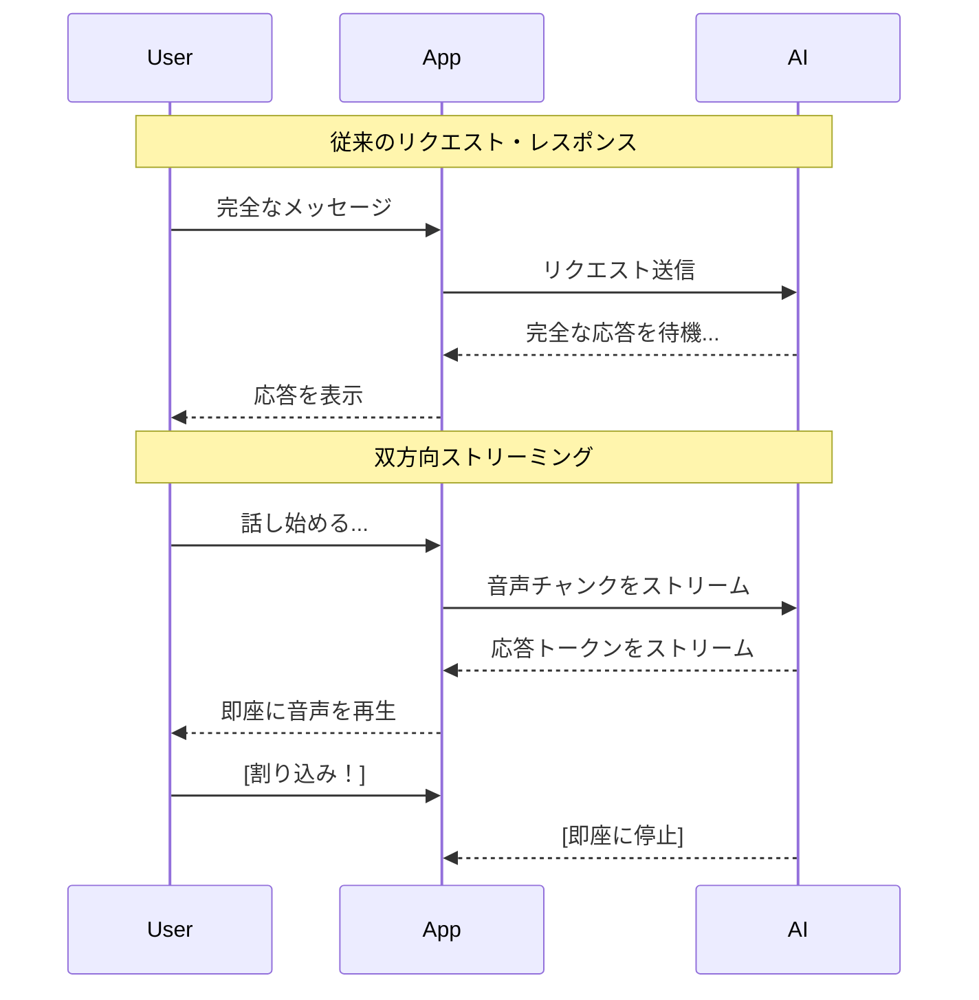
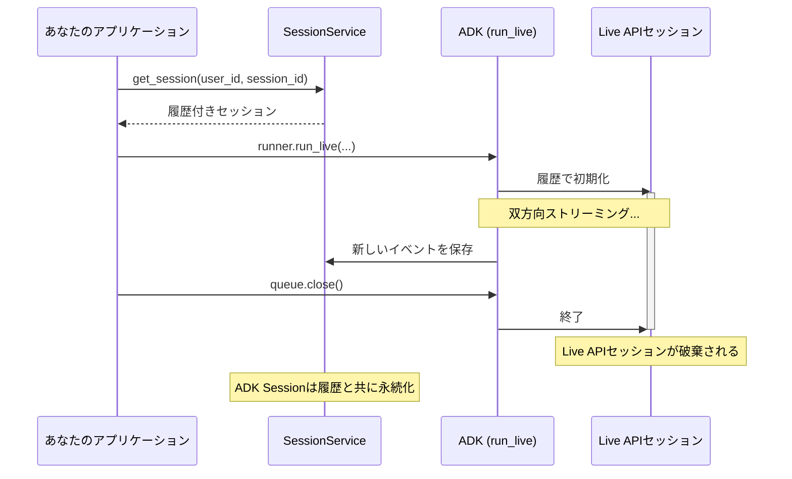

# ADK Bidi-streaming ワークショップ: リアルタイム音声AIを作ろう

## Bidi-streamingとは？

**双方向ストリーミング**（Bidi-streaming）は、アプリケーションとAIモデル間の同時双方向通信を可能にします。完全なメッセージを送信して完全な返答を待つ従来のリクエスト・レスポンスパターンとは異なり、Bidi-streamingでは以下が可能です：

- **継続的な入力**: 音声、動画、テキストをキャプチャしながらストリーミング
- **リアルタイム出力**: AIの応答を生成されながら受信
- **自然な割り込み**: 人間との会話のように、AIの応答中にユーザーが割り込み可能



**なぜこれが重要か：** Bidi-streamingはAIとの会話を自然なものにします。AIはあなたがまだコンテキストを提供している間に応答でき、十分聞いたと思ったら割り込むことができます—まるで人間と話しているかのように。

### ADK Bidi-streamingとは？

**[Agent Development Kit (ADK)](https://google.github.io/adk-docs/)** は[Gemini Live API](https://ai.google.dev/gemini-api/docs/live)上の高レベルな抽象化を提供し、リアルタイムストリーミングの複雑な仕組みを処理することで、アプリケーション構築に集中できるようにします。


ADK Bidi-streamingが管理するもの：

- **接続ライフサイクル**: [WebSocket](https://developer.mozilla.org/en-US/docs/Web/API/WebSockets_API)接続の確立、維持、回復
- **メッセージルーティング**: 音声、テキスト、画像を適切なハンドラーに振り分け
- **セッション状態**: 再接続時の会話履歴の永続化
- **ツール実行**: 関数呼び出しの自動実行と再開

**なぜ生のLive APIではなくADKを使うのか？**

Gemini Live API上で直接構築することもできますが、ADKが複雑なインフラを処理するので、アプリケーションに集中できます：


| 機能 | 生のLive API | ADK Bidi-streaming |
|------|--------------|-------------------|
| エージェントフレームワーク | ゼロから構築 | ツール、評価、セキュリティ付きのシングル/マルチエージェント |
| ツール実行 | 手動処理 | 自動並列実行 |
| 接続管理 | 手動再接続 | 透過的なセッション再開 |
| イベントモデル | カスタム構造 | 統一された型付きEventオブジェクト |
| 非同期フレームワーク | 手動調整 | LiveRequestQueue + run_live()ジェネレーター |
| セッション永続化 | 手動実装 | 組み込みのSQL、Vertex AI、またはインメモリ |

> **結論：** ADKは数ヶ月のインフラ開発を数日のアプリケーション開発に短縮します。ストリーミングの仕組みではなく、エージェントが何をするかに集中できます。

### 実世界のユースケース

- **カスタマーサービス**: 顧客が故障したコーヒーマシンを電話のカメラで見せながら問題を説明。AIがモデルと故障箇所を特定し、顧客は会話の途中で詳細を訂正するために割り込むことができます。

- **Eコマース**: 買い物客がウェブカメラに服を向けて「このパンツに合う靴を探して」と質問。エージェントがスタイルを分析し、流暢なやり取りを行います：「もっとカジュアルなものを見せて」→「このスニーカーはいかがですか？」→「青いのをサイズ10で追加して」

- **フィールドサービス**: スマートグラスを着用した技術者が視界をストリーミングしながら「このコンプレッサーから変な音がするんだけど、特定できる？」と質問。エージェントがハンズフリーでステップバイステップのガイダンスを提供。

- **ヘルスケア**: 患者が皮膚の状態のライブビデオを共有。AIが予備分析を行い、明確化のための質問をし、次のステップをガイド。

- **金融サービス**: クライアントがポートフォリオを確認しながら、エージェントがチャートを表示し取引の影響をシミュレート。クライアントは特定のニュース記事について議論するために画面を共有できます。

**Shopper's Concierge 2 デモ**: ADK Bidi-streamingと[Vertex AI](https://cloud.google.com/vertex-ai) Vector Search、Embeddings、Feature Store、Ranking APIで構築された、Eコマース向けリアルタイムAgentic RAGデモ：

[](https://www.youtube.com/watch?v=Hwx94smxT_0)

### さらに学ぶ：開発者ガイド

包括的な詳細については、[ADK Bidi-streaming開発者ガイド](https://google.github.io/adk-docs/streaming/dev-guide/part1/)をご覧ください—アーキテクチャから本番デプロイまでをカバーする5部構成のシリーズです：

| パート | フォーカス | 学べること |
|--------|-----------|------------|
| [パート1](https://google.github.io/adk-docs/streaming/dev-guide/part1/) | 基礎 | アーキテクチャ、Live APIプラットフォーム、4フェーズライフサイクル |
| [パート2](https://google.github.io/adk-docs/streaming/dev-guide/part2/) | アップストリーム | LiveRequestQueueを介したテキスト、音声、動画の送信 |
| [パート3](https://google.github.io/adk-docs/streaming/dev-guide/part3/) | ダウンストリーム | イベント処理、ツール実行、マルチエージェントワークフロー |
| [パート4](https://google.github.io/adk-docs/streaming/dev-guide/part4/) | 設定 | セッション管理、クォータ、本番環境制御 |
| [パート5](https://google.github.io/adk-docs/streaming/dev-guide/part5/) | マルチモーダル | 音声仕様、モデルアーキテクチャ、高度な機能 |

---

## ワークショップ概要

### 作るもの

このハンズオンワークショップでは、完全な双方向ストリーミングAIアプリケーションをゼロから構築します。完了時には、以下ができる動作する音声AIが完成します：

- テキスト、音声、画像入力を受け付ける
- ストリーミングテキストまたは自然な音声で応答する
- 割り込みを自然に処理する
- Google Searchなどのツールを使用する

ドキュメントを読むだけではなく、**各コンポーネントをステップバイステップで調べ**、段階的に構築しながらそれらをどのように組み合わせていくかを理解します。


### 学習アプローチ

段階的なビルドアプローチを採用しています：

```
ステップ1: 最小限のWebSocketサーバー → "Hello World"応答
ステップ2: エージェントを追加         → AI動作とツールを定義
ステップ3: アプリケーション初期化     → Runnerとセッションサービス
ステップ4: セッション初期化           → RunConfigとLiveRequestQueue
ステップ5: アップストリームタスク     → クライアントからキューへの通信
ステップ6: ダウンストリームタスク     → クライアントへのイベント配信
ステップ7: 音声を追加                 → 音声入出力
ステップ8: 画像入力を追加             → マルチモーダルAI
```

各ステップは前のステップの上に構築されます。各ステップ後にテストして進捗を確認できます。

### 前提条件

- [課金が有効](https://cloud.google.com/billing/docs/how-to/modify-project)なGoogle Cloudアカウント
- 基本的なPythonと非同期プログラミング（async/await）の知識
- マイクとWebカメラにアクセスできるウェブブラウザ（Chrome推奨）

---

## 環境セットアップ（10分）

[Cloud Shell Editor](https://cloud.google.com/shell/docs/editor-overview)は、VS Code機能を備えたブラウザベースの開発環境を提供します。ローカルセットアップは不要です！

**ステップ1: Cloud Shell Editorを開く**

ブラウザで[ide.cloud.google.com](https://ide.cloud.google.com)に移動します。右側のGeminiパネルを閉じてください（このワークショップでは使用しません）。


**ステップ2: ワークショップファイルをダウンロード**

新しいターミナルを開きます（**Terminal** → **New Terminal**）：


ターミナルで、以下のコマンドを実行してワークショップファイルをダウンロードします：

```bash
mkdir -p ~/bidi-workshop && cd ~/bidi-workshop
curl -L https://raw.githubusercontent.com/kazunori279/adk-streaming-guide/main/workshops/src.tar.gz | tar xz
```

これにより、すべてのPythonソースファイル、エージェント定義、フロントエンドアセットがダウンロードされます。各`stepN_main.py`ファイルは、そのステップの完全な動作バージョンです。

次に、エディタでプロジェクトフォルダを開きます：

1. メニューバーで**File** → **Open Folder**をクリック
2. `bidi-workshop`に移動
3. **OK**をクリック

プロジェクト構造は以下のようになります：

```
bidi-workshop/
├── pyproject.toml                    # Pythonパッケージ設定
└── app/                              # メインアプリケーションディレクトリ
    ├── .env.template                  # 環境変数テンプレート（.envにコピー）
    ├── step1_main.py                 # ステップ1: 最小限のWebSocketサーバー
    ├── step3_main.py                 # ステップ3: アプリケーション初期化
    ├── step4_main.py                 # ステップ4: セッション初期化
    ├── step5_main.py                 # ステップ5: アップストリームタスク
    ├── step6_main.py                 # ステップ6: ダウンストリームタスク
    ├── step7_main.py                 # ステップ7: 双方向音声
    ├── step8_main.py                 # ステップ8: 画像入力
    ├── my_agent/                     # エージェントパッケージ
    │   ├── __init__.py
    │   └── agent.py                  # エージェント定義
    └── static/                       # フロントエンドアセット
        ├── index.html
        ├── css/style.css
        └── js/                       # WebSocket、音声キャプチャ/再生
```

`step1_main.py`から`step8_main.py`までの各ファイルは、それぞれのステップで使用する`main.py`ファイルです。

**ステップ3: 環境変数を設定**

新しいターミナルを開き、以下のコマンドでテンプレートファイルをコピーします：

```bash
cd ~/bidi-workshop/app
cp .env.template .env
```

Explorerに`.env`ファイルが表示されない場合は、Explorerパネルの**Refresh Explorer**ボタンをクリックして新しいファイルを表示します。


`app/.env`を編集し、`your_project_id`をプロジェクトIDに置き換えます：

```bash
GOOGLE_CLOUD_PROJECT=your_project_id
GOOGLE_CLOUD_LOCATION=us-central1
GOOGLE_GENAI_USE_VERTEXAI=TRUE
```

> **プロジェクトIDの確認方法**: Cloud Consoleの「Cloud overview」→「Dashboard」→「Project info」で確認できます。

プロジェクトでVertex AI APIを有効化します（`your_project_id`を実際のプロジェクトIDに置き換えてください）：

```bash
gcloud services enable aiplatform.googleapis.com --project=your_project_id
```

**ステップ4: 依存関係をインストール**

pyproject.tomlで定義されているすべてのPythonパッケージをインストールします。

ターミナルを開いて実行：

```bash
cd ~/bidi-workshop
python3 -m venv .venv
source .venv/bin/activate
pip install -e .
```

これにより、bidi-workshopパッケージと以下を含むすべての必要な依存関係がインストールされます：

- `google-adk` - GeminiでAIエージェントを構築するための[Agent Development Kit](https://google.github.io/adk-docs/)
- `fastapi` - WebSocketサポート付きのモダンなPythonウェブフレームワーク[FastAPI](https://fastapi.tiangolo.com/)
- `uvicorn` - FastAPIアプリケーションを実行するASGIサーバー[Uvicorn](https://www.uvicorn.org/)
- `python-dotenv` - `.env`ファイルから環境変数をロードする[python-dotenv](https://pypi.org/project/python-dotenv/)

---

## アーキテクチャ概要

コードに入る前に、Bidi-streamingアプリケーションの高レベルアーキテクチャとライフサイクルを理解しましょう。

### 高レベルアーキテクチャ


アーキテクチャは3つの主要レイヤーで構成されています：

| レイヤー | コンポーネント | 目的 |
|----------|----------------|------|
| **クライアント** | ブラウザ、WebSocket、[AudioWorklet](https://developer.mozilla.org/en-US/docs/Web/API/AudioWorklet) | 入力をキャプチャ、音声を再生、UIを表示 |
| **サーバー** | FastAPI、ADK Runner、LiveRequestQueue | メッセージをルーティング、セッションを管理、エージェントをオーケストレート |
| **AI** | Gemini Live API、Agent、Tools | 入力を処理、応答を生成、ツールを実行 |

---

## ステップ1: 最小限のWebSocketサーバー

最もシンプルなWebSocketサーバーから始めましょう。メッセージをエコーバックするだけです。

### サーバーを実行

ステップ1のソースファイルを`main.py`にコピーしてサーバーを起動します：

```bash
cd ~/bidi-workshop/app
cp step1_main.py main.py
```

サーバーを起動：

```bash
cd ~/bidi-workshop/app
python -m uvicorn main:app --host 0.0.0.0 --port 8080
```

以下のログが表示されるはずです：

```
INFO:     Uvicorn running on http://0.0.0.0:8080 (Press CTRL+C to quit)
INFO:     Started server process [...]
INFO:     Application startup complete.
```

**Web Preview**ボタンをクリックし、**Preview on port 8080**を選択します。


ブラウザにデモ画面が表示されます。右上隅に**Connected**インジケーターが表示されることを確認してください—これはWebSocket接続が機能していることを確認するものです。


**テストする:**
1. テキスト入力に「Hello」と入力
2. Sendをクリック
3. チャットに「Echo: {"type": "text", "text": "Hello"}」と表示されるはずです


エディタで`main.py`を開いてコードを確認します。主要コンポーネント：

- **FastAPI app**: WebSocketサポート付きのウェブサーバーを作成
- **静的ファイル**: フロントエンドアセット（HTML、CSS、JS）を提供
- **WebSocketエンドポイント**: `/ws/{user_id}/{session_id}`で接続を受け付け
- **エコー応答**: ADKイベント形式でメッセージを返す

### サーバーコードを理解する

**step1_main.py:9-14** - FastAPIアプリを作成し、静的ファイルを提供：
```python
# FastAPIアプリケーションを作成
app = FastAPI()

# 静的ファイル（HTML、CSS、JS）を提供
static_dir = Path(__file__).parent / "static"
app.mount("/static", StaticFiles(directory=static_dir), name="static")
```

FastAPIは組み込みWebSocketサポートを提供するモダンなPythonウェブフレームワークです。`StaticFiles`ミドルウェアは`static/`ディレクトリからフロントエンドアセット（HTML、CSS、JavaScript）を提供します。

**step1_main.py:23-30** - WebSocketエンドポイントが接続を受け付け：
```python
@app.websocket("/ws/{user_id}/{session_id}")
async def websocket_endpoint(
    websocket: WebSocket,
    user_id: str,
    session_id: str,
) -> None:
    """WebSocketエンドポイント - 現在はメッセージをエコーするだけ。"""
    await websocket.accept()
```

`@app.websocket`デコレータによりWebSocketエンドポイントが作成されます。パスパラメータ`{user_id}`と`{session_id}`はURLから抽出され、引数として渡されます。`websocket.accept()`を呼び出すとWebSocketハンドシェイクが完了します。

**step1_main.py:44-50** - ADKイベント形式でエコー応答：
```python
response = {
    "content": {
        "parts": [{"text": f"Echo: {text_data}"}]
    }
}
await websocket.send_text(json.dumps(response))
await websocket.send_text(json.dumps({"turnComplete": True}))
```

この時点では、ADKの機能をまだ使用せず、入力メッセージをエコーバックしているだけです。ただし、応答の内容はADKのイベント形式に従っています：テキスト応答は`content.parts[].text`、応答完了のシグナルは`turnComplete: true`です。このイベント形式についてはステップ6で詳しく解説します。クライアントはあらかじめこのイベント形式の応答を処理するよう記述されているため、エコーバックされたメッセージがチャットメッセージとして表示されます。

### イベントコンソールを理解する

デモUIには、画面右側に**Event Console**パネルがあります。これはサーバーから到着する生のADKイベントをリアルタイムで表示するデバッグツールです。

**Event Consoleが表示するもの:**

- サーバーから送信されるすべてのイベント（JSON形式）
- イベントのタイミングを表すタイムスタンプ
- イベントのペイロード全体

**イベントタイプアイコン:**

| アイコン | イベントタイプ | 説明 |
|----------|---------------|------|
| 📝 | テキストコンテンツ | モデルのテキスト応答チャンク |
| 🔊 | 音声コンテンツ | モデルの音声応答チャンク |
| 🎤 | 入力トランスクリプション | ユーザーの音声をテキストに変換 |
| 📜 | 出力トランスクリプション | モデルの音声をテキストに変換 |
| ⏹️ | ターン完了 | モデルが応答を完了 |
| ⚡ | 割り込み | ユーザーがモデルを割り込み |

**使い方:**

1. **表示切り替え**: 「Event Console」ヘッダーまたはトグルボタンをクリックしてパネルの表示/非表示を切り替え
2. **イベントをクリア**: コンソールをリセット
3. **ペイロードを表示**: イベントをクリックしてJSONペイロード全体を表示

このステップでは、送信するメッセージごとに2つのイベントが表示されます：
1. エコー応答を含むコンテンツイベント
2. 応答完了を示す`turnComplete`イベント

ワークショップを進めるにつれ、トランスクリプション、音声チャンクなど、より多くのイベントタイプが表示され、ADKストリーミングが内部でどのように機能するかを可視化できます。

### クライアントコードを理解する: WebSocket接続

フロントエンドはWebSocket接続を確立し管理します。クライアント側で何が起こるかを見てみましょう：

**サーバーへの接続 (app.js:10-12, 317-350):**

```javascript
const userId = "demo-user";
const sessionId = "demo-session-" + Math.random().toString(36).substring(7);

function connectWebsocket() {
    // ユーザー/セッションIDでWebSocket URLを構築
    const ws_url = "ws://" + window.location.host + "/ws/" + userId + "/" + sessionId;
    websocket = new WebSocket(ws_url);

    websocket.onopen = function() {
        console.log("WebSocket connected");
        updateConnectionStatus(true);  // UIインジケーターを更新
    };

    websocket.onclose = function() {
        console.log("WebSocket closed");
        updateConnectionStatus(false);
        setTimeout(connectWebsocket, 5000);  // 自動再接続
    };

    websocket.onmessage = function(event) {
        // 受信メッセージを処理（後で詳しく見ます）
        const data = JSON.parse(event.data);
        // ... イベントを処理
    };
}

// ページロード時に接続
connectWebsocket();
```

**キーポイント:**

| 概念 | 目的 |
|------|------|
| `userId` / `sessionId` | セッション永続化のためのユーザーと会話の識別 |
| `WebSocket()` | リアルタイム双方向通信のためのブラウザAPI |
| `onopen` / `onclose` | 接続ライフサイクルコールバック |
| `onmessage` | すべてのサーバーイベント（テキスト、音声、トランスクリプション）を受信 |
| 自動再接続 | ネットワーク中断を適切に処理 |

**なぜREST APIを使わないのか？** 従来のREST APIは、クライアントがリクエストを送信したら全ての応答が届くまで待機する、リクエスト・レスポンスパターンを使用します。一方、ストリーミングAIでは、サーバーがイベントを生成された時点でリアルタイムに配信します。こうしたストリーミング通信を行うには、REST APIに代わりWebSocketやSSE（Server-Sent Events）等のストリーミングプロトコルを利用します：

| プロトコル | 長所 | 短所 |
|------------|------|------|
| **WebSocket** | 双方向、バイナリデータ（音声/画像）サポート、低レイテンシ | プロキシ/ロードバランサーでの設定が複雑 |
| **SSE** | シンプル、HTTP上で動作、プロキシサポートが良好 | 双方向ストリーミングには2つのエンドポイントが必要、バイナリデータにはbase64エンコーディングが必要 |

このワークショップではWebSocketを使用しますが、実際のアプリケーション開発では用途に応じてSSEを選択することもできます。

### ステップ1チェックポイント

> **構築したもの**: メッセージを受信し応答を送信するWebSocketエンドポイントを持つFastAPIアプリをセットアップしました。応答がADKのイベント形式に従っているため、フロントエンドはチャットメッセージとして表示します。
>
> **より詳しい解説**: [ADK Bidi-streamingアーキテクチャ](https://google.github.io/adk-docs/streaming/dev-guide/part1/)

---

## ステップ2: エージェントを追加

次に、実際の応答を生成するAIエージェントを追加しましょう。

### エージェントを確認

このステップではmain.pyファイルのコピーは不要です。事前に記述されたエージェントの内容を確認するだけです。

エージェントファイルはセットアップ時にダウンロードされています。エディタで`my_agent/agent.py`を開いてコードを確認します。

### エージェントを理解する

**my_agent/agent.py:1-16**
```python
from google.adk.agents import Agent
from google.adk.tools import google_search

agent = Agent(
    name="workshop_agent",
    model="gemini-live-2.5-flash-native-audio",
    instruction="""You are a helpful AI assistant.

    You can use Google Search to find current information.
    Keep your responses concise and friendly.
    """,
    tools=[google_search],
)
```

**エージェントパラメータ:**

| パラメータ | 目的 |
|-----------|------|
| `name` | エージェントの識別名。ログ、デバッグ、マルチエージェントルーティング等に利用します |
| `model` | 使用するGeminiモデル（下記のモデルアーキテクチャを参照） |
| `instruction` | エージェントの役割と動作を指示するプロンプト |
| `tools` | 会話中にエージェントが呼び出せるツールのリスト |

エージェントのコードは、その振る舞いをステートレスに記述したものです。クライアントとの会話状態はエージェントの中には保持しません。そのため、ひとつのエージェントインスタンスがすべてのセッションの実行に利用されます。

### google_searchツール

`google_search`ツールは、エージェントがウェブで最新情報を検索できるようにする組み込みのADKツールです：

```python
from google.adk.tools import google_search
```

**動作の仕組み:**

1. ユーザーが現在のイベント、天気、事実情報について質問すると、モデルは`google_search`を呼び出すことを決定
2. ADKが自動的に検索を実行し、結果をモデルに返す
3. モデルが結果を自然な応答に合成

> **注意**: エージェントはまだADKと統合されていないため、このステップではツール呼び出しをテストできません。ステップ6で双方向ストリーミングが完成したら試せます。

### Live APIモデルを選択

`model`パラメータは、エージェントを駆動するLive APIモデルを決定します。Live APIモデルは、2種類のアーキテクチャに分類されます：

**Native Audioモデル**は、内部で中間テキストを生成せずにエンドツーエンドで音声を処理します。より自然なイントネーションの音声を生成できるほか、複数種類の音声からの選択、感情的対話（感情適応）やプロアクティビティ（モデル主導の応答）などの高度な機能が利用できます。Vertex AIにおける現在のモデルは`gemini-live-2.5-flash-native-audio`です。

**Half-Cascadeモデル**は、音声をテキストに変換し、処理してから、音声を合成します。TEXTとAUDIOの両方の応答モダリティをサポートし、より高速なテキスト応答とより予測可能なツール実行を提供します。モデル`gemini-2.0-flash-live-001`は2025年12月に非推奨になりました。

| 機能 | Native Audio | Half-Cascade |
|------|--------------|--------------|
| 応答モダリティ | AUDIOのみ | TEXTまたはAUDIO |
| 音声品質 | より自然な韻律 | 標準的な音声合成 |
| 高度な機能 | 感情的対話、プロアクティビティ | 限定的 |
| ツール実行 | 場合により予測しにくいケースあり | より信頼性が高い |

最新のサポートモデルは以下ページで確認できます:

- [Gemini Live APIモデル](https://ai.google.dev/gemini-api/docs/models#live-models) — Google AI Studio（**Gemini 2.5 Flash Live**を参照）
- [Vertex AI Live APIモデル](https://cloud.google.com/vertex-ai/generative-ai/docs/live-api#supported-models) — Google Cloud


### ステップ2チェックポイント

> **構築したもの**: システムプロンプト、モデル選択、ツールを持つAIエージェントを定義しました。エージェントはステートレスで、すべてのユーザーに対応します。ただし、まだWebSocketに接続されていません—それは次のステップです。
>
> **より詳しい解説**: [ADK Agents](https://google.github.io/adk-docs/agents/)

---

## ステップ3: アプリケーション初期化

すべてのBidi-streamingアプリケーションは以下のライフサイクルに従います：


| フェーズ | タイミング | 何が起こるか |
|----------|-----------|--------------|
| **1. アプリケーション初期化** | サーバー起動時 | Agent、SessionService、Runnerを作成（一度だけ作成し、アプリ内で共有） |
| **2. セッション初期化** | WebSocket接続時 | RunConfig作成、Session取得/作成、LiveRequestQueue作成 |
| **3. Bidi-streaming** | アクティブな会話 | アップストリーム（入力）とダウンストリーム（イベント）タスク を並行処理|
| **4. 終了** | 接続クローズ時 | LiveRequestQueueをクローズ、リソースをクリーンアップ |

このライフサイクルパターンはすべてのストリーミングアプリケーションの基本です。以下のステップで各フェーズを実装していきます。

このステップでは、**1. アプリケーション初期化フェーズ**を追加します。ADKは起動時に一度初期化される3つのコンポーネントを必要とします：

1. **[Agent](https://google.github.io/adk-docs/agents/)** - AI動作を定義（すでに作成済み）
2. **[SessionService](https://google.github.io/adk-docs/sessions/)** - 会話履歴を保存
3. **[Runner](https://google.github.io/adk-docs/runtime/runners/)** - ストリーミングをオーケストレート

### サーバーを実行

**Ctrl+C**でサーバーを停止し、ステップ3のソースファイルをコピーして再起動します：

```bash
cp step3_main.py main.py
```

サーバーを再起動：

```bash
python -m uvicorn main:app --host 0.0.0.0 --port 8080
```

ブラウザでデモページを開き、アプリがConnectedであることを確認し、「Hello」メッセージを送信します。チャットに**「ADK Ready! Model: gemini-live-2.5-flash-native-audio」**と表示され、ADKコンポーネントが初期化されていることが確認できます。ターミナルでサーバーログにエラーが出力されていないことを確認してください。

### サーバーコードを理解する: コアADKコンポーネント

エディタで`main.py`を開いて新しいコードを確認します。主な追加点：

- **環境のロード**: `load_dotenv()`が`.env`をロード
- **SessionService**: `InMemorySessionService()`が会話履歴をメモリに保存
- **Runner**: エージェント実行とセッション管理機能を提供

**step3_main.py:13-14** - Live API呼び出し用の環境変数をロード：
```python
load_dotenv(Path(__file__).parent / ".env")
```

**step3_main.py:31-39** - SessionServiceとRunnerを作成：
```python
# SessionService: 会話履歴を保存
session_service = InMemorySessionService()  # メモリベース（再起動で消失）
# 本番環境用: DatabaseSessionServiceまたはVertexAiSessionService

# Runner: すべてをオーケストレート
runner = Runner(
    app_name=APP_NAME,           # アプリケーションを識別
    agent=agent,                  # 実行するエージェント
    session_service=session_service,  # セッションの保存先
)
```

**[SessionService](https://google.github.io/adk-docs/sessions/)** はクライアントとの接続が終了したあとでも会話履歴を保持するサービスです。ユーザーが再接続すると、以前のメッセージが復元されます。`InMemorySessionService`は最も簡単に利用できるため、開発用途に最適ですが、サーバーの再起動によりセッションデータが消失します—本番環境では`DatabaseSessionService`または`VertexAiSessionService`を使用してください。ADKにおけるSessionの詳細はステップ4で見ていきます。

**[Runner](https://google.github.io/adk-docs/runtime/runners/)** はエージェントをLive APIに接続する中央オーケストレーターです。ストリーミングライフサイクルを管理し、メッセージをエージェント経由でルーティングし、ツールを実行し、イベントをセッションに永続化します。`run_live()`の動作はステップ6で見ていきます。

### クライアントコードを理解する: セッションID生成

このサンプルコードでは、ユーザーIDとセッションIDをクライアント側で生成しています：

**セッションID生成 (app.js:10-12):**

```javascript
const userId = "demo-user";  // 本番環境では: 認証されたユーザーIDを使用
const sessionId = "demo-session-" + Math.random().toString(36).substring(7);

// URLにこれらのIDを含める
const ws_url = "ws://" + window.location.host + "/ws/" + userId + "/" + sessionId;
```

### ステップ3チェックポイント

> **構築したもの**: 3つのコアADKコンポーネント—Agent、SessionService、Runnerを初期化しました。これらは起動時に一度作成され、すべての接続で共有されます。アプリはまだ実際のチャットの準備ができていません—次のステップでLive APIに接続します。
>
> **より詳しい解説**: [アプリケーションライフサイクル](https://google.github.io/adk-docs/streaming/dev-guide/part1/#the-4-phase-application-lifecycle)

---

## ステップ4: セッション初期化

クライアントがWebSocket接続を行うたびに、新しいセッションが作成されます。これは、前述したライフサイクルのフェーズ2です。

### サーバーを実行

**Ctrl+C**でサーバーを停止し、ステップ4のソースファイルをコピーして再起動します：

```bash
cp step4_main.py main.py
```

サーバーを再起動：

```bash
python -m uvicorn main:app --host 0.0.0.0 --port 8080
```

同じURLで2番目のブラウザタブを開きます。サーバーログを確認すると、各タブがユニークなIDで新しいセッションを作成していることがわかります：

```
INFO:     127.0.0.1:39884 - "WebSocket /ws/demo-user/demo-session-cy0x8f" [accepted]
Client connected: user=demo-user, session=demo-session-cy0x8f
Created new session: demo-session-cy0x8f
...
INFO:     127.0.0.1:38498 - "WebSocket /ws/demo-user/demo-session-xoamfa" [accepted]
Client connected: user=demo-user, session=demo-session-xoamfa
Created new session: demo-session-xoamfa
```

エディタで`main.py`を開いて新しいコードを確認します。主な追加点：

- **[RunConfig](https://google.github.io/adk-docs/streaming/dev-guide/part4/#understanding-runconfig)**: セッションのストリーミングモード、応答モダリティ、トランスクリプションを設定
- **[LiveRequestQueue](https://google.github.io/adk-docs/streaming/dev-guide/part2/#liverequestqueue-the-upstream-interface)**: モデルに入力を送信するためのキューを作成
- **終了処理**: `finally`ブロックでキューをクローズ
- **セッション管理**: セッションを取得または作成

### RunConfigを理解する

`RunConfig`は、モデルの出力メッセージのモダリティ（テキストもしくは音声）設定や、音声書き起こし（transcribe）設定、その他のランタイム設定をセッションごとに指定するためのAPIです。

**step4_main.py:56-61**
```python
run_config = RunConfig(
    streaming_mode=StreamingMode.BIDI,  # WebSocket双方向
    response_modalities=["AUDIO"],       # Native audioモデルはAUDIOが必要
    input_audio_transcription=types.AudioTranscriptionConfig(),
    output_audio_transcription=types.AudioTranscriptionConfig(),
)
```

セッション初期化時のRunConfig設定はサーバーログで確認できます：

```
Session initialized with config: streaming_mode=<StreamingMode.BIDI: 'bidi'>
  response_modalities=['AUDIO'] input_audio_transcription=AudioTranscriptionConfig()
  output_audio_transcription=AudioTranscriptionConfig() ...
```

**主要なRunConfigオプション:**

| パラメータ | 目的 |
|-----------|------|
| `streaming_mode` | ADKとGeminiモデル間の通信方法：Live APIモデル用の`BIDI`（リアルタイム）、または標準モデル用の`SSE`（レガシー）を選択。注：クライアント-サーバー間のトランスポートは、この設定とは関係なく開発者が選択できます。 |
| `response_modalities` | モデルの応答のモダリティ設定。音声応答には`["AUDIO"]`（Native audioモデルに必須）、テキストのみには`["TEXT"]` |
| `input_audio_transcription` | ユーザー音声の書き起こし設定 |
| `output_audio_transcription` | モデル音声の書き起こし設定 |

**追加のRunConfigオプション:**

| パラメータ | 目的 |
|-----------|------|
| `speech_config` | 音声選択と話し方スタイルを設定 |
| `proactivity` | モデル主導の応答を有効化（Native audioのみ） |
| `enable_affective_dialog` | 応答での感情適応（Native audioのみ） |
| `session_resumption` | Live API接続タイムアウト（約10分）後の自動再接続を有効化 |
| `context_window_compression` | 古いコンテキストを要約・圧縮してセッション時間を延長 |
| `realtime_input_config` | Voice Activity Detection (VAD)の動作を設定 |
| `save_live_blob` | 音声/動画ストリームをストレージに保存 |


### LiveRequestQueueを理解する

`LiveRequestQueue`はモデルに入力を送信するための主要インターフェースです。メッセージを投函するメールボックスと考えてください。ADKがそれをLive APIに配信します。

**step4_main.py:76**
```python
live_request_queue = LiveRequestQueue()
```


| メソッド | ユースケース | 応答のタイミング |
|----------|-------------|-----------------|
| `send_content(content)` | テキストメッセージ | 個々のメッセージごとに応答 |
| `send_realtime(blob)` | 音声/画像ストリーム | VADが無音を検出した後に応答 |
| `close()` | セッションを終了 | N/A |

**`send_content()`と`send_realtime()`の主な違い:**

- **`send_content()`**: テキストメッセージ用。モデルはテキストを受信した直後に応答を開始します。チャットスタイルのテキスト入力に使用。

- **`send_realtime()`**: 音声や動画などの連続ストリーム用。モデルはチャンクを蓄積し、Voice Activity Detection (VAD)を使用してユーザーが話し終えたことを判断してから応答します。マイク音声とカメラフレームに使用。

**`close()`が重要な理由:** Live APIセッションを適切に終了し、リソースを解放するために、常に`finally`ブロックで`close()`を呼び出してください。クローズを忘れると、残ったセッションがクオータ制限を圧迫する可能性があります。

**step4_main.py:101-108** - 常にfinallyでクローズ：
```python
except (WebSocketDisconnect, RuntimeError):
    print("Client disconnected")
finally:
    # フェーズ4: 終了 - 常にキューをクローズ
    live_request_queue.close()
    print("LiveRequestQueue closed")
```

### セッション管理を理解する

**step4_main.py:64-73** - ADK Sessionを取得または作成：
```python
# 会話履歴のためにセッションを取得または作成
session = await session_service.get_session(
    app_name=APP_NAME, user_id=user_id, session_id=session_id
)
if not session:
    await session_service.create_session(
        app_name=APP_NAME, user_id=user_id, session_id=session_id
    )
    print(f"Created new session: {session_id}")
else:
    print(f"Resumed existing session: {session_id}")
```

このコード例では、セッションがすでに存在するか新規作成が必要かをチェックしています。クライアントが指定したsession_idに該当するセッションが以前に作成済みの場合は、保存されたセッションから会話履歴が復元され、その文脈で会話を続けることができます。

**ADK SessionとLive APIセッション:**

多くの開発者が混乱する点のひとつが、ADK SessionとLive APIセッションの違いです。

| セッションタイプ | 寿命 | 保存場所 | 利用目的 |
|-----------------|------|----------|------|
| **ADK Session** | 永続的（数日〜数ヶ月） | SessionService（メモリ、データベース、Vertex AI） | クライアントとの接続が終了しても以前の会話履歴を保持 |
| **Live APIセッション** | 一時的（`run_live()`中） | Live APIバックエンド | Live APIモデルとの現在の会話内容の一時的な保持 |

`run_live()`（後述）がのイベントループが開始すると、ADK Sessionから会話履歴がロードされ、それを元にLive APIセッションが作成されます。セッション中にLive APIから届いたイベントはすべてADK Sessionに保存されます。`run_live()`が終了すると、Live APIセッションは破棄されますが、会話履歴はADK Sessionに保存されます。



### ステップ4チェックポイント

> **構築したもの**: ライフサイクルのフェーズ2—セッション初期化を実装しました。各WebSocket接続は独自のRunConfig、Session、LiveRequestQueueを持つようになりました。`finally`ブロックで接続クローズ時の適切なクリーンアップを保証します。
>
> **より詳しい解説**: [RunConfigオプション](https://google.github.io/adk-docs/streaming/dev-guide/part4/#understanding-runconfig)

---

## ステップ5: アップストリームタスク

次に、`LiveRequestQueue`を使用してテキストをモデルに送信します。

### サーバーを実行

**Ctrl+C**でサーバーを停止し、ステップ5のソースファイルをコピーして再起動します：

```bash
cp step5_main.py main.py
```

サーバーを再起動：

```bash
python -m uvicorn main:app --host 0.0.0.0 --port 8080
```

メッセージを送信します。ターミナルを確認すると、以下が表示されるはずです：
```
User said: Hello
Sent to LiveRequestQueue
```

この時点でメッセージはモデルに送られていますが、応答はまだ受信できていません（次のステップで受信可能になります）。

エディタで`main.py`を開いて新しいコードを確認します。主な追加点：

- **upstream_task()**: WebSocketメッセージを受信する非同期関数
- **JSONパース**: `{"type": "text", "text": "..."}`メッセージからテキストを抽出
- **[types.Content](https://google.github.io/adk-docs/streaming/dev-guide/part2/#sending-text-with-send_content)**: テキストパートを持つADK Contentオブジェクトを作成
- **send_content()**: テキストをモデルに送信（即座に応答をトリガー）
- **asyncio.gather()**: アップストリームとダウンストリームタスクを並行実行

### アップストリームフローを理解する

アップストリームタスクは**クライアント → モデル**方向のメッセージを処理します。WebSocketが接続中の間は無限ループとしてメッセージの到着を待機し、届いたメッセージを`LiveRequestQueue`経由でモデルに転送します：

**step5_main.py:66-90**
```python
async def upstream_task() -> None:
    while True:
        message = await websocket.receive()  # クライアントからのWebSocketメッセージを待機

        if "text" in message:
            text_data = message["text"]
            json_message = json.loads(text_data)  # JSONをパース

            if json_message.get("type") == "text":
                user_text = json_message["text"]

                # Contentオブジェクトを作成してキューに送信
                content = types.Content(
                    parts=[types.Part(text=user_text)]
                )
                live_request_queue.send_content(content)
```

**クライアントからFastAPIへ:**
ユーザーがUIでテキストメッセージを入力すると、クライアントはメッセージの種類を識別する`type`フィールド付きのJSONとして送信します：

```javascript
// クライアントはこのJSON文字列を送信
{"type": "text", "text": "Hello, how are you?"}
```

**FastAPIからアップストリームタスクへ:**
FastAPIはWebSocketフレームを受信し、フレームタイプに応じて`"text"`または`"bytes"`キーを持つ辞書として`websocket.receive()`に渡します：

```python
# クライアントからのテキストフレーム
{"type": "websocket.receive", "text": '{"type": "text", "text": "Hello"}'}

# クライアントからのバイナリフレーム（音声）
{"type": "websocket.receive", "bytes": b'\x00\x01\x02...'}
```

**アップストリームタスクからLiveRequestQueueへ:**
アップストリームタスクはJSONをパースし、ユーザーのテキストを抽出し、`types.Content`オブジェクトでラップし、`live_request_queue.send_content()`経由でモデルに送信します。これはユーザーが入力を終えて応答を待っていることをモデルに知らせます。

**なぜ`types.Content`なのか？** ADKはコンテンツを扱うデータ構造としてGemini APIの`genai.types`パッケージ内の`Content`を使用します。`Content`は1つ以上の`Part`オブジェクト（テキスト、画像など）を持つメッセージ全体を表します。これはGemini APIで使用されるのと同じ形式です。Bidi-streamingでテキストをモデルに送信する場合、テキストを入れた単一の`Part`を`Content`に入れ、`send_content()`経由でモデルに送信します。一方、画像と音声の送信には`Content`は使わず、Blobオブジェクトとして`send_realtime()`経由で送信します。

**ContentとBlob - いつ使うか:**

| メソッド | データタイプ | 動作 |
|----------|-------------|------|
| `send_content()` | `types.Content` | ひとまとまりのテキストをモデルに送信。ユーザーがテキストを入力し終えたことを表すため、モデルは即座に応答します |
| `send_realtime()` | `types.Blob` | 連続するバイナリストリーム（音声/画像）の一つのチャンク（かたまり）をモデルに送信。モデルは即座に応答せず、VAD（後述）で音声の区切りを検出してから応答します |

**`asyncio.gather()`による並行実行:**

**step5_main.py:99-106**
```python
try:
    await asyncio.gather(upstream_task(), downstream_task())
except (WebSocketDisconnect, RuntimeError):
    print("Client disconnected")
finally:
    live_request_queue.close()
    print("Session terminated")
```

この行では以下のタスクを並行で実行します（`downstream_task()`は次のステップで実装）：
- **upstream_task**: WebSocketから受信 → モデルに送信
- **downstream_task**: モデルから受信 → WebSocketに送信

クライアントが切断すると、`WebSocketDisconnect`が`upstream_task`から伝播し、両タスクがキャンセルされます。ブラウザのリロード時には接続が突然閉じられ`RuntimeError`が発生する場合があるため、これもキャッチしています。`finally`ブロックにより、常にクリーンアップが実行されます。

### クライアントコードを理解する: テキストメッセージの送信

サーバーが受信メッセージをどのように処理するかを見たので、クライアント側を見てみましょう。フロントエンドJavaScriptはユーザー入力をキャプチャし、WebSocket接続経由で送信します。

**テキストメッセージの送信 (app.js:755-766):**

クライアントはWebSocket経由でテキストをJSONとして送信します。送信前に接続が開いていることを確認します。

```javascript
function sendMessage(message) {
    if (websocket && websocket.readyState === WebSocket.OPEN) {
        const jsonMessage = JSON.stringify({
            type: "text",      // サーバーはこれを使用してメッセージをルーティング
            text: message
        });
        websocket.send(jsonMessage);  // テキストフレームとして送信
    }
}
```

**なぜプレーンテキストをそのまま送信しないのか？** クライアントはテキストと画像を`type`フィールド付きJSONとして送信し、サーバーが各メッセージを適切なハンドラーにルーティングできるようにします。このパターンは拡張可能です—プロトコルを変更せずに他のメッセージタイプ（例：`{"type": "clear_history"}`などの制御コマンド）を追加できます。なお、音声の送信方法はこれとは異なります。効率化のために生のバイナリWebSocketフレームとして送信します（ステップ7で見ます）。

### ステップ5チェックポイント

> **構築したもの**: WebSocketメッセージを受信し、`LiveRequestQueue.send_content()`経由でモデルに送信するアップストリームタスクを実装しました。メッセージはLive APIに流れていますが、応答はまだ受信できていません—それは次のステップです！
>
> **より詳しい解説**: [アップストリームメッセージ処理](https://google.github.io/adk-docs/streaming/dev-guide/part2/)

---

## ステップ6: ダウンストリームタスク

いよいよエキサイティングな部分です—モデルからのストリーミング応答を受信します！

### サーバーを実行

**Ctrl+C**でサーバーを停止し、ステップ6のソースファイルをコピーして再起動します：

```bash
cp step6_main.py main.py
```

サーバーを再起動：

```bash
python -m uvicorn main:app --host 0.0.0.0 --port 8080
```

以下の2つのシナリオを試してください：

**シナリオ1: ストリーミングテキストイベントを観察**

1. 「東京の天気は？」と入力して送信
2. Event Console（右パネル）を確認し、イベントが単語ごとに到着するのを観察
3. 各イベントが応答の一部分のテキストを含んでいることに注目

**シナリオ2: 割り込みをテスト**
1. 「日本の歴史を詳しく説明して」と入力
2. モデルが応答している間に、「止めて」と入力して送信
3. Event Consoleを観察—`interrupted`イベントが表示され、その後モデルが新しいメッセージへの応答を開始します


エディタで`main.py`を開いて新しいコードを確認します。主な追加点：

- **[runner.run_live()](https://google.github.io/adk-docs/streaming/dev-guide/part3/#understanding-run_live)**: モデルから[Event](https://google.github.io/adk-docs/streaming/dev-guide/part3/#event-types-reference)オブジェクトを生成する非同期ジェネレーター
- **イベントのシリアライズ**: `event.model_dump_json()`がイベントをJSONに変換
- **WebSocket転送**: 各イベントを即座にクライアントに送信
- **エラー処理**: 例外をキャッチしてキューが確実にクローズされるようにする

### サーバーコードを理解する: run_live()

**step6_main.py:78-93**
```python
async def downstream_task() -> None:
    async for event in runner.run_live(
        user_id=user_id,              # ユーザーを識別
        session_id=session_id,        # セッションを識別
        live_request_queue=live_request_queue,  # 入力チャネル
        run_config=run_config,        # ストリーミング設定
    ):
        # イベントをJSONにシリアライズ
        event_json = event.model_dump_json(exclude_none=True, by_alias=True)

        # クライアントに転送
        await websocket.send_text(event_json)
```

**run_live()は非同期ジェネレーター**で、モデルから到着する`Event`オブジェクトを生成します。応答全体を待ってから処理する従来のリクエスト・レスポンス型APIとは異なり、`run_live()`はイベントを順次ストリーミングします。そのため、サーバーはモデルが生成する個々の単語や音声チャンクをリアルタイムに受信、処理できます。

`async for`ループはイベントを1つずつ処理します：
- 各イテレーションで単一の`Event`オブジェクトを生成
- セッションが終了するかエラーが発生するまでループが続行
- イベントはリアルタイムで到着し、低レイテンシストリーミングを可能に

**一般的なイベントタイプ:**

| イベントタイプ | フィールド | 説明 |
|---------------|-----------|------|
| テキストコンテンツ | `event.content.parts[0].text` | モデルのテキスト応答 |
| 音声コンテンツ | `event.content.parts[0].inline_data` | モデルの音声応答（音声チャンク） |
| ターン完了 | `event.turn_complete` | モデルが現在の入力への応答を完了 |
| 割り込み | `event.interrupted` | ユーザーがモデルを割り込み（例：モデルが応答中に話した） |


**`model_dump_json()`でイベントをシリアライズ:** このデモでは、ダウンストリームタスクの中でイベントの中身を処理するのではなく、そのままクライアントに転送します。そして、クライアント側のJavaScriptがイベント内容の解析と処理を担当します。ADKのイベントはPydanticモデルなので、`model_dump_json()`を使用してJSON文字列に変換できます：

- `exclude_none=True` - `None`値のフィールドを省略し、ペイロードサイズを削減
- `by_alias=True` - JSONフィールド名を使用（例：`inline_data`の代わりに`inlineData`）、JavaScript互換性のため


### クライアントコードを理解する: イベントの受信と処理

**イベントハンドラー (app.js:341-693):**

クライアントは`websocket.onmessage`ですべての受信ADKイベントを処理します。この単一のハンドラーでテキスト、音声、トランスクリプション、ツール呼び出し、制御シグナルを処理します。

```javascript
websocket.onmessage = function(event) {
    const adkEvent = JSON.parse(event.data);

    // Event Consoleにログ
    addEventToConsole(adkEvent);

    // ターン完了を処理 - モデルが応答を完了
    if (adkEvent.turnComplete === true) {
        currentMessageId = null;
        currentBubbleElement = null;
        return;
    }

    // 割り込みを処理 - ユーザーがモデルの応答中に話し始めた
    if (adkEvent.interrupted === true) {
        if (audioPlayerNode) {
            audioPlayerNode.port.postMessage({ command: "endOfAudio" });
        }
        if (currentBubbleElement) {
            currentBubbleElement.classList.add("interrupted");
        }
        return;
    }

    // テキストコンテンツを処理 - ストリーミング応答
    if (adkEvent.content && adkEvent.content.parts) {
        for (const part of adkEvent.content.parts) {
            if (part.text) {
                if (currentMessageId == null) {
                    // 新しいメッセージバブルを作成
                    currentMessageId = Date.now();
                    currentBubbleElement = createMessageBubble(part.text, false, true);
                    messagesDiv.appendChild(currentBubbleElement);
                } else {
                    // 既存のバブルに追加（ストリーミング効果）
                    const textSpan = currentBubbleElement.querySelector(".bubble-text");
                    textSpan.textContent += part.text;
                }
            }
        }
    }
};
```

**主要なイベント処理パターン:**

| イベント | クライアントアクション |
|---------|----------------------|
| `turnComplete: true` | 状態をリセット、次の入力の準備完了 |
| `interrupted: true` | 音声再生を停止、メッセージを割り込み済みとしてマーク |
| `content.parts[].text` | チャットバブルに追加（ストリーミング） |
| `content.parts[].inline_data` | オーディオプレーヤーに送信（後で追加） |

**ストリーミングテキスト効果:**

```
イベント1: {"content": {"parts": [{"text": "こんにちは"}]}}    → "こんにちは"
イベント2: {"content": {"parts": [{"text": "、お元気"}]}}    → "こんにちは、お元気"
イベント3: {"content": {"parts": [{"text": "ですか？"}]}} → "こんにちは、お元気ですか？"
イベント4: {"turnComplete": true}                          → 完了！
```

各イベントが同じバブルにテキストを追加し、「タイピング」効果を作り出します。

### ステップ6チェックポイント

> **構築したもの**: 双方向ストリーミングループを完成させました！ダウンストリームタスクは`runner.run_live()`を使用してモデルからイベントを受信し、クライアントに転送します。ストリーミング応答、ツール実行（Google Search）、割り込み処理を備えた完全なテキストベースの会話ができるようになりました。
>
> **より詳しい解説**: [ダウンストリームイベント処理](https://google.github.io/adk-docs/streaming/dev-guide/part3/)

---

## ステップ7: 音声を追加

双方向音声サポートを追加しましょう—AIに話しかけ、応答を聞くことができます。

### サーバーを実行

**Ctrl+C**でサーバーを停止し、ステップ7のソースファイルをコピーして再起動します：

```bash
cp step7_main.py main.py
```

サーバーを再起動：

```bash
python -m uvicorn main:app --host 0.0.0.0 --port 8080
```

音声インタラクションをテスト：

1. 「Start Audio」ボタンをクリック
2. マイクアクセスを許可
3. 「アルファベットの現在の株価は？」と話しかける
4. 応答を待つ—AIが話し返すのが聞こえるはずです！
5. 自分の音声とAIの音声が文字起こしされるのが確認できるはずです

### 音声処理を理解する

エディタで`main.py`を開いて新しいコードを確認します。主な追加点：

- **バイナリメッセージ処理**: WebSocketメッセージで`"bytes"`を検出
- **[types.Blob](https://google.github.io/adk-docs/streaming/dev-guide/part2/#sending-audio-with-send_realtime)**: `audio/pcm;rate=16000` MIMEタイプで音声blobを作成
- **send_realtime()**: 音声を継続的にストリーム（VADが応答をトリガー）

**step7_main.py:85-97** - バイナリメッセージ処理：
```python
# バイナリメッセージ（音声）を処理
elif "bytes" in message:
    audio_data = message["bytes"]

    # 正しいフォーマットで音声blobを作成
    audio_blob = types.Blob(
        mime_type="audio/pcm;rate=16000",  # 16kHzモノラルPCM
        data=audio_data
    )

    # 音声をストリーム（VADが無音を検出するまで応答をトリガーしない）
    live_request_queue.send_realtime(audio_blob)
```

Live APIには音声入出力に特定の要件があります：

**入力音声（マイク → モデル）:**

| プロパティ | 値 |
|----------|-----|
| フォーマット | 16ビット符号付きPCM |
| サンプルレート | 16 kHz |
| チャンネル | モノラル |
| MIMEタイプ | `audio/pcm;rate=16000` |
| チャンクサイズ | 50-100ms推奨（1,600-3,200バイト） |

**出力音声（モデル → スピーカー）:**

| プロパティ | 値 |
|----------|-----|
| フォーマット | 16ビット符号付きPCM |
| サンプルレート | 24 kHz |
| チャンネル | モノラル |
| 配信 | イベントの`inline_data`としてストリーム |


#### Voice Activity Detection (VAD)

**[VAD (Voice Activity Detection)](https://ai.google.dev/gemini-api/docs/live-guide#voice-activity-detection-vad)** はすべてのLive APIモデルでデフォルトで有効です。話し始めと話し終わりを自動検出するので、手動制御なしに自然な会話のターン切り替えが可能です。

**VADの動作:**

1. **発話開始を検出**: ユーザーが話し始めたことを識別
2. **発話終了を検出**: ユーザーが終了したことを示す自然な間を認識
3. **応答をトリガー**: 発話終了を検出した後、モデルが応答を開始
4. **割り込みを処理**: 自然な会話のやり取りを可能に

これが`send_realtime()`がすぐに応答を返さない理由です—モデルは応答する前にVADが無音を検出するのを待ちます。

**VADを無効にするケース:**

- ターン切り替えをアプリ側で制御するプッシュトゥトーク（PTT）実装
- 帯域幅を削減するためのクライアントサイドVAD（発話中のみ音声を送信）
- 手動の「話し終わり」シグナルが必要な、特定のUXパターン

VADが無効の場合、ターン境界を手動で通知するために`send_activity_start()`と`send_activity_end()`を使用する必要があります。

#### 音声トランスクリプション（文字起こし）

Live APIは、ユーザー入力とモデル出力の両方で音声を自動的にテキストに変換する組み込み音声トランスクリプション機能を提供します。これにより、外部トランスクリプションサービスなしでリアルタイムキャプション、会話ログ、アクセシビリティ機能を実現できます。

**step7_main.py:53-54** - RunConfigでトランスクリプションを有効化します：
```python
run_config = RunConfig(
    streaming_mode=StreamingMode.BIDI,
    response_modalities=["AUDIO"],
    input_audio_transcription=types.AudioTranscriptionConfig(),   # ユーザー音声 → テキスト
    output_audio_transcription=types.AudioTranscriptionConfig(),  # モデル音声 → テキスト
)
```

**トランスクリプションはデフォルトで有効**です。無効にするには、明示的に`None`を設定します：

```python
input_audio_transcription=None,   # ユーザートランスクリプションを無効化
output_audio_transcription=None,  # モデルトランスクリプションを無効化
```

**クライアントでのトランスクリプション処理 (app.js:533-655, 抜粋):**

トランスクリプションのテキストデータは、通常のコンテンツとは別のイベントで配信されます。`finished`フラグは、トランスクリプションが部分的（進行中）か完了かを示します。

```javascript
if (adkEvent.inputTranscription && adkEvent.inputTranscription.text) {
    // ユーザーの音声がテキストにトランスクライブされた
    const userText = adkEvent.inputTranscription.text;
    const isComplete = adkEvent.inputTranscription.finished;
    displayCaption(userText, "user", isComplete);
}

if (adkEvent.outputTranscription && adkEvent.outputTranscription.text) {
    // モデルの音声がテキストにトランスクライブされた
    const modelText = adkEvent.outputTranscription.text;
    const isComplete = adkEvent.outputTranscription.finished;
    displayCaption(modelText, "model", isComplete);
}
```

### クライアントコードを理解する: 音声キャプチャ

このクライアントではAudioWorklet[Web Audio API](https://developer.mozilla.org/en-US/docs/Web/API/Web_Audio_API)により低遅延のマイク音声のキャプチャを実現しています。AudioWorkletは専用のオーディオスレッドで実行され、UIの更新やネットワーク処理に妨げられないスムーズなキャプチャを実現します。

**AudioWorkletプロセッサー (pcm-recorder-processor.js:1-18):**

このプロセッサーはオーディオスレッドで実行され、生の音声フレームをキャプチャします。`process()`メソッドは自動的に毎秒約125回呼び出され（16kHzで呼び出しあたり128サンプル）、各フレームをコピーして`postMessage()`経由でメインスレッドに送信します。

```javascript
class PCMProcessor extends AudioWorkletProcessor {
    process(inputs, outputs, parameters) {
        if (inputs.length > 0 && inputs[0].length > 0) {
            const inputChannel = inputs[0][0];
            const inputCopy = new Float32Array(inputChannel);
            this.port.postMessage(inputCopy);  // メインスレッドに送信
        }
        return true;  // プロセッサーを維持
    }
}

registerProcessor("pcm-recorder-processor", PCMProcessor);
```

**オーディオパイプラインのセットアップ (audio-recorder.js:7-38):**

この関数は音声キャプチャのパイプライン全体を管理します。16kHzサンプリング用に設定されたAudioContext（Live API要件に一致）を作成し、AudioWorkletプロセッサーをロードし、マイクアクセスをリクエストし、すべてを相互接続します。ワークレットから音声データが到着すると、Float32サンプルを16ビットPCMに変換し、WebSocket経由で送信するためにハンドラー関数に渡します。

```javascript
export async function startAudioRecorderWorklet(audioRecorderHandler) {
    // 16kHzでAudioContextを作成（Live APIが必要）
    const audioRecorderContext = new AudioContext({ sampleRate: 16000 });

    // AudioWorkletプロセッサーをロード
    const workletURL = new URL("./pcm-recorder-processor.js", import.meta.url);
    await audioRecorderContext.audioWorklet.addModule(workletURL);

    // マイクアクセスをリクエスト（モノラル音声）
    const micStream = await navigator.mediaDevices.getUserMedia({
        audio: { channelCount: 1 }
    });
    const source = audioRecorderContext.createMediaStreamSource(micStream);

    // プロセッサーノードを作成して接続
    const audioRecorderNode = new AudioWorkletNode(
        audioRecorderContext,
        "pcm-recorder-processor"
    );
    source.connect(audioRecorderNode);

    // ワークレットからの音声データを処理
    audioRecorderNode.port.onmessage = (event) => {
        const pcmData = convertFloat32ToPCM(event.data);
        audioRecorderHandler(pcmData);  // WebSocketに送信
    };

    return [audioRecorderNode, audioRecorderContext, micStream];
}

function convertFloat32ToPCM(inputData) {
    const pcm16 = new Int16Array(inputData.length);
    for (let i = 0; i < inputData.length; i++) {
        pcm16[i] = inputData[i] * 0x7fff;  // [-1,1]を[-32768,32767]にスケール
    }
    return pcm16.buffer;
}
```

**音声チャンクの送信 (app.js:979-988):**

このハンドラーはAudioWorkletからの各音声チャンクに対して呼び出されます。WebSocket接続が開いていて音声モードが有効であることを確認してから、PCMデータをバイナリフレームとして送信します。WebSocket APIは`ArrayBuffer`（`pcmData`がそうである）を渡すと自動的にバイナリフレームを送信し、文字列の場合はテキストフレームを送信します。バイナリフレームはbase64エンコードされたJSONより効率的で、帯域幅を約33%削減し、エンコーディングオーバーヘッドを排除します。

```javascript
function audioRecorderHandler(pcmData) {
    if (websocket && websocket.readyState === WebSocket.OPEN && is_audio) {
        websocket.send(pcmData);  // バイナリWebSocketフレームとして送信
    }
}
```

**音声キャプチャパイプラインのサマリー:**

```
マイク → MediaStream → AudioContext (16kHzリサンプル)
    → AudioWorkletNode → PCMProcessor (オーディオスレッド)
    → postMessage → メインスレッド → Float32からInt16
    → WebSocketバイナリフレーム → サーバー → send_realtime()
```

| コンポーネント | 目的 |
|---------------|------|
| `AudioContext({ sampleRate: 16000 })` | Live APIが必要とする16kHzにリサンプル |
| `AudioWorklet` | 別スレッドで音声を処理（音飛びを防止） |
| `Float32 → Int16` | Web Audioフォーマットをに変換PCM |
| バイナリWebSocketフレーム | base64エンコーディングより効率的 |

### クライアントコードを理解する: 音声再生

次に、モデルからユーザーへと音声が配信される様子を見てみましょう。このクライアントではリングバッファを持つAudioWorkletを使用して音声を再生します：

**オーディオプレーヤーのセットアップ (audio-player.js:5-24):**

この関数は音声再生パイプラインを初期化します。24kHzでAudioContextを作成し（Live APIの出力フォーマットに一致—16kHz入力とは異なることに注意）、AudioWorkletプロセッサーをロードし、スピーカー（`audioContext.destination`）に接続します。返される`audioPlayerNode`は再生用に音声データを送信するために使用されます。

```javascript
export async function startAudioPlayerWorklet() {
    // 24kHzでAudioContextを作成（Live API出力フォーマット）
    const audioContext = new AudioContext({ sampleRate: 24000 });

    // AudioWorkletプロセッサーをロード
    const workletURL = new URL('./pcm-player-processor.js', import.meta.url);
    await audioContext.audioWorklet.addModule(workletURL);

    // プレーヤーノードを作成してスピーカーに接続
    const audioPlayerNode = new AudioWorkletNode(audioContext, 'pcm-player-processor');
    audioPlayerNode.connect(audioContext.destination);

    return [audioPlayerNode, audioContext];
}
```

**リングバッファプレーヤー (pcm-player-processor.js:5-75):**

音声チャンクはWebSocketから不規則な間隔で到着しますが、再生は完全に連続している必要があります。そこでこの例では、ネットワーク遅延を吸収するリングバッファを実装しています。`_enqueue()`は`writeIndex`に入力サンプルを追加し、`process()`は出力用に`readIndex`からサンプルを読み取ります。バッファが空になると（アンダーフロー）無音を出力し、いっぱいになると（オーバーフロー）最も古いサンプルが上書きされます。ユーザーがモデルを割り込んだ（interrupt）ときには、`endOfAudio`コマンドが送信されバッファを即座にクリアします。

```javascript
class PCMPlayerProcessor extends AudioWorkletProcessor {
    constructor() {
        super();

        // リングバッファ: 24kHz × 180秒の容量
        this.bufferSize = 24000 * 180;
        this.buffer = new Float32Array(this.bufferSize);
        this.writeIndex = 0;
        this.readIndex = 0;

        this.port.onmessage = (event) => {
            // 割り込み処理 - バッファを即座にクリア
            if (event.data.command === 'endOfAudio') {
                this.readIndex = this.writeIndex;  // バッファを空に
                return;
            }

            // リングバッファに音声サンプルを追加
            const int16Samples = new Int16Array(event.data);
            this._enqueue(int16Samples);
        };
    }

    _enqueue(int16Samples) {
        for (let i = 0; i < int16Samples.length; i++) {
            // Int16をFloat32 [-1, 1]に変換
            const floatVal = int16Samples[i] / 32768;
            this.buffer[this.writeIndex] = floatVal;
            this.writeIndex = (this.writeIndex + 1) % this.bufferSize;
        }
    }

    process(inputs, outputs, parameters) {
        const output = outputs[0];

        for (let frame = 0; frame < output[0].length; frame++) {
            output[0][frame] = this.buffer[this.readIndex];  // 左チャンネル
            if (output.length > 1) {
                output[1][frame] = this.buffer[this.readIndex];  // 右（モノラル→ステレオ）
            }

            if (this.readIndex !== this.writeIndex) {
                this.readIndex = (this.readIndex + 1) % this.bufferSize;
            }
        }
        return true;
    }
}

registerProcessor('pcm-player-processor', PCMPlayerProcessor);
```

**音声の受信と再生 (app.js:341-693):**

このコードはWebSocketメッセージハンドラー内で実行されます。ADKイベントが音声データ（`audio/pcm` MIMEタイプの`inlineData`）を含んで到着すると、base64エンコードされた音声を`ArrayBuffer`にデコードし、`postMessage()`経由でAudioWorkletに送信します。ワークレットがその後、音声を連続的にバッファリングして再生します。

```javascript
if (adkEvent.content && adkEvent.content.parts) {
    for (const part of adkEvent.content.parts) {
        if (part.inlineData && part.inlineData.mimeType.startsWith("audio/pcm")) {
            // base64音声をデコードしてプレーヤーに送信
            const audioData = base64ToArrayBuffer(part.inlineData.data);
            audioPlayerNode.port.postMessage(audioData);
        }
    }
}
```

### ステップ7チェックポイント

> **構築したもの**: 双方向音声ストリーミングを追加しました！アップストリームタスクはPCM音声を含むバイナリWebSocketフレームを処理し、`send_realtime()`経由で送信するようになりました。モデルはブラウザのAudioWorkletを通じて再生される音声で応答します。
>
> **より詳しい解説**: [マルチモーダルストリーミング](https://google.github.io/adk-docs/streaming/dev-guide/part5/)

---

## ステップ8: 画像入力を追加

マルチモーダルAIのためにカメラ/画像サポートを追加しましょう。

### サーバーを実行

**Ctrl+C**でサーバーを停止し、ステップ8のソースファイルをコピーして再起動します：

```bash
cp step8_main.py main.py
```

サーバーを再起動：

```bash
python -m uvicorn main:app --host 0.0.0.0 --port 8080
```

画像入力をテスト：

1. カメラボタンをクリック
2. カメラアクセスを許可
3. 画像をキャプチャ
4. 「この画像には何が見えますか？」と質問

エディタで`main.py`を開いて新しいコードを確認します。

### サーバーコードを理解する: 画像入力の処理

**画像メッセージの処理 (step8_main.py:87-102):**

アップストリームタスクはJSONの`type: "image"`をチェックして画像メッセージを検出します。base64画像データをデコードし、`send_realtime()`経由でモデルに送信します—音声と同じメソッドです。

```python
# 画像データを処理
elif json_message.get("type") == "image":
    import base64

    # base64画像データをデコード
    image_data = base64.b64decode(json_message["data"])
    mime_type = json_message.get("mimeType", "image/jpeg")

    # 画像をblobとして送信（音声と同じ）
    image_blob = types.Blob(mime_type=mime_type, data=image_data)
    live_request_queue.send_realtime(image_blob)
```

**重要なポイント:**

- **音声と同じメソッド**: 画像と音声の両方が`types.Blob`で`send_realtime()`を使用
- **Base64デコード**: クライアントはbase64エンコードされた画像を送信、サーバーがバイトにデコード
- **MIMEタイプ**: 適切な処理のために画像フォーマット（JPEG、PNG）を保持

### 画像フォーマットを理解する

| プロパティ | 推奨 |
|----------|------|
| フォーマット | JPEGまたはPNG |
| 解像度 | 768x768推奨 |
| フレームレート | 動画の場合最大1 FPS |

画像は音声と同じ方法で送信されます—`send_realtime()`経由。モデルはマルチモーダル理解のためにテキストと音声と一緒に処理します。

**なぜバイナリフレームではなくbase64 JSONなのか？** このサンプルでは、バイナリWebSocketフレームはすでに音声データに使用されています。カスタムプロトコルなしでは同じバイナリストリームで画像と音声データを混在させることができないため、画像はルーティング用の`type`フィールドを持つbase64エンコードJSONとして送信されます。

### クライアントコードを理解する: カメラキャプチャ

フロントエンドはCanvas APIを使用してカメラから画像をキャプチャし、base64エンコードされたJSONとして送信します：

**カメラプレビューを開く (app.js:803-830):**

この関数は768x768解像度（Live API推奨に一致）でMediaDevices APIを使用してカメラアクセスをリクエストします。ビデオストリームはキャプチャ前のライブプレビュー用に`<video>`要素に表示されます。

```javascript
async function openCameraPreview() {
    // カメラアクセスをリクエスト
    cameraStream = await navigator.mediaDevices.getUserMedia({
        video: {
            width: { ideal: 768 },
            height: { ideal: 768 },
            facingMode: 'user'  // モバイル端末ではフロントカメラ
        }
    });

    // ライブプレビューを表示
    cameraPreview.srcObject = cameraStream;
    cameraModal.classList.add('show');
}
```

**画像のキャプチャと送信 (app.js:848-904, 906-917):**

ユーザーがキャプチャをクリックすると、この関数は現在のビデオフレームをキャンバスに描画し、85%品質でJPEGに変換してから、送信用にbase64エンコードします。`sendImage()`関数は`type`と`mimeType`フィールド付きでデータをJSONでラップし、サーバーが正しくルーティングして処理できるようにします。

```javascript
function captureImageFromPreview() {
    // ビデオサイズに合わせたキャンバスを作成
    const canvas = document.createElement('canvas');
    canvas.width = cameraPreview.videoWidth;
    canvas.height = cameraPreview.videoHeight;
    const context = canvas.getContext('2d');

    // 現在のビデオフレームをキャンバスに描画
    context.drawImage(cameraPreview, 0, 0, canvas.width, canvas.height);

    // JPEGブロブに変換してからbase64に
    canvas.toBlob((blob) => {
        const reader = new FileReader();
        reader.onloadend = () => {
            // "data:image/jpeg;base64,"プレフィックスを削除
            const base64data = reader.result.split(',')[1];
            sendImage(base64data);
        };
        reader.readAsDataURL(blob);
    }, 'image/jpeg', 0.85);  // 85%品質

    closeCameraPreview();
}

function sendImage(base64Image) {
    if (websocket && websocket.readyState === WebSocket.OPEN) {
        const jsonMessage = JSON.stringify({
            type: "image",
            data: base64Image,
            mimeType: "image/jpeg"
        });
        websocket.send(jsonMessage);
    }
}
```

**画像キャプチャフロー:**

```
カメラ → MediaStream → <video>要素（プレビュー）
    → ユーザーが「キャプチャ」をクリック
    → Canvas.drawImage()（スクリーンショット）
    → canvas.toBlob()（JPEG 85%）
    → FileReader → base64エンコーディング
    → JSONメッセージ → WebSocketテキストフレーム
    → サーバー → base64.b64decode() → types.Blob
    → live_request_queue.send_realtime()
```

### ステップ8チェックポイント

> **構築したもの**: 完全なマルチモーダルアプリケーションを完成させました！サーバーは同じ`LiveRequestQueue`インターフェースを通じてテキスト、音声、画像入力を処理するようになりました。モデルは見て、聞いて、自然な音声で応答できます。
>
> **より詳しい解説**: [マルチモーダルストリーミング](https://google.github.io/adk-docs/streaming/dev-guide/part5/)

---

## まとめ & 重要なポイント

### 構築したもの

このワークショップでは、ADK Bidi-streamingを利用して双方向ストリーミングAIアプリケーションをゼロから構築しました。このアプリケーションはリアルタイムストリーミング応答でテキスト、音声、画像入力を処理します—本番環境対応の会話型AIを構築するための基盤です。

| コンポーネント | 役割 | ステップ |
|---------------|------|---------|
| Agent | AIの個性、指示、利用可能なツール（例：Google Search）を定義 | ステップ2 |
| SessionService | 再接続間で会話履歴を永続化 | ステップ3 |
| Runner | ストリーミングライフサイクルをオーケストレートし、エージェントをLive APIに接続 | ステップ3 |
| RunConfig | 応答モダリティ（TEXT/AUDIO）、トランスクリプション、セッション再開を設定 | ステップ4 |
| LiveRequestQueue | テキスト、音声、画像をモデルに送信するための統一インターフェース | ステップ5 |
| run_live() | モデルからストリーミングイベントを生成する非同期ジェネレーター | ステップ6 |
| send_realtime() | 連続ストリーミング入力用の音声/画像blobを送信 | ステップ7-8 |

### 4フェーズライフサイクル

すべてのADKストリーミングアプリケーションはこのパターンに従います。これらのフェーズを理解することで、コードを正しく構造化し、問題を効果的にデバッグできます。

```
フェーズ1: アプリケーション初期化  →  Agent、SessionService、Runner（一度）
フェーズ2: セッション初期化        →  RunConfig、Session、LiveRequestQueue（接続ごと）
フェーズ3: Bidi-streaming         →  upstream_task + downstream_task（並行）
フェーズ4: 終了                    →  キューをclose()（常にfinallyで）
```

### 主要なコードパターン

これらはすべてのADKストリーミングアプリケーションで使用する基本的なパターンです。

```python
# アップストリーム: テキストを送信
content = types.Content(parts=[types.Part(text="Hello")])
live_request_queue.send_content(content)

# アップストリーム: 音声/画像を送信
blob = types.Blob(mime_type="audio/pcm;rate=16000", data=audio_bytes)
live_request_queue.send_realtime(blob)

# ダウンストリーム: イベントを受信
async for event in runner.run_live(...):
    await websocket.send_text(event.model_dump_json())

# 常にクローズ！
finally:
    live_request_queue.close()
```

### リソース

これらの公式リソースで学習を続けてください。ADK Bidi-streamingガイドはこのワークショップのすべてをより深くカバーしています。

| リソース | URL |
|----------|-----|
| ADKドキュメント | https://google.github.io/adk-docs/ |
| ADK Bidi-streamingガイド | https://google.github.io/adk-docs/streaming/dev-guide/ |
| Gemini Live API | https://ai.google.dev/gemini-api/docs/live |
| Vertex AI Live API | https://cloud.google.com/vertex-ai/generative-ai/docs/live-api |
| ADKサンプルリポジトリ | https://github.com/google/adk-samples |
