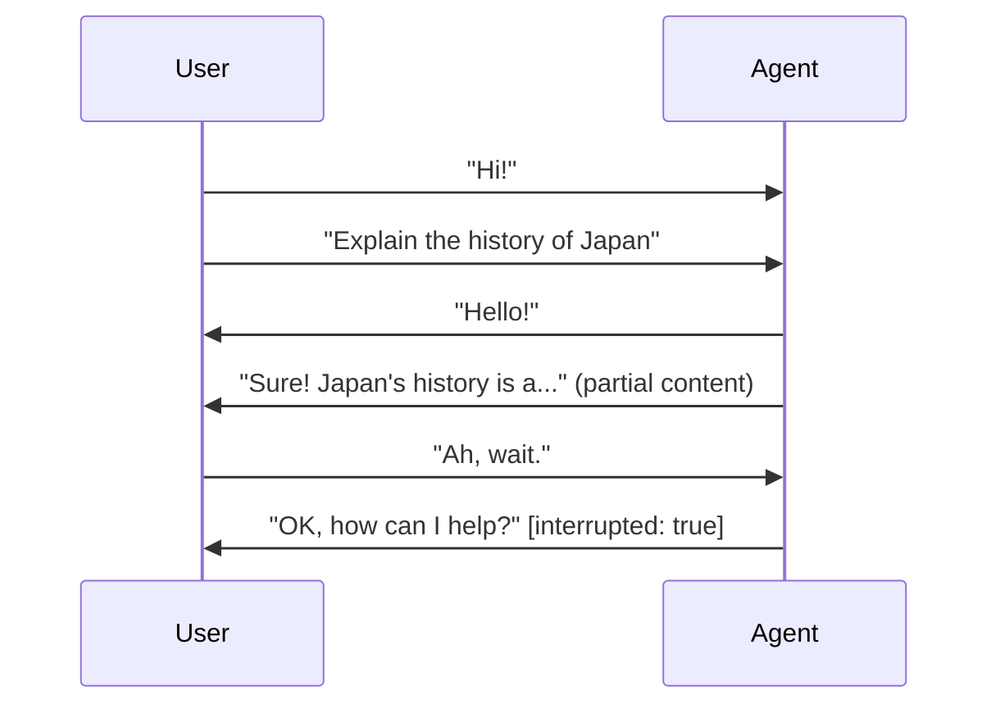
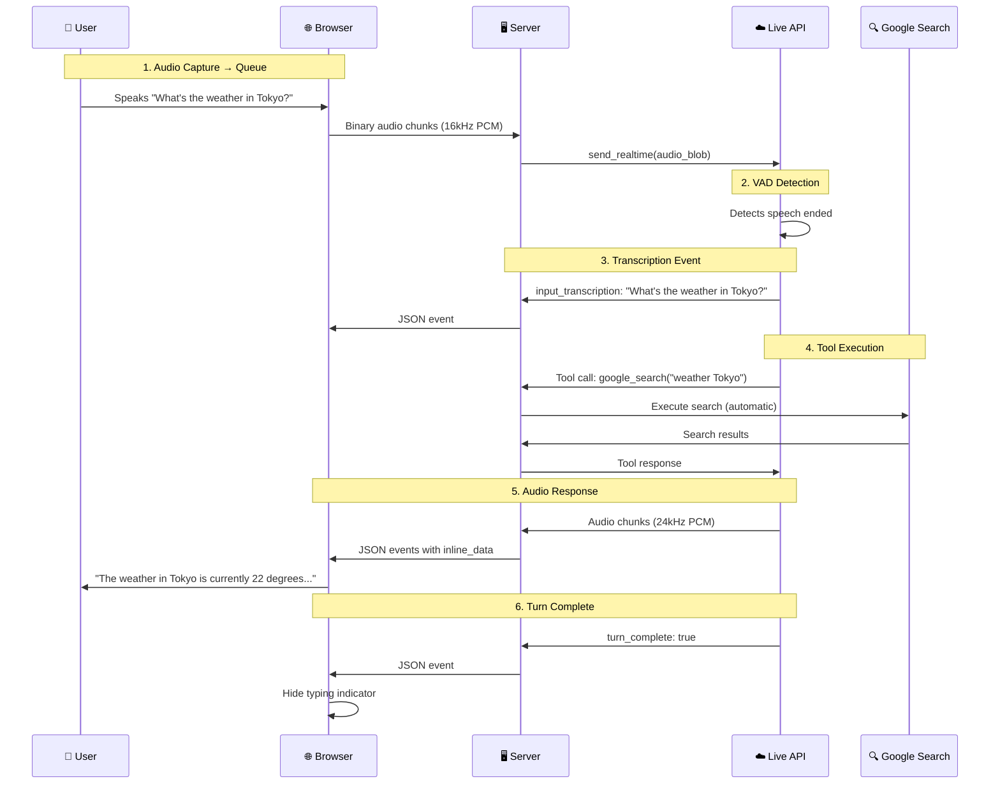

# ADK Bidi-streaming Workshop

## Workshop Overview

### What is Bidi-streaming?

Bidi-streaming (Bidirectional streaming) represents a fundamental shift from traditional AI interactions. Instead of the rigid "ask-and-wait" pattern, it enables **real-time, two-way communication** where both human and AI can speak, listen, and respond simultaneously. This creates natural, human-like conversations with immediate responses and the ability to interrupt ongoing interactions.

Think of the difference between sending emails and having a phone conversation. Traditional AI interactions are like emails—you send a complete message, wait for a complete response, then send another. Bidi-streaming is like a phone conversation—fluid, natural, with the ability to interrupt, clarify, and respond in real-time.



The diagram above shows a key feature of Bidi-streaming: **interruption**. The user can interrupt the agent mid-response, and the agent immediately stops and addresses the new input—just like a natural conversation.

### Real-World Use Cases

- **Customer Service**: A customer shows their defective coffee machine via phone camera while explaining the issue. The AI identifies the model and failure point, and the customer can interrupt to correct details mid-conversation.

- **E-commerce**: A shopper holds up clothing to their webcam asking "Find shoes that match these pants." The agent analyzes the style and engages in fluid back-and-forth: "Show me something more casual" → "How about these sneakers?" → "Add the blue ones in size 10."

- **Field Service**: A technician wearing smart glasses streams their view while asking "I'm hearing a strange noise from this compressor—can you identify it?" The agent provides step-by-step guidance hands-free.

- **Healthcare**: A patient shares a live video of a skin condition. The AI performs preliminary analysis, asks clarifying questions, and guides next steps.

- **Financial Services**: A client reviews their portfolio while the agent displays charts and simulates trade impacts. The client can share their screen to discuss specific news articles.

**Shopper's Concierge 2 Demo**: Real-time Agentic RAG demo for e-commerce, built with [ADK Bidi-streaming](https://google.github.io/adk-docs/streaming/dev-guide/part1/) and Vertex AI Vector Search, Embeddings, Feature Store and Ranking API

[](https://www.youtube.com/watch?v=Hwx94smxT_0)

### What is ADK Bidi-streaming?

Building real-time voice AI is hard. You need WebSocket connections that stay alive, audio streaming that doesn't lag, interruption handling that feels natural, and session state that persists across reconnections. The complexity adds up fast—what should take weeks often stretches into months of infrastructure work. ADK lets you skip all that plumbing and focus on what actually matters: your agent's behavior and your users' experience.


ADK Bidi-streaming enables real-time, two-way communication between your application and [Gemini](https://deepmind.google/technologies/gemini/) models through the [Live API](https://ai.google.dev/gemini-api/docs/live). Unlike traditional request-response patterns, bidirectional streaming allows:

- **Continuous input streaming**: Send audio, text, and images in real-time without waiting for responses
- **Concurrent output streaming**: Receive model responses, transcriptions, and events while still sending input
- **Natural conversations**: Enable voice-based interactions with sub-second latency
- **Multimodal experiences**: Combine text, audio, images, and video in a single session

For a comprehensive deep-dive, we provide the [ADK Bidi-streaming Developer Guide](https://google.github.io/adk-docs/streaming/dev-guide/part1/)—a 5-part series covering architecture to production deployment:

| Part | Focus | What You'll Learn |
|------|-------|-------------------|
| [Part 1](https://google.github.io/adk-docs/streaming/dev-guide/part1/) | Foundation | Architecture, Live API platforms, 4-phase lifecycle |
| [Part 2](https://google.github.io/adk-docs/streaming/dev-guide/part2/) | Upstream | Sending text, audio, video via LiveRequestQueue |
| [Part 3](https://google.github.io/adk-docs/streaming/dev-guide/part3/) | Downstream | Event handling, tool execution, multi-agent workflows |
| [Part 4](https://google.github.io/adk-docs/streaming/dev-guide/part4/) | Configuration | Session management, quotas, production controls |
| [Part 5](https://google.github.io/adk-docs/streaming/dev-guide/part5/) | Multimodal | Audio specs, model architectures, advanced features |

### ADK Bidi-streaming hands-on workshop

This hands-on workshop teaches you how to build real-time, bidirectional streaming AI applications based on the dev guide. You will deploy and explore the bidi-demo application on [Cloud Shell Editor](https://cloud.google.com/shell/docs/editor-overview), learning the core concepts of ADK Bidi-streaming through practical experimentation.


### Learning Objectives

By the end of this workshop, you will be able to:

1. Set up and run a Bidi-streaming application on Cloud Shell
2. Understand ADK's 4-phase streaming lifecycle
3. Learn how to implement bidirectional communication with LiveRequestQueue
4. Process streaming events from run_live()
5. Configure RunConfig for different modalities
6. Work with audio, image, and video inputs

### Prerequisites

- Google Cloud account with billing enabled
- [Google AI Studio](https://aistudio.google.com) API key (GOOGLE_API_KEY)
- Basic Python knowledge
- Familiarity with [async/await](https://docs.python.org/3/library/asyncio.html) concepts
- Web browser with microphone access (Chrome recommended)

---

## Section 1: Introduction & Environment Setup (10 min)

To help you understand the concepts in this guide, we provide a working demo application that showcases ADK bidirectional streaming in action. This FastAPI-based demo implements the complete streaming lifecycle with a practical, real-world architecture.

### 1.1 Cloud Shell Editor Setup

Cloud Shell Editor provides a browser-based development environment with VS Code functionality. No local setup required!

**Step 1: Open Cloud Shell Editor**

Navigate to [ide.cloud.google.com](https://ide.cloud.google.com) in your browser.

Alternatively:
- Go to [shell.cloud.google.com](https://shell.cloud.google.com)
- Click "Open Editor" in the toolbar


**Step 2: Clone the Repository**

Open a terminal in Cloud Shell Editor (Terminal → New Terminal) and run:

```bash
git clone https://github.com/google/adk-samples.git
```


**Step 3: Open the bidi-demo Folder**

In Cloud Shell Editor, open the bidi-demo project folder:

1. Click **File** → **Open Folder** in the menu bar
2. Navigate to `adk-samples/python/agents/bidi-demo`
3. Click **OK**

**Step 4: Configure Environment Variables**

Create a new `.env` file in the `app/` directory:

1. Right-click on the `app` folder in the Explorer panel
2. Select **New File**
3. Name it `.env`
4. Add the following content:

```bash
GOOGLE_API_KEY=your_api_key_here
DEMO_AGENT_MODEL=gemini-2.5-flash-native-audio-preview-12-2025
```

Replace `your_api_key_here` with your actual Google AI Studio API key.

> **Getting an API Key**: Visit [aistudio.google.com](https://aistudio.google.com) → Get API Key (at the bottom left) → Create API key

**Step 5: Install Dependencies**

Open a terminal in Cloud Shell Editor (Terminal → New Terminal) and run:

```bash
pip install -e .
```

This installs the bidi-demo package and all required dependencies including:
- `google-adk` - Agent Development Kit
- [`fastapi`](https://fastapi.tiangolo.com/) - Web framework
- [`uvicorn`](https://www.uvicorn.org/) - ASGI server
- [`python-dotenv`](https://pypi.org/project/python-dotenv/) - Environment variable management

### 1.2 Understanding the Directory Structure

After cloning, explore the project structure in Cloud Shell Editor:

```
bidi-demo/
├── app/                              # Main application directory
│   ├── main.py                       # FastAPI server with WebSocket endpoint
│   ├── .env                          # Environment variables (API key, model)
│   ├── google_search_agent/          # Agent definition
│   │   └── agent.py                  # Agent configuration (model, tools, instruction)
│   └── static/                       # Frontend assets
│       ├── index.html                # Main HTML page
│       ├── css/
│       │   └── styles.css            # UI styling
│       └── js/
│           ├── app.js                # Main app logic, WebSocket, event handling
│           ├── audio-recorder.js     # Microphone capture (16kHz)
│           ├── audio-player.js       # Audio playback (24kHz)
│           ├── pcm-recorder-processor.js  # [AudioWorklet](https://developer.mozilla.org/en-US/docs/Web/API/AudioWorklet) for recording
│           └── pcm-player-processor.js    # AudioWorklet for playback
├── pyproject.toml                    # Python package configuration
└── README.md                         # Project documentation
```

**Key Files to Explore:**

| File | Purpose |
|------|---------|
| `app/main.py` | Server-side: FastAPI app, WebSocket endpoint, upstream/downstream tasks |
| `app/google_search_agent/agent.py` | Agent definition: model, tools, instruction |
| `app/static/js/app.js` | Client-side: WebSocket connection, event handling, UI updates |
| `app/static/js/audio-*.js` | Client-side: Audio capture and playback with [Web Audio API](https://developer.mozilla.org/en-US/docs/Web/API/Web_Audio_API) |

Take a moment to open these files in the editor. We'll walk through them in detail in Section 4.

### 1.3 Run the Demo

Let's verify your setup by running the demo application.

**Step 1: Start the Server**

In the terminal, navigate to the app directory and start the server:

```bash
cd app
python -m uvicorn main:app --reload --host 0.0.0.0 --port 8080
```

You should see output like:
```
INFO:     Will watch for changes in these directories: ['/home/kazsato/adk-samples/python/agents/bidi-demo/app']
INFO:     Uvicorn running on http://0.0.0.0:8080 (Press CTRL+C to quit)
INFO:     Started reloader process [9896] using WatchFiles
INFO:     Started server process [9898]
INFO:     Waiting for application startup.
INFO:     Application startup complete.
```

**Step 2: Open the Web Preview**

1. In Cloud Shell Editor, click the **Web Preview** button (globe icon) in the toolbar
2. Select **Preview on port 8080**
3. A new browser tab opens with the bidi-demo UI


**Step 3: Test the Connection**

Type a message like "Hello!" in the text input and click **Send**. If everything is configured correctly, you should receive a response from the agent.

> **Tip**: Keep the server running for the rest of the workshop. You can open a new terminal (Terminal → New Terminal) if you need to run other commands.


---

## Section 2: Architecture Overview (15 min)

### 2.1 High-Level Architecture

Before diving into code, you need a mental model of how the pieces connect. ADK Bidi-streaming follows a clean separation of concerns across three layers, each with distinct responsibilities:


**You own the application layer.** This includes the client applications your users interact with (web, mobile, kiosk) and the transport server that manages connections. Most teams use FastAPI with [WebSockets](https://developer.mozilla.org/en-US/docs/Web/API/WebSockets_API), but any framework supporting real-time communication works. You also define your Agent—the instructions, tools, and behaviors that make your AI unique.

**ADK handles the orchestration.** The framework provides three key components that eliminate infrastructure work:

| Component | Purpose |
|-----------|---------|
| **LiveRequestQueue** | Buffers and sequences incoming messages so you don't worry about race conditions |
| **Runner** | Manages session lifecycles and conversation state |
| **LLM Flow** | Handles the complex protocol translation you never want to write yourself |

**Google provides the AI backbone.** The Live API—available through Gemini Live API for rapid prototyping or [Vertex AI Live API](https://cloud.google.com/vertex-ai/generative-ai/docs/live-api) for enterprise production—delivers real-time, low-latency AI processing with built-in support for audio, video, and natural interruptions.

> **Why this matters:** The bidirectional arrows in the diagram aren't just decoration—they represent true concurrent communication. Users can interrupt the AI mid-sentence, just like in human conversation. This is fundamentally different from request-response APIs, and it's what makes voice AI feel natural rather than robotic.

The key insight is that ADK abstracts away the complexity of managing WebSocket connections to the Live API. Your application only needs to:

1. **Send input** through `LiveRequestQueue` (upstream)
2. **Process events** from `run_live()` (downstream)

ADK handles everything in between: connection management, message serialization, tool execution, and session state.

### 2.2 The 4-Phase Lifecycle

Every ADK Bidi-streaming application follows a predictable four-phase lifecycle. Understanding these phases is key to resource efficiency and clean code architecture.


| Phase | When | What Happens |
|-------|------|--------------|
| **1. Application Initialization** | Server startup (once) | Create Agent, SessionService, and Runner. These are stateless, thread-safe, and shared across all connections. |
| **2. Session Initialization** | User connects | Get/create Session, configure RunConfig, create LiveRequestQueue. Each user gets their own session context. |
| **3. Bidi-streaming** | Active conversation | Two concurrent tasks: upstream (user input → model) and downstream (model events → user). True simultaneous communication. |
| **4. Termination** | Connection ends | Close LiveRequestQueue to release resources. Session state persists for future reconnection. |

> **Key Insight**: The upstream and downstream tasks run concurrently using `asyncio.gather()`. This enables true bidirectional communication—users can interrupt the AI mid-sentence, just like in human conversation.

We'll explore each phase in detail with code examples in Section 4.

### 2.3 Key Components

Before running the demo, here's a brief overview of the core components you'll encounter:

| Component | Purpose | Key Insight |
|-----------|---------|-------------|
| **Agent** | Defines your AI's personality, model, and tools | The `instruction` field is your system prompt |
| **LiveRequestQueue** | Channel for sending input to the model | Use `send_content()` for text, `send_realtime()` for audio/images |
| **run_live()** | Async generator that yields model events | Process events like text, audio, transcriptions, and tool calls |
| **RunConfig** | Session configuration (modalities, features) | Set `response_modalities=["AUDIO"]` for voice responses |

> **Coming up:** Section 4 provides complete code walkthroughs for each component with detailed explanations.

---

## Section 3: Running the Demo (20 min)

### 3.1 Text Interaction

Let's start with basic text interaction:

1. **Type a message** in the text input field
2. Click "Send" or press Enter
3. Observe the streaming response appearing word-by-word

**Try these prompts:**

- "Hello, who are you?"
- "What's the weather like in Tokyo today?" (uses Google Search)
- "Tell me a short joke"

> **What to observe:** Watch the response appear word-by-word, not all at once. This is streaming in action—the server forwards events from `run_live()` as they arrive.

> **Lifecycle in action:** Your text goes through the **upstream task** (`send_content()`), the model processes it, and responses flow back through the **downstream task** (`run_live()` events).

#### Understanding the UI

Now that you've tried text interaction, explore the demo interface:

**Header Bar:**
- **Connection Status**: Green indicator shows you're connected to the WebSocket
- **Proactivity**: Enable the model to respond proactively (native audio models only)
- **Affective Dialog**: Enable emotional awareness in responses (native audio models only)

**Chat Area (Left Panel):**
- Message bubbles show the conversation
- User messages appear on the right, agent responses on the left
- A typing indicator (...) appears during streaming responses

**Input Controls:**
- **Text input**: Type messages to the agent
- **Send**: Submit text messages
- **Start Audio**: Enable microphone for voice interaction
- **📷 Camera**: Capture and send images

**Event Console (Right Panel):**

The Event Console displays all ADK events in real-time—this is your window into how bidi-streaming works:

| Emoji | Event Type | Description |
|-------|-----------|-------------|
| 🔌 | WebSocket Connected | Connection established with server |
| 💬 | User Message | Your outgoing text (upstream) |
| 📝 | Input Transcription | Your speech converted to text |
| 📝 | Output Transcription | Agent's speech converted to text |
| 💭 | Text Response | Agent's text content |
| 🔊 | Audio Response | Agent's audio content (filtered by default) |
| 📊 | Token Usage | Prompt and response token counts |
| ✅ | Turn Complete | Agent finished responding |
| ⏸️ | Interrupted | User interrupted the agent |

> **Tip:** Click any event entry to expand and see the full JSON payload. Use the "Show audio" checkbox to display high-frequency audio events, and "Clear" to reset the console.

### 3.2 Audio Interaction

Now let's try voice interaction:

1. **Click the microphone button** to enable audio mode
2. **Allow microphone access** when prompted
3. **Speak to the agent** naturally
4. Observe:
   - Your speech appears as transcription (input_transcription)
   - The agent responds with voice (audio content)
   - Agent's speech appears as transcription (output_transcription)

**Try these voice prompts:**

- "Hello, can you hear me?"
- "Search for the latest news about AI"
- "What time is it in New York?"

> **What to observe:** Notice the transcriptions appearing for both your speech and the agent's speech. These are `input_transcription` and `output_transcription` events from `run_live()`.

> **Try interrupting:** Start speaking while the agent is responding. The agent stops immediately—this is the `interrupted` flag in action, enabling natural conversation flow.

> **Lifecycle in action:** Audio chunks stream continuously via `send_realtime()`. The Live API uses Voice Activity Detection (VAD) to determine when you've finished speaking—no manual signaling needed.

**Audio Specifications:**

| Direction | Format | Sample Rate | Channels | Chunk Size |
|-----------|--------|-------------|----------|------------|
| **Input** (your voice) | 16-bit PCM | 16 kHz | Mono | 50-100ms (1,600-3,200 bytes) |
| **Output** (model voice) | 16-bit PCM | 24 kHz | Mono | Buffered for smooth playback |

**Model Architectures:**

The demo uses a native audio model by default, but you can switch models in `.env`:

| Feature | Native Audio | Half-Cascade |
|---------|-------------|--------------|
| Response modality | AUDIO only | TEXT and AUDIO |
| Natural prosody | Yes - more human-like | Synthesized |
| Proactive audio | Yes | No |
| Affective dialog | Yes | No |

> **Choosing the right model:** For natural conversation with emotional awareness, use native audio (`gemini-2.5-flash-native-audio-preview-12-2025`). For applications needing text output, use half-cascade.

### 3.3 Image/Camera Input

The demo supports image input through the camera:

1. **Click the camera button** to open camera preview
2. **Allow camera access** when prompted
3. **Position your subject** and click "Capture"
4. **Ask about the image**: "What do you see in this image?"

**Try these scenarios:**

- Show a product and ask "What is this?"
- Show text and ask "Can you read this?"
- Show a scene and ask "Describe what you see"

> **What to observe:** The captured image appears in the chat, then the agent responds with a description. Images use the same `send_realtime()` method as audio.

> **Lifecycle in action:** Images are sent as JPEG blobs via `send_realtime()`. The model processes them alongside the conversation context and responds with text or audio.

**Image Specifications:**

| Property | Specification |
|----------|---------------|
| Format | JPEG |
| Resolution | 768×768 recommended |
| Frame rate | 1 FPS maximum |

### 3.4 Tracing a Complete Interaction

Now that you've experienced the demo, let's trace what happens during a typical voice search. Ask the agent: *"What's the weather in Tokyo?"*



**What you just observed:**

1. **Audio Capture**: Your microphone captured audio at 16kHz, converted to PCM, and streamed via WebSocket
2. **VAD Detection**: The Live API detected when you stopped speaking
3. **Transcription**: Your speech was transcribed and displayed (`input_transcription` event)
4. **Tool Execution**: The model called Google Search—ADK handled this automatically
5. **Audio Response**: The model's spoken response streamed back at 24kHz
6. **Turn Complete**: The `turn_complete` flag signaled the response was finished

> **This entire flow takes under two seconds.** In Section 4, we'll examine the code that makes this possible.

---

## Break (10 min)

Take a short break. When you return, we'll dive into the code!

---

## Section 4: Code Walkthrough (20 min)

### 4.1 Application Initialization

Open `app/main.py` in the editor and examine the application initialization:

```python
# bidi-demo/app/main.py:19-53

# IMPORTANT: Load environment variables BEFORE importing agent
# The agent reads DEMO_AGENT_MODEL at import time
from dotenv import load_dotenv
load_dotenv(Path(__file__).parent / ".env")

from google_search_agent.agent import agent  # Now safe to import

# ========================================
# Phase 1: Application Initialization (once at startup)
# ========================================

app = FastAPI()  # Web framework for HTTP and WebSocket

# Serve static files (HTML, CSS, JS) for the web UI
static_dir = Path(__file__).parent / "static"
app.mount("/static", StaticFiles(directory=static_dir), name="static")

# These are created ONCE and shared across ALL connections
session_service = InMemorySessionService()  # Stores conversation history
runner = Runner(app_name=APP_NAME, agent=agent, session_service=session_service)
```

**Key Points:**

1. **Environment variables first**: `load_dotenv()` must run before importing the agent, because the agent reads `DEMO_AGENT_MODEL` at import time
2. **Single instances**: SessionService and Runner are created once and shared across all connections
3. **InMemorySessionService**: Stores sessions in memory (use DatabaseSessionService for production)

### 4.2 Session Initialization

Examine the WebSocket endpoint where sessions are initialized:

```python
# bidi-demo/app/main.py:71-163

# WebSocket endpoint - path parameters capture user/session IDs
@app.websocket("/ws/{user_id}/{session_id}")
async def websocket_endpoint(
    websocket: WebSocket,
    user_id: str,                    # From URL path
    session_id: str,                 # From URL path
    proactivity: bool = False,       # From query param ?proactivity=true
    affective_dialog: bool = False,  # From query param ?affective_dialog=true
) -> None:
    await websocket.accept()  # Complete WebSocket handshake

    # ========================================
    # Phase 2: Session Initialization (runs for EACH connection)
    # ========================================

    # Auto-detect model type to configure appropriate response modality
    model_name = agent.model
    is_native_audio = "native-audio" in model_name.lower()

    if is_native_audio:
        # Native audio models: respond with speech, enable advanced features
        run_config = RunConfig(
            streaming_mode=StreamingMode.BIDI,
            response_modalities=["AUDIO"],  # Model responds with voice
            input_audio_transcription=types.AudioTranscriptionConfig(),   # Transcribe user speech
            output_audio_transcription=types.AudioTranscriptionConfig(),  # Transcribe model speech
            proactivity=(
                types.ProactivityConfig(proactive_audio=True) if proactivity else None
            ),
            enable_affective_dialog=affective_dialog if affective_dialog else None,
        )
    else:
        # Half-cascade models: respond with text for faster performance
        run_config = RunConfig(
            streaming_mode=StreamingMode.BIDI,
            response_modalities=["TEXT"],  # Model responds with text
        )

    # Restore existing session or create new one
    session = await session_service.get_session(
        app_name=APP_NAME, user_id=user_id, session_id=session_id
    )
    if not session:
        await session_service.create_session(
            app_name=APP_NAME, user_id=user_id, session_id=session_id
        )

    # Create fresh queue for this connection's upstream messages
    live_request_queue = LiveRequestQueue()
```

**Key Points:**

1. **Model detection**: The code auto-detects native audio vs half-cascade models
2. **RunConfig per session**: Each connection gets its own configuration
3. **Session management**: Supports both new sessions and reconnections
4. **LiveRequestQueue per session**: Each connection needs its own queue

### 4.3 Upstream Task

The upstream task handles all incoming messages from the client:

```python
# bidi-demo/app/main.py:169-217
async def upstream_task() -> None:
    """Receives messages from WebSocket and sends to LiveRequestQueue."""
    while True:  # Runs continuously until connection closes
        message = await websocket.receive()  # Wait for next WebSocket frame

        # Binary frames = raw audio bytes (most efficient for streaming)
        if "bytes" in message:
            audio_data = message["bytes"]
            audio_blob = types.Blob(
                mime_type="audio/pcm;rate=16000",  # 16kHz mono PCM required
                data=audio_data
            )
            live_request_queue.send_realtime(audio_blob)  # Stream to model

        # Text frames = JSON messages (text input, images, etc.)
        elif "text" in message:
            json_message = json.loads(message["text"])

            # User typed a message
            if json_message.get("type") == "text":
                content = types.Content(
                    parts=[types.Part(text=json_message["text"])]
                )
                live_request_queue.send_content(content)  # Triggers model response

            # User captured an image
            elif json_message.get("type") == "image":
                image_data = base64.b64decode(json_message["data"])
                image_blob = types.Blob(
                    mime_type=json_message.get("mimeType", "image/jpeg"),
                    data=image_data
                )
                live_request_queue.send_realtime(image_blob)  # Send for analysis
```

This task bridges the WebSocket connection to the LiveRequestQueue, converting browser data formats to ADK types.

**Key Points:**

1. **Binary vs Text frames**: Audio uses efficient binary WebSocket frames; text/images use JSON
2. **send_content() vs send_realtime()**:
   - `send_content()`: For discrete text messages (triggers a turn)
   - `send_realtime()`: For streaming data (audio, images) that flows continuously
3. **MIME types matter**: `audio/pcm;rate=16000` tells the API the audio format

#### Understanding LiveRequestQueue

The path from your application to the AI flows through a single interface: LiveRequestQueue. Instead of juggling different APIs for text, audio, and control signals, you use one elegant queue that handles everything.


| Method | Use Case | Example |
|--------|----------|---------|
| `send_content(content)` | Text messages (turn-based) | User typed a message |
| `send_realtime(blob)` | Audio/image/video (streaming) | Microphone audio chunk |
| `send_activity_start()` / `send_activity_end()` | Manual turn control | Push-to-talk interfaces |
| `close()` | End the session | User disconnected |

> **Pro tip:** Don't wait for model responses before sending the next audio chunk. The queue handles buffering, and the model expects continuous streaming. Waiting creates awkward pauses in conversation.

#### Client-Side: Sending Text Messages

The client sends text messages as JSON through the WebSocket:

**JavaScript (app.js):**

```javascript
// bidi-demo/app/static/js/app.js:755-766
function sendMessage(message) {
    // Only send if connection is open
    if (websocket && websocket.readyState === WebSocket.OPEN) {
        // Package as JSON with type identifier
        const jsonMessage = JSON.stringify({
            type: "text",  // Server uses this to route the message
            text: message
        });
        websocket.send(jsonMessage);  // Send as text frame
    }
}
```

The `type` field tells the server how to process the message—"text" for typed messages, "image" for captured frames.

```javascript
// bidi-demo/app/static/js/app.js:734-752
messageForm.onsubmit = function(e) {
    e.preventDefault();  // Don't reload the page
    const message = messageInput.value.trim();
    if (message) {
        // Show user's message in the UI immediately (optimistic update)
        const userBubble = createMessageBubble(message, true);
        messagesDiv.appendChild(userBubble);

        messageInput.value = "";  // Clear input field
        sendMessage(message);     // Send to server
    }
};
```

The UI updates immediately when the user sends a message, providing instant feedback while the server processes the request.

#### Client-Side: Sending Audio

Audio capture uses Web Audio API with AudioWorklet for real-time processing:

**JavaScript (audio-recorder.js):**

```javascript
// bidi-demo/app/static/js/audio-recorder.js:7-38
// Start audio recording worklet
export async function startAudioRecorderWorklet(audioRecorderHandler) {
    // Create AudioContext at 16kHz (required by Live API)
    const audioRecorderContext = new AudioContext({ sampleRate: 16000 });

    // Load the AudioWorklet processor module
    const workletURL = new URL("./pcm-recorder-processor.js", import.meta.url);
    await audioRecorderContext.audioWorklet.addModule(workletURL);

    // Request microphone access (mono audio)
    const micStream = await navigator.mediaDevices.getUserMedia({
        audio: { channelCount: 1 }
    });
    const source = audioRecorderContext.createMediaStreamSource(micStream);

    // Create and connect the AudioWorklet node
    const audioRecorderNode = new AudioWorkletNode(
        audioRecorderContext,
        "pcm-recorder-processor"
    );
    source.connect(audioRecorderNode);

    // Handle audio data from the worklet
    audioRecorderNode.port.onmessage = (event) => {
        // Convert Float32 to 16-bit PCM
        const pcmData = convertFloat32ToPCM(event.data);
        audioRecorderHandler(pcmData);
    };

    return [audioRecorderNode, audioRecorderContext, micStream];
}
```

The AudioWorklet runs on a separate audio thread, ensuring smooth capture without blocking the main UI thread.

```javascript
// bidi-demo/app/static/js/audio-recorder.js:49-58
// Convert Float32 samples to 16-bit PCM
function convertFloat32ToPCM(inputData) {
    const pcm16 = new Int16Array(inputData.length);
    for (let i = 0; i < inputData.length; i++) {
        // Scale float [-1, 1] to int16 [-32768, 32767]
        pcm16[i] = inputData[i] * 0x7fff;
    }
    return pcm16.buffer;
}
```

Web Audio provides Float32 samples (-1 to 1), but the Live API requires 16-bit PCM integers. This conversion is essential.

**JavaScript (pcm-recorder-processor.js):**

```javascript
// bidi-demo/app/static/js/pcm-recorder-processor.js:1-18
// AudioWorklet processor for capturing microphone audio
class PCMProcessor extends AudioWorkletProcessor {
    process(inputs, outputs, parameters) {
        if (inputs.length > 0 && inputs[0].length > 0) {
            // Copy the first channel (mono)
            const inputChannel = inputs[0][0];
            const inputCopy = new Float32Array(inputChannel);
            // Send to main thread
            this.port.postMessage(inputCopy);
        }
        return true; // Keep processor alive
    }
}

registerProcessor("pcm-recorder-processor", PCMProcessor);
```

**JavaScript (app.js) - Sending audio chunks:**

```javascript
// bidi-demo/app/static/js/app.js:979-988
// Audio recorder handler - called for each audio chunk
function audioRecorderHandler(pcmData) {
    if (websocket && websocket.readyState === WebSocket.OPEN && is_audio) {
        // Send audio as binary WebSocket frame (more efficient than base64)
        websocket.send(pcmData);
    }
}
```

#### Client-Side: Sending Images

Images are captured from the camera, converted to JPEG, and sent as base64:

**JavaScript (app.js):**

```javascript
// bidi-demo/app/static/js/app.js:803-830
// Open camera and start preview
async function openCameraPreview() {
    cameraStream = await navigator.mediaDevices.getUserMedia({
        video: {
            width: { ideal: 768 },
            height: { ideal: 768 },
            facingMode: 'user'
        }
    });
    cameraPreview.srcObject = cameraStream;
    cameraModal.classList.add('show');
}
```

```javascript
// bidi-demo/app/static/js/app.js:848-903
// Capture image from the live preview
function captureImageFromPreview() {
    // Create canvas to capture the frame
    const canvas = document.createElement('canvas');
    canvas.width = cameraPreview.videoWidth;
    canvas.height = cameraPreview.videoHeight;
    const context = canvas.getContext('2d');

    // Draw current video frame to canvas
    context.drawImage(cameraPreview, 0, 0, canvas.width, canvas.height);

    // Convert canvas to blob and send
    canvas.toBlob((blob) => {
        const reader = new FileReader();
        reader.onloadend = () => {
            // Remove data:image/jpeg;base64, prefix
            const base64data = reader.result.split(',')[1];
            sendImage(base64data);
        };
        reader.readAsDataURL(blob);
    }, 'image/jpeg', 0.85);

    closeCameraPreview();
}
```

```javascript
// bidi-demo/app/static/js/app.js:906-916
// Send image to server as JSON
function sendImage(base64Image) {
    if (websocket && websocket.readyState === WebSocket.OPEN) {
        const jsonMessage = JSON.stringify({
            type: "image",
            data: base64Image,
            mimeType: "image/jpeg"
        });
        websocket.send(jsonMessage);
    }
}
```

### 4.4 Downstream Task

The downstream task processes all events from the model:

```python
# bidi-demo/app/main.py:219-234
async def downstream_task() -> None:
    """Receives Events from run_live() and sends to WebSocket."""
    # run_live() is an async generator - yields events as they arrive
    async for event in runner.run_live(
        user_id=user_id,
        session_id=session_id,
        live_request_queue=live_request_queue,  # Same queue used by upstream task
        run_config=run_config,
    ):
        # Convert Pydantic model to JSON, excluding None fields for cleaner output
        event_json = event.model_dump_json(exclude_none=True, by_alias=True)
        await websocket.send_text(event_json)  # Forward to browser
```

This task runs concurrently with the upstream task. Events stream continuously as the model generates responses, enabling real-time UI updates.

**Event Types You'll Receive:**

| Event Field | Content | When |
|-------------|---------|------|
| `event.content` | Text or audio parts | Model generates response |
| `event.input_transcription` | User speech → text | VAD detects user spoke |
| `event.output_transcription` | Model speech → text | Model generates audio |
| `event.actions` | Tool calls | Model invokes a tool |
| `event.error` | Error details | Something went wrong |

**Processing Specific Events:**

```python
# bidi-demo/app/main.py:225-233 (event processing example)
async for event in runner.run_live(...):
    # Text or Audio content from the model
    if event.content and event.content.parts:
        for part in event.content.parts:
            if part.text:
                # Text response (may arrive with partial=True for streaming)
                print(f"Model text: {part.text}")
            if part.inline_data:
                # Audio response - raw bytes at 24kHz PCM
                audio_bytes = part.inline_data.data

    # User's speech transcribed to text
    if event.input_transcription and event.input_transcription.text:
        print(f"User said: {event.input_transcription.text}")

    # Model's speech transcribed to text (for display/logging)
    if event.output_transcription and event.output_transcription.text:
        print(f"Model said: {event.output_transcription.text}")
```

This pattern shows how to extract different types of content from events. The same event may contain multiple fields.

#### Understanding run_live() Events

The return path—from the AI back to your application—centers on `run_live()`. This async generator is the heart of ADK streaming, yielding events in real-time without buffering.


**The Seven Event Types:**

| Event Type | Field | Description |
|------------|-------|-------------|
| Text | `event.content.parts[0].text` | Model's written response (arrives incrementally with `partial=True`) |
| Audio (inline) | `event.content.parts[0].inline_data` | Real-time audio for immediate playback (not persisted) |
| Audio (file) | `event.content.parts[0].file_data` | References stored artifacts when `save_live_blob` is enabled |
| Input Transcription | `event.input_transcription` | User speech converted to text |
| Output Transcription | `event.output_transcription` | Model speech converted to text |
| Metadata | `event.usage_metadata` | Token usage for cost monitoring |
| Tool Calls | `event.actions` | Function execution (ADK handles automatically) |
| Errors | `event.error` | Error code and message |

**The Three Flow Control Flags:**

| Flag | Meaning | UI Action |
|------|---------|-----------|
| `partial` | Incremental chunk vs complete text | Continue accumulating text |
| `interrupted` | User started speaking while model was responding | Stop audio playback immediately |
| `turn_complete` | Model finished its response | Hide typing indicator, re-enable input |

> **Why `interrupted` matters:** This flag is what makes voice AI feel natural. Without it, users must wait silently for the AI to finish speaking. With it, conversation flows like it does between humans.

#### Client-Side: Receiving Events

The client processes ADK events received from the WebSocket. Each event type requires different handling:

##### Flow Control Events

These events manage conversation state and enable natural interruption:

```javascript
// bidi-demo/app/static/js/app.js:351-370
websocket.onmessage = function(event) {
    const adkEvent = JSON.parse(event.data);

    // Handle turn complete - model finished responding
    if (adkEvent.turnComplete === true) {
        // Remove typing indicators, reset state for next turn
        currentMessageId = null;
        currentBubbleElement = null;
        return;
    }

    // Handle interrupted - user started speaking while model was responding
    if (adkEvent.interrupted === true) {
        // Stop audio playback immediately
        if (audioPlayerNode) {
            audioPlayerNode.port.postMessage({ command: "endOfAudio" });
        }
        // Mark message as interrupted in UI
        if (currentBubbleElement) {
            currentBubbleElement.classList.add("interrupted");
        }
        return;
    }
    // ... handle other events
};
```

**Why this matters:** The `interrupted` flag enables natural conversation. When the user starts speaking, the model's audio playback stops immediately—just like interrupting someone in real life.

##### Transcription Events

Transcription events convert speech to text for display in the chat:

```javascript
// bidi-demo/app/static/js/app.js:373-408
// Handle input transcription (user's speech → text)
if (adkEvent.inputTranscription && adkEvent.inputTranscription.text) {
    const text = adkEvent.inputTranscription.text;
    const isFinished = adkEvent.inputTranscription.finished;

    if (currentInputTranscriptionId == null) {
        // Create new transcription bubble for user
        currentInputTranscriptionElement = createMessageBubble(text, true, !isFinished);
        messagesDiv.appendChild(currentInputTranscriptionElement);
    } else {
        // Update existing bubble as more words are recognized
        updateMessageBubble(currentInputTranscriptionElement, text, !isFinished);
    }
}

// Handle output transcription (model's speech → text)
if (adkEvent.outputTranscription && adkEvent.outputTranscription.text) {
    const text = adkEvent.outputTranscription.text;
    const isFinished = adkEvent.outputTranscription.finished;

    if (currentOutputTranscriptionId == null) {
        // Create new transcription bubble for agent
        currentOutputTranscriptionElement = createMessageBubble(text, false, !isFinished);
        messagesDiv.appendChild(currentOutputTranscriptionElement);
    } else {
        // Update existing bubble as speech continues
        updateMessageBubble(currentOutputTranscriptionElement, text, !isFinished);
    }
}
```

**Why this matters:** Transcriptions arrive incrementally with `finished: false`, then a final version with `finished: true`. The UI updates progressively so users see their words appear in real-time.

##### Content Events (Text and Audio)

Content events carry the model's actual response—either text or audio:

```javascript
// bidi-demo/app/static/js/app.js:410-435
if (adkEvent.content && adkEvent.content.parts) {
    for (const part of adkEvent.content.parts) {
        // Handle audio data - send to AudioWorklet for playback
        if (part.inlineData) {
            const mimeType = part.inlineData.mimeType;
            const data = part.inlineData.data;

            if (mimeType.startsWith("audio/pcm") && audioPlayerNode) {
                // Decode base64 and send to audio player's ring buffer
                audioPlayerNode.port.postMessage(base64ToArray(data));
            }
        }

        // Handle text - create or update message bubble
        if (part.text) {
            if (currentMessageId == null) {
                // Create new message bubble
                currentBubbleElement = createMessageBubble(part.text, false, true);
                messagesDiv.appendChild(currentBubbleElement);
            } else {
                // Append to existing bubble (streaming text)
                const existingText = currentBubbleElement.querySelector(".bubble-text").textContent;
                updateMessageBubble(currentBubbleElement, existingText + part.text, true);
            }
        }
    }
}
```

**Why this matters:** Audio chunks arrive continuously and are sent to an AudioWorklet ring buffer for smooth playback. Text chunks are appended to create the streaming "typing" effect you see in the chat.

#### Client-Side: Audio Playback

Audio playback uses a ring buffer to handle streaming audio smoothly:

**JavaScript (audio-player.js):**

```javascript
// bidi-demo/app/static/js/audio-player.js:5-24
// Start audio playback worklet
export async function startAudioPlayerWorklet() {
    // Create AudioContext at 24kHz (Live API output format)
    const audioContext = new AudioContext({ sampleRate: 24000 });

    // Load the AudioWorklet processor
    const workletURL = new URL('./pcm-player-processor.js', import.meta.url);
    await audioContext.audioWorklet.addModule(workletURL);

    // Create and connect the player node
    const audioPlayerNode = new AudioWorkletNode(audioContext, 'pcm-player-processor');
    audioPlayerNode.connect(audioContext.destination);

    return [audioPlayerNode, audioContext];
}
```

**JavaScript (pcm-player-processor.js):**

```javascript
// bidi-demo/app/static/js/pcm-player-processor.js:5-75
// AudioWorklet processor for playing streaming PCM audio
class PCMPlayerProcessor extends AudioWorkletProcessor {
    constructor() {
        super();

        // Ring buffer: 24kHz × 180 seconds
        this.bufferSize = 24000 * 180;
        this.buffer = new Float32Array(this.bufferSize);
        this.writeIndex = 0;
        this.readIndex = 0;

        // Handle incoming audio data from main thread
        this.port.onmessage = (event) => {
            // Handle interruption - clear buffer
            if (event.data.command === 'endOfAudio') {
                this.readIndex = this.writeIndex;
                return;
            }

            // Decode Int16 samples from ArrayBuffer
            const int16Samples = new Int16Array(event.data);
            this._enqueue(int16Samples);
        };
    }

    // Add Int16 samples to ring buffer
    _enqueue(int16Samples) {
        for (let i = 0; i < int16Samples.length; i++) {
            // Convert Int16 to Float32 [-1, 1]
            const floatVal = int16Samples[i] / 32768;
            this.buffer[this.writeIndex] = floatVal;
            this.writeIndex = (this.writeIndex + 1) % this.bufferSize;

            // Handle overflow (overwrite oldest samples)
            if (this.writeIndex === this.readIndex) {
                this.readIndex = (this.readIndex + 1) % this.bufferSize;
            }
        }
    }

    // Called by Web Audio system (~128 samples at a time)
    process(inputs, outputs, parameters) {
        const output = outputs[0];
        const framesPerBlock = output[0].length;

        for (let frame = 0; frame < framesPerBlock; frame++) {
            // Write to left channel
            output[0][frame] = this.buffer[this.readIndex];
            // Write to right channel (mono to stereo)
            if (output.length > 1) {
                output[1][frame] = this.buffer[this.readIndex];
            }

            // Advance read index (unless buffer empty)
            if (this.readIndex !== this.writeIndex) {
                this.readIndex = (this.readIndex + 1) % this.bufferSize;
            }
        }

        return true; // Keep processor alive
    }
}

registerProcessor('pcm-player-processor', PCMPlayerProcessor);
```

**Key Points:**

1. **Ring buffer**: Absorbs network jitter for smooth playback
2. **24kHz sample rate**: Matches Live API output format
3. **Int16 to Float32**: Web Audio API requires Float32 samples
4. **Mono to stereo**: Duplicate mono to both channels for stereo output
5. **Interruption handling**: Clear buffer when user interrupts the model

### 4.5 Concurrent Execution and Termination

The upstream and downstream tasks run concurrently, enabling true bidirectional communication. Both tasks run simultaneously using `asyncio.gather()`:

```python
# bidi-demo/app/main.py:236-253
# ========================================
# Phase 3: Active Session (bidirectional communication)
# ========================================

try:
    # Run both tasks concurrently - this is the heart of bidi-streaming
    # upstream_task: WebSocket → LiveRequestQueue (user input)
    # downstream_task: run_live() → WebSocket (model output)
    await asyncio.gather(upstream_task(), downstream_task())
except WebSocketDisconnect:
    logger.debug("Client disconnected normally")  # Expected when user closes tab
except Exception as e:
    logger.error(f"Unexpected error: {e}")  # Log unexpected failures
finally:
    # ========================================
    # Phase 4: Session Termination (cleanup)
    # ========================================

    # CRITICAL: Always close the queue to release Live API resources
    live_request_queue.close()
```

The `finally` block ensures cleanup happens even if an exception occurs. Forgetting to close the queue can lead to resource leaks.

**Key Points:**

1. **asyncio.gather()**: Runs both tasks concurrently; if one fails, both stop
2. **Exception handling**: Catch WebSocketDisconnect for clean exits
3. **finally block**: Always close LiveRequestQueue to terminate the Live API session properly

### 4.6 RunConfig Deep Dive

RunConfig is your control center for streaming behavior. Every aspect of a session—from audio format to cost limits—is configured here.


**Demo Implementation:**

The demo auto-detects the model type and configures RunConfig accordingly:

```python
# bidi-demo/app/main.py:107-124
if is_native_audio:
    # Native audio models require AUDIO response modality
    run_config = RunConfig(
        streaming_mode=StreamingMode.BIDI,           # Enable bidirectional streaming
        response_modalities=["AUDIO"],               # Model responds with voice
        input_audio_transcription=types.AudioTranscriptionConfig(),   # Transcribe user speech
        output_audio_transcription=types.AudioTranscriptionConfig(),  # Transcribe model speech
        session_resumption=types.SessionResumptionConfig(),           # Handle reconnections
        proactivity=(
            types.ProactivityConfig(proactive_audio=True) if proactivity else None
        ),
        enable_affective_dialog=affective_dialog if affective_dialog else None,
    )
else:
    # Half-cascade models: use TEXT for faster performance
    run_config = RunConfig(
        streaming_mode=StreamingMode.BIDI,
        response_modalities=["TEXT"],                # Model responds with text
        session_resumption=types.SessionResumptionConfig(),
    )
```

**Key configuration choices:**

- **`streaming_mode=StreamingMode.BIDI`**: Required for WebSocket bidirectional streaming
- **`response_modalities`**: Native audio models must use `["AUDIO"]`; half-cascade can use `["TEXT"]` for faster responses
- **`input/output_audio_transcription`**: Enables the transcription events you saw in the Event Console
- **`session_resumption`**: Automatically handles WebSocket reconnections (~10 min timeout)
- **`proactivity`**: Allows the model to speak without waiting for user input
- **`enable_affective_dialog`**: Model adapts tone based on detected emotions

**Essential Parameters:**

| Parameter | Purpose |
|-----------|---------|
| `response_modalities` | `["TEXT"]` for chat, `["AUDIO"]` for voice (choose one per session) |
| `streaming_mode` | `BIDI` for WebSocket streaming, `SSE` for HTTP streaming |
| `session_resumption` | Enable automatic reconnection after WebSocket timeouts (~10 min) |
| `context_window_compression` | Remove session duration limits (15 min audio, 2 min video) |

**Production Controls:**

| Parameter | Purpose |
|-----------|---------|
| `max_llm_calls` | Cap invocations per session for cost control (SSE mode only) |
| `save_live_blob` | Persist audio/video for debugging, compliance, or training |
| `custom_metadata` | Attach key-value data for user segmentation or A/B testing |

**Understanding Session Types:**

One concept trips up many developers: ADK Session vs Live API session.

- **ADK Session**: Persistent, lives in SessionService, survives restarts. User returns days later with history intact.
- **Live API session**: Ephemeral, exists only during active `run_live()`. When loop ends, it's destroyed—but ADK persisted events.

> **Quota planning:** Gemini Live API allows 50-1,000 concurrent sessions depending on tier. Vertex AI supports up to 1,000 per project.

### 4.7 Client-Side: WebSocket Connection

While the server handles ADK communication, the client manages the WebSocket connection. Here's how the client connects:

**JavaScript (app.js):**

```javascript
// bidi-demo/app/static/js/app.js:10-12
const userId = "demo-user";  // In production, use authenticated user ID
const sessionId = "demo-session-" + Math.random().toString(36).substring(7);  // Unique per tab
let websocket = null;  // WebSocket connection instance
```

Each browser tab gets a unique session ID, allowing multiple concurrent conversations per user.

```javascript
// bidi-demo/app/static/js/app.js:37-55
function getWebSocketUrl() {
    // Construct URL: ws://host/ws/{user_id}/{session_id}
    const baseUrl = "ws://" + window.location.host + "/ws/" + userId + "/" + sessionId;
    const params = new URLSearchParams();

    // Pass RunConfig options as query parameters
    if (enableProactivityCheckbox.checked) {
        params.append("proactivity", "true");
    }
    if (enableAffectiveDialogCheckbox.checked) {
        params.append("affective_dialog", "true");
    }

    const queryString = params.toString();
    return queryString ? baseUrl + "?" + queryString : baseUrl;
}
```

```javascript
// bidi-demo/app/static/js/app.js:317-730
function connectWebsocket() {
    const ws_url = getWebSocketUrl();
    websocket = new WebSocket(ws_url);

    websocket.onopen = function() {
        console.log("WebSocket connection opened.");
        updateConnectionStatus(true);
    };

    websocket.onclose = function() {
        console.log("WebSocket connection closed.");
        updateConnectionStatus(false);
        setTimeout(connectWebsocket, 5000);  // Auto-reconnect after 5 seconds
    };
}

connectWebsocket();  // Connect immediately when page loads
```

**Key Points:**

1. **Dynamic URL**: Session ID is generated per browser tab for isolation
2. **Query parameters**: RunConfig options passed as URL query parameters
3. **Auto-reconnect**: Client automatically reconnects on disconnection

---

## Section 5: Experimentation & Customization (10 min)

### 5.1 Modify the Agent

Open `app/google_search_agent/agent.py` and customize the agent:

```python
# bidi-demo/app/google_search_agent/agent.py:1-18 (customization example)
import os
from google.adk.agents import Agent
from google.adk.tools import google_search

agent = Agent(
    name="my_custom_agent",
    # Use environment variable with fallback for flexibility
    model=os.getenv("DEMO_AGENT_MODEL", "gemini-2.5-flash-native-audio-preview-12-2025"),

    # The instruction is your system prompt - shapes personality and behavior
    instruction="""You are a friendly travel assistant named Aria.

    When helping users:
    - Be enthusiastic about travel destinations
    - Use Google Search for current information about places
    - Suggest activities based on user interests
    - Provide practical tips for travelers

    Always maintain a warm, conversational tone.""",

    tools=[google_search]  # Tools the agent can call
)
```

Try changing the instruction to create different agent personalities—a tech support specialist, a language tutor, or a cooking assistant.

**Restart the server** to apply changes:

```bash
# Stop the current server (Ctrl+C)
python -m uvicorn main:app --reload --host 0.0.0.0 --port 8080
```

### 5.2 Add a Custom Tool

Create a simple custom tool:

```python
# bidi-demo/app/google_search_agent/agent.py (custom tool example)
from google.adk.tools import FunctionTool

# Define a custom tool as a regular Python function
# ADK automatically extracts the schema from type hints and docstring
def get_current_time(timezone: str = "UTC") -> str:
    """Get the current time in a specified timezone.

    Args:
        timezone: The timezone name (e.g., "America/New_York", "Asia/Tokyo")

    Returns:
        The current time as a formatted string
    """
    from datetime import datetime
    import pytz  # pip install pytz

    try:
        tz = pytz.timezone(timezone)
        current_time = datetime.now(tz)
        return f"The current time in {timezone} is {current_time.strftime('%I:%M %p on %B %d, %Y')}"
    except Exception as e:
        return f"Could not get time for timezone {timezone}: {str(e)}"

# Add the function directly to tools - ADK wraps it automatically
agent = Agent(
    name="my_agent",
    model=os.getenv("DEMO_AGENT_MODEL"),
    instruction="You are a helpful assistant with access to search and time tools.",
    tools=[google_search, get_current_time]  # Mix built-in and custom tools
)
```

ADK automatically calls your function when the model decides to use the tool. The docstring becomes the tool's description for the model.

### 5.3 Experiment with RunConfig

Try different configurations by modifying the WebSocket endpoint:

**Enable Proactivity (Native Audio Only):**

```python
# bidi-demo/app/main.py:114-124 (proactivity example)
run_config = RunConfig(
    streaming_mode=StreamingMode.BIDI,
    response_modalities=["AUDIO"],
    # Proactivity: model can initiate responses without waiting for user input
    proactivity=types.ProactivityConfig(proactive_audio=True),
    # Affective dialog: model adapts tone based on user's emotional state
    enable_affective_dialog=True,
)
```

With proactivity enabled, the model may:
- Offer suggestions without being asked
- Anticipate user needs based on context
- Ignore irrelevant input

**Change the Voice:**

```python
# bidi-demo/app/main.py:114-124 (voice configuration example)
run_config = RunConfig(
    streaming_mode=StreamingMode.BIDI,
    response_modalities=["AUDIO"],
    # Configure the model's speaking voice
    speech_config=types.SpeechConfig(
        voice_config=types.VoiceConfig(
            prebuilt_voice_config=types.PrebuiltVoiceConfig(
                voice_name="Kore"  # Each voice has distinct personality
            )
        )
    ),
)
```

Voice selection affects the agent's perceived personality—experiment to find the right match for your use case.

**Available Voices (Half-Cascade):**
- Puck, Charon, Kore, Fenrir, Aoede, Leda, Orus, Zephyr

**Native Audio Models:** Support extended voice library from [Text-to-Speech](https://cloud.google.com/text-to-speech) service.

### 5.4 Quick Experiments Checklist

Try these experiments and observe the differences:

- [ ] Change the agent instruction to a different persona
- [ ] Add a custom tool and invoke it by voice
- [ ] Switch between TEXT and AUDIO response modalities
- [ ] Enable proactivity and test with open-ended prompts
- [ ] Change the voice and compare the sound

---

## Section 6: Wrap-up & Resources (5 min)

### 6.1 Key Takeaways

1. **4-Phase Lifecycle**: Application Init → Session Init → Bidi-streaming → Termination

2. **Concurrent Architecture**: Upstream (input) and downstream (events) tasks run simultaneously with `asyncio.gather()`

3. **LiveRequestQueue Methods**:
   - `send_content()`: Text messages (turn-based)
   - `send_realtime()`: Audio/images (streaming)
   - `close()`: End session (always in `finally` block)

4. **run_live() Events**: Content, transcriptions, tool calls, errors - all streamed as they occur

5. **RunConfig Controls**: Response modalities, transcription, proactivity, voice, VAD

6. **Model Architectures**:
   - Native Audio: Natural speech, AUDIO-only, advanced features
   - Half-Cascade: TEXT and AUDIO, faster text, fewer features

### 6.2 Why ADK Over Raw Live API?

Now that you've experienced building with ADK, here's what it saved you from implementing yourself:


| Capability | Raw Live API | ADK Bidi-streaming |
|------------|--------------|-------------------|
| Agent Framework | Build from scratch | Single/multi-agent with tools, evaluation, security |
| Tool Execution | Manual handling | Automatic parallel execution |
| Connection Management | Manual reconnection | Transparent session resumption |
| Event Model | Custom structures | Unified, typed Event objects |
| Async Framework | Manual coordination | LiveRequestQueue + run_live() generator |
| Session Persistence | Manual implementation | Built-in SQL, Vertex AI, or in-memory |

> **The bottom line:** ADK reduces months of infrastructure development to days of application development. You focus on what your agent does, not how streaming works.

### 6.3 Resources

| Resource | URL |
|----------|-----|
| ADK Documentation | https://google.github.io/adk-docs/ |
| ADK Bidi-streaming Guide | https://google.github.io/adk-docs/streaming/dev-guide/ |
| Gemini Live API | https://ai.google.dev/gemini-api/docs/live |
| Vertex AI Live API | https://cloud.google.com/vertex-ai/generative-ai/docs/live-api |
| ADK Samples Repository | https://github.com/google/adk-samples |
| Google AI Studio | https://aistudio.google.com |

**ADK Bidi-streaming Developer Guide (5-Part Series):**

| Part | Focus | What You'll Learn |
|------|-------|-------------------|
| [Part 1](https://google.github.io/adk-docs/streaming/dev-guide/part1/) | Foundation | Architecture, Live API platforms, 4-phase lifecycle |
| [Part 2](https://google.github.io/adk-docs/streaming/dev-guide/part2/) | Upstream | Sending text, audio, video via LiveRequestQueue |
| [Part 3](https://google.github.io/adk-docs/streaming/dev-guide/part3/) | Downstream | Event handling, tool execution, multi-agent workflows |
| [Part 4](https://google.github.io/adk-docs/streaming/dev-guide/part4/) | Configuration | Session management, quotas, production controls |
| [Part 5](https://google.github.io/adk-docs/streaming/dev-guide/part5/) | Multimodal | Audio specs, model architectures, advanced features |

### 6.4 Next Steps

After this workshop, consider exploring:

1. **Multi-Agent Systems**: Create agents with different voices that hand off conversations
2. **Custom Streaming Tools**: Build tools that yield video frames continuously
3. **Production Deployment**: Use [Cloud Run](https://cloud.google.com/run) with DatabaseSessionService for scalability
4. **Client-Side VAD**: Implement browser-based voice detection to reduce bandwidth
5. **Session Resumption**: Handle disconnections gracefully with session state persistence

---

## Appendix A: Troubleshooting

### Common Issues and Solutions

| Issue | Possible Cause | Solution |
|-------|---------------|----------|
| Microphone not working | Browser permissions | Check site permissions, ensure HTTPS or localhost |
| No audio response | Wrong model or modality | Verify native audio model, check response_modalities=["AUDIO"] |
| API key errors | Missing or invalid key | Check .env file, verify GOOGLE_API_KEY is set correctly |
| WebSocket disconnects | Session timeout or error | Check server logs, implement reconnection logic |
| Slow responses | TEXT modality on native audio | Use appropriate modality for model architecture |
| "Model not found" | Invalid model name | Check model name spelling, verify availability |

### Debugging Tips

**Enable Debug Logging:**

```python
# bidi-demo/app/main.py:27-31
import logging
logging.basicConfig(level=logging.DEBUG)
```

**Check Server Logs:**

Look for events in the terminal:
```
DEBUG - [SERVER] Event: {"content": {"parts": [{"text": "Hello!"}]}}
```

**Verify WebSocket Connection:**

Open browser DevTools → Network → WS tab to see WebSocket frames.

---

## Appendix B: Environment Variables Reference

```bash
# Required
GOOGLE_API_KEY=your_google_ai_studio_api_key

# Optional - Model Selection
DEMO_AGENT_MODEL=gemini-2.5-flash-native-audio-preview-12-2025

# For Vertex AI (instead of Google AI Studio)
GOOGLE_CLOUD_PROJECT=your_project_id
GOOGLE_CLOUD_LOCATION=us-central1
```

---

## Appendix C: Quick Reference Card

### LiveRequestQueue Methods

```python
# bidi-demo/app/main.py:169-217, 246-253
# Text message (turn-based)
content = types.Content(parts=[types.Part(text="Hello")])
live_request_queue.send_content(content)

# Audio chunk (streaming)
audio_blob = types.Blob(mime_type="audio/pcm;rate=16000", data=audio_bytes)
live_request_queue.send_realtime(audio_blob)

# Image (streaming)
image_blob = types.Blob(mime_type="image/jpeg", data=image_bytes)
live_request_queue.send_realtime(image_blob)

# End session
live_request_queue.close()
```

### RunConfig Quick Reference

```python
# bidi-demo/app/main.py:114-124
from google.adk.agents.run_config import RunConfig, StreamingMode
from google.genai import types

run_config = RunConfig(
    # Required
    streaming_mode=StreamingMode.BIDI,

    # Response type
    response_modalities=["AUDIO"],  # or ["TEXT"]

    # Transcription
    input_audio_transcription=types.AudioTranscriptionConfig(),
    output_audio_transcription=types.AudioTranscriptionConfig(),

    # Voice (optional)
    speech_config=types.SpeechConfig(
        voice_config=types.VoiceConfig(
            prebuilt_voice_config=types.PrebuiltVoiceConfig(voice_name="Kore")
        )
    ),

    # Advanced (native audio only)
    proactivity=types.ProactivityConfig(proactive_audio=True),
    enable_affective_dialog=True,
)
```

### Event Processing Pattern

```python
# bidi-demo/app/main.py:225-233
async for event in runner.run_live(...):
    # Text/Audio content
    if event.content and event.content.parts:
        for part in event.content.parts:
            if part.text:
                handle_text(part.text)
            if part.inline_data:
                handle_audio(part.inline_data.data)

    # Transcriptions
    if event.input_transcription:
        handle_user_speech(event.input_transcription.text)
    if event.output_transcription:
        handle_model_speech(event.output_transcription.text)

    # Tool calls
    if event.actions:
        for action in event.actions:
            handle_tool_call(action)
```

---

## Appendix D: Full-Stack Architecture Reference

### Data Flow Diagram

```
┌─────────────────────────────────────────────────────────────────────────────┐
│                              BROWSER (Client)                                │
├─────────────────────────────────────────────────────────────────────────────┤
│                                                                             │
│  ┌─────────────────┐    ┌─────────────────┐    ┌─────────────────┐         │
│  │   app.js        │    │ audio-recorder  │    │  audio-player   │         │
│  │                 │    │                 │    │                 │         │
│  │ • WebSocket     │    │ • 16kHz capture │    │ • 24kHz playback│         │
│  │ • Event handler │    │ • Float32→Int16 │    │ • Ring buffer   │         │
│  │ • UI updates    │    │ • Binary frames │    │ • Int16→Float32 │         │
│  └────────┬────────┘    └────────┬────────┘    └────────▲────────┘         │
│           │                      │                      │                   │
│           │    Text/Image JSON   │   Audio Binary       │  Audio Base64     │
│           ▼                      ▼                      │                   │
│  ┌────────────────────────────────────────────────────────────────┐        │
│  │                        WebSocket                                │        │
│  └────────────────────────────────────────────────────────────────┘        │
│                                    │                  ▲                     │
└────────────────────────────────────┼──────────────────┼─────────────────────┘
                                     │                  │
                              HTTPS/WSS                 │
                                     │                  │
┌────────────────────────────────────┼──────────────────┼─────────────────────┐
│                              SERVER (Python)          │                     │
├────────────────────────────────────┼──────────────────┼─────────────────────┤
│                                    ▼                  │                     │
│  ┌────────────────────────────────────────────────────────────────┐        │
│  │                     FastAPI WebSocket Endpoint                  │        │
│  └────────────────────────────────────────────────────────────────┘        │
│           │                                           ▲                     │
│           │                                           │                     │
│  ┌────────▼────────┐                        ┌────────┴────────┐            │
│  │  upstream_task  │                        │ downstream_task │            │
│  │                 │                        │                 │            │
│  │ • Receive WS    │                        │ • run_live()    │            │
│  │ • Parse JSON    │                        │ • Yield events  │            │
│  │ • Decode audio  │                        │ • Send to WS    │            │
│  └────────┬────────┘                        └────────▲────────┘            │
│           │                                          │                      │
│           │  send_content()                          │                      │
│           │  send_realtime()                         │                      │
│           ▼                                          │                      │
│  ┌─────────────────────────────────────────────────────────────┐           │
│  │                    LiveRequestQueue                          │           │
│  └─────────────────────────────────────────────────────────────┘           │
│                                    │                  ▲                     │
└────────────────────────────────────┼──────────────────┼─────────────────────┘
                                     │                  │
                              WebSocket                 │
                                     │                  │
┌────────────────────────────────────┼──────────────────┼─────────────────────┐
│                              LIVE API (Google)        │                     │
├────────────────────────────────────┼──────────────────┼─────────────────────┤
│                                    ▼                  │                     │
│  ┌─────────────────────────────────────────────────────────────┐           │
│  │                      Gemini Model                            │           │
│  │                                                              │           │
│  │  • Process text/audio/image input                           │           │
│  │  • Generate text/audio responses                            │           │
│  │  • Voice Activity Detection (VAD)                           │           │
│  │  • Tool execution                                           │           │
│  │  • Transcription                                            │           │
│  └─────────────────────────────────────────────────────────────┘           │
│                                                                             │
└─────────────────────────────────────────────────────────────────────────────┘
```

### Client Files Reference

| File | Purpose | Key Functions |
|------|---------|---------------|
| `app.js` | Main application logic | `connectWebsocket()`, `sendMessage()`, `sendImage()`, event handlers |
| `audio-recorder.js` | Microphone capture | `startAudioRecorderWorklet()`, `convertFloat32ToPCM()` |
| `audio-player.js` | Audio playback | `startAudioPlayerWorklet()` |
| `pcm-recorder-processor.js` | AudioWorklet for capture | `PCMProcessor.process()` |
| `pcm-player-processor.js` | AudioWorklet for playback | `PCMPlayerProcessor.process()`, `_enqueue()` |

### Server Files Reference

| File | Purpose | Key Functions |
|------|---------|---------------|
| `main.py` | FastAPI application | `websocket_endpoint()`, `upstream_task()`, `downstream_task()` |
| `agent.py` | Agent definition | `Agent()` configuration |

### Audio Format Summary

| Direction | Sample Rate | Format | Channels | Transmission |
|-----------|-------------|--------|----------|--------------|
| Client → Server | 16 kHz | 16-bit PCM (Int16) | Mono | Binary WebSocket frame |
| Server → Client | 24 kHz | 16-bit PCM (Base64) | Mono | JSON in text frame |

### Message Format Reference

**Text Message (Client → Server):**
```json
{"type": "text", "text": "Hello, how are you?"}
```

**Image Message (Client → Server):**
```json
{"type": "image", "data": "<base64>", "mimeType": "image/jpeg"}
```

**Audio (Client → Server):**
Binary WebSocket frame containing raw PCM bytes (no JSON wrapper)

**ADK Event (Server → Client):**
```json
{
  "content": {"parts": [{"text": "I'm doing well!"}]},
  "author": "agent",
  "turnComplete": false
}
```

**Transcription Event (Server → Client):**
```json
{
  "inputTranscription": {"text": "Hello", "finished": true},
  "author": "user"
}
```
