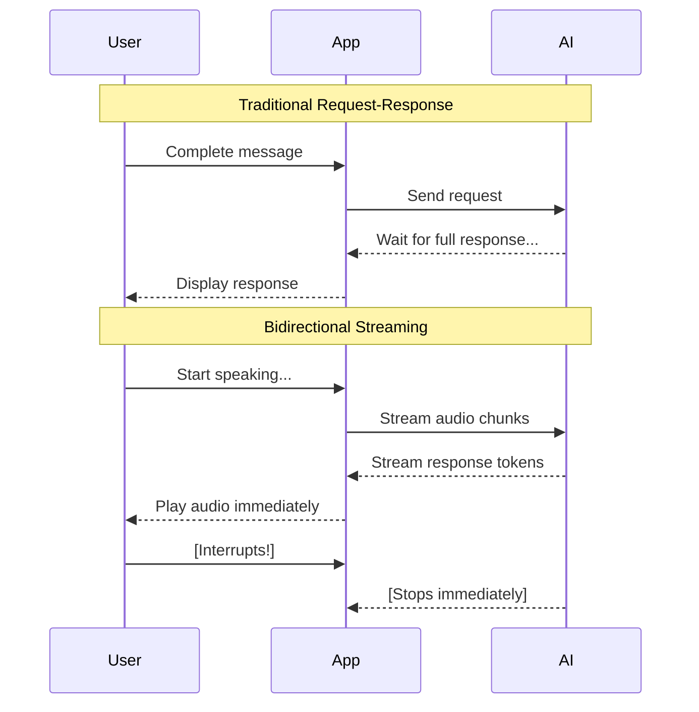

# ADK Bidi-streaming Workshop: Build Your Own Real-Time Voice AI

## What is Bidi-streaming?

**Bidirectional streaming** (bidi-streaming) enables simultaneous two-way communication between your application and AI models. Unlike traditional request-response patterns where you send a complete message and wait for a complete reply, bidi-streaming allows:

- **Continuous input**: Stream audio, video, or text as it's captured
- **Real-time output**: Receive AI responses as they're generated
- **Natural interruption**: Users can interrupt the AI mid-response, just like in human conversation



**Why this matters:** Bidi-streaming makes AI conversations feel natural. The AI can respond while you're still providing context, and you can interrupt it when you've heard enough—just like talking to a human.

### What is ADK Bidi-streaming?

The **[Agent Development Kit (ADK)](https://google.github.io/adk-docs/)** provides a high-level abstraction over the [Gemini Live API](https://ai.google.dev/gemini-api/docs/live), handling the complex plumbing of real-time streaming so you can focus on building your application.


ADK Bidi-streaming manages:

- **Connection lifecycle**: Establishing, maintaining, and recovering [WebSocket](https://developer.mozilla.org/en-US/docs/Web/API/WebSockets_API) connections
- **Message routing**: Directing audio, text, and images to the right handlers
- **Session state**: Persisting conversation history across reconnections
- **Tool execution**: Automatically calling and resuming from function calls

**Why ADK over raw Live API?**

You could build directly on the Gemini Live API, but ADK handles the complex infrastructure so you can focus on your application:


| Capability | Raw Live API | ADK Bidi-streaming |
|------------|--------------|-------------------|
| Agent Framework | Build from scratch | Single/multi-agent with tools, evaluation, security |
| Tool Execution | Manual handling | Automatic parallel execution |
| Connection Management | Manual reconnection | Transparent session resumption |
| Event Model | Custom structures | Unified, typed Event objects |
| Async Framework | Manual coordination | LiveRequestQueue + run_live() generator |
| Session Persistence | Manual implementation | Built-in SQL, Vertex AI, or in-memory |

> **The bottom line:** ADK reduces months of infrastructure development to days of application development. You focus on what your agent does, not how streaming works.

### Real-World Use Cases

- **Customer Service**: A customer shows their defective coffee machine via phone camera while explaining the issue. The AI identifies the model and failure point, and the customer can interrupt to correct details mid-conversation.

- **E-commerce**: A shopper holds up clothing to their webcam asking "Find shoes that match these pants." The agent analyzes the style and engages in fluid back-and-forth: "Show me something more casual" → "How about these sneakers?" → "Add the blue ones in size 10."

- **Field Service**: A technician wearing smart glasses streams their view while asking "I'm hearing a strange noise from this compressor—can you identify it?" The agent provides step-by-step guidance hands-free.

- **Healthcare**: A patient shares a live video of a skin condition. The AI performs preliminary analysis, asks clarifying questions, and guides next steps.

- **Financial Services**: A client reviews their portfolio while the agent displays charts and simulates trade impacts. The client can share their screen to discuss specific news articles.

**Shopper's Concierge 2 Demo**: Real-time Agentic RAG demo for e-commerce, built with ADK Bidi-streaming and [Vertex AI](https://cloud.google.com/vertex-ai) Vector Search, Embeddings, Feature Store and Ranking API:

[](https://www.youtube.com/watch?v=Hwx94smxT_0)

### Learn More: Developer Guide

For a comprehensive deep-dive, see the [ADK Bidi-streaming Developer Guide](https://google.github.io/adk-docs/streaming/dev-guide/part1/)—a 5-part series covering architecture to production deployment:

| Part | Focus | What You'll Learn |
|------|-------|-------------------|
| [Part 1](https://google.github.io/adk-docs/streaming/dev-guide/part1/) | Foundation | Architecture, Live API platforms, 4-phase lifecycle |
| [Part 2](https://google.github.io/adk-docs/streaming/dev-guide/part2/) | Upstream | Sending text, audio, video via LiveRequestQueue |
| [Part 3](https://google.github.io/adk-docs/streaming/dev-guide/part3/) | Downstream | Event handling, tool execution, multi-agent workflows |
| [Part 4](https://google.github.io/adk-docs/streaming/dev-guide/part4/) | Configuration | Session management, quotas, production controls |
| [Part 5](https://google.github.io/adk-docs/streaming/dev-guide/part5/) | Multimodal | Audio specs, model architectures, advanced features |

---

## Workshop Overview

### What You'll Build

In this hands-on workshop, you'll build a complete bidirectional streaming AI application from scratch. By the end, you'll have a working voice AI that can:

- Accept text, audio, and image input
- Respond with streaming text or natural speech
- Handle interruptions naturally
- Use tools like Google Search

Unlike reading documentation, you'll **examine each component step by step**, understanding how the pieces fit together as you build incrementally.


### Learning Approach

We follow an incremental build approach:

```
Step 1: Minimal WebSocket Server  → "Hello World" response
Step 2: Add the Agent             → Define AI behavior and tools
Step 3: Application Initialization → Runner and session service
Step 4: Session Initialization    → RunConfig and LiveRequestQueue
Step 5: Upstream Task             → Client to queue communication
Step 6: Downstream Task           → Events to client streaming
Step 7: Add Audio                 → Voice input and output
Step 8: Add Image Input           → Multimodal AI
```

Each step builds on the previous one. You'll test after every step to see your progress.

### Prerequisites

- Google Cloud account with [billing enabled](https://cloud.google.com/billing/docs/how-to/modify-project)
- Basic Python and async programming (async/await) knowledge
- Web browser with microphone and web camera access (Chrome recommended)

### Time Estimate

- **Full workshop**: ~90 minutes
- **Quick version** (Steps 1-4 only): ~45 minutes

---

## Environment Setup (10 min)

[Cloud Shell Editor](https://cloud.google.com/shell/docs/editor-overview) provides a browser-based development environment with VS Code functionality. No local setup required!

**Step 1: Open Cloud Shell Editor**

Navigate to [ide.cloud.google.com](https://ide.cloud.google.com) in your browser.


**Step 2: Download Workshop Files**

Open a terminal in Cloud Shell Editor (Terminal → New Terminal) and download the workshop files:

```bash
mkdir -p ~/bidi-workshop && cd ~/bidi-workshop
curl -L https://raw.githubusercontent.com/kazunori279/adk-streaming-guide/main/workshops/src.tar.gz | tar xz
```

This downloads all Python source files, agent definition, and frontend assets. Each `stepN_main.py` file is a complete, working version for that step.

Then open the project folder in the editor:

1. Click **File** → **Open Folder** in the menu bar
2. Navigate to `bidi-workshop`
3. Click **OK**

**Step 3: Configure Environment Variables**

We'll configure the application to use Vertex AI, which automatically authenticates using your Cloud Shell credentials.

Create a new `.env` file in the `app/` directory:

1. Right-click on the `app` folder in the Explorer panel
2. Select **New File**
3. Name it `.env`
4. Add the following content:

```bash
GOOGLE_CLOUD_PROJECT=your_project_id
GOOGLE_CLOUD_LOCATION=us-central1
GOOGLE_GENAI_USE_VERTEXAI=TRUE
```

Replace `your_project_id` with your Google Cloud project ID.

> **Finding your Project ID**: Click the project dropdown in the Cloud Console header to see your project ID.

**Step 4: Set Up Authentication**

Configure [Application Default Credentials (ADC)](https://cloud.google.com/docs/authentication/application-default-credentials) for Vertex AI access:

```bash
gcloud auth application-default login
```

Follow the prompts to authenticate. This creates credentials that ADK uses to access Vertex AI.

> **Verify authentication**: Run `gcloud auth application-default print-access-token` to confirm credentials are configured.

**Step 5: Install Dependencies**

Now we'll install all the Python packages defined in pyproject.toml.

Open a terminal in Cloud Shell Editor (Terminal → New Terminal) and run:

```bash
python3 -m venv .venv
source .venv/bin/activate
pip install -e .
```

This installs the bidi-workshop package and all required dependencies including:
- `google-adk` - Agent Development Kit
- [`fastapi`](https://fastapi.tiangolo.com/) - Web framework
- [`uvicorn`](https://www.uvicorn.org/) - ASGI server
- [`python-dotenv`](https://pypi.org/project/python-dotenv/) - Environment variable management

### Understanding the Directory Structure

After completing the setup, your project structure looks like this:

```
bidi-workshop/
├── pyproject.toml                    # Python package configuration (downloaded)
└── app/                              # Main application directory
    ├── .env                          # Environment variables (you create this)
    ├── main.py                       # Active server file (copy from stepN_main.py)
    ├── step1_main.py                 # Step 1: Minimal WebSocket server
    ├── step3_main.py                 # Step 3: Application initialization
    ├── step4_main.py                 # Step 4: Session initialization
    ├── step5_main.py                 # Step 5: Upstream task
    ├── step6_main.py                 # Step 6: Downstream task
    ├── step7_main.py                 # Step 7: Bidirectional audio
    ├── step8_main.py                 # Step 8: Image input
    ├── my_agent/                     # Agent package (pre-downloaded)
    │   ├── __init__.py               # Package initialization
    │   └── agent.py                  # Agent definition
    └── static/                       # Frontend assets (pre-downloaded)
        ├── index.html                # Main HTML page
        ├── css/
        │   └── style.css             # UI styling
        └── js/
            ├── app.js                # WebSocket, event handling, UI logic
            ├── audio-recorder.js     # Microphone capture (16kHz PCM)
            ├── audio-player.js       # Audio playback (24kHz PCM)
            ├── pcm-recorder-processor.js  # AudioWorklet for recording
            └── pcm-player-processor.js    # AudioWorklet for playback
```

**How to use the step files:**

Each step has a complete, working `stepN_main.py` file. To use a step:

```bash
cp step1_main.py main.py  # Copy step file to main.py
```

**Downloaded files:**

| File | Purpose |
|------|---------|
| `pyproject.toml` | Python package configuration and dependencies |
| `app/stepN_main.py` | Complete server implementation for each step |
| `app/my_agent/agent.py` | Agent definition (model, tools, instruction) |
| `app/static/*` | Frontend: HTML, CSS, WebSocket, audio capture/playback |

**Key insight:** The Python backend handles ADK integration. The JavaScript frontend handles browser APIs for audio/video. They communicate via WebSocket.

---

## Architecture Overview

Before diving into code, let's understand the high-level architecture and lifecycle of a bidi-streaming application.

### High-Level Architecture


The architecture consists of three main layers:

| Layer | Components | Purpose |
|-------|------------|---------|
| **Client** | Browser, WebSocket, [AudioWorklet](https://developer.mozilla.org/en-US/docs/Web/API/AudioWorklet) | Captures input, plays audio, displays UI |
| **Server** | FastAPI, ADK Runner, LiveRequestQueue | Routes messages, manages sessions, orchestrates agent |
| **AI** | Gemini Live API, Agent, Tools | Processes input, generates responses, executes tools |

### The 4-Phase Lifecycle

Every bidi-streaming session follows this lifecycle:


| Phase | When | What Happens |
|-------|------|--------------|
| **1. Application Init** | Server startup | Create Agent, SessionService, Runner (once, shared) |
| **2. Session Init** | WebSocket connects | Create RunConfig, get/create Session, create LiveRequestQueue |
| **3. Bidi-streaming** | Active conversation | Concurrent upstream (input) and downstream (events) tasks |
| **4. Termination** | Connection closes | Close LiveRequestQueue, cleanup resources |

This lifecycle pattern is fundamental to all streaming applications. You'll implement each phase as you build through the steps.

### LiveRequestQueue: The Input Channel

The `LiveRequestQueue` is your primary interface for sending input to the model:


| Method | Use Case | Triggers Response? |
|--------|----------|-------------------|
| `send_content(content)` | Text messages | Yes, immediately |
| `send_realtime(blob)` | Audio/image streams | After VAD detects silence |
| `send_activity_start()` | Signal user is active | No |
| `send_activity_end()` | Signal user stopped | May trigger response |
| `close()` | End the session | N/A |

---

## Step 1: Minimal WebSocket Server (10 min)

Let's start with the simplest possible WebSocket server that echoes messages back.

### Activate Step 1

Copy the step 1 source file to `main.py`:

```bash
cd ~/bidi-workshop/app
cp step1_main.py main.py
```

Open `main.py` in the editor to examine the code. Key points:

- **FastAPI app**: Creates the web server
- **Static files mount**: Serves the frontend HTML/CSS/JS
- **WebSocket endpoint**: Accepts connections at `/ws/{user_id}/{session_id}`
- **Echo response**: Returns the received text in ADK event format

### Test Step 1

Start the server:

```bash
cd ~/bidi-workshop/app
python -m uvicorn main:app --reload --host 0.0.0.0 --port 8080
```

Open Web Preview (globe icon → Preview on port 8080).

**Test it:**
1. Type "Hello" in the text input
2. Click Send
3. You should see "Echo: {"type": "text", "text": "Hello"}" in the chat

> **What you built**: A WebSocket server that receives messages and sends responses. The frontend displays it as a chat message because the response follows ADK's event format.

### Client Code: WebSocket Connection

The frontend establishes and manages the WebSocket connection. Here's what happens on the client side:

**Connecting to the server (app.js:10-12, 317-350):**

```javascript
// app.js:10-12 - Session identifiers
const userId = "demo-user";
const sessionId = "demo-session-" + Math.random().toString(36).substring(7);

// app.js:317-350 - WebSocket connection
function connectWebsocket() {
    // Construct WebSocket URL with user/session IDs
    const ws_url = "ws://" + window.location.host + "/ws/" + userId + "/" + sessionId;
    websocket = new WebSocket(ws_url);

    websocket.onopen = function() {
        console.log("WebSocket connected");
        updateConnectionStatus(true);  // Update UI indicator
    };

    websocket.onclose = function() {
        console.log("WebSocket closed");
        updateConnectionStatus(false);
        setTimeout(connectWebsocket, 5000);  // Auto-reconnect
    };

    websocket.onmessage = function(event) {
        // Handle incoming messages (we'll explore this later)
        const data = JSON.parse(event.data);
        // ... process event
    };
}

// Connect when page loads
connectWebsocket();
```

**Key concepts:**

| Concept | Purpose |
|---------|---------|
| `userId` / `sessionId` | Identify user and conversation for session persistence |
| `WebSocket()` | Browser API for real-time bidirectional communication |
| `onopen` / `onclose` | Connection lifecycle callbacks |
| `onmessage` | Receives all server events (text, audio, transcriptions) |
| Auto-reconnect | Handles network interruptions gracefully |

**Why WebSocket?** Unlike HTTP which is request-response, WebSocket maintains a persistent connection allowing the server to push events to the client at any time—essential for streaming AI responses.

**Checkpoint**: You have a working WebSocket connection!

---

## Step 2: Add the Agent (10 min)

Now let's add an actual AI agent to generate real responses.

### Examine the Agent

The agent files were downloaded during setup. Open `my_agent/agent.py` in the editor to examine the code.

### Understand the Agent

```python
agent = Agent(
    name="workshop_agent",        # Identifier for logs and debugging
    model=os.getenv(...),         # Which Gemini model to use
    instruction="...",            # System prompt - shapes personality
    tools=[google_search],        # Tools the agent can call
)
```

The Agent is **stateless**—it defines behavior, not conversation state. The same agent instance serves all users.

### Model Architectures

The `model` parameter determines which Gemini model powers your agent. Two fundamentally different architectures are available for voice AI:

**Native Audio models** process audio end-to-end without text intermediates. They produce more natural prosody, support an extended voice library, and enable advanced features like affective dialog (emotional adaptation) and proactivity (model-initiated responses). The current model is `gemini-live-2.5-flash-native-audio`.

**Half-Cascade models** convert audio to text, process it, then synthesize speech. They support both TEXT and AUDIO response modalities, offering faster text responses and more predictable tool execution. The model `gemini-2.0-flash-live-001` was deprecated in December 2025.

| Feature | Native Audio | Half-Cascade |
|---------|--------------|--------------|
| Response modalities | AUDIO only | TEXT or AUDIO |
| Speech quality | More natural prosody | Standard TTS |
| Advanced features | Affective dialog, proactivity | Limited |
| Tool execution | Works but less predictable | More reliable |

> **Choosing the right model:** For natural conversation with emotional awareness, use native audio. For applications prioritizing tool execution reliability or needing text output, test thoroughly with native audio before committing.

### Client Code: No Changes Needed

The Agent is purely server-side—the client doesn't know or care about agent configuration. From the client's perspective:

```
Client sends: {"type": "text", "text": "Hello"}
Client receives: {"content": {"parts": [{"text": "..."}]}, ...}
```

The client only deals with:
- **Sending messages** (text, audio, images)
- **Receiving events** (responses, transcriptions, tool calls)

The Agent's instruction, model selection, and tools are invisible to the frontend. This separation means you can change agent behavior without modifying client code.

### Test Step 2

The `--reload` flag auto-detects file changes. Check the terminal—you should see uvicorn reload the app automatically.

If you see import errors, verify `my_agent/__init__.py` exists and is empty.

**Checkpoint**: Agent defined, but not yet connected to WebSocket.

---

## Step 3: Application Initialization (10 min)

ADK requires three components initialized once at startup:

1. **Agent** - Defines AI behavior (already created)
2. **SessionService** - Stores conversation history
3. **Runner** - Orchestrates streaming

### Activate Step 3

Copy the step 3 source file to `main.py`:

```bash
cp step3_main.py main.py
```

Open `main.py` in the editor to examine the new code. Key additions:

- **Load environment**: `load_dotenv()` loads `.env` before importing agent
- **SessionService**: `InMemorySessionService()` stores conversation history
- **Runner**: Orchestrates agent execution with session management

### Test Step 3

After the server reloads, send a message. You should see "ADK Ready! Model: gemini-live-2.5-flash-native-audio" in the chat.

**Checkpoint**: ADK components initialized! The app is not ready for actual chat yet - we'll connect to the Live API in the next steps.

### Understand the Components

```python
# SessionService: Stores conversation history
session_service = InMemorySessionService()  # Memory-based (lost on restart)
# For production: DatabaseSessionService or VertexAiSessionService

# Runner: Orchestrates everything
runner = Runner(
    app_name=APP_NAME,           # Identifies your application
    agent=agent,                  # The agent to run
    session_service=session_service,  # Where to store sessions
)
```

**Why single instances?**
- Created once at startup, shared across all connections
- Thread-safe and memory-efficient
- SessionService enables conversation continuity across reconnections

### Client Code: Session ID Generation

While `SessionService` and `Runner` are server-side, the client controls session identity:

```javascript
// app.js - Session ID generation
const userId = "demo-user";  // In production: authenticated user ID
const sessionId = "demo-session-" + Math.random().toString(36).substring(7);

// URL includes these IDs
const ws_url = "ws://" + window.location.host + "/ws/" + userId + "/" + sessionId;
```

---

## Step 4: Session Initialization (15 min)

Each WebSocket connection needs its own session. This is Phase 2 of the lifecycle.

### Activate Step 4

Copy the step 4 source file to `main.py`:

```bash
cp step4_main.py main.py
```

Open `main.py` in the editor to examine the new code. Key additions:

- **RunConfig**: Configures streaming mode, response modalities, and transcription
- **Session management**: Gets or creates session for conversation history
- **LiveRequestQueue**: Creates the queue for sending input to the model
- **Termination**: Closes the queue in `finally` block

### Test Step 4

Restart and test. Open a second browser tab with the same URL.

**Checkpoint**: Per-session resources created!

### Understand RunConfig

```python
run_config = RunConfig(
    streaming_mode=StreamingMode.BIDI,  # WebSocket bidirectional
    response_modalities=["AUDIO"],       # Native audio models require AUDIO
    input_audio_transcription=types.AudioTranscriptionConfig(),
    output_audio_transcription=types.AudioTranscriptionConfig(),
)
```

**Key RunConfig options:**

| Parameter | Purpose |
|-----------|---------|
| `streaming_mode` | `BIDI` for WebSocket, `SSE` for HTTP |
| `response_modalities` | `["AUDIO"]` for native audio models |
| `input_audio_transcription` | Transcribe user speech to text |
| `output_audio_transcription` | Transcribe model audio to text |


**Additional RunConfig options for production:**

| Parameter | Purpose |
|-----------|---------|
| `speech_config` | Configure voice selection and speaking style |
| `proactivity` | Enable model-initiated responses (native audio only) |
| `session_resumption` | Enable automatic reconnection after WebSocket timeouts |
| `context_window_compression` | Remove session duration limits |

**Understanding Session Types:**

One concept trips up many developers: ADK Session vs Live API session.

- **ADK Session**: Persistent, lives in SessionService, survives restarts. User returns days later with history intact.
- **Live API session**: Ephemeral, exists only during active `run_live()`. When the loop ends, it's destroyed—but ADK has already persisted the events.

### Understand LiveRequestQueue

```python
live_request_queue = LiveRequestQueue()
```

This is the **upstream channel** for sending input to the model:

| Method | Use Case |
|--------|----------|
| `send_content(content)` | Text messages (triggers response) |
| `send_realtime(blob)` | Audio/image chunks (streaming) |
| `close()` | End the session |

---

## Step 5: Upstream Task (15 min)

Now we'll send text to the model using `LiveRequestQueue`.

### Activate Step 5

Copy the step 5 source file to `main.py`:

```bash
cp step5_main.py main.py
```

Open `main.py` in the editor to examine the new code. Key additions:

- **upstream_task()**: Async function that receives WebSocket messages
- **JSON parsing**: Extracts text from `{"type": "text", "text": "..."}` messages
- **types.Content**: Creates ADK Content object with text part
- **send_content()**: Sends text to the model (triggers immediate response)
- **asyncio.gather()**: Runs upstream and downstream tasks concurrently

### Test Step 5

Restart and send a message. Check the terminal—you should see:
```
User said: Hello
Sent to LiveRequestQueue
```

The message goes to the model, but we're not receiving responses yet. That's next!

**Checkpoint**: Upstream path working!

### Understand the Upstream Flow

```python
# Parse JSON message from client
json_message = json.loads(text_data)
# {"type": "text", "text": "Hello"}

# Create ADK Content object
content = types.Content(
    parts=[types.Part(text=user_text)]
)

# Send to model via queue
live_request_queue.send_content(content)
```

**Content vs Blob:**
- `types.Content` - Structured text (triggers model response)
- `types.Blob` - Binary data like audio/images (streams continuously)

### Client Code: Sending Text Messages

The client sends text as JSON through the WebSocket:

```javascript
// app.js:755-766 - Send text message
function sendMessage(message) {
    if (websocket && websocket.readyState === WebSocket.OPEN) {
        const jsonMessage = JSON.stringify({
            type: "text",      // Server uses this to route the message
            text: message
        });
        websocket.send(jsonMessage);  // Sends as text frame
    }
}

// app.js:734-752 - Form submission handler
messageForm.onsubmit = function(e) {
    e.preventDefault();  // Don't reload page
    const message = messageInput.value.trim();

    if (message) {
        // Optimistic UI update - show message immediately
        const userBubble = createMessageBubble(message, true);
        messagesDiv.appendChild(userBubble);

        messageInput.value = "";  // Clear input
        sendMessage(message);      // Send to server
    }
};
```

**Key patterns:**

| Pattern | Purpose |
|---------|---------|
| `JSON.stringify()` | Package text with type identifier |
| `websocket.send(string)` | Send as WebSocket text frame |
| `e.preventDefault()` | Stop form from reloading page |
| Optimistic update | Show user message before server confirms |

**Message flow:**

```
User types → Form submit → JSON.stringify → WebSocket text frame
    → Server receives → json.loads() → types.Content
    → live_request_queue.send_content()
```

The `type: "text"` field tells the server this is a text message (vs image or other types we'll add later).

---

## Step 6: Downstream Task (15 min)

Now the exciting part—receiving streaming responses from the model!

### Activate Step 6

Copy the step 6 source file to `main.py`:

```bash
cp step6_main.py main.py
```

Open `main.py` in the editor to examine the new code. Key additions:

- **runner.run_live()**: Async generator that yields events from the model
- **Event serialization**: `event.model_dump_json()` converts events to JSON
- **WebSocket forwarding**: Sends each event to the client immediately
- **Error handling**: Catches exceptions and ensures queue is closed

### Test Step 6

Restart and try:

1. Type "Hello, who are you?"
2. Watch the response stream in word by word!
3. Try "Search for the weather in Tokyo"—watch tool execution!

Open the Event Console (right panel) to see raw events.

**Checkpoint**: Full bidirectional text streaming!

### Understand run_live()

```python
async for event in runner.run_live(
    user_id=user_id,              # Identifies the user
    session_id=session_id,        # Identifies the session
    live_request_queue=live_request_queue,  # Input channel
    run_config=run_config,        # Streaming configuration
):
    # Events arrive as they're generated - true streaming!
    event_json = event.model_dump_json(exclude_none=True, by_alias=True)
    await websocket.send_text(event_json)
```

**run_live() is an async generator** that yields events in real-time:

| Event Type | Field | Description |
|------------|-------|-------------|
| Text content | `event.content.parts[0].text` | Model's text response |
| Audio content | `event.content.parts[0].inline_data` | Model's audio response |
| Turn complete | `event.turn_complete` | Model finished responding |
| Interrupted | `event.interrupted` | User interrupted model |


### The Event Console

The demo application includes an Event Console (right panel) that displays raw events as they arrive. This is invaluable for debugging and understanding the streaming flow.

| Icon | Event Type | Description |
|------|------------|-------------|
| 📝 | Text content | Model's text response chunks |
| 🔊 | Audio content | Model's audio response chunks |
| 🎤 | Input transcription | User's speech converted to text |
| 📜 | Output transcription | Model's audio converted to text |
| 🛠️ | Tool call | Model requesting to use a tool |
| ✅ | Tool response | Result from tool execution |
| ⏹️ | Turn complete | Model finished responding |
| ⚡ | Interrupted | User interrupted the model |

Watch the Event Console as you interact—you'll see exactly how events flow in a streaming conversation.

### Client Code: Receiving and Processing Events

The client handles all incoming events in `websocket.onmessage`:

```javascript
// app.js:341-693 - Event handler (simplified)
websocket.onmessage = function(event) {
    const adkEvent = JSON.parse(event.data);

    // Log to Event Console
    addEventToConsole(adkEvent);

    // Handle turn complete - model finished responding
    if (adkEvent.turnComplete === true) {
        currentMessageId = null;
        currentBubbleElement = null;
        return;
    }

    // Handle interrupted - user started speaking while model was responding
    if (adkEvent.interrupted === true) {
        if (audioPlayerNode) {
            audioPlayerNode.port.postMessage({ command: "endOfAudio" });
        }
        if (currentBubbleElement) {
            currentBubbleElement.classList.add("interrupted");
        }
        return;
    }

    // Handle text content - streaming response
    if (adkEvent.content && adkEvent.content.parts) {
        for (const part of adkEvent.content.parts) {
            if (part.text) {
                if (currentMessageId == null) {
                    // Create new message bubble
                    currentMessageId = Date.now();
                    currentBubbleElement = createMessageBubble(part.text, false, true);
                    messagesDiv.appendChild(currentBubbleElement);
                } else {
                    // Append to existing bubble (streaming effect)
                    const textSpan = currentBubbleElement.querySelector(".bubble-text");
                    textSpan.textContent += part.text;
                }
            }
        }
    }
};
```

**Key event handling patterns:**

| Event | Client Action |
|-------|---------------|
| `turnComplete: true` | Reset state, ready for next input |
| `interrupted: true` | Stop audio playback, mark message interrupted |
| `content.parts[].text` | Append to chat bubble (streaming) |
| `content.parts[].inline_data` | Send to audio player (we'll add this later) |

**Streaming text effect:**

```
Event 1: {"content": {"parts": [{"text": "Hello"}]}}    → "Hello"
Event 2: {"content": {"parts": [{"text": ", how"}]}}    → "Hello, how"
Event 3: {"content": {"parts": [{"text": " are you?"}]}} → "Hello, how are you?"
Event 4: {"turnComplete": true}                          → Done!
```

Each event appends text to the same bubble, creating the "typing" effect.

### Example: Complete Voice Search Flow

Let's trace a complete interaction to see how all the pieces work together. A user asks: *"What's the weather in Tokyo?"*

```
1. Audio Capture → Queue
   Browser captures microphone at 16kHz, converts to PCM chunks.
   Server receives binary frames and calls:
   live_request_queue.send_realtime(audio_blob)

2. VAD Detection
   Live API's Voice Activity Detection notices user stopped speaking.
   Triggers processing of accumulated audio.

3. Transcription Event
   Event arrives: input_transcription.text = "What's the weather in Tokyo?"
   Display in chat UI so users see their words recognized.

4. Tool Execution
   Model decides to call google_search tool.
   Tool call event arrives → ADK executes automatically → Tool response event follows.

5. Audio Response
   Model generates spoken response.
   Audio chunks arrive as events with inline_data.
   Client feeds them to AudioWorklet for playback:
   "The weather in Tokyo is currently 22 degrees and sunny."

6. Turn Complete
   Event arrives with turn_complete=True.
   UI removes "..." indicator—agent finished talking.
```

This entire flow takes under two seconds. The user experiences natural conversation, unaware of the LiveRequestQueue, Events, and session management happening beneath the surface.

---

## Step 7: Add Audio (15 min)

Let's add bidirectional voice support—both speaking to the AI and hearing its responses.

### Activate Step 7

Copy the step 7 source file to `main.py`:

```bash
cp step7_main.py main.py
```

Open `main.py` in the editor to examine the new code. Key additions:

- **Binary message handling**: Detects `"bytes"` in WebSocket message
- **types.Blob**: Creates audio blob with `audio/pcm;rate=16000` MIME type
- **send_realtime()**: Streams audio continuously (VAD triggers response)
- **Warning filters**: Suppresses noisy authentication warnings

### Test Step 7

After the server reloads:

1. Click "Start Audio" button
2. Allow microphone access
3. Speak "Hello, can you hear me?"
4. Wait for the response—you should hear the AI speak back!

You should see your speech transcribed in the chat (if using a model with transcription support), and hear the AI's audio response through your speakers.

**Checkpoint**: Bidirectional voice streaming working!

### Multimodal Capabilities

ADK Bidi-streaming supports audio, images, and video through the same streaming interface.


### Understand Audio Format

The Live API has specific requirements for audio input and output:

**Input Audio (microphone → model):**

| Property | Value |
|----------|-------|
| Format | 16-bit signed PCM |
| Sample rate | 16 kHz |
| Channels | Mono |
| MIME type | `audio/pcm;rate=16000` |
| Chunk size | 50-100ms recommended (1,600-3,200 bytes) |

**Output Audio (model → speakers):**

| Property | Value |
|----------|-------|
| Format | 16-bit signed PCM |
| Sample rate | 24 kHz |
| Channels | Mono |
| Delivery | Streamed as `inline_data` in events |

The frontend's AudioWorklet handles format conversion automatically. The browser captures at 16kHz for input, and the player expects 24kHz for output.

### send_content() vs send_realtime()

```python
# Text: triggers immediate model response
live_request_queue.send_content(content)

# Audio: streams continuously, model uses VAD to detect turn end
live_request_queue.send_realtime(audio_blob)
```

**[VAD (Voice Activity Detection)](https://ai.google.dev/gemini-api/docs/live-guide#voice-activity-detection-vad)**: The Live API automatically detects when you stop speaking and triggers a response—no manual "end of turn" signal needed.

### Client Code: Audio Capture with AudioWorklet

The frontend captures microphone audio using the [Web Audio API](https://developer.mozilla.org/en-US/docs/Web/API/Web_Audio_API) with AudioWorklet for low-latency processing:

**Setting up the audio pipeline (audio-recorder.js:7-38):**

```javascript
// audio-recorder.js:7-38 - Start audio recording
export async function startAudioRecorderWorklet(audioRecorderHandler) {
    // Create AudioContext at 16kHz (required by Live API)
    const audioRecorderContext = new AudioContext({ sampleRate: 16000 });

    // Load the AudioWorklet processor
    const workletURL = new URL("./pcm-recorder-processor.js", import.meta.url);
    await audioRecorderContext.audioWorklet.addModule(workletURL);

    // Request microphone access (mono audio)
    const micStream = await navigator.mediaDevices.getUserMedia({
        audio: { channelCount: 1 }
    });
    const source = audioRecorderContext.createMediaStreamSource(micStream);

    // Create and connect the processor node
    const audioRecorderNode = new AudioWorkletNode(
        audioRecorderContext,
        "pcm-recorder-processor"
    );
    source.connect(audioRecorderNode);

    // Handle audio data from the worklet
    audioRecorderNode.port.onmessage = (event) => {
        const pcmData = convertFloat32ToPCM(event.data);
        audioRecorderHandler(pcmData);  // Send to WebSocket
    };

    return [audioRecorderNode, audioRecorderContext, micStream];
}

// audio-recorder.js:49-58 - Convert Float32 samples to 16-bit PCM
function convertFloat32ToPCM(inputData) {
    const pcm16 = new Int16Array(inputData.length);
    for (let i = 0; i < inputData.length; i++) {
        pcm16[i] = inputData[i] * 0x7fff;  // Scale [-1,1] to [-32768,32767]
    }
    return pcm16.buffer;
}
```

**The AudioWorklet processor (pcm-recorder-processor.js:1-18):**

```javascript
// pcm-recorder-processor.js:1-18
class PCMProcessor extends AudioWorkletProcessor {
    process(inputs, outputs, parameters) {
        if (inputs.length > 0 && inputs[0].length > 0) {
            const inputChannel = inputs[0][0];
            const inputCopy = new Float32Array(inputChannel);
            this.port.postMessage(inputCopy);  // Send to main thread
        }
        return true;  // Keep processor alive
    }
}

registerProcessor("pcm-recorder-processor", PCMProcessor);
```

**Sending audio chunks (app.js:979-988):**

```javascript
// app.js:979-988
function audioRecorderHandler(pcmData) {
    if (websocket && websocket.readyState === WebSocket.OPEN && is_audio) {
        websocket.send(pcmData);  // Send as binary WebSocket frame
    }
}
```

**Audio pipeline flow:**

```
Microphone → MediaStream → AudioContext (16kHz resample)
    → AudioWorkletNode → PCMProcessor (audio thread)
    → postMessage → Main thread → Float32 to Int16
    → WebSocket binary frame → Server → send_realtime()
```

**Key concepts:**

| Component | Purpose |
|-----------|---------|
| `AudioContext({ sampleRate: 16000 })` | Resample to Live API's required 16kHz |
| `AudioWorklet` | Process audio on separate thread (no glitches) |
| `Float32 → Int16` | Convert Web Audio format to PCM |
| Binary WebSocket frame | More efficient than base64 encoding |

### Understand Audio Response Events

Since we configured `response_modalities=["AUDIO"]`, the model returns audio in events:

```python
# Audio arrives as inline_data in content parts
if event.content and event.content.parts:
    for part in event.content.parts:
        if part.inline_data:
            # Base64-encoded 24kHz PCM audio
            mime_type = part.inline_data.mime_type  # "audio/pcm;rate=24000"
            audio_data = part.inline_data.data       # Base64 string
```

The frontend's audio player worklet handles:
1. Base64 decoding
2. Ring buffer for smooth playback
3. 24kHz PCM to speaker output

### Client Code: Audio Playback with Ring Buffer

The frontend plays audio using an AudioWorklet with a ring buffer for smooth, glitch-free playback:

**Setting up the audio player (audio-player.js:5-24):**

```javascript
// audio-player.js:5-24 - Start audio playback
export async function startAudioPlayerWorklet() {
    // Create AudioContext at 24kHz (Live API output format)
    const audioContext = new AudioContext({ sampleRate: 24000 });

    // Load the AudioWorklet processor
    const workletURL = new URL('./pcm-player-processor.js', import.meta.url);
    await audioContext.audioWorklet.addModule(workletURL);

    // Create and connect the player node to speakers
    const audioPlayerNode = new AudioWorkletNode(audioContext, 'pcm-player-processor');
    audioPlayerNode.connect(audioContext.destination);

    return [audioPlayerNode, audioContext];
}
```

**The ring buffer player (pcm-player-processor.js:5-75):**

```javascript
// pcm-player-processor.js:5-75
class PCMPlayerProcessor extends AudioWorkletProcessor {
    constructor() {
        super();

        // Ring buffer: 24kHz × 180 seconds capacity
        this.bufferSize = 24000 * 180;
        this.buffer = new Float32Array(this.bufferSize);
        this.writeIndex = 0;
        this.readIndex = 0;

        this.port.onmessage = (event) => {
            // Handle interruption - clear buffer immediately
            if (event.data.command === 'endOfAudio') {
                this.readIndex = this.writeIndex;  // Empty the buffer
                return;
            }

            // Add audio samples to ring buffer
            const int16Samples = new Int16Array(event.data);
            this._enqueue(int16Samples);
        };
    }

    _enqueue(int16Samples) {
        for (let i = 0; i < int16Samples.length; i++) {
            // Convert Int16 to Float32 [-1, 1]
            const floatVal = int16Samples[i] / 32768;
            this.buffer[this.writeIndex] = floatVal;
            this.writeIndex = (this.writeIndex + 1) % this.bufferSize;
        }
    }

    process(inputs, outputs, parameters) {
        const output = outputs[0];

        for (let frame = 0; frame < output[0].length; frame++) {
            output[0][frame] = this.buffer[this.readIndex];  // Left channel
            if (output.length > 1) {
                output[1][frame] = this.buffer[this.readIndex];  // Right (mono→stereo)
            }

            if (this.readIndex !== this.writeIndex) {
                this.readIndex = (this.readIndex + 1) % this.bufferSize;
            }
        }
        return true;
    }
}

registerProcessor('pcm-player-processor', PCMPlayerProcessor);
```

**Receiving and playing audio (app.js:341-693, excerpt):**

```javascript
// app.js:341-693 - In websocket.onmessage handler (excerpt)
if (adkEvent.content && adkEvent.content.parts) {
    for (const part of adkEvent.content.parts) {
        if (part.inlineData && part.inlineData.mimeType.startsWith("audio/pcm")) {
            // Decode base64 audio and send to player
            const audioData = base64ToArrayBuffer(part.inlineData.data);
            audioPlayerNode.port.postMessage(audioData);
        }
    }
}

function base64ToArrayBuffer(base64) {
    const binaryString = atob(base64);
    const bytes = new Uint8Array(binaryString.length);
    for (let i = 0; i < binaryString.length; i++) {
        bytes[i] = binaryString.charCodeAt(i);
    }
    return bytes.buffer;
}
```

**Why a ring buffer?**

```
Without ring buffer:
  Network jitter → Audio gaps → Choppy playback

With ring buffer:
  Network jitter → Buffer absorbs → Smooth playback

Ring buffer visualization:
     writeIndex (network writes here)
         ↓
[ ][█][█][█][█][ ][ ][ ]
            ↑
        readIndex (speaker reads here)
```

The buffer absorbs timing variations between network arrival and audio playback, ensuring smooth output even with irregular packet delivery.

---

## Step 8: Add Image Input (10 min)

Let's add camera/image support for multimodal AI.

### Activate Step 8

Copy the step 8 source file to `main.py`:

```bash
cp step8_main.py main.py
```

Open `main.py` in the editor to examine the new code. Key additions:

- **Image message handling**: Detects `{"type": "image", ...}` JSON messages
- **Base64 decoding**: `base64.b64decode()` converts image data
- **types.Blob for images**: Creates blob with `image/jpeg` MIME type
- **send_realtime() for images**: Sends image same as audio

### Test Image Input

After the server reloads:

1. Click the camera button
2. Allow camera access
3. Capture an image
4. Ask "What do you see in this image?"

**Checkpoint**: Multimodal AI working!

### Understand Image Format

| Property | Recommendation |
|----------|----------------|
| Format | JPEG or PNG |
| Resolution | 768x768 recommended |
| Frame rate | 1 FPS max for video |

Images are sent the same way as audio—via `send_realtime()`. The model processes them alongside text and audio for multimodal understanding.

### Client Code: Camera Capture and Image Sending

The frontend captures images from the camera using Canvas API and sends them as base64-encoded JSON:

**Opening camera preview (app.js:803-830):**

```javascript
// app.js:803-830 - Open camera and start preview
async function openCameraPreview() {
    // Request camera access
    cameraStream = await navigator.mediaDevices.getUserMedia({
        video: {
            width: { ideal: 768 },
            height: { ideal: 768 },
            facingMode: 'user'  // Front camera on mobile
        }
    });

    // Display live preview
    cameraPreview.srcObject = cameraStream;
    cameraModal.classList.add('show');
}
```

**Capturing and sending an image (app.js:848-904, 906-917):**

```javascript
// app.js:848-904 - Capture image from preview
function captureImageFromPreview() {
    // Create canvas matching video dimensions
    const canvas = document.createElement('canvas');
    canvas.width = cameraPreview.videoWidth;
    canvas.height = cameraPreview.videoHeight;
    const context = canvas.getContext('2d');

    // Draw current video frame to canvas
    context.drawImage(cameraPreview, 0, 0, canvas.width, canvas.height);

    // Convert to JPEG blob, then to base64
    canvas.toBlob((blob) => {
        const reader = new FileReader();
        reader.onloadend = () => {
            // Remove "data:image/jpeg;base64," prefix
            const base64data = reader.result.split(',')[1];
            sendImage(base64data);
        };
        reader.readAsDataURL(blob);
    }, 'image/jpeg', 0.85);  // 85% quality

    closeCameraPreview();
}

// app.js:906-917 - Send image to server
function sendImage(base64Image) {
    if (websocket && websocket.readyState === WebSocket.OPEN) {
        const jsonMessage = JSON.stringify({
            type: "image",
            data: base64Image,
            mimeType: "image/jpeg"
        });
        websocket.send(jsonMessage);
    }
}
```

**Image capture flow:**

```
Camera → MediaStream → <video> element (preview)
    → User clicks "Capture"
    → Canvas.drawImage() (screenshot)
    → canvas.toBlob() (JPEG 85%)
    → FileReader → base64 encoding
    → JSON message → WebSocket text frame
    → Server → base64.b64decode() → types.Blob
    → live_request_queue.send_realtime()
```

**Why base64 for images (not binary)?**

| Approach | Pros | Cons |
|----------|------|------|
| Binary frame | Smaller (no encoding overhead) | Can't include metadata |
| Base64 JSON | Includes mimeType, type field | 33% larger |

For images sent infrequently (on user action), base64 overhead is acceptable. The JSON wrapper lets the server distinguish image messages from text messages using the `type` field.

**Message comparison:**

```javascript
// Text message
{"type": "text", "text": "Hello"}

// Image message
{"type": "image", "data": "/9j/4AAQ...", "mimeType": "image/jpeg"}

// Audio - binary frame (no JSON wrapper)
[raw PCM bytes]
```

---

## Wrap-up & Key Takeaways

### What You Built

You built a complete bidirectional streaming AI application from scratch:

| Component | What It Does |
|-----------|--------------|
| Agent | Defines AI personality and tools |
| SessionService | Stores conversation history |
| Runner | Orchestrates streaming lifecycle |
| LiveRequestQueue | Sends input to model |
| run_live() | Receives streaming events |

### The 4-Phase Lifecycle

```
Phase 1: Application Init  →  Agent, SessionService, Runner (once)
Phase 2: Session Init      →  RunConfig, Session, LiveRequestQueue (per connection)
Phase 3: Bidi-streaming    →  upstream_task + downstream_task (concurrent)
Phase 4: Termination       →  close() the queue (always in finally)
```

### Key Code Patterns

```python
# Upstream: Send text
content = types.Content(parts=[types.Part(text="Hello")])
live_request_queue.send_content(content)

# Upstream: Send audio/images
blob = types.Blob(mime_type="audio/pcm;rate=16000", data=audio_bytes)
live_request_queue.send_realtime(blob)

# Downstream: Receive events
async for event in runner.run_live(...):
    await websocket.send_text(event.model_dump_json())

# Always close!
finally:
    live_request_queue.close()
```

### Resources

| Resource | URL |
|----------|-----|
| ADK Documentation | https://google.github.io/adk-docs/ |
| ADK Bidi-streaming Guide | https://google.github.io/adk-docs/streaming/dev-guide/ |
| Gemini Live API | https://ai.google.dev/gemini-api/docs/live |
| Vertex AI Live API | https://cloud.google.com/vertex-ai/generative-ai/docs/live-api |
| ADK Samples Repository | https://github.com/google/adk-samples |

### Next Steps

1. **Read the full guide**: https://google.github.io/adk-docs/streaming/dev-guide/
2. **Explore multi-agent**: Create agents that hand off conversations
3. **Deploy to [Cloud Run](https://cloud.google.com/run)**: Scale your streaming app
4. **Add session resumption**: Handle disconnections gracefully
5. **Add custom tools**: Build tools that integrate with your backend services

---

## Appendix: Troubleshooting

### Common Issues and Solutions

| Issue | Possible Cause | Solution |
|-------|---------------|----------|
| Microphone not working | Browser permissions | Check site permissions, ensure HTTPS or localhost |
| No audio response | Wrong model or modality | Verify native audio model, check `response_modalities=["AUDIO"]` |
| API key errors | Missing or invalid key | Check `.env` file, verify credentials are set correctly |
| WebSocket disconnects | Session timeout or error | Check server logs, implement reconnection logic |
| Slow responses | Network latency | Check connection, consider closer region |
| "Model not found" | Invalid model name | Check model name spelling, verify availability |

### Debugging Tips

**Enable Debug Logging:**

```python
import logging
logging.basicConfig(level=logging.DEBUG)
```

**Check Server Logs:**

Look for events in the terminal:

```
[UPSTREAM] User text: Hello
[DOWNSTREAM] Event: {"content": {"parts": [{"text": "Hi there!"}]}}
```

**Verify WebSocket Connection:**

Open browser DevTools → Network → WS tab to see WebSocket frames.

**Verify Audio Format:**

Ensure audio is 16kHz mono PCM for input and expect 24kHz mono PCM for output.

### Environment Variables Reference

```bash
# For Vertex AI (recommended for Cloud Shell)
GOOGLE_CLOUD_PROJECT=your_project_id
GOOGLE_CLOUD_LOCATION=us-central1
GOOGLE_GENAI_USE_VERTEXAI=TRUE

# For Google AI Studio (alternative)
# Get your API key at https://aistudio.google.com/
GOOGLE_API_KEY=your_google_ai_studio_api_key
```
