# ADK Bidi-streaming Workshop: Build Your Own Real-Time Voice AI

## What is Bidi-streaming?

**Bidirectional streaming** (bidi-streaming) enables simultaneous two-way communication between your application and AI models. Unlike traditional request-response patterns where you send a complete message and wait for a complete reply, bidi-streaming allows:

- **Continuous input**: Stream audio, video, or text as it's captured
- **Real-time output**: Receive AI responses as they're generated
- **Natural interruption**: Users can interrupt the AI mid-response, just like in human conversation

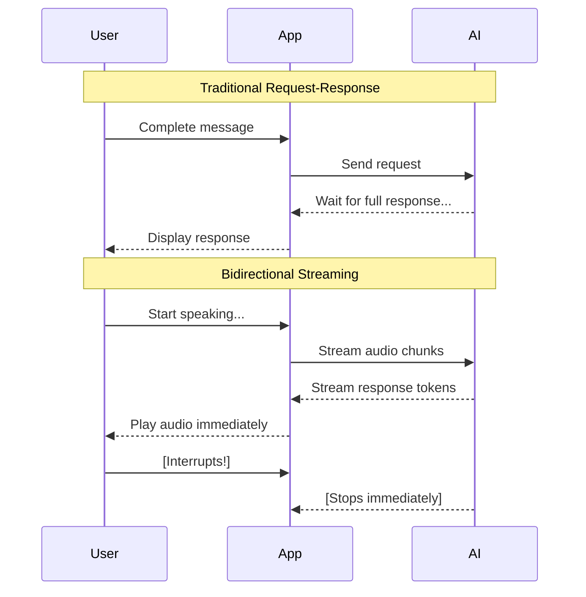

**Why this matters:** Bidi-streaming makes AI conversations feel natural. The AI can respond while you're still providing context, and you can interrupt it when you've heard enough—just like talking to a human.

### What is ADK Bidi-streaming?

The **[Agent Development Kit (ADK)](https://google.github.io/adk-docs/)** provides a high-level abstraction over the [Gemini Live API](https://ai.google.dev/gemini-api/docs/live), handling the complex plumbing of real-time streaming so you can focus on building your application.

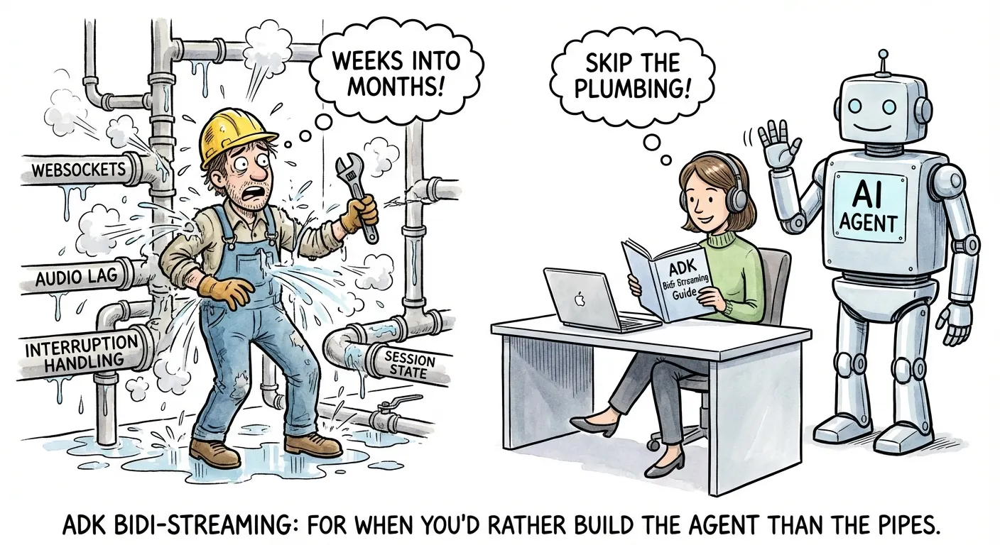

ADK Bidi-streaming manages:

- **Connection lifecycle**: Establishing, maintaining, and recovering [WebSocket](https://developer.mozilla.org/en-US/docs/Web/API/WebSockets_API) connections
- **Message routing**: Directing audio, text, and images to the right handlers
- **Session state**: Persisting conversation history across reconnections
- **Tool execution**: Automatically calling and resuming from function calls

**Why ADK over raw Live API?**

You could build directly on the Gemini Live API, but ADK handles the complex infrastructure so you can focus on your application:

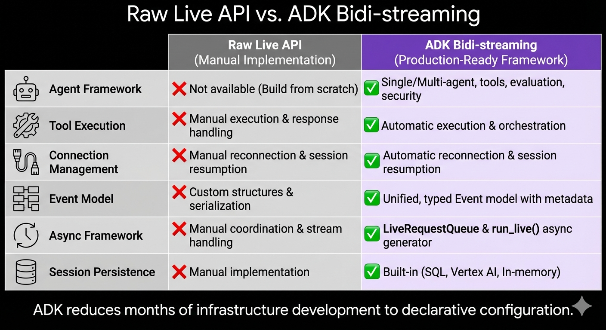

| Capability | Raw Live API | ADK Bidi-streaming |
|------------|--------------|-------------------|
| Agent Framework | Build from scratch | Single/multi-agent with tools, evaluation, security |
| Tool Execution | Manual handling | Automatic parallel execution |
| Connection Management | Manual reconnection | Transparent session resumption |
| Event Model | Custom structures | Unified, typed Event objects |
| Async Framework | Manual coordination | LiveRequestQueue + run_live() generator |
| Session Persistence | Manual implementation | Built-in SQL, Vertex AI, or in-memory |

> **The bottom line:** ADK reduces months of infrastructure development to days of application development. You focus on what your agent does, not how streaming works.

### Real-World Use Cases

- **Customer Service**: A customer shows their defective coffee machine via phone camera while explaining the issue. The AI identifies the model and failure point, and the customer can interrupt to correct details mid-conversation.

- **E-commerce**: A shopper holds up clothing to their webcam asking "Find shoes that match these pants." The agent analyzes the style and engages in fluid back-and-forth: "Show me something more casual" → "How about these sneakers?" → "Add the blue ones in size 10."

- **Field Service**: A technician wearing smart glasses streams their view while asking "I'm hearing a strange noise from this compressor—can you identify it?" The agent provides step-by-step guidance hands-free.

- **Healthcare**: A patient shares a live video of a skin condition. The AI performs preliminary analysis, asks clarifying questions, and guides next steps.

- **Financial Services**: A client reviews their portfolio while the agent displays charts and simulates trade impacts. The client can share their screen to discuss specific news articles.

**Shopper's Concierge 2 Demo**: Real-time Agentic RAG demo for e-commerce, built with ADK Bidi-streaming and [Vertex AI](https://cloud.google.com/vertex-ai) Vector Search, Embeddings, Feature Store and Ranking API:

[](https://www.youtube.com/watch?v=Hwx94smxT_0)

### Learn More: Developer Guide

For a comprehensive deep-dive, see the [ADK Bidi-streaming Developer Guide](https://google.github.io/adk-docs/streaming/dev-guide/part1/)—a 5-part series covering architecture to production deployment:

| Part | Focus | What You'll Learn |
|------|-------|-------------------|
| [Part 1](https://google.github.io/adk-docs/streaming/dev-guide/part1/) | Foundation | Architecture, Live API platforms, 4-phase lifecycle |
| [Part 2](https://google.github.io/adk-docs/streaming/dev-guide/part2/) | Upstream | Sending text, audio, video via LiveRequestQueue |
| [Part 3](https://google.github.io/adk-docs/streaming/dev-guide/part3/) | Downstream | Event handling, tool execution, multi-agent workflows |
| [Part 4](https://google.github.io/adk-docs/streaming/dev-guide/part4/) | Configuration | Session management, quotas, production controls |
| [Part 5](https://google.github.io/adk-docs/streaming/dev-guide/part5/) | Multimodal | Audio specs, model architectures, advanced features |

---

## Workshop Overview

### What You'll Build

In this hands-on workshop, you'll build a complete bidirectional streaming AI application from scratch. By the end, you'll have a working voice AI that can:

- Accept text, audio, and image input
- Respond with streaming text or natural speech
- Handle interruptions naturally
- Use tools like Google Search

Unlike reading documentation, you'll **examine each component step by step**, understanding how the pieces fit together as you build incrementally.


### Learning Approach

We follow an incremental build approach:

```
Step 1: Minimal WebSocket Server  → "Hello World" response
Step 2: Add the Agent             → Define AI behavior and tools
Step 3: Application Initialization → Runner and session service
Step 4: Session Initialization    → RunConfig and LiveRequestQueue
Step 5: Upstream Task             → Client to queue communication
Step 6: Downstream Task           → Events to client streaming
Step 7: Add Audio                 → Voice input and output
Step 8: Add Image Input           → Multimodal AI
```

Each step builds on the previous one. You'll test after every step to see your progress.

### Prerequisites

- Google Cloud account with [billing enabled](https://cloud.google.com/billing/docs/how-to/modify-project)
- Basic Python and async programming (async/await) knowledge
- Web browser with microphone and web camera access (Chrome recommended)

### Time Estimate

- **Full workshop**: ~90 minutes
- **Quick version** (Steps 1-4 only): ~45 minutes

---

## Environment Setup (10 min)

[Cloud Shell Editor](https://cloud.google.com/shell/docs/editor-overview) provides a browser-based development environment with VS Code functionality. No local setup required!

**Step 1: Open Cloud Shell Editor**

Navigate to [ide.cloud.google.com](https://ide.cloud.google.com) in your browser. Close the Gemini panel on the right side (we won't use it in this workshop).


**Step 2: Download Workshop Files**

Open a terminal in Cloud Shell Editor (**Terminal** → **New Terminal**):

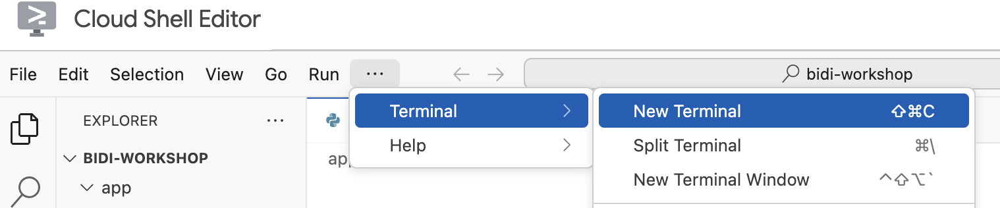

Download the workshop files:


```bash
mkdir -p ~/bidi-workshop && cd ~/bidi-workshop
curl -L https://raw.githubusercontent.com/kazunori279/adk-streaming-guide/main/workshops/src.tar.gz | tar xz
```

This downloads all Python source files, agent definition, and frontend assets. Each `stepN_main.py` file is a complete, working version for that step.

Then open the project folder in the editor:

1. Click **File** → **Open Folder** in the menu bar
2. Navigate to `bidi-workshop`
3. Click **OK**

Your project structure looks like this:

```
bidi-workshop/
├── pyproject.toml                    # Python package configuration
└── app/                              # Main application directory
    ├── .env.template                  # Environment variables template (copy to .env)
    ├── step1_main.py                 # Step 1: Minimal WebSocket server
    ├── step3_main.py                 # Step 3: Application initialization
    ├── step4_main.py                 # Step 4: Session initialization
    ├── step5_main.py                 # Step 5: Upstream task
    ├── step6_main.py                 # Step 6: Downstream task
    ├── step7_main.py                 # Step 7: Bidirectional audio
    ├── step8_main.py                 # Step 8: Image input
    ├── my_agent/                     # Agent package
    │   ├── __init__.py
    │   └── agent.py                  # Agent definition
    └── static/                       # Frontend assets
        ├── index.html
        ├── css/style.css
        └── js/                       # WebSocket, audio capture/playback
```

Each `stepN_main.py` file is a complete, working version for that step. Copy it to `main.py` to use: `cp step1_main.py main.py`

**Step 3: Configure Environment Variables**

Rename the template file and edit it with your Google Cloud project ID:

```bash
cd ~/bidi-workshop/app
cp .env.template .env
```

Click the **Refresh Explorer** button in the Explorer panel to see the new file. 

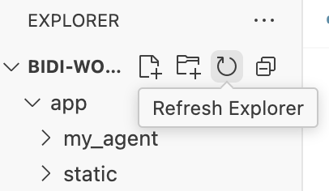

Then edit `app/.env` and replace `your_project_id` with your project ID:

```bash
GOOGLE_CLOUD_PROJECT=your_project_id
GOOGLE_CLOUD_LOCATION=us-central1
GOOGLE_GENAI_USE_VERTEXAI=TRUE
```

> **Finding your Project ID**: Run `gcloud projects list` to see your available projects, or check the project dropdown in the Cloud Console header.

**Step 4: Install Dependencies**

Now we'll install all the Python packages defined in pyproject.toml.

Open a terminal and run:

```bash
cd ~/bidi-workshop
python3 -m venv .venv
source .venv/bin/activate
pip install -e .
```

This installs the bidi-workshop package and all required dependencies including:

- `google-adk` - [Agent Development Kit](https://google.github.io/adk-docs/) for building AI agents with Gemini
- `fastapi` - [FastAPI](https://fastapi.tiangolo.com/), modern Python web framework with WebSocket support
- `uvicorn` - [Uvicorn](https://www.uvicorn.org/), ASGI server to run FastAPI applications
- `python-dotenv` - [python-dotenv](https://pypi.org/project/python-dotenv/), loads environment variables from `.env` files

---

## Architecture Overview

Before diving into code, let's understand the high-level architecture and lifecycle of a bidi-streaming application.

### High-Level Architecture

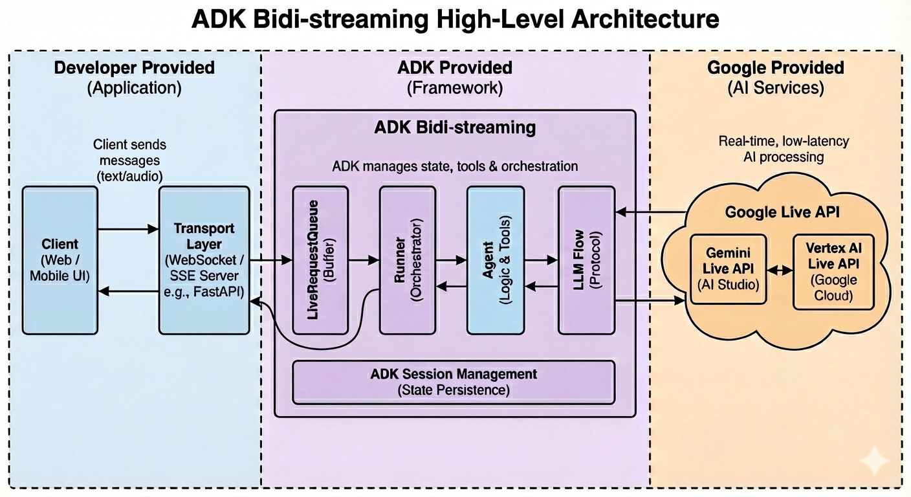

The architecture consists of three main layers:

| Layer | Components | Purpose |
|-------|------------|---------|
| **Client** | Browser, WebSocket, [AudioWorklet](https://developer.mozilla.org/en-US/docs/Web/API/AudioWorklet) | Captures input, plays audio, displays UI |
| **Server** | FastAPI, ADK Runner, LiveRequestQueue | Routes messages, manages sessions, orchestrates agent |
| **AI** | Gemini Live API, Agent, Tools | Processes input, generates responses, executes tools |

---

## Step 1: Minimal WebSocket Server (10 min)

Let's start with the simplest possible WebSocket server that echoes messages back.

### Run the Server

Copy the step 1 source file to `main.py` and start the server:

```bash
cd ~/bidi-workshop/app
cp step1_main.py main.py
```

Start the server:

```bash
cd ~/bidi-workshop/app
python -m uvicorn main:app --host 0.0.0.0 --port 8080
```

You should see:

```
INFO:     Uvicorn running on http://0.0.0.0:8080 (Press CTRL+C to quit)
INFO:     Started server process [...]
INFO:     Application startup complete.
```

Click **Web Preview** button and choose **Preview on port 8080**.

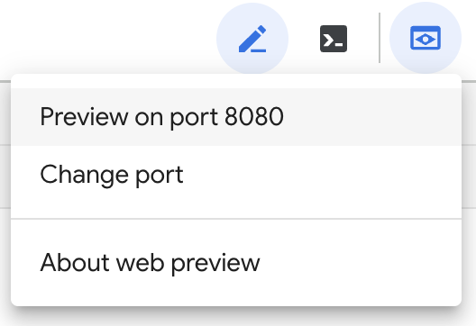

You'll see the demo screen in your browser. Make sure the **Connected** indicator appears in the top right corner—this confirms the WebSocket connection is working.

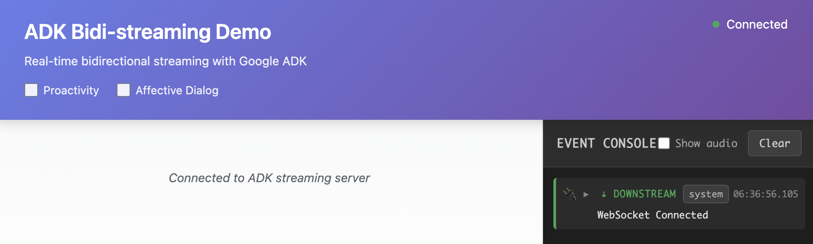

**Test it:**
1. Type "Hello" in the text input
2. Click Send
3. You should see "Echo: {"type": "text", "text": "Hello"}" in the chat

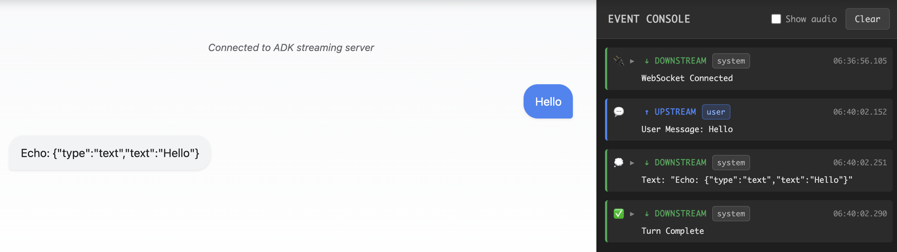

Open `main.py` in the editor to examine the code. Key components:

- **FastAPI app**: Creates web server with WebSocket support
- **Static files**: Serves frontend assets (HTML, CSS, JS)
- **WebSocket endpoint**: Accepts connections at `/ws/{user_id}/{session_id}`
- **Echo response**: Returns messages in ADK event format

### Understanding the Server Code

**step1_main.py:9-14** - Create FastAPI app and serve static files:
```python
# Create FastAPI application
app = FastAPI()

# Serve static files (HTML, CSS, JS)
static_dir = Path(__file__).parent / "static"
app.mount("/static", StaticFiles(directory=static_dir), name="static")
```

FastAPI is a modern Python web framework that provides built-in WebSocket support. The `StaticFiles` middleware serves our frontend assets (HTML, CSS, JavaScript) from the `static/` directory.

**step1_main.py:23-30** - WebSocket endpoint accepts connections:
```python
@app.websocket("/ws/{user_id}/{session_id}")
async def websocket_endpoint(
    websocket: WebSocket,
    user_id: str,
    session_id: str,
) -> None:
    """WebSocket endpoint - currently just echoes messages."""
    await websocket.accept()
```

The `@app.websocket` decorator creates a WebSocket endpoint. Path parameters `{user_id}` and `{session_id}` are extracted from the URL and passed to the function. Calling `websocket.accept()` completes the WebSocket handshake.

**step1_main.py:44-50** - Echo response in ADK event format:
```python
response = {
    "content": {
        "parts": [{"text": f"Echo: {text_data}"}]
    }
}
await websocket.send_text(json.dumps(response))
await websocket.send_text(json.dumps({"turnComplete": True}))
```

At this point, we're just echoing back the input message without using any ADK functionality yet. However, the response follows ADK's event format: `content.parts[].text` for text responses, and `turnComplete: true` to signal the response is finished. We'll explore this event format in detail in Step 6. The frontend already understands this format, so our echo appears as a chat message.

### Understanding the Event Console

The demo UI includes an **Event Console** panel on the right side of the screen. This is a powerful debugging tool that displays raw ADK events as they arrive from the server in real-time.

**What the Event Console shows:**

- Every event sent from the server, formatted as JSON
- Event types identified by icons for quick scanning
- Timestamps for understanding event timing and latency
- Full event payload that you can expand to inspect

**Event type icons:**

| Icon | Event Type | Description |
|------|------------|-------------|
| 📝 | Text content | Model's text response chunks |
| 🔊 | Audio content | Model's audio response chunks |
| 🎤 | Input transcription | User's speech converted to text |
| 📜 | Output transcription | Model's audio converted to text |
| 🛠️ | Tool call | Model requesting to use a tool |
| ✅ | Tool response | Result from tool execution |
| ⏹️ | Turn complete | Model finished responding |
| ⚡ | Interrupted | User interrupted the model |

**How to use it:**

1. **Toggle visibility**: Click the "Event Console" header or the toggle button to show/hide the panel
2. **Clear events**: Use the clear button to reset the console between tests
3. **Inspect events**: Click any event to see the full JSON payload
4. **Trace message flow**: Watch events arrive in sequence to understand the streaming lifecycle

At this step, you'll see two events for each message you send:
1. A content event with the echo response
2. A `turnComplete` event signaling the response is finished

As you progress through the workshop, you'll see more event types—transcriptions, tool calls, audio chunks—giving you visibility into exactly how ADK streaming works under the hood.

### Understanding the Client Code: WebSocket Connection

The frontend establishes and manages the WebSocket connection. Here's what happens on the client side:

**Connecting to the server (app.js:10-12, 317-350):**

```javascript
// app.js:10-12 - Session identifiers
const userId = "demo-user";
const sessionId = "demo-session-" + Math.random().toString(36).substring(7);

// app.js:317-350 - WebSocket connection
function connectWebsocket() {
    // Construct WebSocket URL with user/session IDs
    const ws_url = "ws://" + window.location.host + "/ws/" + userId + "/" + sessionId;
    websocket = new WebSocket(ws_url);

    websocket.onopen = function() {
        console.log("WebSocket connected");
        updateConnectionStatus(true);  // Update UI indicator
    };

    websocket.onclose = function() {
        console.log("WebSocket closed");
        updateConnectionStatus(false);
        setTimeout(connectWebsocket, 5000);  // Auto-reconnect
    };

    websocket.onmessage = function(event) {
        // Handle incoming messages (we'll explore this later)
        const data = JSON.parse(event.data);
        // ... process event
    };
}

// Connect when page loads
connectWebsocket();
```

**Key concepts:**

| Concept | Purpose |
|---------|---------|
| `userId` / `sessionId` | Identify user and conversation for session persistence |
| `WebSocket()` | Browser API for real-time bidirectional communication |
| `onopen` / `onclose` | Connection lifecycle callbacks |
| `onmessage` | Receives all server events (text, audio, transcriptions) |
| Auto-reconnect | Handles network interruptions gracefully |

**Why not REST API?** Traditional REST APIs use request-response patterns—you send a request and wait for the complete response. For streaming AI, we need the server to push events as they're generated. Both WebSocket and SSE (Server-Sent Events) solve this:

| Protocol | Pros | Cons |
|----------|------|------|
| **WebSocket** | Bidirectional, supports binary data (audio/image), lower latency | More complex setup with proxies/load balancers |
| **SSE** | Simpler, works over HTTP, better proxy support | Needs two endpoints for bidirectional streaming, requires base64 encoding for binary data |

This workshop uses WebSocket for bidirectional audio streaming, but you can also choose to use SSE for text-only applications.

### Step 1 Checkpoint

> **What you built**: You set up a FastAPI app with a WebSocket endpoint that receives messages and sends responses. The frontend displays it as a chat message because the response follows ADK's event format.

---

## Step 2: Add the Agent (10 min)

Now let's add an actual AI agent to generate real responses.

### Examine the Agent

The agent files were downloaded during setup. Open `my_agent/agent.py` in the editor to examine the code.

### Understand the Agent

**my_agent/agent.py:1-16**
```python
from google.adk.agents import Agent
from google.adk.tools import google_search

agent = Agent(
    name="workshop_agent",
    model="gemini-live-2.5-flash-native-audio",
    instruction="""You are a helpful AI assistant.

    You can use Google Search to find current information.
    Keep your responses concise and friendly.
    """,
    tools=[google_search],
)
```

**Agent parameters:**

| Parameter | Purpose |
|-----------|---------|
| `name` | Identifier for logs, debugging, and multi-agent routing |
| `model` | Gemini model to use (see Model Architectures below) |
| `instruction` | System prompt that shapes the agent's personality and behavior |
| `tools` | List of tools the agent can call during conversation |

The Agent is **stateless**—it defines behavior, not conversation state. The same agent instance serves all users.

### The google_search Tool

The `google_search` tool is a built-in ADK tool that enables your agent to search the web for current information:

```python
from google.adk.tools import google_search
```

**How it works:**

1. When the user asks about current events, weather, or factual information, the model decides to call `google_search`
2. ADK automatically executes the search and returns results to the model
3. The model synthesizes the results into a natural response

You'll see tool calls in the Event Console as 🛠️ (tool call) and ✅ (tool response) events. ADK handles tool execution automatically—you don't need to write any tool-handling code.

> **Note**: The agent isn't integrated with ADK yet, so you can't test tool calls at this step. You'll try it in Step 6 when bidirectional streaming is complete—ask "Search for the weather in Tokyo" and watch the tool execution flow in the Event Console.

### Choosing a Live API model

The `model` parameter determines which Live API model powers your agent. Two fundamentally different architectures are available for voice AI:

**Native Audio models** process audio end-to-end without text intermediates. They produce more natural prosody, support an extended voice library, and enable advanced features like affective dialog (emotional adaptation) and proactivity (model-initiated responses). The current model is `gemini-live-2.5-flash-native-audio`.

**Half-Cascade models** convert audio to text, process it, then synthesize speech. They support both TEXT and AUDIO response modalities, offering faster text responses and more predictable tool execution. The model `gemini-2.0-flash-live-001` was deprecated in December 2025.

| Feature | Native Audio | Half-Cascade |
|---------|--------------|--------------|
| Response modalities | AUDIO only | TEXT or AUDIO |
| Speech quality | More natural prosody | Standard TTS |
| Advanced features | Affective dialog, proactivity | Limited |
| Tool execution | Works but less predictable | More reliable |

**Find the latest supported models:**

- [Gemini Live API models](https://ai.google.dev/gemini-api/docs/models#live-models) — Google AI Studio (See **Gemini 2.5 Flash Live**)
- [Vertex AI Live API models](https://cloud.google.com/vertex-ai/generative-ai/docs/live-api#supported-models) — Google Cloud

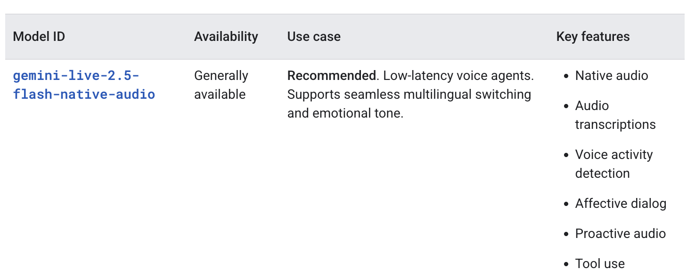

### Step 2 Checkpoint

> **What you built**: You defined an AI agent with a system prompt, model selection, and tools. The agent is stateless and will serve all users. However, it's not yet connected to the WebSocket—that comes next.

---

## Step 3: Application Initialization (10 min)

Every bidi-streaming application follows this lifecycle:

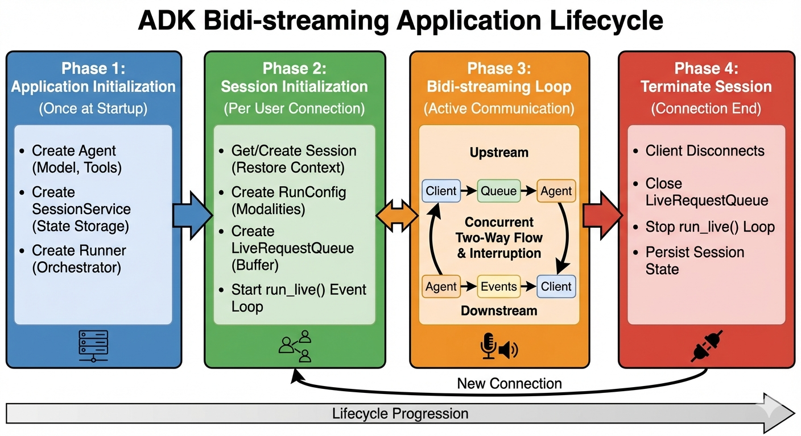

| Phase | When | What Happens |
|-------|------|--------------|
| **1. Application Init** | Server startup | Create Agent, SessionService, Runner (once, shared) |
| **2. Session Init** | WebSocket connects | Create RunConfig, get/create Session, create LiveRequestQueue |
| **3. Bidi-streaming** | Active conversation | Concurrent upstream (input) and downstream (events) tasks |
| **4. Termination** | Connection closes | Close LiveRequestQueue, cleanup resources |

This lifecycle pattern is fundamental to all streaming applications. You'll implement each phase as you build through the following steps.

In this step, we will add the **1. Application Init phase**. ADK requires three components initialized once at startup:

1. **Agent** - Defines AI behavior (already created)
2. **SessionService** - Stores conversation history
3. **Runner** - Orchestrates streaming

### Run the Server

Stop the server with **Ctrl+C**, then copy the step 3 source file and restart:

```bash
cp step3_main.py main.py
```

Restart the server:

```bash
python -m uvicorn main:app --host 0.0.0.0 --port 8080
```

Open the demo page on the browser, make sure the app is Connected, and send a "Hello" message. You should see **"ADK Ready! Model: gemini-live-2.5-flash-native-audio"** in the chat, confirming the ADK components are initialized. Check the Terminal to make sure the server log doesn't output any errors.

### Understanding the Server Code: Core ADK Components

Open `main.py` in the editor to examine the new code. Key additions:

- **Load environment**: `load_dotenv()` loads `.env` before importing agent
- **SessionService**: `InMemorySessionService()` stores conversation history
- **Runner**: Orchestrates agent execution with session management

**step3_main.py:13-14** - Load environment variables for calling Live API:
```python
# Load environment variables BEFORE importing agent
load_dotenv(Path(__file__).parent / ".env")
```

**step3_main.py:31-39** - Create SessionService and Runner:
```python
# SessionService: Stores conversation history
session_service = InMemorySessionService()  # Memory-based (lost on restart)
# For production: DatabaseSessionService or VertexAiSessionService

# Runner: Orchestrates everything
runner = Runner(
    app_name=APP_NAME,           # Identifies your application
    agent=agent,                  # The agent to run
    session_service=session_service,  # Where to store sessions
)
```

**[SessionService](https://google.github.io/adk-docs/sessions/)** persists conversation history across connections. When a user reconnects, their previous messages are restored. `InMemorySessionService` is simple but loses data on restart—use `DatabaseSessionService` or `VertexAiSessionService` for production. We'll see how to use ADK Session in Step 4.

**[Runner](https://google.github.io/adk-docs/runtime/runners/)** is the central orchestrator that connects your agent to the Live API. It manages the streaming lifecycle, routes messages through the agent, executes tools, and persists events to the session. We'll see how `run_live()` works in Step 6.

### Understanding the Client Code: Session ID Generation

While `SessionService` and `Runner` are server-side, the client controls session identity:

```javascript
// app.js - Session ID generation
const userId = "demo-user";  // In production: authenticated user ID
const sessionId = "demo-session-" + Math.random().toString(36).substring(7);

// URL includes these IDs
const ws_url = "ws://" + window.location.host + "/ws/" + userId + "/" + sessionId;
```

### Step 3 Checkpoint

> **What you built**: You initialized the three core ADK components—Agent, SessionService, and Runner. These are created once at startup and shared across all connections. The app isn't ready for actual chat yet—we'll connect to the Live API in the next steps.

---

## Step 4: Session Initialization (15 min)

Each WebSocket connection needs its own session. This is Phase 2 of the lifecycle.

### Run the Server

Stop the server with **Ctrl+C**, then copy the step 4 source file and restart:

```bash
cp step4_main.py main.py
```

Restart the server:

```bash
python -m uvicorn main:app --host 0.0.0.0 --port 8080
```

Open a second browser tab with the same URL. Examine the server log to see each tab creates a new session with a unique ID:

```
INFO:     127.0.0.1:39884 - "WebSocket /ws/demo-user/demo-session-cy0x8f" [accepted]
Client connected: user=demo-user, session=demo-session-cy0x8f
Created new session: demo-session-cy0x8f
...
INFO:     127.0.0.1:38498 - "WebSocket /ws/demo-user/demo-session-xoamfa" [accepted]
Client connected: user=demo-user, session=demo-session-xoamfa
Created new session: demo-session-xoamfa
```

Each browser tab generates a unique `session_id`, allowing multiple concurrent conversations.

Open `main.py` in the editor to examine the new code. Key additions:

- **RunConfig**: Configures streaming mode, response modalities, and transcription
- **LiveRequestQueue**: Creates the queue for sending input to the model
- **Termination**: Closes the queue in `finally` block
- **Session management**: Gets or creates session for conversation history

### Understanding RunConfig

`RunConfig` controls how the streaming session behaves—what modalities to use, whether to transcribe audio, and other runtime settings.

**step4_main.py:56-61**
```python
run_config = RunConfig(
    streaming_mode=StreamingMode.BIDI,  # WebSocket bidirectional
    response_modalities=["AUDIO"],       # Native audio models require AUDIO
    input_audio_transcription=types.AudioTranscriptionConfig(),
    output_audio_transcription=types.AudioTranscriptionConfig(),
)
```

You can see the RunConfig settings in the server log when a session is initialized:

```
Session initialized with config: streaming_mode=<StreamingMode.BIDI: 'bidi'>
  response_modalities=['AUDIO'] input_audio_transcription=AudioTranscriptionConfig()
  output_audio_transcription=AudioTranscriptionConfig() ...
```

**Key RunConfig options:**

| Parameter | Purpose |
|-----------|---------|
| `streaming_mode` | Communication between ADK and Gemini: `BIDI` for Live API models (real-time), `SSE` for standard models (legacy). Note: your client-server transport is independent and can be different |
| `response_modalities` | `["AUDIO"]` for voice responses (required for native audio models), `["TEXT"]` for text-only |
| `input_audio_transcription` | Transcribe user's speech to text—displays what the user said in the chat |
| `output_audio_transcription` | Transcribe model's audio to text—useful for logging and accessibility |

**Additional RunConfig options:**

| Parameter | Purpose |
|-----------|---------|
| `speech_config` | Configure voice selection and speaking style |
| `proactivity` | Enable model-initiated responses (native audio only) |
| `enable_affective_dialog` | Emotional adaptation in responses (native audio only) |
| `session_resumption` | Enable automatic reconnection after Live API connection timeouts (~10 min) |
| `context_window_compression` | Enable unlimited session duration by summarizing old context |
| `realtime_input_config` | Configure Voice Activity Detection (VAD) behavior |
| `save_live_blob` | Persist audio/video streams for debugging and compliance |

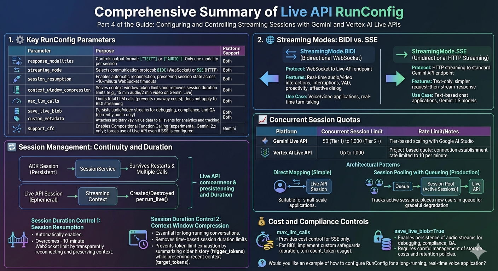

### Understanding LiveRequestQueue

The `LiveRequestQueue` is your primary interface for sending input to the model. Think of it as a mailbox where you drop messages, and ADK delivers them to the Live API.

**step4_main.py:76**
```python
live_request_queue = LiveRequestQueue()
```

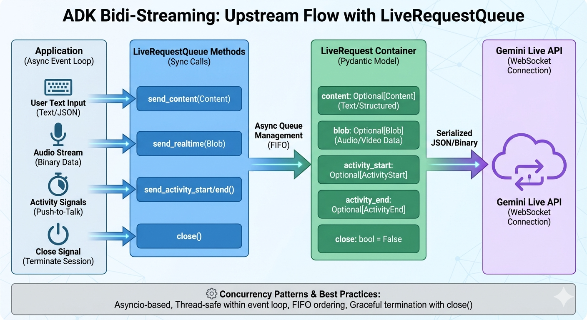

| Method | Use Case | Triggers Response? |
|--------|----------|-------------------|
| `send_content(content)` | Text messages | Yes, immediately |
| `send_realtime(blob)` | Audio/image streams | After VAD detects silence |
| `send_activity_start()` | Signal user is active | No |
| `send_activity_end()` | Signal user stopped | May trigger response |
| `close()` | End the session | N/A |

**Key difference between `send_content()` and `send_realtime()`:**

- **`send_content()`**: For complete text messages. The model starts responding immediately after receiving the content. Use this for chat-style text input.

- **`send_realtime()`**: For continuous streams like audio and video. The model accumulates chunks and uses Voice Activity Detection (VAD) to determine when the user has finished speaking before responding. Use this for microphone audio and camera frames.

**Why `close()` matters:** Always call `close()` in a `finally` block to properly terminate the Live API session and release resources. Forgetting to close can leave orphaned sessions counting against your quota.

**step4_main.py:103-108** - Always close in `finally`:
```python
except WebSocketDisconnect:
    print("Client disconnected")
finally:
    # Phase 4: Termination - always close the queue
    live_request_queue.close()
    print("LiveRequestQueue closed")
```

### Understanding Session Management

**step4_main.py:64-73** - Get or create ADK Session:
```python
# Get or create session for conversation history
session = await session_service.get_session(
    app_name=APP_NAME, user_id=user_id, session_id=session_id
)
if not session:
    await session_service.create_session(
        app_name=APP_NAME, user_id=user_id, session_id=session_id
    )
    print(f"Created new session: {session_id}")
else:
    print(f"Resumed existing session: {session_id}")
```

This pattern checks if a session already exists (returning user) or creates a new one (first-time user). The `session_id` comes from the client, enabling conversation continuity across reconnections.

**ADK Session vs Live API session:**

One concept trips up many developers: ADK Session vs Live API session.

| Session Type | Lifetime | Storage | Purpose |
|--------------|----------|---------|---------|
| **ADK Session** | Persistent (days/months) | SessionService (memory, database, Vertex AI) | Store conversation history across reconnections |
| **Live API session** | Ephemeral (during `run_live()`) | Live API backend | Active streaming connection to Gemini |

When `run_live()` starts (we will see it later), it loads history from the ADK Session and creates an ephemeral Live API session. As events arrive, ADK saves them to the ADK Session. When `run_live()` ends, the Live API session is destroyed—but the conversation history remains in the ADK Session for next time.


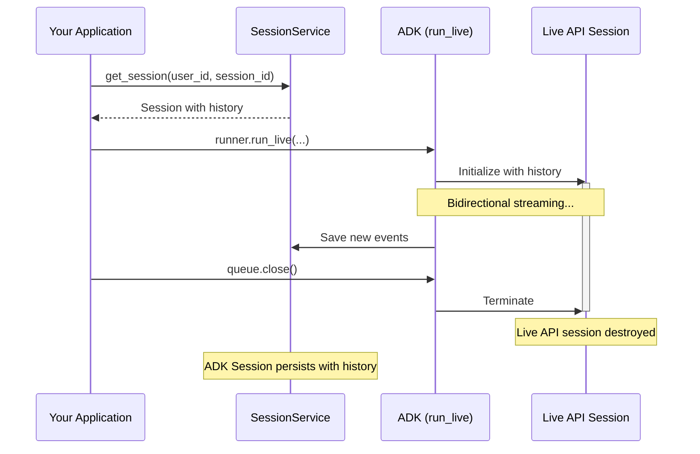

### Step 4 Checkpoint

> **What you built**: You implemented Phase 2 of the lifecycle—session initialization. Each WebSocket connection now gets its own RunConfig, Session, and LiveRequestQueue. The `finally` block ensures proper cleanup when connections close.

---

## Step 5: Upstream Task (15 min)

Now we'll send text to the model using `LiveRequestQueue`.

### Run the Server

Stop the server with **Ctrl+C**, then copy the step 5 source file and restart:

```bash
cp step5_main.py main.py
```

Restart the server:

```bash
python -m uvicorn main:app --host 0.0.0.0 --port 8080
```

Send a message. Check the terminal—you should see:
```
User said: Hello
Sent to LiveRequestQueue
```

The message goes to the model, but we're not receiving responses yet. That's next!

Open `main.py` in the editor to examine the new code. Key additions:

- **upstream_task()**: Async function that receives WebSocket messages
- **JSON parsing**: Extracts text from `{"type": "text", "text": "..."}` messages
- **types.Content**: Creates ADK Content object with text part
- **send_content()**: Sends text to the model (triggers immediate response)
- **asyncio.gather()**: Runs upstream and downstream tasks concurrently

### Understanding the Upstream Flow

The upstream task handles the **client → model** direction. It runs as an infinite loop, waiting for WebSocket messages and forwarding them to the model via `LiveRequestQueue`:

**step5_main.py:66-91**
```python
async def upstream_task() -> None:
    while True:
        message = await websocket.receive()  # Wait for WebSocket message from the client

        if "text" in message:
            text_data = message["text"]
            json_message = json.loads(text_data)  # Parse JSON

            if json_message.get("type") == "text":
                user_text = json_message["text"]

                # Create Content object and send to queue
                content = types.Content(
                    parts=[types.Part(text=user_text)]
                )
                live_request_queue.send_content(content)
```

**From the client to FastAPI:**
When a user enters a text message in the UI, the client sends it as JSON with a `type` field to identify the message kind:

```javascript
// Client sends this JSON string
{"type": "text", "text": "Hello, how are you?"}
```

**From FastAPI to the upstream task:**
FastAPI receives the WebSocket frame and passes it to `websocket.receive()` as a dictionary with either a `"text"` or `"bytes"` key depending on the frame type:

```python
# Text frame from client
{"type": "websocket.receive", "text": '{"type": "text", "text": "Hello"}'}

# Binary frame from client (audio)
{"type": "websocket.receive", "bytes": b'\x00\x01\x02...'}
```

**From the upstream task to LiveRequestQueue:**
The upstream task parses the JSON, extracts the user's text, wraps it in a `types.Content` object, and sends it to the model via `live_request_queue.send_content()`. This signals to the model that the user has finished their input and expects a response.

**Why `types.Content`?** The ADK uses Gemini API's `genai.types` for all data structures. `Content` represents a complete message with one or more `Part` objects (text, images, etc.). This is the same format used throughout the Gemini API. In Bidi-streaming, you typically use a single text `Part`—images and audio are sent separately via `send_realtime()` as `Blob` objects.

**Content vs Blob - When to use each:**

| Method | Data Type | Behavior |
|--------|-----------|----------|
| `send_content()` | `types.Content` | Structured text - signals "user finished speaking", triggers immediate model response |
| `send_realtime()` | `types.Blob` | Binary streams (audio/images) - continuous flow, model uses VAD to detect when to respond |

**Concurrent execution with `asyncio.gather()`:**

**step5_main.py:101**
```python
await asyncio.gather(upstream_task(), downstream_task())
```

This runs both tasks simultaneously (we'll implement `downstream_task()` in the next step):
- **upstream_task**: Receives from WebSocket → sends to model
- **downstream_task**: Receives from model → sends to WebSocket

If either task raises an exception, both are cancelled—ensuring clean shutdown when the client disconnects.

### Understanding the Client Code: Sending Text Messages

Now that we've seen how the server handles incoming messages, let's look at the client side. The frontend JavaScript captures user input and sends it through the WebSocket connection.

**Why JSON with a type field?** The client sends text and images as JSON with a `type` field, allowing the server to route each message to the appropriate handler. This pattern is extensible—you could add other message types like control commands (e.g., `{"type": "clear_history"}`) without changing the protocol. Audio is different—it's sent as raw binary WebSocket frames for efficiency (we'll see this in Step 7).

The client sends text as JSON through the WebSocket:

```javascript
// app.js:755-766 - Send text message
function sendMessage(message) {
    if (websocket && websocket.readyState === WebSocket.OPEN) {
        const jsonMessage = JSON.stringify({
            type: "text",      // Server uses this to route the message
            text: message
        });
        websocket.send(jsonMessage);  // Sends as text frame
    }
}
```

The `sendMessage()` function packages text into JSON and sends it via WebSocket. It checks that the connection is open before sending.

### Step 5 Checkpoint

> **What you built**: You implemented the upstream task that receives WebSocket messages and sends them to the model via `LiveRequestQueue.send_content()`. Messages are flowing to the Live API, but we're not receiving responses yet—that's next!

---

## Step 6: Downstream Task (15 min)

Now the exciting part—receiving streaming responses from the model!

### Run the Server

Stop the server with **Ctrl+C**, then copy the step 6 source file and restart:

```bash
cp step6_main.py main.py
```

Restart the server:

```bash
python -m uvicorn main:app --host 0.0.0.0 --port 8080
```

Try these three scenarios:

**Scenario 1: Watch streaming text events**
1. Type "Hello" and send
2. Open the Event Console (right panel) and watch events arrive word by word
3. Notice each event contains a small piece of text that builds up the response

**Scenario 2: Watch tool execution**
1. Type "Search for the weather in Tokyo"
2. Watch the Event Console—you'll see tool call events followed by tool response events
3. The model uses Google Search to get real-time weather data

**Scenario 3: Test interruption**
1. Type "Explain the history of Japan in detail"
2. While the model is responding, type "Stop" and send it
3. Watch the Event Console—you'll see an `interrupted` event, then the model starts responding to your new message

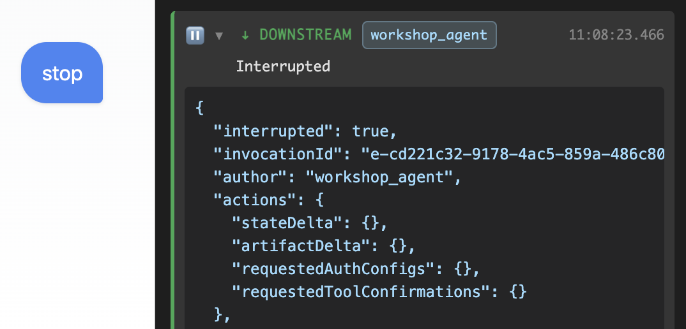

Open `main.py` in the editor to examine the new code. Key additions:

- **runner.run_live()**: Async generator that yields events from the model
- **Event serialization**: `event.model_dump_json()` converts events to JSON
- **WebSocket forwarding**: Sends each event to the client immediately
- **Error handling**: Catches exceptions and ensures queue is closed

### Understanding the Server Code: run_live()

**step6_main.py:78-93**
```python
async def downstream_task() -> None:
    async for event in runner.run_live(
        user_id=user_id,              # Identifies the user
        session_id=session_id,        # Identifies the session
        live_request_queue=live_request_queue,  # Input channel
        run_config=run_config,        # Streaming configuration
    ):
        # Serialize event to JSON
        event_json = event.model_dump_json(exclude_none=True, by_alias=True)

        # Forward to client
        await websocket.send_text(event_json)
```

**run_live() is an async generator** that yields `Event` objects as they arrive from the model. Unlike traditional request-response APIs where you wait for the complete response, `run_live()` streams events incrementally—you receive each word or audio chunk as it's generated.

The `async for` loop processes events one at a time:
- Each iteration yields a single `Event` object
- The loop continues until the session ends or an error occurs
- Events arrive in real-time, enabling low-latency streaming

**Common event types:**

| Event Type | Field | Description |
|------------|-------|-------------|
| Text content | `event.content.parts[0].text` | Model's text response |
| Audio content | `event.content.parts[0].inline_data` | Model's audio response (audio chunk) |
| Turn complete | `event.turn_complete` | Model finished responding to current input |
| Interrupted | `event.interrupted` | User interrupted model (e.g., spoke while model was responding) |

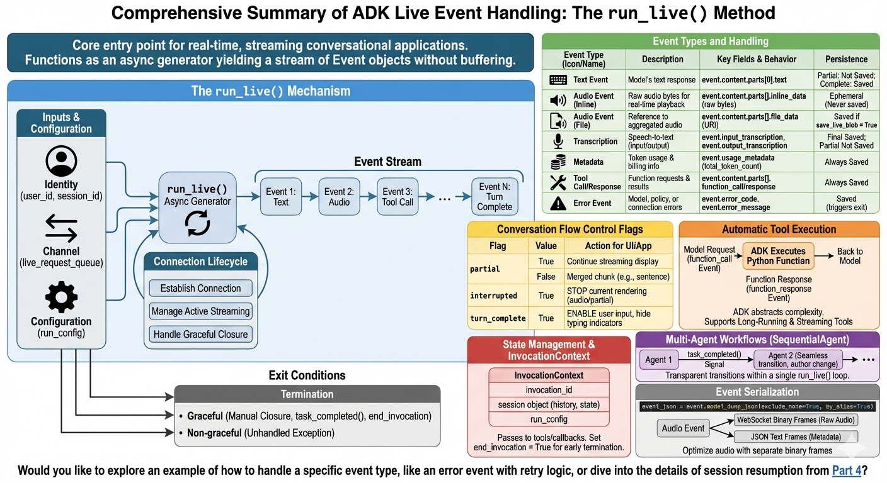

**Serializing events with `model_dump_json()`:** In this demo, we forward events directly to the client rather than examining them in the downstream task. The client-side JavaScript handles parsing and display. ADK events are Pydantic models, so we use `model_dump_json()` to convert them to JSON strings:

- `exclude_none=True` - Omits fields with `None` values, reducing payload size
- `by_alias=True` - Uses JSON field names (e.g., `inlineData` instead of `inline_data`) for JavaScript compatibility


### Understanding the Client Code: Receiving and Processing Events

The client handles all incoming ADK events in `websocket.onmessage`:

```javascript
// app.js:341-693 - Event handler (simplified)
websocket.onmessage = function(event) {
    const adkEvent = JSON.parse(event.data);

    // Log to Event Console
    addEventToConsole(adkEvent);

    // Handle turn complete - model finished responding
    if (adkEvent.turnComplete === true) {
        currentMessageId = null;
        currentBubbleElement = null;
        return;
    }

    // Handle interrupted - user started speaking while model was responding
    if (adkEvent.interrupted === true) {
        if (audioPlayerNode) {
            audioPlayerNode.port.postMessage({ command: "endOfAudio" });
        }
        if (currentBubbleElement) {
            currentBubbleElement.classList.add("interrupted");
        }
        return;
    }

    // Handle text content - streaming response
    if (adkEvent.content && adkEvent.content.parts) {
        for (const part of adkEvent.content.parts) {
            if (part.text) {
                if (currentMessageId == null) {
                    // Create new message bubble
                    currentMessageId = Date.now();
                    currentBubbleElement = createMessageBubble(part.text, false, true);
                    messagesDiv.appendChild(currentBubbleElement);
                } else {
                    // Append to existing bubble (streaming effect)
                    const textSpan = currentBubbleElement.querySelector(".bubble-text");
                    textSpan.textContent += part.text;
                }
            }
        }
    }
};
```

**Key event handling patterns:**

| Event | Client Action |
|-------|---------------|
| `turnComplete: true` | Reset state, ready for next input |
| `interrupted: true` | Stop audio playback, mark message interrupted |
| `content.parts[].text` | Append to chat bubble (streaming) |
| `content.parts[].inline_data` | Send to audio player (we'll add this later) |

**Streaming text effect:**

```
Event 1: {"content": {"parts": [{"text": "Hello"}]}}    → "Hello"
Event 2: {"content": {"parts": [{"text": ", how"}]}}    → "Hello, how"
Event 3: {"content": {"parts": [{"text": " are you?"}]}} → "Hello, how are you?"
Event 4: {"turnComplete": true}                          → Done!
```

Each event appends text to the same bubble, creating the "typing" effect.

### Step 6 Checkpoint

> **What you built**: You completed the bidirectional streaming loop! The downstream task uses `runner.run_live()` to receive events from the model and forward them to the client. You now have full text-based conversation with streaming responses, tool execution (Google Search), and interruption handling.

---

## Step 7: Add Audio (15 min)

Let's add bidirectional voice support—both speaking to the AI and hearing its responses.

### Run the Server

Stop the server with **Ctrl+C**, then copy the step 7 source file and restart:

```bash
cp step7_main.py main.py
```

Restart the server:

```bash
python -m uvicorn main:app --host 0.0.0.0 --port 8080
```

Test voice interaction:

1. Click "Start Audio" button
2. Allow microphone access
3. Speak "Hello, can you hear me?"
4. Wait for the response—you should hear the AI speak back!

You should see your speech transcribed in the chat (if using a model with transcription support), and hear the AI's audio response through your speakers.

Open `main.py` in the editor to examine the new code. Key additions:

- **Binary message handling**: Detects `"bytes"` in WebSocket message
- **types.Blob**: Creates audio blob with `audio/pcm;rate=16000` MIME type
- **send_realtime()**: Streams audio continuously (VAD triggers response)
- **Warning filters**: Suppresses noisy authentication warnings

### Multimodal Capabilities

ADK Bidi-streaming supports audio, images, and video through the same streaming interface.

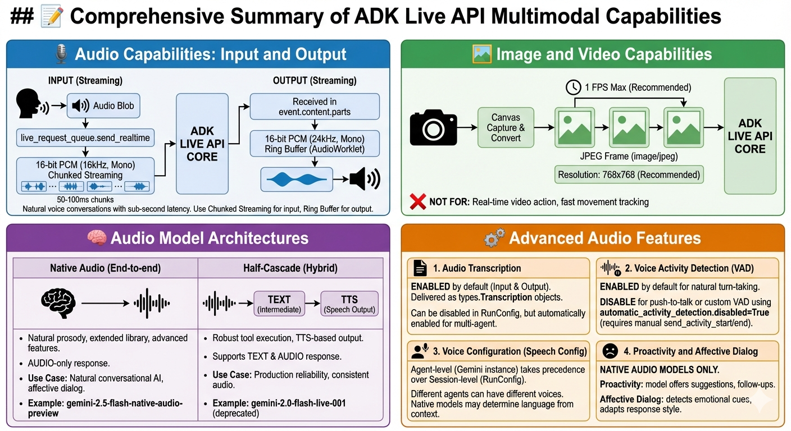

### Understand Audio Format

The Live API has specific requirements for audio input and output:

**Input Audio (microphone → model):**

| Property | Value |
|----------|-------|
| Format | 16-bit signed PCM |
| Sample rate | 16 kHz |
| Channels | Mono |
| MIME type | `audio/pcm;rate=16000` |
| Chunk size | 50-100ms recommended (1,600-3,200 bytes) |

**Output Audio (model → speakers):**

| Property | Value |
|----------|-------|
| Format | 16-bit signed PCM |
| Sample rate | 24 kHz |
| Channels | Mono |
| Delivery | Streamed as `inline_data` in events |

The frontend's AudioWorklet handles format conversion automatically. The browser captures at 16kHz for input, and the player expects 24kHz for output.

### send_content() vs send_realtime()

```python
# Text: triggers immediate model response
live_request_queue.send_content(content)

# Audio: streams continuously, model uses VAD to detect turn end
live_request_queue.send_realtime(audio_blob)
```

**[VAD (Voice Activity Detection)](https://ai.google.dev/gemini-api/docs/live-guide#voice-activity-detection-vad)**: The Live API automatically detects when you stop speaking and triggers a response—no manual "end of turn" signal needed.

### Understanding the Client Code: Audio Capture with AudioWorklet

The frontend captures microphone audio using the [Web Audio API](https://developer.mozilla.org/en-US/docs/Web/API/Web_Audio_API) with AudioWorklet for low-latency processing:

**Setting up the audio pipeline (audio-recorder.js:7-38):**

```javascript
// audio-recorder.js:7-38 - Start audio recording
export async function startAudioRecorderWorklet(audioRecorderHandler) {
    // Create AudioContext at 16kHz (required by Live API)
    const audioRecorderContext = new AudioContext({ sampleRate: 16000 });

    // Load the AudioWorklet processor
    const workletURL = new URL("./pcm-recorder-processor.js", import.meta.url);
    await audioRecorderContext.audioWorklet.addModule(workletURL);

    // Request microphone access (mono audio)
    const micStream = await navigator.mediaDevices.getUserMedia({
        audio: { channelCount: 1 }
    });
    const source = audioRecorderContext.createMediaStreamSource(micStream);

    // Create and connect the processor node
    const audioRecorderNode = new AudioWorkletNode(
        audioRecorderContext,
        "pcm-recorder-processor"
    );
    source.connect(audioRecorderNode);

    // Handle audio data from the worklet
    audioRecorderNode.port.onmessage = (event) => {
        const pcmData = convertFloat32ToPCM(event.data);
        audioRecorderHandler(pcmData);  // Send to WebSocket
    };

    return [audioRecorderNode, audioRecorderContext, micStream];
}

// audio-recorder.js:49-58 - Convert Float32 samples to 16-bit PCM
function convertFloat32ToPCM(inputData) {
    const pcm16 = new Int16Array(inputData.length);
    for (let i = 0; i < inputData.length; i++) {
        pcm16[i] = inputData[i] * 0x7fff;  // Scale [-1,1] to [-32768,32767]
    }
    return pcm16.buffer;
}
```

**The AudioWorklet processor (pcm-recorder-processor.js:1-18):**

```javascript
// pcm-recorder-processor.js:1-18
class PCMProcessor extends AudioWorkletProcessor {
    process(inputs, outputs, parameters) {
        if (inputs.length > 0 && inputs[0].length > 0) {
            const inputChannel = inputs[0][0];
            const inputCopy = new Float32Array(inputChannel);
            this.port.postMessage(inputCopy);  // Send to main thread
        }
        return true;  // Keep processor alive
    }
}

registerProcessor("pcm-recorder-processor", PCMProcessor);
```

**Sending audio chunks (app.js:979-988):**

```javascript
// app.js:979-988
function audioRecorderHandler(pcmData) {
    if (websocket && websocket.readyState === WebSocket.OPEN && is_audio) {
        websocket.send(pcmData);  // Send as binary WebSocket frame
    }
}
```

**Audio pipeline flow:**

```
Microphone → MediaStream → AudioContext (16kHz resample)
    → AudioWorkletNode → PCMProcessor (audio thread)
    → postMessage → Main thread → Float32 to Int16
    → WebSocket binary frame → Server → send_realtime()
```

**Key concepts:**

| Component | Purpose |
|-----------|---------|
| `AudioContext({ sampleRate: 16000 })` | Resample to Live API's required 16kHz |
| `AudioWorklet` | Process audio on separate thread (no glitches) |
| `Float32 → Int16` | Convert Web Audio format to PCM |
| Binary WebSocket frame | More efficient than base64 encoding |

### Understanding the Server Code: Audio Response Events

Since we configured `response_modalities=["AUDIO"]`, the model returns audio in events:

```python
# Audio arrives as inline_data in content parts
if event.content and event.content.parts:
    for part in event.content.parts:
        if part.inline_data:
            # Base64-encoded 24kHz PCM audio
            mime_type = part.inline_data.mime_type  # "audio/pcm;rate=24000"
            audio_data = part.inline_data.data       # Base64 string
```

The frontend's audio player worklet handles:
1. Base64 decoding
2. Ring buffer for smooth playback
3. 24kHz PCM to speaker output

### Understanding the Client Code: Audio Playback with Ring Buffer

The frontend plays audio using an AudioWorklet with a ring buffer for smooth, glitch-free playback:

**Setting up the audio player (audio-player.js:5-24):**

```javascript
// audio-player.js:5-24 - Start audio playback
export async function startAudioPlayerWorklet() {
    // Create AudioContext at 24kHz (Live API output format)
    const audioContext = new AudioContext({ sampleRate: 24000 });

    // Load the AudioWorklet processor
    const workletURL = new URL('./pcm-player-processor.js', import.meta.url);
    await audioContext.audioWorklet.addModule(workletURL);

    // Create and connect the player node to speakers
    const audioPlayerNode = new AudioWorkletNode(audioContext, 'pcm-player-processor');
    audioPlayerNode.connect(audioContext.destination);

    return [audioPlayerNode, audioContext];
}
```

**The ring buffer player (pcm-player-processor.js:5-75):**

```javascript
// pcm-player-processor.js:5-75
class PCMPlayerProcessor extends AudioWorkletProcessor {
    constructor() {
        super();

        // Ring buffer: 24kHz × 180 seconds capacity
        this.bufferSize = 24000 * 180;
        this.buffer = new Float32Array(this.bufferSize);
        this.writeIndex = 0;
        this.readIndex = 0;

        this.port.onmessage = (event) => {
            // Handle interruption - clear buffer immediately
            if (event.data.command === 'endOfAudio') {
                this.readIndex = this.writeIndex;  // Empty the buffer
                return;
            }

            // Add audio samples to ring buffer
            const int16Samples = new Int16Array(event.data);
            this._enqueue(int16Samples);
        };
    }

    _enqueue(int16Samples) {
        for (let i = 0; i < int16Samples.length; i++) {
            // Convert Int16 to Float32 [-1, 1]
            const floatVal = int16Samples[i] / 32768;
            this.buffer[this.writeIndex] = floatVal;
            this.writeIndex = (this.writeIndex + 1) % this.bufferSize;
        }
    }

    process(inputs, outputs, parameters) {
        const output = outputs[0];

        for (let frame = 0; frame < output[0].length; frame++) {
            output[0][frame] = this.buffer[this.readIndex];  // Left channel
            if (output.length > 1) {
                output[1][frame] = this.buffer[this.readIndex];  // Right (mono→stereo)
            }

            if (this.readIndex !== this.writeIndex) {
                this.readIndex = (this.readIndex + 1) % this.bufferSize;
            }
        }
        return true;
    }
}

registerProcessor('pcm-player-processor', PCMPlayerProcessor);
```

**Receiving and playing audio (app.js:341-693, excerpt):**

```javascript
// app.js:341-693 - In websocket.onmessage handler (excerpt)
if (adkEvent.content && adkEvent.content.parts) {
    for (const part of adkEvent.content.parts) {
        if (part.inlineData && part.inlineData.mimeType.startsWith("audio/pcm")) {
            // Decode base64 audio and send to player
            const audioData = base64ToArrayBuffer(part.inlineData.data);
            audioPlayerNode.port.postMessage(audioData);
        }
    }
}

function base64ToArrayBuffer(base64) {
    const binaryString = atob(base64);
    const bytes = new Uint8Array(binaryString.length);
    for (let i = 0; i < binaryString.length; i++) {
        bytes[i] = binaryString.charCodeAt(i);
    }
    return bytes.buffer;
}
```

**Why a ring buffer?**

```
Without ring buffer:
  Network jitter → Audio gaps → Choppy playback

With ring buffer:
  Network jitter → Buffer absorbs → Smooth playback

Ring buffer visualization:
     writeIndex (network writes here)
         ↓
[ ][█][█][█][█][ ][ ][ ]
            ↑
        readIndex (speaker reads here)
```

The buffer absorbs timing variations between network arrival and audio playback, ensuring smooth output even with irregular packet delivery.

### Step 7 Checkpoint

> **What you built**: You added bidirectional audio streaming! The upstream task now handles binary WebSocket frames containing PCM audio, sending them via `send_realtime()`. The model responds with audio that plays through the browser's AudioWorklet.

---

## Step 8: Add Image Input (10 min)

Let's add camera/image support for multimodal AI.

### Run the Server

Stop the server with **Ctrl+C**, then copy the step 8 source file and restart:

```bash
cp step8_main.py main.py
```

Restart the server:

```bash
python -m uvicorn main:app --host 0.0.0.0 --port 8080
```

Test image input:

1. Click the camera button
2. Allow camera access
3. Capture an image
4. Ask "What do you see in this image?"

Open `main.py` in the editor to examine the new code. Key additions:

- **Image message handling**: Detects `{"type": "image", ...}` JSON messages
- **Base64 decoding**: `base64.b64decode()` converts image data
- **types.Blob for images**: Creates blob with `image/jpeg` MIME type
- **send_realtime() for images**: Sends image same as audio

### Understand Image Format

| Property | Recommendation |
|----------|----------------|
| Format | JPEG or PNG |
| Resolution | 768x768 recommended |
| Frame rate | 1 FPS max for video |

Images are sent the same way as audio—via `send_realtime()`. The model processes them alongside text and audio for multimodal understanding.

### Understanding the Client Code: Camera Capture and Image Sending

The frontend captures images from the camera using Canvas API and sends them as base64-encoded JSON:

**Opening camera preview (app.js:803-830):**

```javascript
// app.js:803-830 - Open camera and start preview
async function openCameraPreview() {
    // Request camera access
    cameraStream = await navigator.mediaDevices.getUserMedia({
        video: {
            width: { ideal: 768 },
            height: { ideal: 768 },
            facingMode: 'user'  // Front camera on mobile
        }
    });

    // Display live preview
    cameraPreview.srcObject = cameraStream;
    cameraModal.classList.add('show');
}
```

**Capturing and sending an image (app.js:848-904, 906-917):**

```javascript
// app.js:848-904 - Capture image from preview
function captureImageFromPreview() {
    // Create canvas matching video dimensions
    const canvas = document.createElement('canvas');
    canvas.width = cameraPreview.videoWidth;
    canvas.height = cameraPreview.videoHeight;
    const context = canvas.getContext('2d');

    // Draw current video frame to canvas
    context.drawImage(cameraPreview, 0, 0, canvas.width, canvas.height);

    // Convert to JPEG blob, then to base64
    canvas.toBlob((blob) => {
        const reader = new FileReader();
        reader.onloadend = () => {
            // Remove "data:image/jpeg;base64," prefix
            const base64data = reader.result.split(',')[1];
            sendImage(base64data);
        };
        reader.readAsDataURL(blob);
    }, 'image/jpeg', 0.85);  // 85% quality

    closeCameraPreview();
}

// app.js:906-917 - Send image to server
function sendImage(base64Image) {
    if (websocket && websocket.readyState === WebSocket.OPEN) {
        const jsonMessage = JSON.stringify({
            type: "image",
            data: base64Image,
            mimeType: "image/jpeg"
        });
        websocket.send(jsonMessage);
    }
}
```

**Image capture flow:**

```
Camera → MediaStream → <video> element (preview)
    → User clicks "Capture"
    → Canvas.drawImage() (screenshot)
    → canvas.toBlob() (JPEG 85%)
    → FileReader → base64 encoding
    → JSON message → WebSocket text frame
    → Server → base64.b64decode() → types.Blob
    → live_request_queue.send_realtime()
```

**Why base64 for images (not binary)?**

| Approach | Pros | Cons |
|----------|------|------|
| Binary frame | Smaller (no encoding overhead) | Can't include metadata |
| Base64 JSON | Includes mimeType, type field | 33% larger |

For images sent infrequently (on user action), base64 overhead is acceptable. The JSON wrapper lets the server distinguish image messages from text messages using the `type` field.

**Message comparison:**

```javascript
// Text message
{"type": "text", "text": "Hello"}

// Image message
{"type": "image", "data": "/9j/4AAQ...", "mimeType": "image/jpeg"}

// Audio - binary frame (no JSON wrapper)
[raw PCM bytes]
```

### Step 8 Checkpoint

> **What you built**: You completed the full multimodal application! The server now handles text, audio, and image input through the same `LiveRequestQueue` interface. The model can see, hear, and respond with natural speech.

---

## Wrap-up & Key Takeaways

### What You Built

You built a complete bidirectional streaming AI application from scratch:

| Component | What It Does |
|-----------|--------------|
| Agent | Defines AI personality and tools |
| SessionService | Stores conversation history |
| Runner | Orchestrates streaming lifecycle |
| LiveRequestQueue | Sends input to model |
| run_live() | Receives streaming events |

### The 4-Phase Lifecycle

```
Phase 1: Application Init  →  Agent, SessionService, Runner (once)
Phase 2: Session Init      →  RunConfig, Session, LiveRequestQueue (per connection)
Phase 3: Bidi-streaming    →  upstream_task + downstream_task (concurrent)
Phase 4: Termination       →  close() the queue (always in finally)
```

### Key Code Patterns

```python
# Upstream: Send text
content = types.Content(parts=[types.Part(text="Hello")])
live_request_queue.send_content(content)

# Upstream: Send audio/images
blob = types.Blob(mime_type="audio/pcm;rate=16000", data=audio_bytes)
live_request_queue.send_realtime(blob)

# Downstream: Receive events
async for event in runner.run_live(...):
    await websocket.send_text(event.model_dump_json())

# Always close!
finally:
    live_request_queue.close()
```

### Resources

| Resource | URL |
|----------|-----|
| ADK Documentation | https://google.github.io/adk-docs/ |
| ADK Bidi-streaming Guide | https://google.github.io/adk-docs/streaming/dev-guide/ |
| Gemini Live API | https://ai.google.dev/gemini-api/docs/live |
| Vertex AI Live API | https://cloud.google.com/vertex-ai/generative-ai/docs/live-api |
| ADK Samples Repository | https://github.com/google/adk-samples |

### Next Steps

1. **Read the full guide**: https://google.github.io/adk-docs/streaming/dev-guide/
2. **Explore multi-agent**: Create agents that hand off conversations
3. **Deploy to [Cloud Run](https://cloud.google.com/run)**: Scale your streaming app
4. **Add session resumption**: Handle disconnections gracefully
5. **Add custom tools**: Build tools that integrate with your backend services

---

## Appendix: Troubleshooting

### Common Issues and Solutions

| Issue | Possible Cause | Solution |
|-------|---------------|----------|
| Microphone not working | Browser permissions | Check site permissions, ensure HTTPS or localhost |
| No audio response | Wrong model or modality | Verify native audio model, check `response_modalities=["AUDIO"]` |
| API key errors | Missing or invalid key | Check `.env` file, verify credentials are set correctly |
| WebSocket disconnects | Session timeout or error | Check server logs, implement reconnection logic |
| Slow responses | Network latency | Check connection, consider closer region |
| "Model not found" | Invalid model name | Check model name spelling, verify availability |

### Debugging Tips

**Enable Debug Logging:**

```python
import logging
logging.basicConfig(level=logging.DEBUG)
```

**Check Server Logs:**

Look for events in the terminal:

```
[UPSTREAM] User text: Hello
[DOWNSTREAM] Event: {"content": {"parts": [{"text": "Hi there!"}]}}
```

**Verify WebSocket Connection:**

Open browser DevTools → Network → WS tab to see WebSocket frames.

**Verify Audio Format:**

Ensure audio is 16kHz mono PCM for input and expect 24kHz mono PCM for output.

### Environment Variables Reference

```bash
# For Vertex AI (recommended for Cloud Shell)
GOOGLE_CLOUD_PROJECT=your_project_id
GOOGLE_CLOUD_LOCATION=us-central1
GOOGLE_GENAI_USE_VERTEXAI=TRUE

# For Google AI Studio (alternative)
# Get your API key at https://aistudio.google.com/
GOOGLE_API_KEY=your_google_ai_studio_api_key
```
