# ADK Bidi-streaming Workshop

**Duration:** 1.5 hours (90 minutes)
**Environment:** Google Cloud Shell Editor
**Demo Application:** bidi-demo

---

## Workshop Overview

This hands-on workshop teaches you how to build real-time, bidirectional streaming AI applications using Google's Agent Development Kit (ADK). You will deploy and explore the bidi-demo application on Cloud Shell Editor, learning the core concepts of ADK Bidi-streaming through practical experimentation.


### What is ADK Bidi-streaming?

ADK Bidi-streaming enables real-time, two-way communication between your application and Gemini models through the Live API. Unlike traditional request-response patterns, bidirectional streaming allows:

- **Continuous input streaming**: Send audio, text, and images in real-time without waiting for responses
- **Concurrent output streaming**: Receive model responses, transcriptions, and events while still sending input
- **Natural conversations**: Enable voice-based interactions with sub-second latency
- **Multimodal experiences**: Combine text, audio, images, and video in a single session


The diagram above shows a key feature of Bidi-streaming: **interruption**. The user can interrupt the agent mid-response, and the agent immediately stops and addresses the new input—just like a natural conversation.

### Real-World Use Cases

- Voice assistants and conversational AI
- Real-time translation and transcription
- Interactive customer service agents
- Multimodal AI applications with camera/screen sharing
- Accessibility tools with voice interfaces

### Prerequisites

- Google Cloud account with billing enabled
- Google AI Studio API key (GOOGLE_API_KEY)
- Basic Python knowledge
- Familiarity with async/await concepts
- Web browser with microphone access (Chrome recommended)

### Learning Objectives

By the end of this workshop, you will be able to:

1. Understand ADK's 4-phase streaming lifecycle
2. Set up and run a Bidi-streaming application on Cloud Shell
3. Implement bidirectional communication with LiveRequestQueue
4. Process streaming events from run_live()
5. Configure RunConfig for different modalities
6. Work with audio, image, and video inputs

---

## Section 1: Introduction & Environment Setup (10 min)

### 1.1 Workshop Introduction

Welcome to the ADK Bidi-streaming workshop! In this session, you'll learn how to build real-time streaming AI applications that can handle voice conversations, process images, and respond with natural speech.

The demo application you'll work with is a fully functional voice assistant that demonstrates:

- Text and voice input
- Audio responses with transcription
- Image capture and analysis
- Google Search integration

### 1.2 Cloud Shell Editor Setup

Cloud Shell Editor provides a browser-based development environment with VS Code functionality. No local setup required!

**Step 1: Open Cloud Shell Editor**

Navigate to [ide.cloud.google.com](https://ide.cloud.google.com) in your browser.

Alternatively:
- Go to [shell.cloud.google.com](https://shell.cloud.google.com)
- Click "Open Editor" in the toolbar


**Step 2: Clone the Repository**

Open a terminal in Cloud Shell Editor (Terminal → New Terminal) and run:

```bash
git clone https://github.com/google/adk-samples.git
```


**Step 3: Open the bidi-demo Folder**

In Cloud Shell Editor, open the bidi-demo project folder:

1. Click **File** → **Open Folder** in the menu bar
2. Navigate to `adk-samples/python/agents/bidi-demo`
3. Click **OK**

**Step 4: Configure Environment Variables**

Create a new `.env` file in the `app/` directory:

1. Right-click on the `app` folder in the Explorer panel
2. Select **New File**
3. Name it `.env`
4. Add the following content:

```bash
GOOGLE_API_KEY=your_api_key_here
DEMO_AGENT_MODEL=gemini-2.5-flash-native-audio-preview-12-2025
```

Replace `your_api_key_here` with your actual Google AI Studio API key.

> **Getting an API Key**: Visit [aistudio.google.com](https://aistudio.google.com) → Get API Key (at the bottom left) → Create API key

**Step 5: Install Dependencies**

Open a terminal in Cloud Shell Editor (Terminal → New Terminal) and run:

```bash
pip install -e .
```

This installs the bidi-demo package and all required dependencies including:
- `google-adk` - Agent Development Kit
- `fastapi` - Web framework
- `uvicorn` - ASGI server
- `python-dotenv` - Environment variable management

### 1.3 Understanding the Directory Structure

After cloning, explore the project structure in Cloud Shell Editor:

```
bidi-demo/
├── app/                              # Main application directory
│   ├── main.py                       # FastAPI server with WebSocket endpoint
│   ├── .env                          # Environment variables (API key, model)
│   ├── google_search_agent/          # Agent definition
│   │   └── agent.py                  # Agent configuration (model, tools, instruction)
│   └── static/                       # Frontend assets
│       ├── index.html                # Main HTML page
│       ├── css/
│       │   └── styles.css            # UI styling
│       └── js/
│           ├── app.js                # Main app logic, WebSocket, event handling
│           ├── audio-recorder.js     # Microphone capture (16kHz)
│           ├── audio-player.js       # Audio playback (24kHz)
│           ├── pcm-recorder-processor.js  # AudioWorklet for recording
│           └── pcm-player-processor.js    # AudioWorklet for playback
├── pyproject.toml                    # Python package configuration
└── README.md                         # Project documentation
```

**Key Files to Explore:**

| File | Purpose |
|------|---------|
| `app/main.py` | Server-side: FastAPI app, WebSocket endpoint, upstream/downstream tasks |
| `app/google_search_agent/agent.py` | Agent definition: model, tools, instruction |
| `app/static/js/app.js` | Client-side: WebSocket connection, event handling, UI updates |
| `app/static/js/audio-*.js` | Client-side: Audio capture and playback with Web Audio API |

Take a moment to open these files in the editor. We'll walk through them in detail in Section 4.

### 1.4 Run the Demo

Let's verify your setup by running the demo application.

**Step 1: Start the Server**

In the terminal, navigate to the app directory and start the server:

```bash
cd app
python -m uvicorn main:app --reload --host 0.0.0.0 --port 8080
```

You should see output like:
```
INFO:     Will watch for changes in these directories: ['/home/kazsato/adk-samples/python/agents/bidi-demo/app']
INFO:     Uvicorn running on http://0.0.0.0:8080 (Press CTRL+C to quit)
INFO:     Started reloader process [9896] using WatchFiles
INFO:     Started server process [9898]
INFO:     Waiting for application startup.
INFO:     Application startup complete.
```

**Step 2: Open the Web Preview**

1. In Cloud Shell Editor, click the **Web Preview** button (globe icon) in the toolbar
2. Select **Preview on port 8080**
3. A new browser tab opens with the bidi-demo UI


**Step 3: Test the Connection**

Type a message like "Hello!" in the text input and click **Send**. If everything is configured correctly, you should receive a response from the agent.

> **Tip**: Keep the server running for the rest of the workshop. You can open a new terminal (Terminal → New Terminal) if you need to run other commands.


---

## Section 2: Architecture Overview (15 min)

### 2.1 High-Level Architecture

Before diving into code, you need a mental model of how the pieces connect. ADK Bidi-streaming follows a clean separation of concerns across three layers, each with distinct responsibilities:


**You own the application layer.** This includes the client applications your users interact with (web, mobile, kiosk) and the transport server that manages connections. Most teams use FastAPI with WebSockets, but any framework supporting real-time communication works. You also define your Agent—the instructions, tools, and behaviors that make your AI unique.

**ADK handles the orchestration.** The framework provides three key components that eliminate infrastructure work:

| Component | Purpose |
|-----------|---------|
| **LiveRequestQueue** | Buffers and sequences incoming messages so you don't worry about race conditions |
| **Runner** | Manages session lifecycles and conversation state |
| **LLM Flow** | Handles the complex protocol translation you never want to write yourself |

**Google provides the AI backbone.** The Live API—available through Gemini Live API for rapid prototyping or Vertex AI Live API for enterprise production—delivers real-time, low-latency AI processing with built-in support for audio, video, and natural interruptions.

> **Why this matters:** The bidirectional arrows in the diagram aren't just decoration—they represent true concurrent communication. Users can interrupt the AI mid-sentence, just like in human conversation. This is fundamentally different from request-response APIs, and it's what makes voice AI feel natural rather than robotic.

The key insight is that ADK abstracts away the complexity of managing WebSocket connections to the Live API. Your application only needs to:

1. **Send input** through `LiveRequestQueue` (upstream)
2. **Process events** from `run_live()` (downstream)

ADK handles everything in between: connection management, message serialization, tool execution, and session state.

### 2.2 Why ADK Over Raw Live API?

Now that you understand where the pieces fit, the natural question is: why use ADK instead of building directly on the Live API? After all, the underlying Gemini API is well-documented.

The answer becomes viscerally clear when you compare the two approaches side-by-side.


With the raw Live API, you're responsible for everything. Tool execution? You detect function calls, invoke your code, format responses, and send them back—manually coordinating with ongoing audio streams. Connection drops? You implement reconnection logic, cache session handles, and restore state. Session persistence? You design the schema, handle serialization, and manage the storage layer.

**ADK transforms all of this into declarative configuration.** Tools execute automatically in parallel. Connections resume transparently when WebSocket timeouts occur. Sessions persist to your choice of database with zero custom code. Events arrive as typed Pydantic models you can serialize with a single method call.

| Capability | Raw Live API | ADK Bidi-streaming |
|------------|--------------|-------------------|
| Agent Framework | Build from scratch | Single/multi-agent with tools, evaluation, security |
| Tool Execution | Manual handling | Automatic parallel execution |
| Connection Management | Manual reconnection | Transparent session resumption |
| Event Model | Custom structures | Unified, typed Event objects |
| Async Framework | Manual coordination | LiveRequestQueue + run_live() generator |
| Session Persistence | Manual implementation | Built-in SQL, Vertex AI, or in-memory |

> **The bottom line:** ADK reduces months of infrastructure development to days of application development. You focus on what your agent does, not how streaming works.

### 2.3 The 4-Phase Lifecycle

Every ADK Bidi-streaming application follows a predictable four-phase lifecycle. Understanding these phases isn't just organizational—it's the key to resource efficiency and clean code architecture.


#### Phase 1: Application Initialization (Once at Startup)

When your server starts, you create three foundational components that live for the lifetime of the process. These components are stateless and thread-safe—a single Runner can handle thousands of concurrent users because the per-user state lives elsewhere.

| Component | Purpose |
|-----------|---------|
| **Agent** | Defines the model, tools, and instructions |
| **SessionService** | Manages conversation state and history |
| **Runner** | Orchestrates agent execution |

```python
from google.adk.agents import Agent
from google.adk.runners import Runner
from google.adk.sessions import InMemorySessionService

# Create once at startup
agent = Agent(
    name="my_agent",
    model="gemini-2.5-flash-native-audio-preview-12-2025",
    instruction="You are a helpful assistant.",
    tools=[google_search]
)

session_service = InMemorySessionService()
runner = Runner(app_name="my-app", agent=agent, session_service=session_service)
```

#### Phase 2: Session Initialization (Per User Connection)

When a user connects (e.g., via WebSocket), you initialize their streaming session:

| Component | Purpose |
|-----------|---------|
| **Session** | User's conversation context |
| **RunConfig** | Streaming configuration (modalities, features) |
| **LiveRequestQueue** | Channel for sending input to the model |

```python
# Create per connection
run_config = RunConfig(
    streaming_mode=StreamingMode.BIDI,
    response_modalities=["AUDIO"]
)

live_request_queue = LiveRequestQueue()
```

#### Phase 3: Bidi-streaming (Active Session)

This is where the magic happens. Two concurrent async tasks run simultaneously:

```
┌─────────┐     WebSocket      ┌─────────┐   LiveRequestQueue   ┌──────────┐
│  Client │ ─────────────────> │  Server │ ───────────────────> │ Live API │
│         │                    │         │                      │          │
│         │ <───────────────── │         │ <─────────────────── │          │
└─────────┘     WebSocket      └─────────┘      run_live()      └──────────┘
                                    │
                         ┌──────────┴──────────┐
                         │                     │
                   upstream_task()       downstream_task()
                   (receives input)      (sends events)
```

**Upstream Task**: Sends messages from your WebSocket through the queue to the agent
**Downstream Task**: Receives events from the agent and forwards them to your client

The user can speak while the AI is responding. The AI can be interrupted mid-sentence. It's true two-way communication, not alternating monologues. Both tasks run concurrently using `asyncio.gather()`.

#### Phase 4: Termination (Session End)

When the connection ends—whether the user disconnects, a timeout occurs, or an error happens—you close the LiveRequestQueue. This sends a graceful termination signal, stops the run_live() loop, and ensures session state is persisted for future resumption.

```python
finally:
    # Always close the queue to terminate the Live API session
    live_request_queue.close()
```

> **Critical**: Always close `LiveRequestQueue` in a `finally` block to ensure proper cleanup, even if exceptions occur.

> **Session Continuity**: The arrow from Phase 4 back to Phase 2 represents session continuity. When a user reconnects—even days later—their conversation history is restored from the SessionService. The Live API session is ephemeral, but the ADK Session is permanent (when using persistent storage like SQL or Vertex AI).

### 2.4 Core Components Deep Dive

#### Agent

The Agent defines your AI assistant's personality and capabilities:

```python
from google.adk.agents import Agent
from google.adk.tools import google_search

agent = Agent(
    name="search_agent",
    model="gemini-2.5-flash-native-audio-preview-12-2025",
    instruction="""You are a helpful assistant with access to Google Search.
    When users ask questions, search for current information when needed.""",
    tools=[google_search]
)
```

#### LiveRequestQueue

The path from your application to the AI flows through a single interface: LiveRequestQueue. Instead of juggling different APIs for text, audio, and control signals, you use one elegant queue that handles everything.


**Sending text** is straightforward. When a user types a message, you wrap it in a Content object and call `send_content()`. This signals a complete turn to the model, triggering immediate response generation.

**Streaming audio** works differently. You call `send_realtime()` with small chunks (50-100ms recommended) continuously as the user speaks. The model processes audio in real-time, using Voice Activity Detection to determine when the user has finished.

**Manual turn control** is available when you need it. If you're building a push-to-talk interface or using client-side VAD, `send_activity_start()` and `send_activity_end()` explicitly signal speech boundaries.

**Graceful shutdown** happens through `close()`. This tells the Live API to terminate cleanly rather than waiting for a timeout.

The queue is built on Python's asyncio.Queue, which means it's non-blocking and thread-safe within the event loop. Messages are processed in FIFO order—what you send first arrives first.

> **Pro tip:** Don't wait for model responses before sending the next audio chunk. The queue handles buffering, and the model expects continuous streaming. Waiting creates awkward pauses in conversation.

It provides four key methods:


| Method | Use Case | Example |
|--------|----------|---------|
| `send_content(content)` | Text messages (turn-based) | User typed a message |
| `send_realtime(blob)` | Audio/image/video (streaming) | Microphone audio chunk |
| `close()` | End the session | User disconnected |

```python
# Send text
content = types.Content(parts=[types.Part(text="Hello!")])
live_request_queue.send_content(content)

# Send audio
audio_blob = types.Blob(mime_type="audio/pcm;rate=16000", data=audio_bytes)
live_request_queue.send_realtime(audio_blob)

# Send image
image_blob = types.Blob(mime_type="image/jpeg", data=image_bytes)
live_request_queue.send_realtime(image_blob)

# Close session
live_request_queue.close()
```

#### run_live()

The return path—from the AI back to your application—centers on `run_live()`. This async generator is the heart of ADK streaming, yielding events in real-time without buffering.


You call it with three inputs: **identity** (user_id and session_id), **channel** (the LiveRequestQueue for upstream messages), and **configuration** (RunConfig for streaming behavior). The method returns an async generator that yields Event objects as they arrive.

```python
async for event in runner.run_live(
    user_id=user_id,
    session_id=session_id,
    live_request_queue=live_request_queue,
    run_config=run_config
):
    # Process each event as it arrives
    await websocket.send_text(event.model_dump_json())
```

**The Seven Event Types:**

| Event Type | Field | Description |
|------------|-------|-------------|
| Text | `event.content.parts[0].text` | Model's written response (arrives incrementally with `partial=True`) |
| Audio (inline) | `event.content.parts[0].inline_data` | Real-time audio for immediate playback (not persisted) |
| Audio (file) | `event.content.parts[0].file_data` | References stored artifacts when `save_live_blob` is enabled |
| Input Transcription | `event.input_transcription` | User speech converted to text |
| Output Transcription | `event.output_transcription` | Model speech converted to text |
| Metadata | `event.usage_metadata` | Token usage for cost monitoring |
| Tool Calls | `event.actions` | Function execution (ADK handles automatically) |
| Errors | `event.error` | Error code and message |

> **Inline vs File Audio:** Audio events come in two forms. Inline audio (`inline_data`) streams in real-time for immediate playback but is never saved. File audio (`file_data`) references stored artifacts when you enable persistence with `save_live_blob=True` in RunConfig—useful for debugging, compliance, or training data collection.

**The Three Flow Control Flags:**

- **`partial`**: Whether you're seeing an incremental chunk or complete text
- **`interrupted`**: User started speaking while model was responding—stop playback immediately
- **`turn_complete`**: Model finished its response—re-enable microphone, hide indicators

> **Why `interrupted` matters:** This flag is what makes voice AI feel natural. Without it, users must wait silently for the AI to finish speaking. With it, conversation flows like it does between humans.

#### RunConfig

RunConfig is your control center for streaming behavior. Every aspect of a session—from audio format to cost limits—is configured here.


**Essential Parameters:**

| Parameter | Purpose |
|-----------|---------|
| `response_modalities` | `["TEXT"]` for chat, `["AUDIO"]` for voice (choose one per session) |
| `streaming_mode` | `BIDI` for WebSocket streaming, `SSE` for HTTP streaming |
| `session_resumption` | Enable automatic reconnection after WebSocket timeouts (~10 min) |
| `context_window_compression` | Remove session duration limits (15 min audio, 2 min video) and manage token limits |

**Production Controls:**

| Parameter | Purpose |
|-----------|---------|
| `max_llm_calls` | Cap invocations per session for cost control (SSE mode only) |
| `save_live_blob` | Persist audio/video for debugging, compliance, or training |
| `custom_metadata` | Attach key-value data for user segmentation or A/B testing |

**Understanding Session Types:**

One concept trips up many developers: ADK Session vs Live API session.

- **ADK Session**: Persistent, lives in SessionService, survives restarts. User returns days later with history intact.
- **Live API session**: Ephemeral, exists only during active `run_live()`. When loop ends, it's destroyed—but ADK persisted events.

> **Quota planning:** Gemini Live API allows 50-1,000 concurrent sessions depending on tier. Vertex AI supports up to 1,000 per project.

```python
from google.adk.agents.run_config import RunConfig, StreamingMode
from google.genai import types

run_config = RunConfig(
    # Required for bidirectional streaming
    streaming_mode=StreamingMode.BIDI,

    # Response type: ["AUDIO"], ["TEXT"], or ["AUDIO", "TEXT"]
    response_modalities=["AUDIO"],

    # Enable transcription
    input_audio_transcription=types.AudioTranscriptionConfig(),
    output_audio_transcription=types.AudioTranscriptionConfig(),

    # Session management
    session_resumption=types.SessionResumptionConfig(),

    # Advanced features (native audio models only)
    proactivity=types.ProactivityConfig(proactive_audio=True),
    enable_affective_dialog=True
)
```

### 2.5 Client-Side: WebSocket Connection

While the server handles ADK communication, the client manages the WebSocket connection and user interface. Here's how the client connects:

**JavaScript (app.js):**

```javascript
// Generate unique session ID for this browser session
const userId = "demo-user";
const sessionId = "demo-session-" + Math.random().toString(36).substring(7);
let websocket = null;

// Build WebSocket URL with optional RunConfig parameters
function getWebSocketUrl() {
    const baseUrl = "ws://" + window.location.host + "/ws/" + userId + "/" + sessionId;
    const params = new URLSearchParams();

    // Add optional features as query parameters
    if (enableProactivityCheckbox.checked) {
        params.append("proactivity", "true");
    }
    if (enableAffectiveDialogCheckbox.checked) {
        params.append("affective_dialog", "true");
    }

    const queryString = params.toString();
    return queryString ? baseUrl + "?" + queryString : baseUrl;
}

// Connect to the WebSocket server
function connectWebsocket() {
    const ws_url = getWebSocketUrl();
    websocket = new WebSocket(ws_url);

    websocket.onopen = function() {
        console.log("WebSocket connection opened.");
        updateConnectionStatus(true);
    };

    websocket.onmessage = function(event) {
        // Parse ADK events from the server
        const adkEvent = JSON.parse(event.data);
        handleAdkEvent(adkEvent);
    };

    websocket.onclose = function() {
        console.log("WebSocket connection closed.");
        updateConnectionStatus(false);
        // Auto-reconnect after 5 seconds
        setTimeout(connectWebsocket, 5000);
    };
}

// Start connection when page loads
connectWebsocket();
```

**Key Points:**

1. **Dynamic URL**: Session ID is generated per browser tab for isolation
2. **Query parameters**: RunConfig options passed as URL query parameters
3. **Auto-reconnect**: Client automatically reconnects on disconnection
4. **Event handling**: All ADK events parsed from JSON and processed

### 2.6 Multimodal Capabilities

ADK Bidi-streaming isn't limited to text—it's a full multimodal platform supporting audio, images, and video. Understanding the specifications helps you build robust applications.


#### Audio: The Core Modality

| Direction | Format | Sample Rate | Channels | Chunk Size |
|-----------|--------|-------------|----------|------------|
| **Input** (your voice) | 16-bit PCM | 16 kHz | Mono | 50-100ms (1,600-3,200 bytes) |
| **Output** (model voice) | 16-bit PCM | 24 kHz | Mono | Use ring buffer for smooth playback |

The browser's AudioWorklet captures microphone input, converts Float32 samples to Int16, and streams via WebSocket. For playback, use a ring buffer in your AudioWorklet player to absorb network jitter.

#### Image and Video

Both images and video use the same mechanism—JPEG frames sent via `send_realtime()`:

| Property | Specification |
|----------|---------------|
| Format | JPEG |
| Resolution | 768×768 recommended |
| Frame rate | 1 FPS maximum |

This works well for visual context (showing a product, sharing a document) but isn't suitable for real-time action recognition.

#### Model Architectures

Two fundamentally different architectures power voice AI:

**Native Audio Models** process audio end-to-end without text intermediates:

| Feature | Support |
|---------|---------|
| Natural prosody | Yes - more human-like speech |
| Response modality | AUDIO only |
| Proactive audio | Yes |
| Affective dialog | Yes (emotional adaptation) |
| Voices | Extended library (30+) |

**Model**: `gemini-2.5-flash-native-audio-preview-12-2025`

**Half-Cascade Models** convert audio to text, process it, then synthesize speech:

| Feature | Support |
|---------|---------|
| Response modality | TEXT and AUDIO |
| Faster text responses | Yes |
| Proactive audio | No |
| Affective dialog | No |
| Voices | 8 prebuilt voices |

**Model**: `gemini-2.0-flash-live-001` (deprecated December 2025)

#### Advanced Features

- **Audio transcription**: Enabled by default. Both user speech and model speech are transcribed.
- **Voice Activity Detection**: Automatically detects when users start and stop speaking. No manual signaling needed.
- **Voice configuration**: Select from available voices per-agent or globally in RunConfig.

> **Choosing the right model:** For natural conversation with emotional awareness, use native audio. For applications prioritizing tool execution reliability or needing text output, use half-cascade until you've tested thoroughly with native audio.

### 2.7 Real-World Example: Voice Search

Let's trace a complete interaction to see how these pieces work together. A user asks: *"What's the weather in Tokyo?"*


**Step-by-step breakdown:**

1. **Audio Capture → Queue**: The browser captures microphone input at 16kHz, converts to PCM chunks, and sends via WebSocket. Your server receives the binary frames and calls `live_request_queue.send_realtime(audio_blob)`.

2. **VAD Detection**: The Live API's Voice Activity Detection notices the user stopped speaking. It triggers processing of the accumulated audio.

3. **Transcription Event**: You receive an event with `input_transcription.text = "What's the weather in Tokyo?"`. Display this in the chat UI so users see their words recognized.

4. **Tool Execution**: The model decides to call the `google_search` tool. You receive a tool call event, ADK executes the search automatically, and a tool response event follows with the weather data.

5. **Audio Response**: The model generates a spoken response. Audio chunks arrive as events with `inline_data`. Your client feeds them to an AudioWorklet for real-time playback: *"The weather in Tokyo is currently 22 degrees and sunny."*

6. **Turn Complete**: Finally, an event arrives with `turn_complete=True`. The UI can remove the "..." indicator to show the agent finished talking.

> **This entire flow takes under two seconds.** The user experiences it as natural conversation, unaware of the LiveRequestQueue, Event types, and session management happening beneath the surface.

---

## Section 3: Running the Demo (20 min)

### 3.1 Start the Server

Navigate to the app directory and start the FastAPI server:

```bash
cd app
python -m uvicorn main:app --reload --host 0.0.0.0 --port 8080
```

You should see output like:
```
INFO:     Started server process
INFO:     Waiting for application startup.
INFO:     Application startup complete.
INFO:     Uvicorn running on http://0.0.0.0:8080
```

**Open the Web Preview:**

1. In Cloud Shell Editor, click the "Web Preview" button (globe icon) in the toolbar
2. Select "Preview on port 8080"
3. A new browser tab opens with the bidi-demo UI

### 3.2 Text Interaction

Let's start with basic text interaction:

1. **Type a message** in the text input field
2. Click "Send" or press Enter
3. Observe the streaming response appearing word-by-word

**Try these prompts:**

- "Hello, who are you?"
- "What's the weather like in Tokyo today?" (uses Google Search)
- "Tell me a short joke"

**What's happening behind the scenes:**

```
You type: "What's the weather in Tokyo?"
    ↓
WebSocket sends JSON: {"type": "text", "text": "What's the weather in Tokyo?"}
    ↓
Server: live_request_queue.send_content(content)
    ↓
Model processes and calls Google Search tool
    ↓
Server receives events from run_live()
    ↓
WebSocket streams events to browser
    ↓
UI displays streaming response
```

### 3.3 Audio Interaction

Now let's try voice interaction:

1. **Click the microphone button** to enable audio mode
2. **Allow microphone access** when prompted
3. **Speak to the agent** naturally
4. Observe:
   - Your speech appears as transcription (input_transcription)
   - The agent responds with voice (audio content)
   - Agent's speech appears as transcription (output_transcription)

**Try these voice prompts:**

- "Hello, can you hear me?"
- "Search for the latest news about AI"
- "What time is it in New York?"

**Understanding Audio Flow:**


**Audio Specifications:**

| Direction | Format | Sample Rate | Channels |
|-----------|--------|-------------|----------|
| Input (your voice) | 16-bit PCM | 16 kHz | Mono |
| Output (model voice) | 16-bit PCM | 24 kHz | Mono |

### 3.4 Image/Camera Input

The demo supports image input through the camera:

1. **Click the camera button** to open camera preview
2. **Allow camera access** when prompted
3. **Position your subject** and click "Capture"
4. **Ask about the image**: "What do you see in this image?"

**Try these scenarios:**

- Show a product and ask "What is this?"
- Show text and ask "Can you read this?"
- Show a scene and ask "Describe what you see"

**Image Processing Flow:**

```mermaid
sequenceDiagram
    participant Cam as 📷 Camera
    participant Browser as 🌐 Browser
    participant Server as 🖥️ Server
    participant API as ☁️ Live API

    Cam->>Browser: Video stream
    Browser->>Browser: Capture frame to canvas
    Browser->>Browser: Convert to JPEG (768x768)
    Browser->>Browser: Encode as base64
    Browser->>Server: JSON: {type: "image", data: base64}
    Server->>Server: Decode base64 → bytes
    Server->>API: send_realtime(image_blob)
    API->>API: Analyze image
    API->>Server: Text/audio response
    Server->>Browser: JSON events
```



**Image Specifications:**

| Property | Value |
|----------|-------|
| Format | JPEG |
| Resolution | 768×768 recommended |
| Frame rate | 1 FPS maximum |

---

## Break (10 min)

Take a short break. When you return, we'll dive into the code!

---

## Section 4: Code Walkthrough (20 min)

### 4.1 Application Initialization

Open `app/main.py` in the editor and examine the application initialization:

```python
# Load environment variables BEFORE importing agent
from dotenv import load_dotenv
load_dotenv(Path(__file__).parent / ".env")

# Import agent after loading environment variables
from google_search_agent.agent import agent

# ========================================
# Phase 1: Application Initialization (once at startup)
# ========================================

app = FastAPI()

# Mount static files for the web UI
static_dir = Path(__file__).parent / "static"
app.mount("/static", StaticFiles(directory=static_dir), name="static")

# Session service manages conversation state
session_service = InMemorySessionService()

# Runner orchestrates agent execution
runner = Runner(app_name=APP_NAME, agent=agent, session_service=session_service)
```

**Key Points:**

1. **Environment variables first**: `load_dotenv()` must run before importing the agent, because the agent reads `DEMO_AGENT_MODEL` at import time
2. **Single instances**: SessionService and Runner are created once and shared across all connections
3. **InMemorySessionService**: Stores sessions in memory (use DatabaseSessionService for production)

### 4.2 Session Initialization

Examine the WebSocket endpoint where sessions are initialized:

```python
@app.websocket("/ws/{user_id}/{session_id}")
async def websocket_endpoint(
    websocket: WebSocket,
    user_id: str,
    session_id: str,
    proactivity: bool = False,
    affective_dialog: bool = False,
) -> None:
    await websocket.accept()

    # ========================================
    # Phase 2: Session Initialization
    # ========================================

    # Detect model architecture
    model_name = agent.model
    is_native_audio = "native-audio" in model_name.lower()

    if is_native_audio:
        # Native audio: AUDIO response, full features
        run_config = RunConfig(
            streaming_mode=StreamingMode.BIDI,
            response_modalities=["AUDIO"],
            input_audio_transcription=types.AudioTranscriptionConfig(),
            output_audio_transcription=types.AudioTranscriptionConfig(),
            proactivity=(
                types.ProactivityConfig(proactive_audio=True) if proactivity else None
            ),
            enable_affective_dialog=affective_dialog if affective_dialog else None,
        )
    else:
        # Half-cascade: TEXT response for speed
        run_config = RunConfig(
            streaming_mode=StreamingMode.BIDI,
            response_modalities=["TEXT"],
        )

    # Get or create session
    session = await session_service.get_session(
        app_name=APP_NAME, user_id=user_id, session_id=session_id
    )
    if not session:
        await session_service.create_session(
            app_name=APP_NAME, user_id=user_id, session_id=session_id
        )

    # Create the request queue for this session
    live_request_queue = LiveRequestQueue()
```

**Key Points:**

1. **Model detection**: The code auto-detects native audio vs half-cascade models
2. **RunConfig per session**: Each connection gets its own configuration
3. **Session management**: Supports both new sessions and reconnections
4. **LiveRequestQueue per session**: Each connection needs its own queue

### 4.3 Upstream Task

The upstream task handles all incoming messages from the client:

```python
async def upstream_task() -> None:
    """Receives messages from WebSocket and sends to LiveRequestQueue."""
    while True:
        message = await websocket.receive()

        # Handle binary frames (audio data)
        if "bytes" in message:
            audio_data = message["bytes"]
            audio_blob = types.Blob(
                mime_type="audio/pcm;rate=16000",
                data=audio_data
            )
            live_request_queue.send_realtime(audio_blob)

        # Handle text frames (JSON messages)
        elif "text" in message:
            json_message = json.loads(message["text"])

            # Text message
            if json_message.get("type") == "text":
                content = types.Content(
                    parts=[types.Part(text=json_message["text"])]
                )
                live_request_queue.send_content(content)

            # Image message
            elif json_message.get("type") == "image":
                image_data = base64.b64decode(json_message["data"])
                image_blob = types.Blob(
                    mime_type=json_message.get("mimeType", "image/jpeg"),
                    data=image_data
                )
                live_request_queue.send_realtime(image_blob)
```

**Key Points:**

1. **Binary vs Text frames**: Audio uses efficient binary WebSocket frames; text/images use JSON
2. **send_content() vs send_realtime()**:
   - `send_content()`: For discrete text messages (triggers a turn)
   - `send_realtime()`: For streaming data (audio, images) that flows continuously
3. **MIME types matter**: `audio/pcm;rate=16000` tells the API the audio format

#### Client-Side: Sending Text Messages

The client sends text messages as JSON through the WebSocket:

**JavaScript (app.js):**

```javascript
// Send a text message to the server
function sendMessage(message) {
    if (websocket && websocket.readyState === WebSocket.OPEN) {
        const jsonMessage = JSON.stringify({
            type: "text",
            text: message
        });
        websocket.send(jsonMessage);
    }
}

// Form submission handler
messageForm.onsubmit = function(e) {
    e.preventDefault();
    const message = messageInput.value.trim();
    if (message) {
        // Add user message bubble to UI
        const userBubble = createMessageBubble(message, true);
        messagesDiv.appendChild(userBubble);

        // Clear input and send
        messageInput.value = "";
        sendMessage(message);
    }
};
```

#### Client-Side: Sending Audio

Audio capture uses Web Audio API with AudioWorklet for real-time processing:

**JavaScript (audio-recorder.js):**

```javascript
// Start audio recording worklet
export async function startAudioRecorderWorklet(audioRecorderHandler) {
    // Create AudioContext at 16kHz (required by Live API)
    const audioRecorderContext = new AudioContext({ sampleRate: 16000 });

    // Load the AudioWorklet processor module
    const workletURL = new URL("./pcm-recorder-processor.js", import.meta.url);
    await audioRecorderContext.audioWorklet.addModule(workletURL);

    // Request microphone access (mono audio)
    const micStream = await navigator.mediaDevices.getUserMedia({
        audio: { channelCount: 1 }
    });
    const source = audioRecorderContext.createMediaStreamSource(micStream);

    // Create and connect the AudioWorklet node
    const audioRecorderNode = new AudioWorkletNode(
        audioRecorderContext,
        "pcm-recorder-processor"
    );
    source.connect(audioRecorderNode);

    // Handle audio data from the worklet
    audioRecorderNode.port.onmessage = (event) => {
        // Convert Float32 to 16-bit PCM
        const pcmData = convertFloat32ToPCM(event.data);
        audioRecorderHandler(pcmData);
    };

    return [audioRecorderNode, audioRecorderContext, micStream];
}

// Convert Float32 samples to 16-bit PCM
function convertFloat32ToPCM(inputData) {
    const pcm16 = new Int16Array(inputData.length);
    for (let i = 0; i < inputData.length; i++) {
        // Scale float [-1, 1] to int16 [-32768, 32767]
        pcm16[i] = inputData[i] * 0x7fff;
    }
    return pcm16.buffer;
}
```

**JavaScript (pcm-recorder-processor.js):**

```javascript
// AudioWorklet processor for capturing microphone audio
class PCMProcessor extends AudioWorkletProcessor {
    process(inputs, outputs, parameters) {
        if (inputs.length > 0 && inputs[0].length > 0) {
            // Copy the first channel (mono)
            const inputChannel = inputs[0][0];
            const inputCopy = new Float32Array(inputChannel);
            // Send to main thread
            this.port.postMessage(inputCopy);
        }
        return true; // Keep processor alive
    }
}

registerProcessor("pcm-recorder-processor", PCMProcessor);
```

**JavaScript (app.js) - Sending audio chunks:**

```javascript
// Audio recorder handler - called for each audio chunk
function audioRecorderHandler(pcmData) {
    if (websocket && websocket.readyState === WebSocket.OPEN && is_audio) {
        // Send audio as binary WebSocket frame (more efficient than base64)
        websocket.send(pcmData);
    }
}
```

#### Client-Side: Sending Images

Images are captured from the camera, converted to JPEG, and sent as base64:

**JavaScript (app.js):**

```javascript
// Open camera and start preview
async function openCameraPreview() {
    cameraStream = await navigator.mediaDevices.getUserMedia({
        video: {
            width: { ideal: 768 },
            height: { ideal: 768 },
            facingMode: 'user'
        }
    });
    cameraPreview.srcObject = cameraStream;
    cameraModal.classList.add('show');
}

// Capture image from the live preview
function captureImageFromPreview() {
    // Create canvas to capture the frame
    const canvas = document.createElement('canvas');
    canvas.width = cameraPreview.videoWidth;
    canvas.height = cameraPreview.videoHeight;
    const context = canvas.getContext('2d');

    // Draw current video frame to canvas
    context.drawImage(cameraPreview, 0, 0, canvas.width, canvas.height);

    // Convert canvas to blob and send
    canvas.toBlob((blob) => {
        const reader = new FileReader();
        reader.onloadend = () => {
            // Remove data:image/jpeg;base64, prefix
            const base64data = reader.result.split(',')[1];
            sendImage(base64data);
        };
        reader.readAsDataURL(blob);
    }, 'image/jpeg', 0.85);

    closeCameraPreview();
}

// Send image to server as JSON
function sendImage(base64Image) {
    if (websocket && websocket.readyState === WebSocket.OPEN) {
        const jsonMessage = JSON.stringify({
            type: "image",
            data: base64Image,
            mimeType: "image/jpeg"
        });
        websocket.send(jsonMessage);
    }
}
```

### 4.4 Downstream Task

The downstream task processes all events from the model:

```python
async def downstream_task() -> None:
    """Receives Events from run_live() and sends to WebSocket."""
    async for event in runner.run_live(
        user_id=user_id,
        session_id=session_id,
        live_request_queue=live_request_queue,
        run_config=run_config,
    ):
        # Serialize event to JSON and send to client
        event_json = event.model_dump_json(exclude_none=True, by_alias=True)
        await websocket.send_text(event_json)
```

**Event Types You'll Receive:**

| Event Field | Content | When |
|-------------|---------|------|
| `event.content` | Text or audio parts | Model generates response |
| `event.input_transcription` | User speech → text | VAD detects user spoke |
| `event.output_transcription` | Model speech → text | Model generates audio |
| `event.actions` | Tool calls | Model invokes a tool |
| `event.error` | Error details | Something went wrong |

**Processing Specific Events:**

```python
async for event in runner.run_live(...):
    # Text/Audio content
    if event.content and event.content.parts:
        for part in event.content.parts:
            if part.text:
                print(f"Model text: {part.text}")
            if part.inline_data:
                # Audio data (24kHz PCM)
                audio_bytes = part.inline_data.data

    # User's speech transcribed
    if event.input_transcription and event.input_transcription.text:
        print(f"User said: {event.input_transcription.text}")

    # Model's speech transcribed
    if event.output_transcription and event.output_transcription.text:
        print(f"Model said: {event.output_transcription.text}")
```

#### Client-Side: Receiving Events

The client processes all ADK events received from the WebSocket:

**JavaScript (app.js) - Main event handler:**

```javascript
websocket.onmessage = function(event) {
    const adkEvent = JSON.parse(event.data);

    // Handle turn complete
    if (adkEvent.turnComplete === true) {
        // Remove typing indicators, reset state
        currentMessageId = null;
        currentBubbleElement = null;
        return;
    }

    // Handle interrupted (user interrupted the model)
    if (adkEvent.interrupted === true) {
        // Stop audio playback
        if (audioPlayerNode) {
            audioPlayerNode.port.postMessage({ command: "endOfAudio" });
        }
        // Mark message as interrupted
        if (currentBubbleElement) {
            currentBubbleElement.classList.add("interrupted");
        }
        return;
    }

    // Handle input transcription (user's speech → text)
    if (adkEvent.inputTranscription && adkEvent.inputTranscription.text) {
        const text = adkEvent.inputTranscription.text;
        const isFinished = adkEvent.inputTranscription.finished;

        if (currentInputTranscriptionId == null) {
            // Create new transcription bubble
            currentInputTranscriptionElement = createMessageBubble(text, true, !isFinished);
            messagesDiv.appendChild(currentInputTranscriptionElement);
        } else {
            // Update existing bubble with accumulated text
            updateMessageBubble(currentInputTranscriptionElement, text, !isFinished);
        }

        if (isFinished) {
            currentInputTranscriptionId = null;
        }
    }

    // Handle output transcription (model's speech → text)
    if (adkEvent.outputTranscription && adkEvent.outputTranscription.text) {
        const text = adkEvent.outputTranscription.text;
        const isFinished = adkEvent.outputTranscription.finished;

        if (currentOutputTranscriptionId == null) {
            // Create new transcription bubble
            currentOutputTranscriptionElement = createMessageBubble(text, false, !isFinished);
            messagesDiv.appendChild(currentOutputTranscriptionElement);
        } else {
            // Update existing bubble
            updateMessageBubble(currentOutputTranscriptionElement, text, !isFinished);
        }

        if (isFinished) {
            currentOutputTranscriptionId = null;
        }
    }

    // Handle content (text or audio)
    if (adkEvent.content && adkEvent.content.parts) {
        for (const part of adkEvent.content.parts) {
            // Handle audio data
            if (part.inlineData) {
                const mimeType = part.inlineData.mimeType;
                const data = part.inlineData.data;

                if (mimeType.startsWith("audio/pcm") && audioPlayerNode) {
                    // Decode base64 and send to audio player
                    audioPlayerNode.port.postMessage(base64ToArray(data));
                }
            }

            // Handle text
            if (part.text) {
                if (currentMessageId == null) {
                    // Create new message bubble
                    currentBubbleElement = createMessageBubble(part.text, false, true);
                    messagesDiv.appendChild(currentBubbleElement);
                } else {
                    // Append to existing bubble (streaming)
                    const existingText = currentBubbleElement.querySelector(".bubble-text").textContent;
                    updateMessageBubble(currentBubbleElement, existingText + part.text, true);
                }
            }
        }
    }
};

// Decode base64 to ArrayBuffer (handles base64url encoding)
function base64ToArray(base64) {
    // Convert base64url to standard base64
    let standardBase64 = base64.replace(/-/g, '+').replace(/_/g, '/');

    // Add padding if needed
    while (standardBase64.length % 4) {
        standardBase64 += '=';
    }

    const binaryString = window.atob(standardBase64);
    const bytes = new Uint8Array(binaryString.length);
    for (let i = 0; i < binaryString.length; i++) {
        bytes[i] = binaryString.charCodeAt(i);
    }
    return bytes.buffer;
}
```

#### Client-Side: Audio Playback

Audio playback uses a ring buffer to handle streaming audio smoothly:

**JavaScript (audio-player.js):**

```javascript
// Start audio playback worklet
export async function startAudioPlayerWorklet() {
    // Create AudioContext at 24kHz (Live API output format)
    const audioContext = new AudioContext({ sampleRate: 24000 });

    // Load the AudioWorklet processor
    const workletURL = new URL('./pcm-player-processor.js', import.meta.url);
    await audioContext.audioWorklet.addModule(workletURL);

    // Create and connect the player node
    const audioPlayerNode = new AudioWorkletNode(audioContext, 'pcm-player-processor');
    audioPlayerNode.connect(audioContext.destination);

    return [audioPlayerNode, audioContext];
}
```

**JavaScript (pcm-player-processor.js):**

```javascript
// AudioWorklet processor for playing streaming PCM audio
class PCMPlayerProcessor extends AudioWorkletProcessor {
    constructor() {
        super();

        // Ring buffer: 24kHz × 180 seconds
        this.bufferSize = 24000 * 180;
        this.buffer = new Float32Array(this.bufferSize);
        this.writeIndex = 0;
        this.readIndex = 0;

        // Handle incoming audio data from main thread
        this.port.onmessage = (event) => {
            // Handle interruption - clear buffer
            if (event.data.command === 'endOfAudio') {
                this.readIndex = this.writeIndex;
                return;
            }

            // Decode Int16 samples from ArrayBuffer
            const int16Samples = new Int16Array(event.data);
            this._enqueue(int16Samples);
        };
    }

    // Add Int16 samples to ring buffer
    _enqueue(int16Samples) {
        for (let i = 0; i < int16Samples.length; i++) {
            // Convert Int16 to Float32 [-1, 1]
            const floatVal = int16Samples[i] / 32768;
            this.buffer[this.writeIndex] = floatVal;
            this.writeIndex = (this.writeIndex + 1) % this.bufferSize;

            // Handle overflow (overwrite oldest samples)
            if (this.writeIndex === this.readIndex) {
                this.readIndex = (this.readIndex + 1) % this.bufferSize;
            }
        }
    }

    // Called by Web Audio system (~128 samples at a time)
    process(inputs, outputs, parameters) {
        const output = outputs[0];
        const framesPerBlock = output[0].length;

        for (let frame = 0; frame < framesPerBlock; frame++) {
            // Write to left channel
            output[0][frame] = this.buffer[this.readIndex];
            // Write to right channel (mono to stereo)
            if (output.length > 1) {
                output[1][frame] = this.buffer[this.readIndex];
            }

            // Advance read index (unless buffer empty)
            if (this.readIndex !== this.writeIndex) {
                this.readIndex = (this.readIndex + 1) % this.bufferSize;
            }
        }

        return true; // Keep processor alive
    }
}

registerProcessor('pcm-player-processor', PCMPlayerProcessor);
```

**Key Points:**

1. **Ring buffer**: Absorbs network jitter for smooth playback
2. **24kHz sample rate**: Matches Live API output format
3. **Int16 to Float32**: Web Audio API requires Float32 samples
4. **Mono to stereo**: Duplicate mono to both channels for stereo output
5. **Interruption handling**: Clear buffer when user interrupts the model

### 4.5 Concurrent Execution and Termination

The upstream and downstream tasks run concurrently, enabling true bidirectional communication:


Both tasks run simultaneously using `asyncio.gather()`:

```python
# ========================================
# Phase 3: Active Session
# ========================================

try:
    await asyncio.gather(upstream_task(), downstream_task())
except WebSocketDisconnect:
    logger.debug("Client disconnected normally")
except Exception as e:
    logger.error(f"Unexpected error: {e}")
finally:
    # ========================================
    # Phase 4: Session Termination
    # ========================================

    # ALWAYS close the queue
    live_request_queue.close()
```

**Key Points:**

1. **asyncio.gather()**: Runs both tasks concurrently; if one fails, both stop
2. **Exception handling**: Catch WebSocketDisconnect for clean exits
3. **finally block**: Always close LiveRequestQueue to terminate the Live API session properly

---

## Section 5: Experimentation & Customization (10 min)

### 5.1 Modify the Agent

Open `app/google_search_agent/agent.py` and customize the agent:

```python
import os
from google.adk.agents import Agent
from google.adk.tools import google_search

agent = Agent(
    name="my_custom_agent",
    model=os.getenv("DEMO_AGENT_MODEL", "gemini-2.5-flash-native-audio-preview-12-2025"),
    instruction="""You are a friendly travel assistant named Aria.

    When helping users:
    - Be enthusiastic about travel destinations
    - Use Google Search for current information about places
    - Suggest activities based on user interests
    - Provide practical tips for travelers

    Always maintain a warm, conversational tone.""",
    tools=[google_search]
)
```

**Restart the server** to apply changes:

```bash
# Stop the current server (Ctrl+C)
python -m uvicorn main:app --reload --host 0.0.0.0 --port 8080
```

### 5.2 Add a Custom Tool

Create a simple custom tool:

```python
from google.adk.tools import FunctionTool

def get_current_time(timezone: str = "UTC") -> str:
    """Get the current time in a specified timezone.

    Args:
        timezone: The timezone name (e.g., "America/New_York", "Asia/Tokyo")

    Returns:
        The current time as a formatted string
    """
    from datetime import datetime
    import pytz

    try:
        tz = pytz.timezone(timezone)
        current_time = datetime.now(tz)
        return f"The current time in {timezone} is {current_time.strftime('%I:%M %p on %B %d, %Y')}"
    except Exception as e:
        return f"Could not get time for timezone {timezone}: {str(e)}"

# Add to agent
agent = Agent(
    name="my_agent",
    model=os.getenv("DEMO_AGENT_MODEL"),
    instruction="You are a helpful assistant with access to search and time tools.",
    tools=[google_search, get_current_time]  # Add custom tool
)
```

### 5.3 Experiment with RunConfig

Try different configurations by modifying the WebSocket endpoint:

**Enable Proactivity (Native Audio Only):**

```python
run_config = RunConfig(
    streaming_mode=StreamingMode.BIDI,
    response_modalities=["AUDIO"],
    proactivity=types.ProactivityConfig(proactive_audio=True),
    enable_affective_dialog=True,
)
```

With proactivity enabled, the model may:
- Offer suggestions without being asked
- Anticipate user needs based on context
- Ignore irrelevant input

**Change the Voice:**

```python
run_config = RunConfig(
    streaming_mode=StreamingMode.BIDI,
    response_modalities=["AUDIO"],
    speech_config=types.SpeechConfig(
        voice_config=types.VoiceConfig(
            prebuilt_voice_config=types.PrebuiltVoiceConfig(
                voice_name="Kore"  # Try: Puck, Charon, Kore, Fenrir, Aoede
            )
        )
    ),
)
```

**Available Voices (Half-Cascade):**
- Puck, Charon, Kore, Fenrir, Aoede, Leda, Orus, Zephyr

**Native Audio Models:** Support extended voice library from Text-to-Speech service.

### 5.4 Quick Experiments Checklist

Try these experiments and observe the differences:

- [ ] Change the agent instruction to a different persona
- [ ] Add a custom tool and invoke it by voice
- [ ] Switch between TEXT and AUDIO response modalities
- [ ] Enable proactivity and test with open-ended prompts
- [ ] Change the voice and compare the sound

---

## Section 6: Wrap-up & Resources (5 min)

### 6.1 Key Takeaways

1. **4-Phase Lifecycle**: Application Init → Session Init → Bidi-streaming → Termination

2. **Concurrent Architecture**: Upstream (input) and downstream (events) tasks run simultaneously with `asyncio.gather()`

3. **LiveRequestQueue Methods**:
   - `send_content()`: Text messages (turn-based)
   - `send_realtime()`: Audio/images (streaming)
   - `close()`: End session (always in `finally` block)

4. **run_live() Events**: Content, transcriptions, tool calls, errors - all streamed as they occur

5. **RunConfig Controls**: Response modalities, transcription, proactivity, voice, VAD

6. **Model Architectures**:
   - Native Audio: Natural speech, AUDIO-only, advanced features
   - Half-Cascade: TEXT and AUDIO, faster text, fewer features

### 6.2 Resources

| Resource | URL |
|----------|-----|
| ADK Documentation | https://google.github.io/adk-docs/ |
| ADK Bidi-streaming Guide | https://google.github.io/adk-docs/streaming/dev-guide/ |
| Gemini Live API | https://ai.google.dev/gemini-api/docs/live |
| Vertex AI Live API | https://cloud.google.com/vertex-ai/generative-ai/docs/live-api |
| ADK Samples Repository | https://github.com/google/adk-samples |
| Google AI Studio | https://aistudio.google.com |

**ADK Bidi-streaming Developer Guide (5-Part Series):**

| Part | Focus | What You'll Learn |
|------|-------|-------------------|
| [Part 1](https://google.github.io/adk-docs/streaming/dev-guide/part1/) | Foundation | Architecture, Live API platforms, 4-phase lifecycle |
| [Part 2](https://google.github.io/adk-docs/streaming/dev-guide/part2/) | Upstream | Sending text, audio, video via LiveRequestQueue |
| [Part 3](https://google.github.io/adk-docs/streaming/dev-guide/part3/) | Downstream | Event handling, tool execution, multi-agent workflows |
| [Part 4](https://google.github.io/adk-docs/streaming/dev-guide/part4/) | Configuration | Session management, quotas, production controls |
| [Part 5](https://google.github.io/adk-docs/streaming/dev-guide/part5/) | Multimodal | Audio specs, model architectures, advanced features |

### 6.3 Next Steps

After this workshop, consider exploring:

1. **Multi-Agent Systems**: Create agents with different voices that hand off conversations
2. **Custom Streaming Tools**: Build tools that yield video frames continuously
3. **Production Deployment**: Use Cloud Run with DatabaseSessionService for scalability
4. **Client-Side VAD**: Implement browser-based voice detection to reduce bandwidth
5. **Session Resumption**: Handle disconnections gracefully with session state persistence

---

## Appendix A: Troubleshooting

### Common Issues and Solutions

| Issue | Possible Cause | Solution |
|-------|---------------|----------|
| Microphone not working | Browser permissions | Check site permissions, ensure HTTPS or localhost |
| No audio response | Wrong model or modality | Verify native audio model, check response_modalities=["AUDIO"] |
| API key errors | Missing or invalid key | Check .env file, verify GOOGLE_API_KEY is set correctly |
| WebSocket disconnects | Session timeout or error | Check server logs, implement reconnection logic |
| Slow responses | TEXT modality on native audio | Use appropriate modality for model architecture |
| "Model not found" | Invalid model name | Check model name spelling, verify availability |

### Debugging Tips

**Enable Debug Logging:**

```python
import logging
logging.basicConfig(level=logging.DEBUG)
```

**Check Server Logs:**

Look for events in the terminal:
```
DEBUG - [SERVER] Event: {"content": {"parts": [{"text": "Hello!"}]}}
```

**Verify WebSocket Connection:**

Open browser DevTools → Network → WS tab to see WebSocket frames.

---

## Appendix B: Environment Variables Reference

```bash
# Required
GOOGLE_API_KEY=your_google_ai_studio_api_key

# Optional - Model Selection
DEMO_AGENT_MODEL=gemini-2.5-flash-native-audio-preview-12-2025

# For Vertex AI (instead of Google AI Studio)
GOOGLE_CLOUD_PROJECT=your_project_id
GOOGLE_CLOUD_LOCATION=us-central1
```

---

## Appendix C: Quick Reference Card

### LiveRequestQueue Methods

```python
# Text message (turn-based)
content = types.Content(parts=[types.Part(text="Hello")])
live_request_queue.send_content(content)

# Audio chunk (streaming)
audio_blob = types.Blob(mime_type="audio/pcm;rate=16000", data=audio_bytes)
live_request_queue.send_realtime(audio_blob)

# Image (streaming)
image_blob = types.Blob(mime_type="image/jpeg", data=image_bytes)
live_request_queue.send_realtime(image_blob)

# End session
live_request_queue.close()
```

### RunConfig Quick Reference

```python
from google.adk.agents.run_config import RunConfig, StreamingMode
from google.genai import types

run_config = RunConfig(
    # Required
    streaming_mode=StreamingMode.BIDI,

    # Response type
    response_modalities=["AUDIO"],  # or ["TEXT"]

    # Transcription
    input_audio_transcription=types.AudioTranscriptionConfig(),
    output_audio_transcription=types.AudioTranscriptionConfig(),

    # Voice (optional)
    speech_config=types.SpeechConfig(
        voice_config=types.VoiceConfig(
            prebuilt_voice_config=types.PrebuiltVoiceConfig(voice_name="Kore")
        )
    ),

    # Advanced (native audio only)
    proactivity=types.ProactivityConfig(proactive_audio=True),
    enable_affective_dialog=True,
)
```

### Event Processing Pattern

```python
async for event in runner.run_live(...):
    # Text/Audio content
    if event.content and event.content.parts:
        for part in event.content.parts:
            if part.text:
                handle_text(part.text)
            if part.inline_data:
                handle_audio(part.inline_data.data)

    # Transcriptions
    if event.input_transcription:
        handle_user_speech(event.input_transcription.text)
    if event.output_transcription:
        handle_model_speech(event.output_transcription.text)

    # Tool calls
    if event.actions:
        for action in event.actions:
            handle_tool_call(action)
```

---

## Appendix D: Full-Stack Architecture Reference

### Data Flow Diagram

```
┌─────────────────────────────────────────────────────────────────────────────┐
│                              BROWSER (Client)                                │
├─────────────────────────────────────────────────────────────────────────────┤
│                                                                             │
│  ┌─────────────────┐    ┌─────────────────┐    ┌─────────────────┐         │
│  │   app.js        │    │ audio-recorder  │    │  audio-player   │         │
│  │                 │    │                 │    │                 │         │
│  │ • WebSocket     │    │ • 16kHz capture │    │ • 24kHz playback│         │
│  │ • Event handler │    │ • Float32→Int16 │    │ • Ring buffer   │         │
│  │ • UI updates    │    │ • Binary frames │    │ • Int16→Float32 │         │
│  └────────┬────────┘    └────────┬────────┘    └────────▲────────┘         │
│           │                      │                      │                   │
│           │    Text/Image JSON   │   Audio Binary       │  Audio Base64     │
│           ▼                      ▼                      │                   │
│  ┌────────────────────────────────────────────────────────────────┐        │
│  │                        WebSocket                                │        │
│  └────────────────────────────────────────────────────────────────┘        │
│                                    │                  ▲                     │
└────────────────────────────────────┼──────────────────┼─────────────────────┘
                                     │                  │
                              HTTPS/WSS                 │
                                     │                  │
┌────────────────────────────────────┼──────────────────┼─────────────────────┐
│                              SERVER (Python)          │                     │
├────────────────────────────────────┼──────────────────┼─────────────────────┤
│                                    ▼                  │                     │
│  ┌────────────────────────────────────────────────────────────────┐        │
│  │                     FastAPI WebSocket Endpoint                  │        │
│  └────────────────────────────────────────────────────────────────┘        │
│           │                                           ▲                     │
│           │                                           │                     │
│  ┌────────▼────────┐                        ┌────────┴────────┐            │
│  │  upstream_task  │                        │ downstream_task │            │
│  │                 │                        │                 │            │
│  │ • Receive WS    │                        │ • run_live()    │            │
│  │ • Parse JSON    │                        │ • Yield events  │            │
│  │ • Decode audio  │                        │ • Send to WS    │            │
│  └────────┬────────┘                        └────────▲────────┘            │
│           │                                          │                      │
│           │  send_content()                          │                      │
│           │  send_realtime()                         │                      │
│           ▼                                          │                      │
│  ┌─────────────────────────────────────────────────────────────┐           │
│  │                    LiveRequestQueue                          │           │
│  └─────────────────────────────────────────────────────────────┘           │
│                                    │                  ▲                     │
└────────────────────────────────────┼──────────────────┼─────────────────────┘
                                     │                  │
                              WebSocket                 │
                                     │                  │
┌────────────────────────────────────┼──────────────────┼─────────────────────┐
│                              LIVE API (Google)        │                     │
├────────────────────────────────────┼──────────────────┼─────────────────────┤
│                                    ▼                  │                     │
│  ┌─────────────────────────────────────────────────────────────┐           │
│  │                      Gemini Model                            │           │
│  │                                                              │           │
│  │  • Process text/audio/image input                           │           │
│  │  • Generate text/audio responses                            │           │
│  │  • Voice Activity Detection (VAD)                           │           │
│  │  • Tool execution                                           │           │
│  │  • Transcription                                            │           │
│  └─────────────────────────────────────────────────────────────┘           │
│                                                                             │
└─────────────────────────────────────────────────────────────────────────────┘
```

### Client Files Reference

| File | Purpose | Key Functions |
|------|---------|---------------|
| `app.js` | Main application logic | `connectWebsocket()`, `sendMessage()`, `sendImage()`, event handlers |
| `audio-recorder.js` | Microphone capture | `startAudioRecorderWorklet()`, `convertFloat32ToPCM()` |
| `audio-player.js` | Audio playback | `startAudioPlayerWorklet()` |
| `pcm-recorder-processor.js` | AudioWorklet for capture | `PCMProcessor.process()` |
| `pcm-player-processor.js` | AudioWorklet for playback | `PCMPlayerProcessor.process()`, `_enqueue()` |

### Server Files Reference

| File | Purpose | Key Functions |
|------|---------|---------------|
| `main.py` | FastAPI application | `websocket_endpoint()`, `upstream_task()`, `downstream_task()` |
| `agent.py` | Agent definition | `Agent()` configuration |

### Audio Format Summary

| Direction | Sample Rate | Format | Channels | Transmission |
|-----------|-------------|--------|----------|--------------|
| Client → Server | 16 kHz | 16-bit PCM (Int16) | Mono | Binary WebSocket frame |
| Server → Client | 24 kHz | 16-bit PCM (Base64) | Mono | JSON in text frame |

### Message Format Reference

**Text Message (Client → Server):**
```json
{"type": "text", "text": "Hello, how are you?"}
```

**Image Message (Client → Server):**
```json
{"type": "image", "data": "<base64>", "mimeType": "image/jpeg"}
```

**Audio (Client → Server):**
Binary WebSocket frame containing raw PCM bytes (no JSON wrapper)

**ADK Event (Server → Client):**
```json
{
  "content": {"parts": [{"text": "I'm doing well!"}]},
  "author": "agent",
  "turnComplete": false
}
```

**Transcription Event (Server → Client):**
```json
{
  "inputTranscription": {"text": "Hello", "finished": true},
  "author": "user"
}
```
