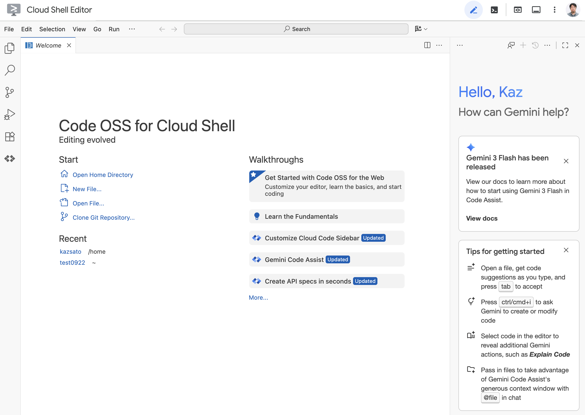

# ADK Bidi-streaming Workshop: Build Your Own Real-Time Voice AI

## Workshop Overview

### What You'll Build

In this hands-on workshop, you'll build a complete bidirectional streaming AI application from scratch. By the end, you'll have a working voice AI that can:

- Accept text, audio, and image input
- Respond with streaming text or natural speech
- Handle interruptions naturally
- Use tools like Google Search

Unlike reading documentation, you'll **write every line of code yourself**, understanding each component as you build it.


### Learning Approach

We follow an incremental build approach:

```
Step 1: Minimal WebSocket server → "Hello World" response
Step 2: Add the Agent            → AI-powered responses
Step 3: Application Initialization → Runner and session service
Step 4: Session Initialization   → RunConfig and LiveRequestQueue
Step 5: Upstream Task            → Client to queue communication
Step 6: Downstream Task          → Events to client streaming
Step 7: Add Audio                → Voice input and output
Step 8: Add Image Input          → Multimodal AI
Step 9: Production Polish        → Error handling & cleanup
```

Each step builds on the previous one. You'll test after every step to see your progress.

### Prerequisites

- Google Cloud account with billing enabled
- [Google AI Studio](https://aistudio.google.com) API key
- Basic Python and async/await knowledge
- Web browser with microphone access (Chrome recommended)

### Time Estimate

- **Full workshop**: ~90 minutes
- **Quick version** (Steps 1-4 only): ~45 minutes

---

## Environment Setup (10 min)

Cloud Shell Editor provides a browser-based development environment with VS Code functionality. No local setup required!

**Step 1: Open Cloud Shell Editor**

We'll use Google's browser-based IDE so you don't need to install anything locally.

Navigate to [ide.cloud.google.com](https://ide.cloud.google.com) in your browser.

Alternatively:
- Go to [shell.cloud.google.com](https://shell.cloud.google.com)
- Click "Open Editor" in the toolbar



**Step 2: Create Project Structure**

We'll create the folder structure for our bidi-streaming application with directories for the backend, frontend assets, and agent code.

Open a terminal in Cloud Shell Editor (Terminal → New Terminal) and run:

```bash
mkdir -p ~/bidi-workshop/app/static/js
mkdir -p ~/bidi-workshop/app/static/css
mkdir -p ~/bidi-workshop/app/my_agent
cd ~/bidi-workshop
```

Then open the project folder in the editor:

1. Click **File** → **Open Folder** in the menu bar
2. Navigate to `bidi-workshop`
3. Click **OK**

**Step 3: Create pyproject.toml**

This file defines our Python package and its dependencies, including the ADK and FastAPI.

Create the Python package configuration. In Cloud Shell Editor:

1. Right-click on `bidi-workshop` folder → **New File**
2. Name it `pyproject.toml`
3. Add this content:

```toml
[project]
name = "bidi-workshop"
version = "0.1.0"
requires-python = ">=3.10"
dependencies = [
    "google-adk>=1.22.1",
    "fastapi>=0.115.0",
    "uvicorn>=0.32.0",
    "python-dotenv>=1.0.0",
    "websockets>=13.0",
]

[build-system]
requires = ["hatchling"]
build-backend = "hatchling.build"

[tool.hatch.build.targets.wheel]
packages = ["app"]
```

**Step 4: Configure Environment Variables**

We'll configure the application to use Vertex AI, which automatically authenticates using your Cloud Shell credentials.

Create a new `.env` file in the `app/` directory:

1. Right-click on the `app` folder in the Explorer panel
2. Select **New File**
3. Name it `.env`
4. Add the following content:

```bash
GOOGLE_CLOUD_PROJECT=your_project_id
GOOGLE_CLOUD_LOCATION=us-central1
GOOGLE_GENAI_USE_VERTEXAI=TRUE
```

Replace `your_project_id` with your Google Cloud project ID.

> **Finding your Project ID**: Click the project dropdown in the Cloud Console header to see your project ID.

**Step 5: Set Up Authentication**

Configure Application Default Credentials (ADC) for Vertex AI access:

```bash
gcloud auth application-default login
```

Follow the prompts to authenticate. This creates credentials that ADK uses to access Vertex AI.

> **Verify authentication**: Run `gcloud auth application-default print-access-token` to confirm credentials are configured.

**Step 6: Install Dependencies**

Now we'll install all the Python packages defined in pyproject.toml.

Open a terminal in Cloud Shell Editor (Terminal → New Terminal) and run:

```bash
python3 -m venv .venv
source .venv/bin/activate
pip install -e .
```

This installs the bidi-workshop package and all required dependencies including:
- `google-adk` - Agent Development Kit
- [`fastapi`](https://fastapi.tiangolo.com/) - Web framework
- [`uvicorn`](https://www.uvicorn.org/) - ASGI server
- [`python-dotenv`](https://pypi.org/project/python-dotenv/) - Environment variable management

**Step 7: Download Frontend Assets**

The frontend handles audio capture/playback using Web Audio APIs. Since this workshop focuses on ADK concepts, we'll use pre-built frontend files.

Download the pre-built frontend:

```bash
cd ~/bidi-workshop/app/static

# Download HTML
curl -o index.html https://raw.githubusercontent.com/google/adk-samples/main/python/agents/bidi-demo/app/static/index.html

# Download CSS
curl -o css/style.css https://raw.githubusercontent.com/google/adk-samples/main/python/agents/bidi-demo/app/static/css/style.css

# Download JavaScript files
curl -o js/app.js https://raw.githubusercontent.com/google/adk-samples/main/python/agents/bidi-demo/app/static/js/app.js
curl -o js/audio-recorder.js https://raw.githubusercontent.com/google/adk-samples/main/python/agents/bidi-demo/app/static/js/audio-recorder.js
curl -o js/audio-player.js https://raw.githubusercontent.com/google/adk-samples/main/python/agents/bidi-demo/app/static/js/audio-player.js
curl -o js/pcm-recorder-processor.js https://raw.githubusercontent.com/google/adk-samples/main/python/agents/bidi-demo/app/static/js/pcm-recorder-processor.js
curl -o js/pcm-player-processor.js https://raw.githubusercontent.com/google/adk-samples/main/python/agents/bidi-demo/app/static/js/pcm-player-processor.js

cd ~/bidi-workshop
```

> **Why pre-built frontend?** The JavaScript involves AudioWorklet APIs that are complex but not ADK-specific. We'll focus on the Python backend where ADK concepts live.

### Understanding the Directory Structure

After completing the setup, your project structure looks like this:

```
bidi-workshop/
├── pyproject.toml                    # Python package configuration
└── app/                              # Main application directory
    ├── .env                          # Environment variables (API key, model)
    ├── my_agent/                     # (empty - we'll add files here)
    └── static/                       # Frontend assets (pre-downloaded)
        ├── index.html                # Main HTML page
        ├── css/
        │   └── style.css             # UI styling
        └── js/
            ├── app.js                # WebSocket, event handling, UI logic
            ├── audio-recorder.js     # Microphone capture (16kHz PCM)
            ├── audio-player.js       # Audio playback (24kHz PCM)
            ├── pcm-recorder-processor.js  # AudioWorklet for recording
            └── pcm-player-processor.js    # AudioWorklet for playback
```

**Files you'll create during this workshop:**

| File | Purpose | When |
|------|---------|------|
| `app/main.py` | FastAPI server with WebSocket endpoint | Step 1 (and iterate through Step 10) |
| `app/my_agent/__init__.py` | Package initialization | Step 2 |
| `app/my_agent/agent.py` | Agent definition (model, tools, instruction) | Step 2 |

**Pre-downloaded frontend files:**

| File | Purpose |
|------|---------|
| `app.js` | Main application: WebSocket connection, event handling, UI updates |
| `audio-recorder.js` | Microphone capture: MediaStream → AudioWorklet → PCM |
| `audio-player.js` | Audio playback: PCM → AudioWorklet → Speakers |
| `pcm-recorder-processor.js` | AudioWorklet processor for low-latency recording |
| `pcm-player-processor.js` | AudioWorklet processor with ring buffer for smooth playback |

**Key insight:** The Python backend (what you'll build) handles ADK integration. The JavaScript frontend (pre-downloaded) handles browser APIs for audio/video. They communicate via WebSocket.

---

## Step 1: Minimal WebSocket Server (10 min)

Let's start with the simplest possible WebSocket server that echoes messages back.

### Create main.py

Create `app/main.py`:

```python
"""Step 1: Minimal WebSocket server - echoes messages back."""

from pathlib import Path

from fastapi import FastAPI, WebSocket, WebSocketDisconnect
from fastapi.responses import FileResponse
from fastapi.staticfiles import StaticFiles

# Create FastAPI application
app = FastAPI()

# Serve static files (HTML, CSS, JS)
static_dir = Path(__file__).parent / "static"
app.mount("/static", StaticFiles(directory=static_dir), name="static")


@app.get("/")
async def root():
    """Serve the index.html page."""
    return FileResponse(Path(__file__).parent / "static" / "index.html")


@app.websocket("/ws/{user_id}/{session_id}")
async def websocket_endpoint(
    websocket: WebSocket,
    user_id: str,
    session_id: str,
) -> None:
    """WebSocket endpoint - currently just echoes messages."""
    await websocket.accept()
    print(f"Client connected: user={user_id}, session={session_id}")

    try:
        while True:
            # Receive message from client
            message = await websocket.receive()

            if "text" in message:
                text_data = message["text"]
                print(f"Received text: {text_data}")

                # Echo back a simple response (content first, then turnComplete)
                import json
                response = {
                    "content": {
                        "parts": [{"text": f"Echo: {text_data}"}]
                    }
                }
                await websocket.send_text(json.dumps(response))
                await websocket.send_text(json.dumps({"turnComplete": True}))

            elif "bytes" in message:
                print(f"Received binary: {len(message['bytes'])} bytes")
                # Ignore binary for now

    except WebSocketDisconnect:
        print("Client disconnected")
```

### Test Step 1

Start the server:

```bash
cd ~/bidi-workshop/app
python -m uvicorn main:app --reload --host 0.0.0.0 --port 8080
```

Open Web Preview (globe icon → Preview on port 8080).

**Test it:**
1. Type "Hello" in the text input
2. Click Send
3. You should see "Echo: {"type": "text", "text": "Hello"}" in the chat

> **What you built**: A WebSocket server that receives messages and sends responses. The frontend displays it as a chat message because the response follows ADK's event format.

### Client Code: WebSocket Connection

The frontend establishes and manages the WebSocket connection. Here's what happens on the client side:

**Connecting to the server (app.js:10-12, 317-350):**

```javascript
// app.js:10-12 - Session identifiers
const userId = "demo-user";
const sessionId = "demo-session-" + Math.random().toString(36).substring(7);

// app.js:317-350 - WebSocket connection
function connectWebsocket() {
    // Construct WebSocket URL with user/session IDs
    const ws_url = "ws://" + window.location.host + "/ws/" + userId + "/" + sessionId;
    websocket = new WebSocket(ws_url);

    websocket.onopen = function() {
        console.log("WebSocket connected");
        updateConnectionStatus(true);  // Update UI indicator
    };

    websocket.onclose = function() {
        console.log("WebSocket closed");
        updateConnectionStatus(false);
        setTimeout(connectWebsocket, 5000);  // Auto-reconnect
    };

    websocket.onmessage = function(event) {
        // Handle incoming messages (we'll explore this later)
        const data = JSON.parse(event.data);
        // ... process event
    };
}

// Connect when page loads
connectWebsocket();
```

**Key concepts:**

| Concept | Purpose |
|---------|---------|
| `userId` / `sessionId` | Identify user and conversation for session persistence |
| `WebSocket()` | Browser API for real-time bidirectional communication |
| `onopen` / `onclose` | Connection lifecycle callbacks |
| `onmessage` | Receives all server events (text, audio, transcriptions) |
| Auto-reconnect | Handles network interruptions gracefully |

**Why WebSocket?** Unlike HTTP which is request-response, WebSocket maintains a persistent connection allowing the server to push events to the client at any time—essential for streaming AI responses.

**Checkpoint**: You have a working WebSocket connection!

---

## Step 2: Add the Agent (10 min)

Now let's add an actual AI agent to generate real responses.

### Create the Agent

Create `app/my_agent/__init__.py`:

```python
"""Agent package initialization."""
```

Create `app/my_agent/agent.py`:

```python
"""Agent definition for the bidi-workshop."""

from google.adk.agents import Agent
from google.adk.tools import google_search

# Define the agent
agent = Agent(
    name="workshop_agent",
    model="gemini-live-2.5-flash-native-audio",
    instruction="""You are a helpful AI assistant.

    You can use Google Search to find current information.
    Keep your responses concise and friendly.
    """,
    tools=[google_search],
)
```

### Understand the Agent

```python
agent = Agent(
    name="workshop_agent",        # Identifier for logs and debugging
    model=os.getenv(...),         # Which Gemini model to use
    instruction="...",            # System prompt - shapes personality
    tools=[google_search],        # Tools the agent can call
)
```

The Agent is **stateless**—it defines behavior, not conversation state. The same agent instance serves all users.

### Client Code: No Changes Needed

The Agent is purely server-side—the client doesn't know or care about agent configuration. From the client's perspective:

```
Client sends: {"type": "text", "text": "Hello"}
Client receives: {"content": {"parts": [{"text": "..."}]}, ...}
```

The client only deals with:
- **Sending messages** (text, audio, images)
- **Receiving events** (responses, transcriptions, tool calls)

The Agent's instruction, model selection, and tools are invisible to the frontend. This separation means you can change agent behavior without modifying client code.

### Test Step 2

The `--reload` flag auto-detects file changes. Check the terminal—you should see uvicorn reload the app automatically.

If you see import errors, verify `my_agent/__init__.py` exists and is empty.

**Checkpoint**: Agent defined, but not yet connected to WebSocket.

---

## Step 3: Application Initialization (10 min)

ADK requires three components initialized once at startup:

1. **Agent** - Defines AI behavior (already created)
2. **SessionService** - Stores conversation history
3. **Runner** - Orchestrates streaming

### Update main.py

Replace `app/main.py` with:

```python
"""Step 3: Application initialization with ADK components."""

import json
from pathlib import Path

from dotenv import load_dotenv
from fastapi import FastAPI, WebSocket, WebSocketDisconnect
from fastapi.responses import FileResponse
from fastapi.staticfiles import StaticFiles
from google.adk.runners import Runner
from google.adk.sessions import InMemorySessionService

# Load environment variables BEFORE importing agent
load_dotenv(Path(__file__).parent / ".env")

# Import agent after loading environment
from my_agent.agent import agent  # noqa: E402

# ========================================
# Phase 1: Application Initialization (once at startup)
# ========================================

APP_NAME = "bidi-workshop"

app = FastAPI()

# Serve static files
static_dir = Path(__file__).parent / "static"
app.mount("/static", StaticFiles(directory=static_dir), name="static")

# Create session service - stores conversation history
session_service = InMemorySessionService()

# Create runner - orchestrates agent execution
runner = Runner(
    app_name=APP_NAME,
    agent=agent,
    session_service=session_service,
)

print(f"Application initialized with model: {agent.model}")


@app.get("/")
async def root():
    """Serve the index.html page."""
    return FileResponse(Path(__file__).parent / "static" / "index.html")


@app.websocket("/ws/{user_id}/{session_id}")
async def websocket_endpoint(
    websocket: WebSocket,
    user_id: str,
    session_id: str,
) -> None:
    """WebSocket endpoint - still echoing, but ADK is ready."""
    await websocket.accept()
    print(f"Client connected: user={user_id}, session={session_id}")

    try:
        while True:
            message = await websocket.receive()

            if "text" in message:
                text_data = message["text"]
                print(f"Received: {text_data}")

                # Still echoing for now - we'll add ADK in next step
                response = {
                    "content": {
                        "parts": [{"text": f"ADK Ready! Model: {agent.model}"}]
                    }
                }
                await websocket.send_text(json.dumps(response))
                await websocket.send_text(json.dumps({"turnComplete": True}))

    except WebSocketDisconnect:
        print("Client disconnected")
```

### Test Step 3

After the server reloads, send a message. You should see "ADK Ready! Model: gemini-live-2.5-flash-native-audio" in the chat.

**Checkpoint**: ADK components initialized! The app is not ready for actual chat yet - we'll connect to the Live API in the next steps.

### Understand the Components

```python
# SessionService: Stores conversation history
session_service = InMemorySessionService()  # Memory-based (lost on restart)
# For production: DatabaseSessionService or VertexAiSessionService

# Runner: Orchestrates everything
runner = Runner(
    app_name=APP_NAME,           # Identifies your application
    agent=agent,                  # The agent to run
    session_service=session_service,  # Where to store sessions
)
```

**Why single instances?**
- Created once at startup, shared across all connections
- Thread-safe and memory-efficient
- SessionService enables conversation continuity across reconnections

### Client Code: Session ID Generation

While `SessionService` and `Runner` are server-side, the client controls session identity:

```javascript
// app.js - Session ID generation
const userId = "demo-user";  // In production: authenticated user ID
const sessionId = "demo-session-" + Math.random().toString(36).substring(7);

// URL includes these IDs
const ws_url = "ws://" + window.location.host + "/ws/" + userId + "/" + sessionId;
```

---

## Step 4: Session Initialization (15 min)

Each WebSocket connection needs its own session. This is Phase 2 of the lifecycle.

### Update main.py

Replace the WebSocket endpoint with:

```python
"""Step 4: Session initialization per connection."""

import json
from pathlib import Path

from dotenv import load_dotenv
from fastapi import FastAPI, WebSocket, WebSocketDisconnect
from fastapi.responses import FileResponse
from fastapi.staticfiles import StaticFiles
from google.adk.agents.live_request_queue import LiveRequestQueue
from google.adk.agents.run_config import RunConfig, StreamingMode
from google.adk.runners import Runner
from google.adk.sessions import InMemorySessionService
from google.genai import types

# Load environment variables BEFORE importing agent
load_dotenv(Path(__file__).parent / ".env")

from my_agent.agent import agent  # noqa: E402

# ========================================
# Phase 1: Application Initialization
# ========================================

APP_NAME = "bidi-workshop"

app = FastAPI()
static_dir = Path(__file__).parent / "static"
app.mount("/static", StaticFiles(directory=static_dir), name="static")

session_service = InMemorySessionService()
runner = Runner(app_name=APP_NAME, agent=agent, session_service=session_service)


@app.get("/")
async def root():
    return FileResponse(Path(__file__).parent / "static" / "index.html")


@app.websocket("/ws/{user_id}/{session_id}")
async def websocket_endpoint(
    websocket: WebSocket,
    user_id: str,
    session_id: str,
) -> None:
    """WebSocket endpoint with session initialization."""
    await websocket.accept()
    print(f"Client connected: user={user_id}, session={session_id}")

    # ========================================
    # Phase 2: Session Initialization
    # ========================================

    # Configure streaming behavior for native audio model
    # Native audio models ONLY support AUDIO response modality
    run_config = RunConfig(
        streaming_mode=StreamingMode.BIDI,  # Bidirectional streaming
        response_modalities=["AUDIO"],       # Native audio models require AUDIO
        input_audio_transcription=types.AudioTranscriptionConfig(),
        output_audio_transcription=types.AudioTranscriptionConfig(),
    )

    # Get or create session for conversation history
    session = await session_service.get_session(
        app_name=APP_NAME, user_id=user_id, session_id=session_id
    )
    if not session:
        await session_service.create_session(
            app_name=APP_NAME, user_id=user_id, session_id=session_id
        )
        print(f"Created new session: {session_id}")
    else:
        print(f"Resumed existing session: {session_id}")

    # Create queue for sending input to the model
    live_request_queue = LiveRequestQueue()

    print(f"Session initialized with config: {run_config}")

    # ========================================
    # Phase 3: Active Session (coming next!)
    # ========================================

    try:
        while True:
            message = await websocket.receive()

            if "text" in message:
                text_data = message["text"]
                print(f"Received: {text_data}")

                # Placeholder - actual streaming will be added in Step 5 & 6
                response = {
                    "content": {
                        "parts": [{"text": "[Step 4 Complete] Session initialized. Proceed to Step 5 to enable model responses."}]
                    }
                }
                await websocket.send_text(json.dumps(response))
                await websocket.send_text(json.dumps({"turnComplete": True}))

    except WebSocketDisconnect:
        print("Client disconnected")
    finally:
        # ========================================
        # Phase 4: Termination
        # ========================================
        live_request_queue.close()
        print("LiveRequestQueue closed")
```

### Test Step 4

Restart and test. Open a second browser tab with the same URL.

**Checkpoint**: Per-session resources created!

### Understand RunConfig

```python
run_config = RunConfig(
    streaming_mode=StreamingMode.BIDI,  # WebSocket bidirectional
    response_modalities=["AUDIO"],       # Native audio models require AUDIO
    input_audio_transcription=types.AudioTranscriptionConfig(),
    output_audio_transcription=types.AudioTranscriptionConfig(),
)
```

**Key RunConfig options:**

| Parameter | Purpose |
|-----------|---------|
| `streaming_mode` | `BIDI` for WebSocket, `SSE` for HTTP |
| `response_modalities` | `["AUDIO"]` for native audio models |
| `input_audio_transcription` | Transcribe user speech to text |
| `output_audio_transcription` | Transcribe model audio to text |

### Understand LiveRequestQueue

```python
live_request_queue = LiveRequestQueue()
```

This is the **upstream channel** for sending input to the model:

| Method | Use Case |
|--------|----------|
| `send_content(content)` | Text messages (triggers response) |
| `send_realtime(blob)` | Audio/image chunks (streaming) |
| `close()` | End the session |

---

## Step 5: Upstream Task (15 min)

Now we'll send text to the model using `LiveRequestQueue`.

### Update main.py

Replace the Phase 3 section:

```python
"""Step 5: Upstream task - sending text to the model."""

import asyncio
import json
from pathlib import Path

from dotenv import load_dotenv
from fastapi import FastAPI, WebSocket, WebSocketDisconnect
from fastapi.responses import FileResponse
from fastapi.staticfiles import StaticFiles
from google.adk.agents.live_request_queue import LiveRequestQueue
from google.adk.agents.run_config import RunConfig, StreamingMode
from google.adk.runners import Runner
from google.adk.sessions import InMemorySessionService
from google.genai import types

load_dotenv(Path(__file__).parent / ".env")

from my_agent.agent import agent  # noqa: E402

APP_NAME = "bidi-workshop"

app = FastAPI()
static_dir = Path(__file__).parent / "static"
app.mount("/static", StaticFiles(directory=static_dir), name="static")

session_service = InMemorySessionService()
runner = Runner(app_name=APP_NAME, agent=agent, session_service=session_service)


@app.get("/")
async def root():
    return FileResponse(Path(__file__).parent / "static" / "index.html")


@app.websocket("/ws/{user_id}/{session_id}")
async def websocket_endpoint(
    websocket: WebSocket,
    user_id: str,
    session_id: str,
) -> None:
    await websocket.accept()

    # Phase 2: Session Initialization
    run_config = RunConfig(
        streaming_mode=StreamingMode.BIDI,
        response_modalities=["AUDIO"],
        input_audio_transcription=types.AudioTranscriptionConfig(),
        output_audio_transcription=types.AudioTranscriptionConfig(),
    )

    session = await session_service.get_session(
        app_name=APP_NAME, user_id=user_id, session_id=session_id
    )
    if not session:
        await session_service.create_session(
            app_name=APP_NAME, user_id=user_id, session_id=session_id
        )

    live_request_queue = LiveRequestQueue()

    # ========================================
    # Phase 3: Upstream Task
    # ========================================

    async def upstream_task() -> None:
        """Receives messages from WebSocket and sends to LiveRequestQueue."""
        print("Upstream task started")

        while True:
            message = await websocket.receive()

            if "text" in message:
                text_data = message["text"]
                json_message = json.loads(text_data)

                if json_message.get("type") == "text":
                    user_text = json_message["text"]
                    print(f"User said: {user_text}")

                    # Create Content object and send to queue
                    content = types.Content(
                        parts=[types.Part(text=user_text)]
                    )
                    live_request_queue.send_content(content)
                    print("Sent to LiveRequestQueue")

            elif "bytes" in message:
                # Audio handling will come later
                print(f"Received audio: {len(message['bytes'])} bytes")

    async def downstream_task() -> None:
        """Placeholder - will receive events from run_live()."""
        print("Downstream task started (placeholder)")
        # Keep task alive
        while True:
            await asyncio.sleep(1)

    try:
        # Run both tasks concurrently
        await asyncio.gather(upstream_task(), downstream_task())
    except WebSocketDisconnect:
        print("Client disconnected")
    finally:
        live_request_queue.close()
        print("Session terminated")
```

### Test Step 5

Restart and send a message. Check the terminal—you should see:
```
User said: Hello
Sent to LiveRequestQueue
```

The message goes to the model, but we're not receiving responses yet. That's next!

**Checkpoint**: Upstream path working!

### Understand the Upstream Flow

```python
# Parse JSON message from client
json_message = json.loads(text_data)
# {"type": "text", "text": "Hello"}

# Create ADK Content object
content = types.Content(
    parts=[types.Part(text=user_text)]
)

# Send to model via queue
live_request_queue.send_content(content)
```

**Content vs Blob:**
- `types.Content` - Structured text (triggers model response)
- `types.Blob` - Binary data like audio/images (streams continuously)

### Client Code: Sending Text Messages

The client sends text as JSON through the WebSocket:

```javascript
// app.js:755-766 - Send text message
function sendMessage(message) {
    if (websocket && websocket.readyState === WebSocket.OPEN) {
        const jsonMessage = JSON.stringify({
            type: "text",      // Server uses this to route the message
            text: message
        });
        websocket.send(jsonMessage);  // Sends as text frame
    }
}

// app.js:734-752 - Form submission handler
messageForm.onsubmit = function(e) {
    e.preventDefault();  // Don't reload page
    const message = messageInput.value.trim();

    if (message) {
        // Optimistic UI update - show message immediately
        const userBubble = createMessageBubble(message, true);
        messagesDiv.appendChild(userBubble);

        messageInput.value = "";  // Clear input
        sendMessage(message);      // Send to server
    }
};
```

**Key patterns:**

| Pattern | Purpose |
|---------|---------|
| `JSON.stringify()` | Package text with type identifier |
| `websocket.send(string)` | Send as WebSocket text frame |
| `e.preventDefault()` | Stop form from reloading page |
| Optimistic update | Show user message before server confirms |

**Message flow:**

```
User types → Form submit → JSON.stringify → WebSocket text frame
    → Server receives → json.loads() → types.Content
    → live_request_queue.send_content()
```

The `type: "text"` field tells the server this is a text message (vs image or other types we'll add later).

---

## Step 6: Downstream Task (15 min)

Now the exciting part—receiving streaming responses from the model!

### Update main.py

Replace the `downstream_task()` function:

```python
"""Step 6: Downstream task - receiving events from run_live()."""

import asyncio
import json
from pathlib import Path

from dotenv import load_dotenv
from fastapi import FastAPI, WebSocket, WebSocketDisconnect
from fastapi.responses import FileResponse
from fastapi.staticfiles import StaticFiles
from google.adk.agents.live_request_queue import LiveRequestQueue
from google.adk.agents.run_config import RunConfig, StreamingMode
from google.adk.runners import Runner
from google.adk.sessions import InMemorySessionService
from google.genai import types

load_dotenv(Path(__file__).parent / ".env")

from my_agent.agent import agent  # noqa: E402

APP_NAME = "bidi-workshop"

app = FastAPI()
static_dir = Path(__file__).parent / "static"
app.mount("/static", StaticFiles(directory=static_dir), name="static")

session_service = InMemorySessionService()
runner = Runner(app_name=APP_NAME, agent=agent, session_service=session_service)


@app.get("/")
async def root():
    return FileResponse(Path(__file__).parent / "static" / "index.html")


@app.websocket("/ws/{user_id}/{session_id}")
async def websocket_endpoint(
    websocket: WebSocket,
    user_id: str,
    session_id: str,
) -> None:
    await websocket.accept()

    run_config = RunConfig(
        streaming_mode=StreamingMode.BIDI,
        response_modalities=["AUDIO"],
        input_audio_transcription=types.AudioTranscriptionConfig(),
        output_audio_transcription=types.AudioTranscriptionConfig(),
    )

    session = await session_service.get_session(
        app_name=APP_NAME, user_id=user_id, session_id=session_id
    )
    if not session:
        await session_service.create_session(
            app_name=APP_NAME, user_id=user_id, session_id=session_id
        )

    live_request_queue = LiveRequestQueue()

    async def upstream_task() -> None:
        """Receives messages from WebSocket and sends to LiveRequestQueue."""
        while True:
            message = await websocket.receive()

            if "text" in message:
                json_message = json.loads(message["text"])

                if json_message.get("type") == "text":
                    user_text = json_message["text"]
                    print(f"[UPSTREAM] User: {user_text}")

                    content = types.Content(
                        parts=[types.Part(text=user_text)]
                    )
                    live_request_queue.send_content(content)

    async def downstream_task() -> None:
        """Receives Events from run_live() and sends to WebSocket."""
        print("[DOWNSTREAM] Starting run_live()")

        async for event in runner.run_live(
            user_id=user_id,
            session_id=session_id,
            live_request_queue=live_request_queue,
            run_config=run_config,
        ):
            # Serialize event to JSON
            event_json = event.model_dump_json(exclude_none=True, by_alias=True)
            print(f"[DOWNSTREAM] Event: {event_json[:100]}...")

            # Forward to client
            await websocket.send_text(event_json)

        print("[DOWNSTREAM] run_live() completed")

    try:
        await asyncio.gather(upstream_task(), downstream_task())
    except WebSocketDisconnect:
        print("Client disconnected")
    except Exception as e:
        print(f"Error: {e}")
    finally:
        live_request_queue.close()
```

### Test Step 6

Restart and try:

1. Type "Hello, who are you?"
2. Watch the response stream in word by word!
3. Try "Search for the weather in Tokyo"—watch tool execution!

Open the Event Console (right panel) to see raw events.

**Checkpoint**: Full bidirectional text streaming!

### Understand run_live()

```python
async for event in runner.run_live(
    user_id=user_id,              # Identifies the user
    session_id=session_id,        # Identifies the session
    live_request_queue=live_request_queue,  # Input channel
    run_config=run_config,        # Streaming configuration
):
    # Events arrive as they're generated - true streaming!
    event_json = event.model_dump_json(exclude_none=True, by_alias=True)
    await websocket.send_text(event_json)
```

**run_live() is an async generator** that yields events in real-time:

| Event Type | Field | Description |
|------------|-------|-------------|
| Text content | `event.content.parts[0].text` | Model's text response |
| Audio content | `event.content.parts[0].inline_data` | Model's audio response |
| Turn complete | `event.turn_complete` | Model finished responding |
| Interrupted | `event.interrupted` | User interrupted model |

### Client Code: Receiving and Processing Events

The client handles all incoming events in `websocket.onmessage`:

```javascript
// app.js:341-693 - Event handler (simplified)
websocket.onmessage = function(event) {
    const adkEvent = JSON.parse(event.data);

    // Log to Event Console
    addEventToConsole(adkEvent);

    // Handle turn complete - model finished responding
    if (adkEvent.turnComplete === true) {
        currentMessageId = null;
        currentBubbleElement = null;
        return;
    }

    // Handle interrupted - user started speaking while model was responding
    if (adkEvent.interrupted === true) {
        if (audioPlayerNode) {
            audioPlayerNode.port.postMessage({ command: "endOfAudio" });
        }
        if (currentBubbleElement) {
            currentBubbleElement.classList.add("interrupted");
        }
        return;
    }

    // Handle text content - streaming response
    if (adkEvent.content && adkEvent.content.parts) {
        for (const part of adkEvent.content.parts) {
            if (part.text) {
                if (currentMessageId == null) {
                    // Create new message bubble
                    currentMessageId = Date.now();
                    currentBubbleElement = createMessageBubble(part.text, false, true);
                    messagesDiv.appendChild(currentBubbleElement);
                } else {
                    // Append to existing bubble (streaming effect)
                    const textSpan = currentBubbleElement.querySelector(".bubble-text");
                    textSpan.textContent += part.text;
                }
            }
        }
    }
};
```

**Key event handling patterns:**

| Event | Client Action |
|-------|---------------|
| `turnComplete: true` | Reset state, ready for next input |
| `interrupted: true` | Stop audio playback, mark message interrupted |
| `content.parts[].text` | Append to chat bubble (streaming) |
| `content.parts[].inline_data` | Send to audio player (we'll add this later) |

**Streaming text effect:**

```
Event 1: {"content": {"parts": [{"text": "Hello"}]}}    → "Hello"
Event 2: {"content": {"parts": [{"text": ", how"}]}}    → "Hello, how"
Event 3: {"content": {"parts": [{"text": " are you?"}]}} → "Hello, how are you?"
Event 4: {"turnComplete": true}                          → Done!
```

Each event appends text to the same bubble, creating the "typing" effect.

---

## Step 7: Add Audio (15 min)

Let's add bidirectional voice support—both speaking to the AI and hearing its responses.

### Update main.py

Replace `app/main.py` with:

```python
"""Step 7: Bidirectional audio - voice input and output."""

import asyncio
import json
import warnings
from pathlib import Path

from dotenv import load_dotenv
from fastapi import FastAPI, WebSocket, WebSocketDisconnect
from fastapi.responses import FileResponse
from fastapi.staticfiles import StaticFiles
from google.adk.agents.live_request_queue import LiveRequestQueue
from google.adk.agents.run_config import RunConfig, StreamingMode
from google.adk.runners import Runner
from google.adk.sessions import InMemorySessionService
from google.genai import types

# Suppress noisy warnings
warnings.filterwarnings("ignore", message="Your application has authenticated using end user credentials")
warnings.filterwarnings("ignore", category=UserWarning, module="pydantic")

load_dotenv(Path(__file__).parent / ".env")

from my_agent.agent import agent  # noqa: E402

APP_NAME = "bidi-workshop"

app = FastAPI()
static_dir = Path(__file__).parent / "static"
app.mount("/static", StaticFiles(directory=static_dir), name="static")

session_service = InMemorySessionService()
runner = Runner(app_name=APP_NAME, agent=agent, session_service=session_service)


@app.get("/")
async def root():
    return FileResponse(Path(__file__).parent / "static" / "index.html")


@app.websocket("/ws/{user_id}/{session_id}")
async def websocket_endpoint(
    websocket: WebSocket,
    user_id: str,
    session_id: str,
) -> None:
    await websocket.accept()
    print("Connection open")

    run_config = RunConfig(
        streaming_mode=StreamingMode.BIDI,
        response_modalities=["AUDIO"],
        input_audio_transcription=types.AudioTranscriptionConfig(),
        output_audio_transcription=types.AudioTranscriptionConfig(),
    )

    session = await session_service.get_session(
        app_name=APP_NAME, user_id=user_id, session_id=session_id
    )
    if not session:
        await session_service.create_session(
            app_name=APP_NAME, user_id=user_id, session_id=session_id
        )

    live_request_queue = LiveRequestQueue()

    async def upstream_task() -> None:
        """Receives messages from WebSocket and sends to LiveRequestQueue."""
        while True:
            message = await websocket.receive()

            # Handle text messages (JSON)
            if "text" in message:
                json_message = json.loads(message["text"])

                if json_message.get("type") == "text":
                    user_text = json_message["text"]
                    print(f"[UPSTREAM] User text: {user_text}")

                    content = types.Content(
                        parts=[types.Part(text=user_text)]
                    )
                    live_request_queue.send_content(content)

            # Handle binary messages (audio)
            elif "bytes" in message:
                audio_data = message["bytes"]
                print(f"[UPSTREAM] Audio chunk: {len(audio_data)} bytes")

                # Create audio blob with correct format
                audio_blob = types.Blob(
                    mime_type="audio/pcm;rate=16000",  # 16kHz mono PCM
                    data=audio_data
                )

                # Stream audio (doesn't trigger response until VAD detects silence)
                live_request_queue.send_realtime(audio_blob)

    async def downstream_task() -> None:
        """Receives Events from run_live() and sends to WebSocket."""
        print("[DOWNSTREAM] Starting run_live()")

        async for event in runner.run_live(
            user_id=user_id,
            session_id=session_id,
            live_request_queue=live_request_queue,
            run_config=run_config,
        ):
            event_json = event.model_dump_json(exclude_none=True, by_alias=True)
            print(f"[DOWNSTREAM] Event: {event_json[:100]}...")
            await websocket.send_text(event_json)

        print("[DOWNSTREAM] run_live() completed")

    try:
        await asyncio.gather(upstream_task(), downstream_task())
    except WebSocketDisconnect:
        print("Client disconnected")
    except Exception as e:
        print(f"Error: {e}")
    finally:
        live_request_queue.close()
        print("Connection closed")
```

### Test Step 7

After the server reloads:

1. Click "Start Audio" button
2. Allow microphone access
3. Speak "Hello, can you hear me?"
4. Wait for the response—you should hear the AI speak back!

You should see your speech transcribed in the chat (if using a model with transcription support), and hear the AI's audio response through your speakers.

**Checkpoint**: Bidirectional voice streaming working!

### Understand Audio Format

The Live API requires specific audio format:

| Property | Value |
|----------|-------|
| Format | 16-bit signed PCM |
| Sample rate | 16 kHz |
| Channels | Mono |
| MIME type | `audio/pcm;rate=16000` |

The frontend's AudioWorklet handles format conversion automatically.

### send_content() vs send_realtime()

```python
# Text: triggers immediate model response
live_request_queue.send_content(content)

# Audio: streams continuously, model uses VAD to detect turn end
live_request_queue.send_realtime(audio_blob)
```

**VAD (Voice Activity Detection)**: The Live API automatically detects when you stop speaking and triggers a response—no manual "end of turn" signal needed.

### Client Code: Audio Capture with AudioWorklet

The frontend captures microphone audio using the Web Audio API with AudioWorklet for low-latency processing:

**Setting up the audio pipeline (audio-recorder.js:7-38):**

```javascript
// audio-recorder.js:7-38 - Start audio recording
export async function startAudioRecorderWorklet(audioRecorderHandler) {
    // Create AudioContext at 16kHz (required by Live API)
    const audioRecorderContext = new AudioContext({ sampleRate: 16000 });

    // Load the AudioWorklet processor
    const workletURL = new URL("./pcm-recorder-processor.js", import.meta.url);
    await audioRecorderContext.audioWorklet.addModule(workletURL);

    // Request microphone access (mono audio)
    const micStream = await navigator.mediaDevices.getUserMedia({
        audio: { channelCount: 1 }
    });
    const source = audioRecorderContext.createMediaStreamSource(micStream);

    // Create and connect the processor node
    const audioRecorderNode = new AudioWorkletNode(
        audioRecorderContext,
        "pcm-recorder-processor"
    );
    source.connect(audioRecorderNode);

    // Handle audio data from the worklet
    audioRecorderNode.port.onmessage = (event) => {
        const pcmData = convertFloat32ToPCM(event.data);
        audioRecorderHandler(pcmData);  // Send to WebSocket
    };

    return [audioRecorderNode, audioRecorderContext, micStream];
}

// audio-recorder.js:49-58 - Convert Float32 samples to 16-bit PCM
function convertFloat32ToPCM(inputData) {
    const pcm16 = new Int16Array(inputData.length);
    for (let i = 0; i < inputData.length; i++) {
        pcm16[i] = inputData[i] * 0x7fff;  // Scale [-1,1] to [-32768,32767]
    }
    return pcm16.buffer;
}
```

**The AudioWorklet processor (pcm-recorder-processor.js:1-18):**

```javascript
// pcm-recorder-processor.js:1-18
class PCMProcessor extends AudioWorkletProcessor {
    process(inputs, outputs, parameters) {
        if (inputs.length > 0 && inputs[0].length > 0) {
            const inputChannel = inputs[0][0];
            const inputCopy = new Float32Array(inputChannel);
            this.port.postMessage(inputCopy);  // Send to main thread
        }
        return true;  // Keep processor alive
    }
}

registerProcessor("pcm-recorder-processor", PCMProcessor);
```

**Sending audio chunks (app.js:979-988):**

```javascript
// app.js:979-988
function audioRecorderHandler(pcmData) {
    if (websocket && websocket.readyState === WebSocket.OPEN && is_audio) {
        websocket.send(pcmData);  // Send as binary WebSocket frame
    }
}
```

**Audio pipeline flow:**

```
Microphone → MediaStream → AudioContext (16kHz resample)
    → AudioWorkletNode → PCMProcessor (audio thread)
    → postMessage → Main thread → Float32 to Int16
    → WebSocket binary frame → Server → send_realtime()
```

**Key concepts:**

| Component | Purpose |
|-----------|---------|
| `AudioContext({ sampleRate: 16000 })` | Resample to Live API's required 16kHz |
| `AudioWorklet` | Process audio on separate thread (no glitches) |
| `Float32 → Int16` | Convert Web Audio format to PCM |
| Binary WebSocket frame | More efficient than base64 encoding |

### Understand Audio Response Events

Since we configured `response_modalities=["AUDIO"]`, the model returns audio in events:

```python
# Audio arrives as inline_data in content parts
if event.content and event.content.parts:
    for part in event.content.parts:
        if part.inline_data:
            # Base64-encoded 24kHz PCM audio
            mime_type = part.inline_data.mime_type  # "audio/pcm;rate=24000"
            audio_data = part.inline_data.data       # Base64 string
```

The frontend's audio player worklet handles:
1. Base64 decoding
2. Ring buffer for smooth playback
3. 24kHz PCM to speaker output

### Client Code: Audio Playback with Ring Buffer

The frontend plays audio using an AudioWorklet with a ring buffer for smooth, glitch-free playback:

**Setting up the audio player (audio-player.js:5-24):**

```javascript
// audio-player.js:5-24 - Start audio playback
export async function startAudioPlayerWorklet() {
    // Create AudioContext at 24kHz (Live API output format)
    const audioContext = new AudioContext({ sampleRate: 24000 });

    // Load the AudioWorklet processor
    const workletURL = new URL('./pcm-player-processor.js', import.meta.url);
    await audioContext.audioWorklet.addModule(workletURL);

    // Create and connect the player node to speakers
    const audioPlayerNode = new AudioWorkletNode(audioContext, 'pcm-player-processor');
    audioPlayerNode.connect(audioContext.destination);

    return [audioPlayerNode, audioContext];
}
```

**The ring buffer player (pcm-player-processor.js:5-75):**

```javascript
// pcm-player-processor.js:5-75
class PCMPlayerProcessor extends AudioWorkletProcessor {
    constructor() {
        super();

        // Ring buffer: 24kHz × 180 seconds capacity
        this.bufferSize = 24000 * 180;
        this.buffer = new Float32Array(this.bufferSize);
        this.writeIndex = 0;
        this.readIndex = 0;

        this.port.onmessage = (event) => {
            // Handle interruption - clear buffer immediately
            if (event.data.command === 'endOfAudio') {
                this.readIndex = this.writeIndex;  // Empty the buffer
                return;
            }

            // Add audio samples to ring buffer
            const int16Samples = new Int16Array(event.data);
            this._enqueue(int16Samples);
        };
    }

    _enqueue(int16Samples) {
        for (let i = 0; i < int16Samples.length; i++) {
            // Convert Int16 to Float32 [-1, 1]
            const floatVal = int16Samples[i] / 32768;
            this.buffer[this.writeIndex] = floatVal;
            this.writeIndex = (this.writeIndex + 1) % this.bufferSize;
        }
    }

    process(inputs, outputs, parameters) {
        const output = outputs[0];

        for (let frame = 0; frame < output[0].length; frame++) {
            output[0][frame] = this.buffer[this.readIndex];  // Left channel
            if (output.length > 1) {
                output[1][frame] = this.buffer[this.readIndex];  // Right (mono→stereo)
            }

            if (this.readIndex !== this.writeIndex) {
                this.readIndex = (this.readIndex + 1) % this.bufferSize;
            }
        }
        return true;
    }
}

registerProcessor('pcm-player-processor', PCMPlayerProcessor);
```

**Receiving and playing audio (app.js:341-693, excerpt):**

```javascript
// app.js:341-693 - In websocket.onmessage handler (excerpt)
if (adkEvent.content && adkEvent.content.parts) {
    for (const part of adkEvent.content.parts) {
        if (part.inlineData && part.inlineData.mimeType.startsWith("audio/pcm")) {
            // Decode base64 audio and send to player
            const audioData = base64ToArrayBuffer(part.inlineData.data);
            audioPlayerNode.port.postMessage(audioData);
        }
    }
}

function base64ToArrayBuffer(base64) {
    const binaryString = atob(base64);
    const bytes = new Uint8Array(binaryString.length);
    for (let i = 0; i < binaryString.length; i++) {
        bytes[i] = binaryString.charCodeAt(i);
    }
    return bytes.buffer;
}
```

**Why a ring buffer?**

```
Without ring buffer:
  Network jitter → Audio gaps → Choppy playback

With ring buffer:
  Network jitter → Buffer absorbs → Smooth playback

Ring buffer visualization:
     writeIndex (network writes here)
         ↓
[ ][█][█][█][█][ ][ ][ ]
            ↑
        readIndex (speaker reads here)
```

The buffer absorbs timing variations between network arrival and audio playback, ensuring smooth output even with irregular packet delivery.

---

## Step 8: Add Image Input (10 min)

Let's add camera/image support for multimodal AI.

### Update main.py

Replace `app/main.py` with:

```python
"""Step 8: Add image input for multimodal AI."""

import asyncio
import base64
import json
import warnings
from pathlib import Path

from dotenv import load_dotenv
from fastapi import FastAPI, WebSocket, WebSocketDisconnect
from fastapi.responses import FileResponse
from fastapi.staticfiles import StaticFiles
from google.adk.agents.live_request_queue import LiveRequestQueue
from google.adk.agents.run_config import RunConfig, StreamingMode
from google.adk.runners import Runner
from google.adk.sessions import InMemorySessionService
from google.genai import types

# Suppress noisy warnings
warnings.filterwarnings("ignore", message="Your application has authenticated using end user credentials")
warnings.filterwarnings("ignore", category=UserWarning, module="pydantic")

load_dotenv(Path(__file__).parent / ".env")

from my_agent.agent import agent  # noqa: E402

APP_NAME = "bidi-workshop"

app = FastAPI()
static_dir = Path(__file__).parent / "static"
app.mount("/static", StaticFiles(directory=static_dir), name="static")

session_service = InMemorySessionService()
runner = Runner(app_name=APP_NAME, agent=agent, session_service=session_service)


@app.get("/")
async def root():
    return FileResponse(Path(__file__).parent / "static" / "index.html")


@app.websocket("/ws/{user_id}/{session_id}")
async def websocket_endpoint(
    websocket: WebSocket,
    user_id: str,
    session_id: str,
) -> None:
    await websocket.accept()
    print("Connection open")

    run_config = RunConfig(
        streaming_mode=StreamingMode.BIDI,
        response_modalities=["AUDIO"],
        input_audio_transcription=types.AudioTranscriptionConfig(),
        output_audio_transcription=types.AudioTranscriptionConfig(),
    )

    session = await session_service.get_session(
        app_name=APP_NAME, user_id=user_id, session_id=session_id
    )
    if not session:
        await session_service.create_session(
            app_name=APP_NAME, user_id=user_id, session_id=session_id
        )

    live_request_queue = LiveRequestQueue()

    async def upstream_task() -> None:
        """Receives messages from WebSocket and sends to LiveRequestQueue."""
        while True:
            message = await websocket.receive()

            # Handle text messages (JSON)
            if "text" in message:
                json_message = json.loads(message["text"])

                # Handle text messages
                if json_message.get("type") == "text":
                    user_text = json_message["text"]
                    print(f"[UPSTREAM] Text: {user_text}")

                    content = types.Content(
                        parts=[types.Part(text=user_text)]
                    )
                    live_request_queue.send_content(content)

                # Handle image messages
                elif json_message.get("type") == "image":
                    print("[UPSTREAM] Image received")

                    # Decode base64 image data
                    image_data = base64.b64decode(json_message["data"])
                    mime_type = json_message.get("mimeType", "image/jpeg")

                    print(f"[UPSTREAM] Image: {len(image_data)} bytes, {mime_type}")

                    # Create image blob and send
                    image_blob = types.Blob(
                        mime_type=mime_type,
                        data=image_data
                    )
                    live_request_queue.send_realtime(image_blob)

            # Handle binary messages (audio)
            elif "bytes" in message:
                audio_data = message["bytes"]
                print(f"[UPSTREAM] Audio chunk: {len(audio_data)} bytes")

                audio_blob = types.Blob(
                    mime_type="audio/pcm;rate=16000",
                    data=audio_data
                )
                live_request_queue.send_realtime(audio_blob)

    async def downstream_task() -> None:
        """Receives Events from run_live() and sends to WebSocket."""
        print("[DOWNSTREAM] Starting run_live()")

        async for event in runner.run_live(
            user_id=user_id,
            session_id=session_id,
            live_request_queue=live_request_queue,
            run_config=run_config,
        ):
            event_json = event.model_dump_json(exclude_none=True, by_alias=True)
            print(f"[DOWNSTREAM] Event: {event_json[:100]}...")
            await websocket.send_text(event_json)

        print("[DOWNSTREAM] run_live() completed")

    try:
        await asyncio.gather(upstream_task(), downstream_task())
    except WebSocketDisconnect:
        print("Client disconnected")
    except Exception as e:
        print(f"Error: {e}")
    finally:
        live_request_queue.close()
        print("Connection closed")
```

### Test Image Input

After the server reloads:

1. Click the camera button
2. Allow camera access
3. Capture an image
4. Ask "What do you see in this image?"

**Checkpoint**: Multimodal AI working!

### Understand Image Format

| Property | Recommendation |
|----------|----------------|
| Format | JPEG or PNG |
| Resolution | 768x768 recommended |
| Frame rate | 1 FPS max for video |

Images are sent the same way as audio—via `send_realtime()`. The model processes them alongside text and audio for multimodal understanding.

### Client Code: Camera Capture and Image Sending

The frontend captures images from the camera using Canvas API and sends them as base64-encoded JSON:

**Opening camera preview (app.js:803-830):**

```javascript
// app.js:803-830 - Open camera and start preview
async function openCameraPreview() {
    // Request camera access
    cameraStream = await navigator.mediaDevices.getUserMedia({
        video: {
            width: { ideal: 768 },
            height: { ideal: 768 },
            facingMode: 'user'  // Front camera on mobile
        }
    });

    // Display live preview
    cameraPreview.srcObject = cameraStream;
    cameraModal.classList.add('show');
}
```

**Capturing and sending an image (app.js:848-904, 906-917):**

```javascript
// app.js:848-904 - Capture image from preview
function captureImageFromPreview() {
    // Create canvas matching video dimensions
    const canvas = document.createElement('canvas');
    canvas.width = cameraPreview.videoWidth;
    canvas.height = cameraPreview.videoHeight;
    const context = canvas.getContext('2d');

    // Draw current video frame to canvas
    context.drawImage(cameraPreview, 0, 0, canvas.width, canvas.height);

    // Convert to JPEG blob, then to base64
    canvas.toBlob((blob) => {
        const reader = new FileReader();
        reader.onloadend = () => {
            // Remove "data:image/jpeg;base64," prefix
            const base64data = reader.result.split(',')[1];
            sendImage(base64data);
        };
        reader.readAsDataURL(blob);
    }, 'image/jpeg', 0.85);  // 85% quality

    closeCameraPreview();
}

// app.js:906-917 - Send image to server
function sendImage(base64Image) {
    if (websocket && websocket.readyState === WebSocket.OPEN) {
        const jsonMessage = JSON.stringify({
            type: "image",
            data: base64Image,
            mimeType: "image/jpeg"
        });
        websocket.send(jsonMessage);
    }
}
```

**Image capture flow:**

```
Camera → MediaStream → <video> element (preview)
    → User clicks "Capture"
    → Canvas.drawImage() (screenshot)
    → canvas.toBlob() (JPEG 85%)
    → FileReader → base64 encoding
    → JSON message → WebSocket text frame
    → Server → base64.b64decode() → types.Blob
    → live_request_queue.send_realtime()
```

**Why base64 for images (not binary)?**

| Approach | Pros | Cons |
|----------|------|------|
| Binary frame | Smaller (no encoding overhead) | Can't include metadata |
| Base64 JSON | Includes mimeType, type field | 33% larger |

For images sent infrequently (on user action), base64 overhead is acceptable. The JSON wrapper lets the server distinguish image messages from text messages using the `type` field.

**Message comparison:**

```javascript
// Text message
{"type": "text", "text": "Hello"}

// Image message
{"type": "image", "data": "/9j/4AAQ...", "mimeType": "image/jpeg"}

// Audio - binary frame (no JSON wrapper)
[raw PCM bytes]
```

---

## Wrap-up & Key Takeaways

### What You Built

You built a complete bidirectional streaming AI application from scratch:

| Component | What It Does |
|-----------|--------------|
| Agent | Defines AI personality and tools |
| SessionService | Stores conversation history |
| Runner | Orchestrates streaming lifecycle |
| LiveRequestQueue | Sends input to model |
| run_live() | Receives streaming events |

### The 4-Phase Lifecycle

```
Phase 1: Application Init  →  Agent, SessionService, Runner (once)
Phase 2: Session Init      →  RunConfig, Session, LiveRequestQueue (per connection)
Phase 3: Bidi-streaming    →  upstream_task + downstream_task (concurrent)
Phase 4: Termination       →  close() the queue (always in finally)
```

### Key Code Patterns

```python
# Upstream: Send text
content = types.Content(parts=[types.Part(text="Hello")])
live_request_queue.send_content(content)

# Upstream: Send audio/images
blob = types.Blob(mime_type="audio/pcm;rate=16000", data=audio_bytes)
live_request_queue.send_realtime(blob)

# Downstream: Receive events
async for event in runner.run_live(...):
    await websocket.send_text(event.model_dump_json())

# Always close!
finally:
    live_request_queue.close()
```

### Next Steps

1. **Read the full guide**: https://google.github.io/adk-docs/streaming/dev-guide/
2. **Explore multi-agent**: Create agents that hand off conversations
3. **Deploy to Cloud Run**: Scale your streaming app
4. **Add session resumption**: Handle disconnections gracefully
